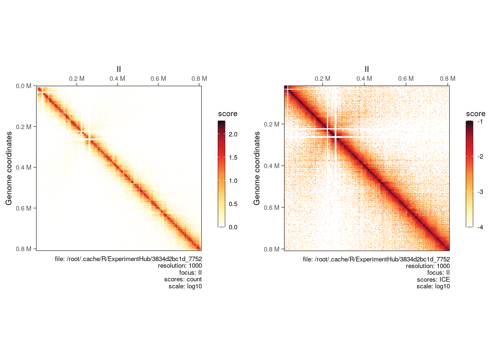

# HiCExperiment S4 class


```r
library(HiContacts)
```

```
## Loading required package: HiCExperiment
```

```
## 
## Attaching package: 'HiContacts'
```

```
## The following objects are masked from 'package:HiCExperiment':
## 
##     contacts_yeast, contacts_yeast_eco1
```

```
## The following object is masked from 'package:base':
## 
##     merge
```

```r
library(HiContactsData)
```

```
## Loading required package: ExperimentHub
```

```
## Loading required package: BiocGenerics
```

```
## 
## Attaching package: 'BiocGenerics'
```

```
## The following object is masked from 'package:HiCExperiment':
## 
##     as.data.frame
```

```
## The following objects are masked from 'package:stats':
## 
##     IQR, mad, sd, var, xtabs
```

```
## The following objects are masked from 'package:base':
## 
##     anyDuplicated, aperm, append, as.data.frame, basename, cbind,
##     colnames, dirname, do.call, duplicated, eval, evalq, Filter, Find,
##     get, grep, grepl, intersect, is.unsorted, lapply, Map, mapply,
##     match, mget, order, paste, pmax, pmax.int, pmin, pmin.int,
##     Position, rank, rbind, Reduce, rownames, sapply, setdiff, sort,
##     table, tapply, union, unique, unsplit, which.max, which.min
```

```
## Loading required package: AnnotationHub
```

```
## Loading required package: BiocFileCache
```

```
## Loading required package: dbplyr
```

```r
library(HiCExperiment)
wt_cf <- HiContactsData::HiContactsData('yeast_wt', 'mcool')
```

```
## snapshotDate(): 2023-02-13
```

```
## see ?HiContactsData and browseVignettes('HiContactsData') for documentation
```

```
## downloading 1 resources
```

```
## retrieving 1 resource
```

```
## loading from cache
```

```r
wt <- import(wt_cf, format = 'cool')
contacts <- normalize(wt['II'], niters = 200)
```

```
## 
  |                                                        
  |                                                  |   0%
  |                                                        
  |                                                  |   1%
  |                                                        
  |-                                                 |   2%
  |                                                        
  |--                                                |   3%
  |                                                        
  |--                                                |   4%
  |                                                        
  |--                                                |   5%
  |                                                        
  |---                                               |   6%
  |                                                        
  |----                                              |   7%
  |                                                        
  |----                                              |   8%
  |                                                        
  |----                                              |   9%
  |                                                        
  |-----                                             |  10%
  |                                                        
  |------                                            |  11%
  |                                                        
  |------                                            |  12%
  |                                                        
  |------                                            |  13%
  |                                                        
  |-------                                           |  14%
  |                                                        
  |--------                                          |  15%
  |                                                        
  |--------                                          |  16%
  |                                                        
  |--------                                          |  17%
  |                                                        
  |---------                                         |  18%
  |                                                        
  |----------                                        |  19%
  |                                                        
  |----------                                        |  20%
  |                                                        
  |----------                                        |  21%
  |                                                        
  |-----------                                       |  22%
  |                                                        
  |------------                                      |  23%
  |                                                        
  |------------                                      |  24%
  |                                                        
  |------------                                      |  25%
  |                                                        
  |-------------                                     |  26%
  |                                                        
  |--------------                                    |  27%
  |                                                        
  |--------------                                    |  28%
  |                                                        
  |--------------                                    |  29%
  |                                                        
  |---------------                                   |  30%
  |                                                        
  |----------------                                  |  31%
  |                                                        
  |----------------                                  |  32%
  |                                                        
  |----------------                                  |  33%
  |                                                        
  |-----------------                                 |  34%
  |                                                        
  |------------------                                |  35%
  |                                                        
  |------------------                                |  36%
  |                                                        
  |------------------                                |  37%
  |                                                        
  |-------------------                               |  38%
  |                                                        
  |--------------------                              |  39%
  |                                                        
  |--------------------                              |  40%
  |                                                        
  |--------------------                              |  41%
  |                                                        
  |---------------------                             |  42%
  |                                                        
  |----------------------                            |  43%
  |                                                        
  |----------------------                            |  44%
  |                                                        
  |----------------------                            |  45%
  |                                                        
  |-----------------------                           |  46%
  |                                                        
  |------------------------                          |  47%
  |                                                        
  |------------------------                          |  48%
  |                                                        
  |------------------------                          |  49%
  |                                                        
  |-------------------------                         |  50%
  |                                                        
  |--------------------------                        |  51%
  |                                                        
  |--------------------------                        |  52%
  |                                                        
  |--------------------------                        |  53%
  |                                                        
  |---------------------------                       |  54%
  |                                                        
  |----------------------------                      |  55%
  |                                                        
  |----------------------------                      |  56%
  |                                                        
  |----------------------------                      |  57%
  |                                                        
  |-----------------------------                     |  58%
  |                                                        
  |------------------------------                    |  59%
  |                                                        
  |------------------------------                    |  60%
  |                                                        
  |------------------------------                    |  61%
  |                                                        
  |-------------------------------                   |  62%
  |                                                        
  |--------------------------------                  |  63%
  |                                                        
  |--------------------------------                  |  64%
  |                                                        
  |--------------------------------                  |  65%
  |                                                        
  |---------------------------------                 |  66%
  |                                                        
  |----------------------------------                |  67%
  |                                                        
  |----------------------------------                |  68%
  |                                                        
  |----------------------------------                |  69%
  |                                                        
  |-----------------------------------               |  70%
  |                                                        
  |------------------------------------              |  71%
  |                                                        
  |------------------------------------              |  72%
  |                                                        
  |------------------------------------              |  73%
  |                                                        
  |-------------------------------------             |  74%
  |                                                        
  |--------------------------------------            |  75%
  |                                                        
  |--------------------------------------            |  76%
  |                                                        
  |--------------------------------------            |  77%
  |                                                        
  |---------------------------------------           |  78%
  |                                                        
  |----------------------------------------          |  79%
  |                                                        
  |----------------------------------------          |  80%
  |                                                        
  |----------------------------------------          |  81%
  |                                                        
  |-----------------------------------------         |  82%
  |                                                        
  |------------------------------------------        |  83%
  |                                                        
  |------------------------------------------        |  84%
  |                                                        
  |------------------------------------------        |  85%
  |                                                        
  |-------------------------------------------       |  86%
  |                                                        
  |--------------------------------------------      |  87%
  |                                                        
  |--------------------------------------------      |  88%
  |                                                        
  |--------------------------------------------      |  89%
  |                                                        
  |---------------------------------------------     |  90%
  |                                                        
  |----------------------------------------------    |  91%
  |                                                        
  |----------------------------------------------    |  92%
  |                                                        
  |----------------------------------------------    |  93%
  |                                                        
  |-----------------------------------------------   |  94%
  |                                                        
  |------------------------------------------------  |  95%
  |                                                        
  |------------------------------------------------  |  96%
  |                                                        
  |------------------------------------------------  |  97%
  |                                                        
  |------------------------------------------------- |  98%
  |                                                        
  |--------------------------------------------------|  99%
  |                                                        
  |--------------------------------------------------| 100%
```

```r
contacts
```

```
## `HiCExperiment` object with 471,364 contacts over 814 regions 
## -------
## fileName: "/root/.cache/R/ExperimentHub/3834d2bc1d_7752" 
## focus: "II" 
## resolutions(5): 1000 2000 4000 8000 16000
## active resolution: 1000 
## interactions: 74360 
## scores(3): count balanced ICE 
## topologicalFeatures: compartments(0) borders(0) loops(0) viewpoints(0) 
## pairsFile: N/A 
## metadata(0):
```

```r
p <- cowplot::plot_grid(
    plotMatrix(contacts, use.scores = 'count', scale = 'log10'),
    plotMatrix(contacts, use.scores = 'ICE', scale = 'log10', limits = c(-4, -1)), 
    ncol = 2
)
p
```


