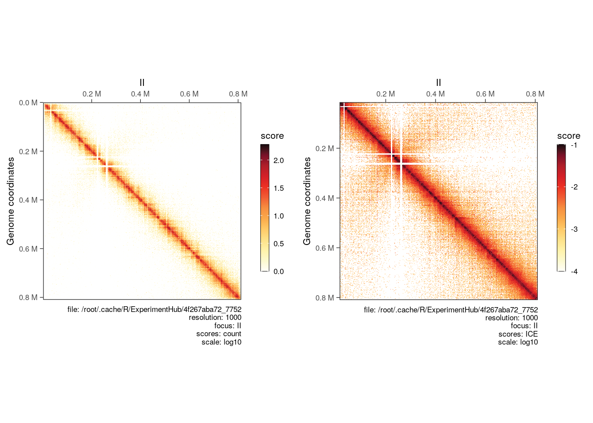
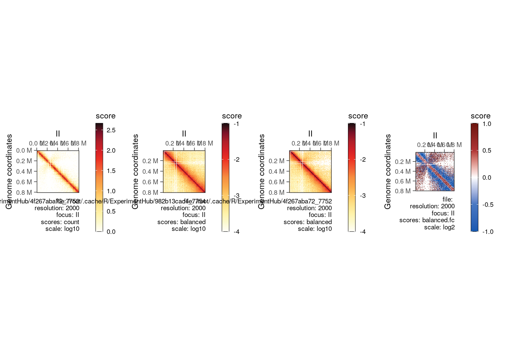
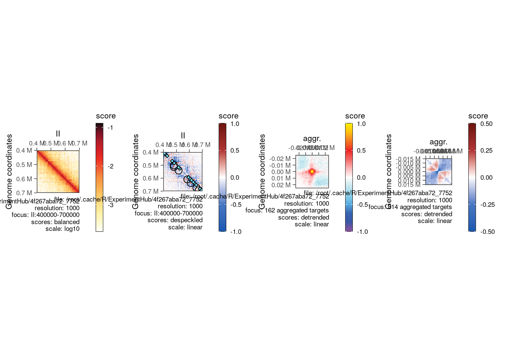

# (PART) Advanced Hi-C topics {-} 


# Performing arithmetics on Hi-C matrices

**Aim:** This notebook illustrates how to leverage `HiCExperiment` data structure 
with `HiContacts` package to operate on Hi-C matrices. 

## Data import and basic matrix arithmetics

### Yeast data

We will start by importing a WT `.mcool` file in R and perform normalization on 
the imported matrix.


```r
library(HiCExperiment)
library(HiContactsData)
library(HiContacts)
mcf <- HiContactsData('yeast_wt', 'mcool')
pf <- HiContactsData('yeast_wt', 'pairs.gz')
cf <- CoolFile(mcf, resolution = 1000, pairsFile = pf)
wt <- import(cf)
contacts <- wt[c('II')] |> normalize(niters = 200)
```

```
## 
  |                                                        
  |                                                  |   0%
  |                                                        
  |                                                  |   1%
  |                                                        
  |-                                                 |   2%
  |                                                        
  |--                                                |   3%
  |                                                        
  |--                                                |   4%
  |                                                        
  |--                                                |   5%
  |                                                        
  |---                                               |   6%
  |                                                        
  |----                                              |   7%
  |                                                        
  |----                                              |   8%
  |                                                        
  |----                                              |   9%
  |                                                        
  |-----                                             |  10%
  |                                                        
  |------                                            |  11%
  |                                                        
  |------                                            |  12%
  |                                                        
  |------                                            |  13%
  |                                                        
  |-------                                           |  14%
  |                                                        
  |--------                                          |  15%
  |                                                        
  |--------                                          |  16%
  |                                                        
  |--------                                          |  17%
  |                                                        
  |---------                                         |  18%
  |                                                        
  |----------                                        |  19%
  |                                                        
  |----------                                        |  20%
  |                                                        
  |----------                                        |  21%
  |                                                        
  |-----------                                       |  22%
  |                                                        
  |------------                                      |  23%
  |                                                        
  |------------                                      |  24%
  |                                                        
  |------------                                      |  25%
  |                                                        
  |-------------                                     |  26%
  |                                                        
  |--------------                                    |  27%
  |                                                        
  |--------------                                    |  28%
  |                                                        
  |--------------                                    |  29%
  |                                                        
  |---------------                                   |  30%
  |                                                        
  |----------------                                  |  31%
  |                                                        
  |----------------                                  |  32%
  |                                                        
  |----------------                                  |  33%
  |                                                        
  |-----------------                                 |  34%
  |                                                        
  |------------------                                |  35%
  |                                                        
  |------------------                                |  36%
  |                                                        
  |------------------                                |  37%
  |                                                        
  |-------------------                               |  38%
  |                                                        
  |--------------------                              |  39%
  |                                                        
  |--------------------                              |  40%
  |                                                        
  |--------------------                              |  41%
  |                                                        
  |---------------------                             |  42%
  |                                                        
  |----------------------                            |  43%
  |                                                        
  |----------------------                            |  44%
  |                                                        
  |----------------------                            |  45%
  |                                                        
  |-----------------------                           |  46%
  |                                                        
  |------------------------                          |  47%
  |                                                        
  |------------------------                          |  48%
  |                                                        
  |------------------------                          |  49%
  |                                                        
  |-------------------------                         |  50%
  |                                                        
  |--------------------------                        |  51%
  |                                                        
  |--------------------------                        |  52%
  |                                                        
  |--------------------------                        |  53%
  |                                                        
  |---------------------------                       |  54%
  |                                                        
  |----------------------------                      |  55%
  |                                                        
  |----------------------------                      |  56%
  |                                                        
  |----------------------------                      |  57%
  |                                                        
  |-----------------------------                     |  58%
  |                                                        
  |------------------------------                    |  59%
  |                                                        
  |------------------------------                    |  60%
  |                                                        
  |------------------------------                    |  61%
  |                                                        
  |-------------------------------                   |  62%
  |                                                        
  |--------------------------------                  |  63%
  |                                                        
  |--------------------------------                  |  64%
  |                                                        
  |--------------------------------                  |  65%
  |                                                        
  |---------------------------------                 |  66%
  |                                                        
  |----------------------------------                |  67%
  |                                                        
  |----------------------------------                |  68%
  |                                                        
  |----------------------------------                |  69%
  |                                                        
  |-----------------------------------               |  70%
  |                                                        
  |------------------------------------              |  71%
  |                                                        
  |------------------------------------              |  72%
  |                                                        
  |------------------------------------              |  73%
  |                                                        
  |-------------------------------------             |  74%
  |                                                        
  |--------------------------------------            |  75%
  |                                                        
  |--------------------------------------            |  76%
  |                                                        
  |--------------------------------------            |  77%
  |                                                        
  |---------------------------------------           |  78%
  |                                                        
  |----------------------------------------          |  79%
  |                                                        
  |----------------------------------------          |  80%
  |                                                        
  |----------------------------------------          |  81%
  |                                                        
  |-----------------------------------------         |  82%
  |                                                        
  |------------------------------------------        |  83%
  |                                                        
  |------------------------------------------        |  84%
  |                                                        
  |------------------------------------------        |  85%
  |                                                        
  |-------------------------------------------       |  86%
  |                                                        
  |--------------------------------------------      |  87%
  |                                                        
  |--------------------------------------------      |  88%
  |                                                        
  |--------------------------------------------      |  89%
  |                                                        
  |---------------------------------------------     |  90%
  |                                                        
  |----------------------------------------------    |  91%
  |                                                        
  |----------------------------------------------    |  92%
  |                                                        
  |----------------------------------------------    |  93%
  |                                                        
  |-----------------------------------------------   |  94%
  |                                                        
  |------------------------------------------------  |  95%
  |                                                        
  |------------------------------------------------  |  96%
  |                                                        
  |------------------------------------------------  |  97%
  |                                                        
  |------------------------------------------------- |  98%
  |                                                        
  |--------------------------------------------------|  99%
  |                                                        
  |--------------------------------------------------| 100%
```

```r
contacts
```

```
## `HiCExperiment` object with 471,364 contacts over 814 regions 
## -------
## fileName: "/root/.cache/R/ExperimentHub/4f267aba72_7752" 
## focus: "II" 
## resolutions(5): 1000 2000 4000 8000 16000
## active resolution: 1000 
## interactions: 74360 
## scores(3): count balanced ICE 
## topologicalFeatures: compartments(0) borders(0) loops(0) viewpoints(0) 
## pairsFile: /root/.cache/R/ExperimentHub/9813c3026b_7753 
## metadata(0):
```

```r
cowplot::plot_grid(
    plotMatrix(contacts, use.scores = 'count', scale = 'log10'),
    plotMatrix(contacts, use.scores = 'ICE', scale = 'log10', limits = c(-4, -1)), 
    ncol = 2
)
```



We can do the same for a Hi-C dataset generated in a eco1 mutant. 


```r
mcf <- HiContactsData('yeast_eco1', 'mcool')
pf <- HiContactsData('yeast_eco1', 'pairs.gz')
cf <- CoolFile(mcf, resolution = 1000, pairsFile = pf)
eco1 <- import(cf)
eco1
```

```
## `HiCExperiment` object with 19,136,736 contacts over 12,079 regions 
## -------
## fileName: "/root/.cache/R/ExperimentHub/982b13cac4_7754" 
## focus: "whole genome" 
## resolutions(5): 1000 2000 4000 8000 16000
## active resolution: 1000 
## interactions: 6474816 
## scores(2): count balanced 
## topologicalFeatures: compartments(0) borders(0) loops(0) viewpoints(0) 
## pairsFile: /root/.cache/R/ExperimentHub/983fe98037_7755 
## metadata(0):
```

Now that we have these two `HiCExperiment` objects, we can: 

1. `refocus` to change the field of view then
2. `zoom` to change the resolution then
3. `detrend` to calculate ovserved/expected fold-change and 
4. `despeckle` to remove background noise by applying a smoothing kernel

Them we can proceed to divide the contact matrix of the WT sample by the eco1 sample and plot each `HiCExperiment` matrix.


```r
wt_II <- wt |> 
    refocus('II') |> 
    zoom(2000) |> 
    detrend() |> 
    despeckle(use.scores = 'detrended')
eco1_II <- eco1 |> 
    refocus('II') |> 
    zoom(2000) |> 
    detrend() |> 
    despeckle(use.scores = 'detrended')
div_contacts <- divide(wt_II, by = eco1_II) 
div_contacts
```

```
## `HiCExperiment` object with 0 contacts over 407 regions 
## -------
## fileName: N/A 
## focus: "II" 
## resolutions(1): 2000
## active resolution: 2000 
## interactions: 83009 
## scores(16): weight1.x weight2.x count.x balanced.x expected.x detrended.x despeckled.x weight1.by weight2.by count.by balanced.by expected.by detrended.by despeckled.by balanced.fc balanced.l2fc 
## topologicalFeatures: () 
## pairsFile: N/A 
## metadata(2): hce_list operation
```

```r
p_div <- cowplot::plot_grid(
    plotMatrix(wt_II, use.scores = 'count', scale = 'log10'), 
    plotMatrix(eco1_II, use.scores = 'balanced', scale = 'log10', limits = c(-4, -1)), 
    plotMatrix(wt_II, compare.to = eco1_II, use.scores = 'balanced', scale = 'log10', limits = c(-4, -1)), 
    plotMatrix(div_contacts, use.scores = 'balanced.fc', scale = 'log2', limits = c(-1, 1), cmap = bwrColors()), 
    ncol = 4
)
p_div
```



Focusing on a narrower genomic region, it may be relevant to point out specific 
topological features, such as focal loops ("dots" in the contact matrices) or 
domain borders. We can do this by providing relevant arguments to the plotting function. 

We can also `aggregate` Hi-C maps over a list of genomic coordinates, either on-diagonal (e.g. for border aggregated plots) or off-diagonal (e.g. for loop aggregated plots).


```r
library(rtracklayer)
library(InteractionSet)
topologicalFeatures(wt_II, 'loops') <- system.file('extdata', 'S288C-loops.bedpe', package = 'HiCExperiment') |> 
    import() |> 
    makeGInteractionsFromGRangesPairs()
topologicalFeatures(wt_II, 'borders') <- system.file('extdata', 'S288C-borders.bed', package = 'HiCExperiment') |> 
    import()
contacts <- refocus(wt_II, 'II:400000-700000') |> 
    zoom(1000) |>
    detrend() |> 
    despeckle(use.scores = 'detrended', focal.size = 2)
aggr_loops <- aggregate(contacts, targets = topologicalFeatures(wt_II, 'loops'), flankingBins = 25)
aggr_borders <- aggregate(contacts, targets = topologicalFeatures(wt_II, 'borders'), flankingBins = 15)
aggr_borders
```

```
## `AggrHiCExperiment` object over 810 targets 
## -------
## fileName: "/root/.cache/R/ExperimentHub/4f267aba72_7752" 
## focus: 810 targets 
## resolutions(5): 1000 2000 4000 8000 16000
## active resolution: 1000 
## interactions: 961 
## scores(4): count balanced expected detrended 
## slices(4): count balanced expected detrended 
## topologicalFeatures: targets(810) compartments(0) borders(814) loops(162) viewpoints(0) 
## pairsFile: /root/.cache/R/ExperimentHub/9813c3026b_7753 
## metadata(0):
```

```r
cowplot::plot_grid(
    plotMatrix(
        contacts, 
        use.scores = 'balanced'
    ),
    plotMatrix(
        contacts, 
        use.scores = 'despeckled', 
        loops = topologicalFeatures(wt_II, 'loops'), 
        borders = topologicalFeatures(wt_II, 'borders'), 
        scale = 'linear', 
        limits = c(-1, 1), 
        cmap = bwrColors()
    ),
    plotMatrix(
        aggr_loops, 
        use.scores = 'detrended', 
        scale = 'linear', 
        limits = c(-1, 1), 
        cmap = rainbowColors()
    ),
    plotMatrix(
        aggr_borders, 
        use.scores = 'detrended', 
        scale = 'linear', 
        limits = c(-0.5, 0.5), 
        cmap = bwrColors()
    ), 
    nrow = 1
)
```



### Playing with mammalian data

The same operations (i.e. detrending, despeckling, ,,,) are also possible on larger genomes. 
On top of that, it is sometimes useful to `autocorrelate` the Hi-C matrix to highlight
the compartments "plaid" pattern.

Here, the `maxDistance` argument can be used to plot triangular horizontal matrices rather 
than square matrices. 


```r
library(fourDNData)
library(cowplot)
## G0G1 neural progenitors cells  (FACS sorted, Sox1-GFP+), Bonev et al. 2017
npcs_mcool <- fourDNData('4DNESJ9SIAV5', type = 'mcool')
npcs_large <- import(npcs_mcool, focus = 'chr3:80000000-120000000', resolution = 250000) |> 
    autocorrelate()
npcs_narrow <- import(npcs_mcool, focus = 'chr3:100800000-102400000', resolution = 5000) |> 
    detrend() |> 
    despeckle(use.scores = 'detrended')
p_mammals_1 <- plot_grid(
    plotMatrix(npcs_large, use.scores = 'balanced', scale = 'log10', limits = c(-4, -1), maxDistance = 30000000), 
    plotMatrix(npcs_large, use.scores = 'autocorrelated', scale = 'linear', limits = c(-1, 1), cmap = bgrColors(), maxDistance = 30000000), 
    plotMatrix(npcs_narrow, use.scores = 'balanced', scale = 'log10', limits = c(-4, -2), maxDistance = 1200000), 
    plotMatrix(npcs_narrow, use.scores = 'expected', scale = 'log10', limits = c(-4, -2), maxDistance = 1200000), 
    plotMatrix(npcs_narrow, use.scores = 'detrended', scale = 'linear', limits = c(-1, 1), maxDistance = 1200000, cmap = rainbowColors()), 
    plotMatrix(npcs_narrow, use.scores = 'despeckled', scale = 'linear', limits = c(-2, 2), maxDistance = 1200000, cmap = rainbowColors()), 
    ncol = 1
)
p_mammals_1
```

Finally, `subsample`ing interactions from a Hi-C experiment can easily be 
performed, and this is done proportionally with the distance-dependent 
interaction frequency. Furthermore, if a Hi-C experiment has been binned to a small resolution, 
it can be `coarsen`ed to any larger resolution. 


```r
sub_npcs_0.5 <- subsample(npcs_narrow, 0.5)
sub_npcs_0.1 <- subsample(npcs_narrow, 0.1) |> 
    detrend()
sub_npcs_0.1_rebinned <- coarsen(sub_npcs_0.1, 10000) |> 
    detrend() 
p_mammals_2 <- cowplot::plot_grid(
    plotMatrix(npcs_narrow, use.scores = 'balanced', limits = c(-4, -2), maxDistance = 1200000), 
    plotMatrix(sub_npcs_0.5, use.scores = 'balanced', limits = c(-4, -2), maxDistance = 1200000), 
    plotMatrix(sub_npcs_0.1, use.scores = 'balanced', limits = c(-4, -2), maxDistance = 1200000), 
    plotMatrix(sub_npcs_0.1, use.scores = 'detrended', scale = 'linear', limits = c(-1, 1), maxDistance = 1200000, cmap = rainbowColors()), 
    plotMatrix(sub_npcs_0.1_rebinned, use.scores = 'balanced', maxDistance = 1200000), 
    plotMatrix(sub_npcs_0.1_rebinned, use.scores = 'detrended', scale = 'linear', limits = c(-1, 1), maxDistance = 1200000, cmap = rainbowColors()), 
    ncol = 1
)
p_mammals_2
```

## Hi-C related arithmetics: P(s), virtual 4c profiles, cis/trans ratios, ...

To illustrate advanced Hi-C related arithmetics, we will use a Hi-C map generated in 
a yeast mutant, which contains segments of `Mycoides mycoides`
chromosome translocated within the chromosome XVI. 


```r
synthChr_cf <- CoolFile(
    'data/S288C_Mmyco-transloc.mcool', 
    resolution = 8000, 
    pairsFile = 'data/S288C_Mmyco-transloc.pairs'
)
availableChromosomes(synthChr_cf)
synthChr <- import(synthChr_cf) |> 
    detrend() |> 
    despeckle(use.scores = 'detrended') |> 
    autocorrelate(detrend = FALSE, ignore_ndiags = 4)
synthChr_zoomed <- import(synthChr_cf, focus = 'chrXVI-Mmmyco_inv870kb', resolution = 1000) 
```

We can compute a P(s) per chromosome for this sample using the `distanceLaw` function, 
as well as a `scalogram` along each chromosome, and `cisTransRatio`s. 


```r
### ----- Distance law
ps <- distanceLaw(synthChr, by_chr = TRUE) |>  
    mutate(type = case_when(chr == 'chrXVI-Mmmyco_inv870kb' ~ 'XVI-Myco', TRUE ~ 'WT')) |> 
    mutate(type = factor(type, c('WT', 'XVI-Myco')))
p1 <- plotMatrix(synthChr[c('chrXIII', 'chrXIV', 'chrXV', 'chrXVI-Mmmyco_inv870kb')], limits = c(-4, -1), cmap = afmhotrColors())
p2 <- plotPs(ps, ggplot2::aes(x = binned_distance, y = norm_p, group = chr, color = type)) + 
    scale_color_manual(values = c('#c6c6c6', '#ca0000'))
p3 <- plotPsSlope(ps, ggplot2::aes(x = binned_distance, y = slope, group = chr, color = type)) + 
    scale_color_manual(values = c('#c6c6c6', '#ca0000'))
p1
p2
p3

### ----- scalograms
scalo <- scalogram(synthChr) 
p4 <- plotMatrix(synthChr['chrXVI-Mmmyco_inv870kb'], use.scores = 'autocorrelated', limits = c(-0.8, 0.8), scale = 'linear', cmap = bwrColors())
p5 <- plotScalogram(scalo |> filter(chr == 'chrXVI-Mmmyco_inv870kb'), ylim = c(1e3, 1e5))
p <- cowplot::plot_grid(p4, p5, align = 'hv', axis = 'tblr', nrow = 1, rel_widths = c(1, 2)) 
p4
p5

### ----- cis/trans ratios
ct <- cisTransRatio(synthChr) |> filter(chr != 'chrXII')
p7 <- ggplot(ct, aes(x = chr, y = trans_pct)) + 
    geom_col(position = position_stack()) + 
    theme_bw() + 
    guides(x=guide_axis(angle = 90))
p7
```

Using the mammalian NPCs dataset as an example, we can also generate virtual 
4C profiles. 


```r
### ----- virtual 4c (NPCs)
v4C_loop <- virtual4C(npcs_narrow, viewpoint = GRanges('chr3:100965000-100975000'), use.scores = 'balanced') |> 
    plyranges::mutate(
        score = score/sum(score),
        score = zoo::rollmean(score, k = 2, na.pad = TRUE, align = 'center'), 
        viewpoint = 'loop'
    )
v4C_TAD <- virtual4C(npcs_narrow, viewpoint = GRanges('chr3:101695000-101705000'), use.scores = 'balanced') |> 
    plyranges::mutate(
        score = score/sum(score),
        score = zoo::rollmean(score, k = 2, na.pad = TRUE, align = 'center'), 
        viewpoint = 'TAD'
    )
v4C_loop2 <- virtual4C(npcs_narrow, viewpoint = GRanges('chr3:102145000-102155000'), use.scores = 'balanced') |> 
    plyranges::mutate(
        score = score/sum(score),
        score = zoo::rollmean(score, k = 2, na.pad = TRUE, align = 'center'), 
        viewpoint = 'loop2'
    )
p8 <- plot4C(c(v4C_loop, v4C_TAD, v4C_loop2), ggplot2::aes(x = center, y = score, col = viewpoint, fill = viewpoint)) + 
    ggplot2::coord_cartesian(ylim = c(0, 0.03))
p8
```

## Session info {-}


```r
sessioninfo::session_info()
```

```
## ─ Session info ───────────────────────────────────────────────────────────────
##  setting  value
##  version  R Under development (unstable) (2023-02-09 r83797)
##  os       Ubuntu 22.04.1 LTS
##  system   x86_64, linux-gnu
##  ui       X11
##  language (EN)
##  collate  en_US.UTF-8
##  ctype    en_US.UTF-8
##  tz       America/New_York
##  date     2023-02-14
##  pandoc   2.19.2 @ /usr/local/bin/ (via rmarkdown)
## 
## ─ Packages ───────────────────────────────────────────────────────────────────
##  package                * version   date (UTC) lib source
##  AnnotationDbi            1.61.0    2022-11-01 [1] Bioconductor
##  AnnotationHub          * 3.7.1     2023-02-06 [1] Bioconductor
##  assertthat               0.2.1     2019-03-21 [1] CRAN (R 4.3.0)
##  beeswarm                 0.4.0     2021-06-01 [1] CRAN (R 4.3.0)
##  Biobase                * 2.59.0    2022-11-01 [1] Bioconductor
##  BiocFileCache          * 2.7.1     2022-12-09 [1] Bioconductor
##  BiocGenerics           * 0.45.0    2022-11-01 [1] Bioconductor
##  BiocIO                   1.9.2     2023-01-19 [1] Bioconductor
##  BiocManager              1.30.19   2022-10-25 [1] CRAN (R 4.3.0)
##  BiocParallel             1.33.9    2022-12-23 [1] Bioconductor
##  BiocVersion              3.17.1    2022-11-04 [1] Bioconductor
##  Biostrings               2.67.0    2022-11-01 [1] Bioconductor
##  bit                      4.0.5     2022-11-15 [1] CRAN (R 4.3.0)
##  bit64                    4.0.5     2020-08-30 [1] CRAN (R 4.3.0)
##  bitops                   1.0-7     2021-04-24 [1] CRAN (R 4.3.0)
##  blob                     1.2.3     2022-04-10 [1] CRAN (R 4.3.0)
##  bookdown                 0.32      2023-01-17 [1] CRAN (R 4.3.0)
##  bslib                    0.4.2     2022-12-16 [1] CRAN (R 4.3.0)
##  cachem                   1.0.6     2021-08-19 [1] CRAN (R 4.3.0)
##  Cairo                    1.6-0     2022-07-05 [1] CRAN (R 4.3.0)
##  cli                      3.6.0     2023-01-09 [1] CRAN (R 4.3.0)
##  codetools                0.2-19    2023-02-01 [2] CRAN (R 4.3.0)
##  colorspace               2.1-0     2023-01-23 [1] CRAN (R 4.3.0)
##  cowplot                  1.1.1     2020-12-30 [1] CRAN (R 4.3.0)
##  crayon                   1.5.2     2022-09-29 [1] CRAN (R 4.3.0)
##  curl                     5.0.0     2023-01-12 [1] CRAN (R 4.3.0)
##  DBI                      1.1.3     2022-06-18 [1] CRAN (R 4.3.0)
##  dbplyr                 * 2.3.0     2023-01-16 [1] CRAN (R 4.3.0)
##  DelayedArray             0.25.0    2022-11-01 [1] Bioconductor
##  digest                   0.6.31    2022-12-11 [1] CRAN (R 4.3.0)
##  downlit                  0.4.2     2022-07-05 [1] CRAN (R 4.3.0)
##  dplyr                    1.1.0     2023-01-29 [1] CRAN (R 4.3.0)
##  ellipsis                 0.3.2     2021-04-29 [1] CRAN (R 4.3.0)
##  evaluate                 0.20      2023-01-17 [1] CRAN (R 4.3.0)
##  ExperimentHub          * 2.7.0     2022-11-01 [1] Bioconductor
##  fansi                    1.0.4     2023-01-22 [1] CRAN (R 4.3.0)
##  farver                   2.1.1     2022-07-06 [1] CRAN (R 4.3.0)
##  fastmap                  1.1.0     2021-01-25 [1] CRAN (R 4.3.0)
##  filelock                 1.0.2     2018-10-05 [1] CRAN (R 4.3.0)
##  fs                       1.6.1     2023-02-06 [1] CRAN (R 4.3.0)
##  generics                 0.1.3     2022-07-05 [1] CRAN (R 4.3.0)
##  GenomeInfoDb           * 1.35.15   2023-02-02 [1] Bioconductor
##  GenomeInfoDbData         1.2.9     2023-02-13 [1] Bioconductor
##  GenomicAlignments        1.35.0    2022-11-01 [1] Bioconductor
##  GenomicRanges          * 1.51.4    2022-12-15 [1] Bioconductor
##  ggbeeswarm               0.7.1     2022-12-16 [1] CRAN (R 4.3.0)
##  ggplot2                  3.4.1     2023-02-10 [1] CRAN (R 4.3.0)
##  ggrastr                  1.0.1     2021-12-08 [1] CRAN (R 4.3.0)
##  glue                     1.6.2     2022-02-24 [1] CRAN (R 4.3.0)
##  gtable                   0.3.1     2022-09-01 [1] CRAN (R 4.3.0)
##  HiCExperiment          * 0.99.9    2023-02-14 [1] Github (js2264/HiCExperiment@7f73f79)
##  HiContacts             * 1.1.1     2023-02-14 [1] Github (js2264/HiContacts@417a53c)
##  HiContactsData         * 1.1.9     2023-02-14 [1] Github (js2264/HiContactsData@275fab4)
##  highr                    0.10      2022-12-22 [1] CRAN (R 4.3.0)
##  htmltools                0.5.4     2022-12-07 [1] CRAN (R 4.3.0)
##  httpuv                   1.6.9     2023-02-14 [1] CRAN (R 4.3.0)
##  httr                     1.4.4     2022-08-17 [1] CRAN (R 4.3.0)
##  InteractionSet         * 1.27.0    2022-11-01 [1] Bioconductor
##  interactiveDisplayBase   1.37.0    2022-11-01 [1] Bioconductor
##  IRanges                * 2.33.0    2022-11-01 [1] Bioconductor
##  jquerylib                0.1.4     2021-04-26 [1] CRAN (R 4.3.0)
##  jsonlite                 1.8.4     2022-12-06 [1] CRAN (R 4.3.0)
##  KEGGREST                 1.39.0    2022-11-01 [1] Bioconductor
##  knitr                    1.42      2023-01-25 [1] CRAN (R 4.3.0)
##  labeling                 0.4.2     2020-10-20 [1] CRAN (R 4.3.0)
##  later                    1.3.0     2021-08-18 [1] CRAN (R 4.3.0)
##  lattice                  0.20-45   2021-09-22 [2] CRAN (R 4.3.0)
##  lifecycle                1.0.3     2022-10-07 [1] CRAN (R 4.3.0)
##  magrittr                 2.0.3     2022-03-30 [1] CRAN (R 4.3.0)
##  Matrix                   1.5-3     2022-11-11 [2] CRAN (R 4.3.0)
##  MatrixGenerics         * 1.11.0    2022-11-01 [1] Bioconductor
##  matrixStats            * 0.63.0    2022-11-18 [1] CRAN (R 4.3.0)
##  memoise                  2.0.1     2021-11-26 [1] CRAN (R 4.3.0)
##  mime                     0.12      2021-09-28 [1] CRAN (R 4.3.0)
##  munsell                  0.5.0     2018-06-12 [1] CRAN (R 4.3.0)
##  pillar                   1.8.1     2022-08-19 [1] CRAN (R 4.3.0)
##  pkgconfig                2.0.3     2019-09-22 [1] CRAN (R 4.3.0)
##  png                      0.1-8     2022-11-29 [1] CRAN (R 4.3.0)
##  promises                 1.2.0.1   2021-02-11 [1] CRAN (R 4.3.0)
##  purrr                    1.0.1     2023-01-10 [1] CRAN (R 4.3.0)
##  R6                       2.5.1     2021-08-19 [1] CRAN (R 4.3.0)
##  rappdirs                 0.3.3     2021-01-31 [1] CRAN (R 4.3.0)
##  Rcpp                     1.0.10    2023-01-22 [1] CRAN (R 4.3.0)
##  RCurl                    1.98-1.10 2023-01-27 [1] CRAN (R 4.3.0)
##  restfulr                 0.0.15    2022-06-16 [1] CRAN (R 4.3.0)
##  rhdf5                    2.43.0    2022-11-01 [1] Bioconductor
##  rhdf5filters             1.11.0    2022-11-01 [1] Bioconductor
##  Rhdf5lib                 1.21.0    2022-11-01 [1] Bioconductor
##  rjson                    0.2.21    2022-01-09 [1] CRAN (R 4.3.0)
##  rlang                    1.0.6     2022-09-24 [1] CRAN (R 4.3.0)
##  rmarkdown                2.20      2023-01-19 [1] CRAN (R 4.3.0)
##  Rsamtools                2.15.1    2022-12-30 [1] Bioconductor
##  RSpectra                 0.16-1    2022-04-24 [1] CRAN (R 4.3.0)
##  RSQLite                  2.2.20    2022-12-22 [1] CRAN (R 4.3.0)
##  rtracklayer            * 1.59.1    2022-12-27 [1] Bioconductor
##  S4Vectors              * 0.37.3    2022-12-07 [1] Bioconductor
##  sass                     0.4.5     2023-01-24 [1] CRAN (R 4.3.0)
##  scales                   1.2.1     2022-08-20 [1] CRAN (R 4.3.0)
##  sessioninfo              1.2.2     2021-12-06 [1] CRAN (R 4.3.0)
##  shiny                    1.7.4     2022-12-15 [1] CRAN (R 4.3.0)
##  strawr                   0.0.9     2021-09-13 [1] CRAN (R 4.3.0)
##  stringi                  1.7.12    2023-01-11 [1] CRAN (R 4.3.0)
##  stringr                  1.5.0     2022-12-02 [1] CRAN (R 4.3.0)
##  SummarizedExperiment   * 1.29.1    2022-11-04 [1] Bioconductor
##  terra                    1.7-3     2023-01-24 [1] CRAN (R 4.3.0)
##  tibble                   3.1.8     2022-07-22 [1] CRAN (R 4.3.0)
##  tidyr                    1.3.0     2023-01-24 [1] CRAN (R 4.3.0)
##  tidyselect               1.2.0     2022-10-10 [1] CRAN (R 4.3.0)
##  tzdb                     0.3.0     2022-03-28 [1] CRAN (R 4.3.0)
##  utf8                     1.2.3     2023-01-31 [1] CRAN (R 4.3.0)
##  vctrs                    0.5.2     2023-01-23 [1] CRAN (R 4.3.0)
##  vipor                    0.4.5     2017-03-22 [1] CRAN (R 4.3.0)
##  vroom                    1.6.1     2023-01-22 [1] CRAN (R 4.3.0)
##  withr                    2.5.0     2022-03-03 [1] CRAN (R 4.3.0)
##  xfun                     0.37      2023-01-31 [1] CRAN (R 4.3.0)
##  XML                      3.99-0.13 2022-12-04 [1] CRAN (R 4.3.0)
##  xml2                     1.3.3     2021-11-30 [1] CRAN (R 4.3.0)
##  xtable                   1.8-4     2019-04-21 [1] CRAN (R 4.3.0)
##  XVector                  0.39.0    2022-11-01 [1] Bioconductor
##  yaml                     2.3.7     2023-01-23 [1] CRAN (R 4.3.0)
##  zlibbioc                 1.45.0    2022-11-01 [1] Bioconductor
## 
##  [1] /usr/local/lib/R/site-library
##  [2] /usr/local/lib/R/library
## 
## ──────────────────────────────────────────────────────────────────────────────
```
