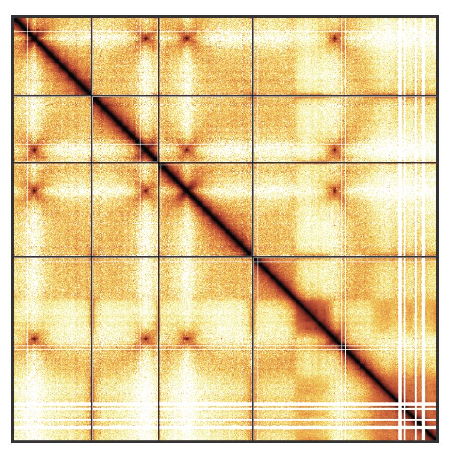

# Orchestrating Hi-C analysis with Bioconductor



**Package:** OHCA\
**Authors:** Jacques Serizay \[aut, cre\]\
**Compiled:** 2026-10-06\
**Package version:** 1.9.2\
**R version:** **R version 4.6.1 (2026-06-24)**\
**BioC version:** **3.24**\
**License:** MIT + file LICENSE\

# Welcome

This is the landing page of the **“Orchestrating Hi-C analysis with Bioconductor”** book. **The primary aim of this book is to introduce the `R` user to Hi-C analysis**. This book starts with key concepts important for the analysis of chromatin conformation capture and then presents `Bioconductor` tools that can be leveraged to process, analyze, explore and visualize Hi-C data.

## Table of contents

This book is divided in three parts:

**Part I: Introduction to Hi-C analysis**

- [Chapter 1: General principles and Hi-C data pre-processing](pages/principles.llms.md)
- [Chapter 2: The different R classes implemented to analyze Hi-C](pages/data-representation.llms.md)
- [Chapter 3: Manipulating Hi-C data in R](pages/parsing.llms.md)
- [Chapter 4: Hi-C data visualization](pages/visualization.llms.md)

**Part II: In-depth Hi-C analysis**

- [Chapter 5: Matrix-centric analysis](pages/matrix-centric.llms.md)
- [Chapter 6: Interactions-centric analysis](pages/interactions-centric.llms.md)
- [Chapter 7: Finding topological features from a Hi-C contact matrix](pages/topological-features.llms.md)

**Part III: Hi-C analysis workflows**

- [Data gateways: accessing public Hi-C data portals](pages/disseminating.llms.md)
- [Interoperability: Using HiCExperiment with other R packages](pages/interoperability.llms.md)
- [Interoperability with `python`: `cooltools`](pages/interoperability-python.llms.md)
- [Workflow 1: Distance-dependent interactions across yeast mutants](pages/workflow-yeast.llms.md)
- [Workflow 2: Chromosome compartment cohesion upon mitosis entry](pages/workflow-chicken.llms.md)
- [Workflow 3: Inter-centromere interactions in yeast](pages/workflow-centros.llms.md)

# Installation & requirements

## General audience

This books aims to demonstrate how to pre-process, parse and investigate Hi-C data in `R`. For this reason, a significant portion of this book consists of executable R code chunks. To be able to reproduce the examples demonstrated in this book and go further in the analysis of *your **real** datasets*, you will need to rely on several dependencies.

- `R >= 4.3` is required. You can check R version by typing `version` in an R console or in RStudio. If you do not have `R >= 4.3` installed, you will need to update your `R` version, as most extra dependencies will require `R >= 4.3`.

> **NOTE:**
>
> Detailed instructions are available [here](https://github.com/js2264/setup_ubuntu) to install `R 4.3` on a Linux machine (Ubuntu 22.04).
>
> Briefly, to install pre-compiled version of `R 4.3.0`:
>
> ``` sh
> # This is adapted from Posit (https://docs.posit.co/resources/install-r/)
> export R_VERSION=4.3.0
>
> # Install curl and gdebi-core
> sudo apt update -qq
> sudo apt install curl gdebi-core -y
>
> # Fetching the `.deb` install file from Posit repository
> curl -O https://cdn.rstudio.com/r/ubuntu-2204/pkgs/r-${R_VERSION}_1_amd64.deb
>
> # Install R
> sudo gdebi r-${R_VERSION}_1_amd64.deb --non-interactive -q
>
> # Optional: create a symlink to add R to your PATH
> sudo ln -s /opt/R/${R_VERSION}/bin/R /usr/local/bin/R
> ```
>
> If you have some issues when installing the Hi-C packages listed below, you may need to install the following system libraries:
>
> ``` sh
> sudo apt update -qq
> sudo apt install -y \
>     automake make cmake fort77 gfortran \
>     bzip2 unzip ftp build-essential \
>     libc6 libreadline-dev \
>     libpng-dev libjpeg-dev libtiff-dev \
>     libx11-dev libxt-dev x11-common \
>     libharfbuzz-dev libfribidi-dev \
>     libfreetype6-dev libfontconfig1-dev \
>     libbz2-dev liblzma-dev libtool \
>     libxml2 libxml2-dev \
>     libzstd-dev zlib1g-dev \
>     libdb-dev libglu1-mesa-dev \
>     libncurses5-dev libghc-zlib-dev libncurses-dev \
>     libpcre3-dev libxml2-dev libblas-dev libzmq3-dev \
>     libssl-dev libcurl4-openssl-dev \
>     libgsl-dev libeigen3-dev libboost-all-dev \
>     libgtk2.0-dev xvfb xauth xfonts-base apt-transport-https \
>     libhdf5-dev libudunits2-dev libgdal-dev libgeos-dev \
>     libproj-dev libnode-dev libmagick++-dev
> ```

- `Bioconductor >= 3.18` is also required. You can check whether `Bioconductor` is available and its version in `R` by typing [`BiocManager::version()`](https://bioconductor.github.io/BiocManager/reference/version.html). If you do not have `BiocManager` \>= 3.18 installed, you will need to update it as follows:

``` downlit
if (!require("BiocManager", quietly = TRUE))
    install.packages("BiocManager")
BiocManager::install(version = "3.18")
```

- You will also need important packages, which will be described in length in this book. The following `R` code will set up most of the extra dependencies:

``` downlit
BiocManager::install("HiCExperiment", ask = FALSE)
BiocManager::install("HiCool", ask = FALSE)
BiocManager::install("HiContacts", ask = FALSE)
BiocManager::install("HiContactsData", ask = FALSE)
BiocManager::install("fourDNData", ask = FALSE)
BiocManager::install("DNAZooData", ask = FALSE)
```

## Developers

For developers or advanced R users, the `devel` versions of these packages can be installed by installing Bioc `devel` version prior to package installation:

``` downlit
BiocManager::install(version = "devel")
BiocManager::install("HiCExperiment", ask = FALSE)
BiocManager::install("HiCool", ask = FALSE)
BiocManager::install("HiContacts", ask = FALSE)
BiocManager::install("HiContactsData", ask = FALSE)
BiocManager::install("fourDNData", ask = FALSE)
BiocManager::install("DNAZooData", ask = FALSE)
```

## Docker image

If you have `docker` installed, the easiest approach would be to run the following command in a `shell` terminal:

``` sh
docker run -it ghcr.io/js2264/ohca:latest R
```

This will fetch a `docker` image with the latest development versions of the aforementioned packages pre-installed, and initiate an interactive R session.

# Reproducibility

## Building book

The OHCA book has been rendered in R thanks to a number of packages, including but not only:

- **`BiocBook`**
- `devtools`
- `quarto`
- `rebook`

To build this book locally, you can run:

``` sh
git clone git@github.com:js2264/OHCA.git && cd OHCA
quarto render
```

> **WARNING:**
>
> All dependencies listed above will be required!

The actual rendering of this book is done by GitHub Actions, and the rendered static website is hosted by GitHub Pages.

# Session info

> **NOTE:**
>
> ``` downlit
> sessioninfo::session_info(
>     installed.packages()[,"Package"], 
>     include_base = TRUE
> )
> ##  ─ Session info ────────────────────────────────────────────────────────────
> ##   setting  value
> ##   version  R version 4.6.1 (2026-06-24)
> ##   os       Ubuntu 24.04.4 LTS
> ##   system   x86_64, linux-gnu
> ##   ui       X11
> ##   language (EN)
> ##   collate  C
> ##   ctype    en_US.UTF-8
> ##   tz       Etc/UTC
> ##   date     2026-10-06
> ##   pandoc   3.11 @ /usr/bin/ (via rmarkdown)
> ##   quarto   1.11.5 @ /usr/local/bin/quarto
> ##  
> ##  ─ Packages ────────────────────────────────────────────────────────────────
> ##   package                     * version    date (UTC) lib source
> ##   abind                         1.4-8      2024-09-12 [2] RSPM (R 4.6.0)
> ##   AnnotationDbi                 1.75.2     2026-07-21 [2] Bioconductor 3.24 (R 4.6.1)
> ##   AnnotationFilter              1.37.0     2026-04-28 [2] Bioconductor 3.24 (R 4.6.1)
> ##   AnnotationHub                 4.3.2      2026-06-30 [2] Bioconductor 3.24 (R 4.6.1)
> ##   askpass                       1.2.1      2024-10-04 [2] RSPM (R 4.6.0)
> ##   backports                     1.5.1      2026-04-03 [2] RSPM (R 4.6.0)
> ##   base                        * 4.6.1      2026-09-11 [3] local
> ##   base64enc                     0.1-6      2026-02-02 [2] RSPM (R 4.6.0)
> ##   beeswarm                      0.4.0      2021-06-01 [2] RSPM (R 4.6.0)
> ##   BH                            1.90.0-1   2025-12-14 [2] RSPM (R 4.6.0)
> ##   Biobase                       2.73.2     2026-07-29 [2] Bioconductor 3.24 (R 4.6.1)
> ##   BiocBaseUtils                 1.15.1     2026-05-10 [2] Bioconductor 3.24 (R 4.6.1)
> ##   BiocBook                      1.11.1     2026-09-06 [2] Bioconductor 3.24 (R 4.6.1)
> ##   BiocFileCache                 3.3.0      2026-04-28 [2] Bioconductor 3.24 (R 4.6.1)
> ##   BiocGenerics                  0.59.12    2026-08-11 [2] Bioconductor 3.24 (R 4.6.1)
> ##   BiocIO                        1.23.3     2026-04-29 [2] Bioconductor 3.24 (R 4.6.1)
> ##   biocmake                      1.5.1      2026-08-21 [2] Bioconductor 3.24 (R 4.6.1)
> ##   BiocManager                   1.30.27    2025-11-14 [2] CRAN (R 4.6.1)
> ##   BiocParallel                  1.47.0     2026-04-28 [2] Bioconductor 3.24 (R 4.6.1)
> ##   BiocStyle                     2.41.0     2026-04-28 [2] Bioconductor 3.24 (R 4.6.1)
> ##   BiocVersion                   3.24.0     2026-04-28 [2] Bioconductor 3.24 (R 4.6.1)
> ##   biomaRt                       2.69.3     2026-09-20 [2] Bioconductor 3.24 (R 4.6.1)
> ##   Biostrings                    2.81.9     2026-09-06 [2] Bioconductor 3.24 (R 4.6.1)
> ##   biovizBase                    1.61.0     2026-04-28 [2] Bioconductor 3.24 (R 4.6.1)
> ##   bit                           4.6.0      2025-03-06 [2] RSPM (R 4.6.0)
> ##   bit64                         4.8.6      2026-09-01 [2] RSPM (R 4.6.0)
> ##   bitops                        1.1-0      2026-07-30 [2] RSPM (R 4.6.0)
> ##   blob                          1.3.0      2026-01-14 [2] RSPM (R 4.6.0)
> ##   bookdown                      0.48       2026-08-28 [2] RSPM (R 4.6.0)
> ##   boot                          1.3-32     2025-08-29 [3] CRAN (R 4.6.1)
> ##   brew                          1.0-10     2023-12-16 [2] RSPM (R 4.6.0)
> ##   brio                          1.1.5      2024-04-24 [2] RSPM (R 4.6.0)
> ##   BSgenome                      1.81.1     2026-07-29 [2] Bioconductor 3.24 (R 4.6.1)
> ##   BSgenome.Hsapiens.UCSC.hg38   1.4.5      2026-07-20 [2] Bioconductor
> ##   bslib                         0.12.0     2026-08-04 [2] RSPM (R 4.6.0)
> ##   cachem                        1.1.0      2024-05-16 [2] RSPM (R 4.6.0)
> ##   Cairo                         1.7-0      2025-10-29 [2] RSPM (R 4.6.0)
> ##   calibrate                     1.7.7      2020-06-19 [2] RSPM (R 4.6.0)
> ##   callr                         3.8.0      2026-06-05 [2] RSPM (R 4.6.0)
> ##   checkmate                     2.3.4      2026-02-03 [2] RSPM (R 4.6.0)
> ##   cigarillo                     1.3.1      2026-07-13 [2] Bioconductor 3.24 (R 4.6.1)
> ##   class                         7.3-24     2026-08-03 [2] RSPM (R 4.6.0)
> ##   cli                           3.6.6      2026-04-09 [2] RSPM (R 4.6.0)
> ##   clipr                         0.8.1      2026-05-25 [2] RSPM (R 4.6.0)
> ##   cluster                       2.1.8.3    2026-07-30 [2] RSPM (R 4.6.0)
> ##   codetools                     0.2-20     2024-03-31 [3] CRAN (R 4.6.1)
> ##   colorspace                    2.1-3      2026-07-12 [2] RSPM (R 4.6.0)
> ##   commonmark                    2.0.0      2025-07-07 [2] RSPM (R 4.6.0)
> ##   compiler                      4.6.1      2026-09-11 [3] local
> ##   cowplot                       1.2.0      2025-07-07 [2] RSPM (R 4.6.0)
> ##   cpp11                         0.5.5      2026-05-06 [2] RSPM (R 4.6.0)
> ##   crayon                        1.5.3      2024-06-20 [2] RSPM (R 4.6.0)
> ##   credentials                   2.0.3      2025-09-12 [2] RSPM (R 4.6.0)
> ##   csaw                          1.47.1     2026-07-14 [2] Bioconductor 3.24 (R 4.6.1)
> ##   curl                          8.0.0      2026-08-25 [2] RSPM (R 4.6.0)
> ##   data.table                    1.18.6.1   2026-08-24 [2] RSPM (R 4.6.0)
> ##   datasets                    * 4.6.1      2026-09-11 [3] local
> ##   DBI                           1.3.0      2026-02-25 [2] RSPM (R 4.6.0)
> ##   dbplyr                        2.6.0      2026-06-17 [2] RSPM (R 4.6.0)
> ##   DelayedArray                  0.39.8     2026-09-30 [2] Bioconductor 3.24 (R 4.6.1)
> ##   deldir                        2.0-4      2024-02-28 [2] RSPM (R 4.6.0)
> ##   DEoptimR                      1.2-2      2026-09-25 [2] RSPM (R 4.6.0)
> ##   desc                          1.4.3      2023-12-10 [2] RSPM (R 4.6.0)
> ##   devtools                      2.5.2      2026-04-30 [2] RSPM (R 4.6.0)
> ##   dichromat                     2.0-1      2026-07-22 [2] RSPM (R 4.6.0)
> ##   diffHic                       1.45.0     2026-04-28 [2] Bioconductor 3.24 (R 4.6.1)
> ##   diffobj                       0.3.9      2026-09-11 [2] RSPM (R 4.6.0)
> ##   digest                        0.6.39     2025-11-19 [2] RSPM (R 4.6.0)
> ##   dir.expiry                    1.21.0     2026-04-28 [2] Bioconductor 3.24 (R 4.6.1)
> ##   DNAZooData                    1.13.0     2026-04-30 [2] Bioconductor 3.24 (R 4.6.1)
> ##   docopt                        0.7.2      2025-03-25 [2] RSPM (R 4.6.1)
> ##   doParallel                    1.0.17     2022-02-07 [2] RSPM (R 4.6.0)
> ##   downlit                       0.4.5      2025-11-14 [2] RSPM (R 4.6.0)
> ##   dplyr                         1.2.1      2026-04-03 [2] RSPM (R 4.6.0)
> ##   dynamicTreeCut                1.63-1     2016-03-11 [2] RSPM (R 4.6.0)
> ##   edgeR                         4.99.6     2026-09-13 [2] Bioconductor 3.24 (R 4.6.1)
> ##   ellipsis                      0.3.3      2026-04-04 [2] RSPM (R 4.6.0)
> ##   ensembldb                     2.37.3     2026-06-07 [2] Bioconductor 3.24 (R 4.6.1)
> ##   evaluate                      1.0.5      2025-08-27 [2] RSPM (R 4.6.0)
> ##   ExperimentHub                 3.3.2      2026-08-12 [2] Bioconductor 3.24 (R 4.6.1)
> ##   fansi                         1.0.7      2025-11-19 [2] RSPM (R 4.6.0)
> ##   farver                        2.1.2      2024-05-13 [2] RSPM (R 4.6.0)
> ##   fastcluster                   1.3.0      2025-05-07 [2] RSPM (R 4.6.0)
> ##   fastmap                       1.2.0      2024-05-15 [2] RSPM (R 4.6.0)
> ##   filelock                      1.0.3      2023-12-11 [2] RSPM (R 4.6.0)
> ##   fontawesome                   0.5.3      2024-11-16 [2] RSPM (R 4.6.0)
> ##   foreach                       1.5.2      2022-02-02 [2] RSPM (R 4.6.0)
> ##   foreign                       0.8-91     2026-01-29 [3] CRAN (R 4.6.1)
> ##   formatR                       1.14       2023-01-17 [2] RSPM (R 4.6.0)
> ##   Formula                       1.2-6      2026-08-03 [2] RSPM (R 4.6.0)
> ##   fourDNData                    1.13.0     2026-04-30 [2] Bioconductor 3.24 (R 4.6.1)
> ##   fs                            2.1.0      2026-04-18 [2] RSPM (R 4.6.0)
> ##   futile.logger                 1.4.9      2025-12-29 [2] RSPM (R 4.6.0)
> ##   futile.options                1.0.1      2018-04-20 [2] RSPM (R 4.6.0)
> ##   generics                      0.1.4      2025-05-09 [2] RSPM (R 4.6.0)
> ##   GenomeInfoDb                  1.49.1     2026-05-24 [2] Bioconductor 3.24 (R 4.6.1)
> ##   GenomeInfoDbData              1.2.15     2026-07-20 [2] Bioconductor
> ##   GenomicAlignments             1.49.2     2026-09-02 [2] Bioconductor 3.24 (R 4.6.1)
> ##   GenomicFeatures               1.65.0     2026-04-28 [2] Bioconductor 3.24 (R 4.6.1)
> ##   GenomicInteractions           1.47.0     2026-04-28 [2] Bioconductor 3.24 (R 4.6.1)
> ##   GenomicRanges                 1.65.4     2026-09-02 [2] Bioconductor 3.24 (R 4.6.1)
> ##   gert                          2.4.1      2026-08-19 [2] RSPM (R 4.6.0)
> ##   ggbeeswarm                    0.7.3      2025-11-29 [2] RSPM (R 4.6.0)
> ##   ggbio                         1.61.0     2026-04-28 [2] Bioconductor 3.24 (R 4.6.1)
> ##   ggplot2                       4.0.3      2026-04-22 [2] RSPM (R 4.6.0)
> ##   ggrastr                       1.0.2      2023-06-01 [2] RSPM (R 4.6.0)
> ##   gh                            1.6.1      2026-07-20 [2] RSPM (R 4.6.0)
> ##   gitcreds                      0.1.2      2022-09-08 [2] RSPM (R 4.6.0)
> ##   glue                          1.8.1      2026-04-17 [2] RSPM (R 4.6.0)
> ##   GOTHiC                        1.49.0     2026-04-28 [2] Bioconductor 3.24 (R 4.6.1)
> ##   graph                         1.91.0     2026-04-28 [2] Bioconductor 3.24 (R 4.6.1)
> ##   graphics                    * 4.6.1      2026-09-11 [3] local
> ##   grDevices                   * 4.6.1      2026-09-11 [3] local
> ##   grid                          4.6.1      2026-09-11 [3] local
> ##   gridExtra                     2.3.1      2026-06-25 [2] RSPM (R 4.6.0)
> ##   gtable                        0.3.6      2024-10-25 [2] RSPM (R 4.6.0)
> ##   gtools                        3.9.5      2023-11-20 [2] RSPM (R 4.6.0)
> ##   Gviz                          1.57.4     2026-08-11 [2] Bioconductor 3.24 (R 4.6.1)
> ##   here                          1.0.2      2025-09-15 [2] RSPM (R 4.6.0)
> ##   HiCcompare                    1.35.2     2026-10-01 [2] Bioconductor 3.24 (R 4.6.1)
> ##   HiCExperiment                 1.13.1     2026-10-04 [2] Bioconductor 3.24 (R 4.6.1)
> ##   HiContacts                    1.15.2     2026-10-04 [2] Bioconductor 3.24 (R 4.6.1)
> ##   HiContactsData                1.5.3      2026-10-06 [2] Github (js2264/HiContactsData@d5bebe7)
> ##   highr                         0.12       2026-03-06 [2] RSPM (R 4.6.0)
> ##   Hmisc                         5.3-0      2026-09-06 [2] RSPM (R 4.6.0)
> ##   hms                           1.1.4      2025-10-17 [2] RSPM (R 4.6.0)
> ##   htmlTable                     2.5.0      2026-04-22 [2] RSPM (R 4.6.0)
> ##   htmltools                     0.5.9      2025-12-04 [2] RSPM (R 4.6.0)
> ##   htmlwidgets                   1.6.4      2023-12-06 [2] RSPM (R 4.6.0)
> ##   httpuv                        1.6.17     2026-03-18 [2] RSPM (R 4.6.0)
> ##   httr                          1.4.9      2026-09-01 [2] RSPM (R 4.6.0)
> ##   httr2                         1.3.0      2026-07-13 [2] RSPM (R 4.6.0)
> ##   hwriter                       1.3.2.1    2022-04-08 [2] RSPM (R 4.6.0)
> ##   igraph                        2.3.4      2026-09-30 [2] RSPM (R 4.6.0)
> ##   impute                        1.87.0     2026-04-28 [2] Bioconductor 3.24 (R 4.6.1)
> ##   ini                           0.3.1      2018-05-20 [2] RSPM (R 4.6.0)
> ##   InteractionSet                1.41.0     2026-04-28 [2] Bioconductor 3.24 (R 4.6.1)
> ##   interp                        1.1-6      2024-01-26 [2] RSPM (R 4.6.0)
> ##   IRanges                       2.47.5     2026-08-27 [2] Bioconductor 3.24 (R 4.6.1)
> ##   isoband                       0.3.0      2025-12-07 [2] RSPM (R 4.6.0)
> ##   iterators                     1.0.14     2022-02-05 [2] RSPM (R 4.6.0)
> ##   jpeg                          0.1-11     2025-03-21 [2] RSPM (R 4.6.0)
> ##   jquerylib                     0.1.4      2021-04-26 [2] RSPM (R 4.6.0)
> ##   jsonlite                      2.0.0      2025-03-27 [2] RSPM (R 4.6.0)
> ##   KEGGREST                      1.53.6     2026-07-23 [2] Bioconductor 3.24 (R 4.6.1)
> ##   KernSmooth                    2.23-27    2026-08-12 [2] RSPM (R 4.6.0)
> ##   knitr                         1.52       2026-09-06 [2] RSPM (R 4.6.0)
> ##   labeling                      0.4.3      2023-08-29 [2] RSPM (R 4.6.0)
> ##   lambda.r                      1.2.4      2019-09-18 [2] RSPM (R 4.6.0)
> ##   later                         1.4.8      2026-03-05 [2] RSPM (R 4.6.0)
> ##   lattice                       0.23-1     2026-08-12 [2] RSPM (R 4.6.0)
> ##   latticeExtra                  0.6-31     2025-09-10 [2] RSPM (R 4.6.0)
> ##   lazyeval                      0.2.3      2026-04-04 [2] RSPM (R 4.6.0)
> ##   lifecycle                     1.0.5      2026-01-08 [2] RSPM (R 4.6.0)
> ##   limma                         3.99.0     2026-08-31 [2] Bioconductor 3.24 (R 4.6.1)
> ##   littler                       0.3.23     2026-04-12 [2] RSPM (R 4.6.1)
> ##   locfit                        1.5-9.12   2025-03-05 [2] RSPM (R 4.6.0)
> ##   magrittr                      2.0.5      2026-04-04 [2] RSPM (R 4.6.0)
> ##   MASS                          7.3-66     2026-07-15 [2] RSPM (R 4.6.0)
> ##   mathjaxr                      2.0-0      2025-12-01 [2] RSPM (R 4.6.0)
> ##   Matrix                        1.7-6      2026-07-25 [2] RSPM (R 4.6.0)
> ##   MatrixGenerics                1.25.0     2026-04-28 [2] Bioconductor 3.24 (R 4.6.1)
> ##   MatrixModels                  0.5-4      2025-03-26 [2] RSPM (R 4.6.0)
> ##   matrixStats                   1.5.0      2025-01-07 [2] RSPM (R 4.6.0)
> ##   memoise                       2.0.1      2021-11-26 [2] RSPM (R 4.6.0)
> ##   metap                         1.14       2026-05-01 [2] RSPM (R 4.6.0)
> ##   metapod                       1.21.0     2026-04-28 [2] Bioconductor 3.24 (R 4.6.1)
> ##   methods                     * 4.6.1      2026-09-11 [3] local
> ##   mgcv                          1.9-4      2025-11-07 [3] CRAN (R 4.6.1)
> ##   mime                          0.13       2025-03-17 [2] RSPM (R 4.6.0)
> ##   miniUI                        0.1.2      2025-04-17 [2] RSPM (R 4.6.0)
> ##   mnormt                        2.1.2      2026-01-27 [2] RSPM (R 4.6.0)
> ##   multcomp                      1.4-32     2026-08-21 [2] RSPM (R 4.6.0)
> ##   multiHiCcompare               1.31.1     2026-07-09 [2] Bioconductor 3.24 (R 4.6.1)
> ##   multtest                      2.69.0     2026-04-28 [2] Bioconductor 3.24 (R 4.6.1)
> ##   mutoss                        0.1-14     2026-01-08 [2] RSPM (R 4.6.0)
> ##   mvtnorm                       1.4-2      2026-07-12 [2] RSPM (R 4.6.0)
> ##   nlme                          3.1-171    2026-09-01 [2] RSPM (R 4.6.0)
> ##   nnet                          7.3-21     2026-08-03 [2] RSPM (R 4.6.0)
> ##   numDeriv                      2016.8-1.1 2019-06-06 [2] RSPM (R 4.6.0)
> ##   OHCA                          1.9.2      2026-10-06 [1] Bioconductor
> ##   openssl                       2.4.2      2026-06-09 [2] RSPM (R 4.6.0)
> ##   OrganismDbi                   1.55.1     2026-04-29 [2] Bioconductor 3.24 (R 4.6.1)
> ##   otel                          0.2.0      2025-08-29 [2] RSPM (R 4.6.0)
> ##   pak                           0.11.1     2026-07-22 [2] RSPM (R 4.6.0)
> ##   parallel                      4.6.1      2026-09-11 [3] local
> ##   patchwork                     1.3.2      2025-08-25 [2] RSPM (R 4.6.0)
> ##   pbapply                       1.7-5      2026-09-01 [2] RSPM (R 4.6.0)
> ##   pheatmap                      1.0.13     2025-06-05 [2] RSPM (R 4.6.0)
> ##   pillar                        1.11.1     2025-09-17 [2] RSPM (R 4.6.0)
> ##   pkgbuild                      1.4.8      2025-05-26 [2] RSPM (R 4.6.0)
> ##   pkgconfig                     2.0.3      2019-09-22 [2] RSPM (R 4.6.0)
> ##   pkgdown                       2.2.1      2026-07-07 [2] RSPM (R 4.6.0)
> ##   pkgload                       1.5.3      2026-06-15 [2] RSPM (R 4.6.0)
> ##   plotrix                       3.8-14     2026-02-13 [2] RSPM (R 4.6.0)
> ##   plyinteractions               1.11.1     2026-10-04 [2] Bioconductor 3.24 (R 4.6.1)
> ##   plyr                          1.8.9      2023-10-02 [2] RSPM (R 4.6.0)
> ##   plyranges                     1.33.2     2026-07-30 [2] Bioconductor 3.24 (R 4.6.1)
> ##   png                           0.1-9      2026-03-15 [2] RSPM (R 4.6.0)
> ##   praise                        1.0.0      2015-08-11 [2] RSPM (R 4.6.0)
> ##   preprocessCore                1.75.1     2026-08-31 [2] Bioconductor 3.24 (R 4.6.1)
> ##   prettyunits                   1.2.0      2023-09-24 [2] RSPM (R 4.6.0)
> ##   processx                      3.9.0      2026-04-22 [2] RSPM (R 4.6.0)
> ##   profvis                       0.4.0      2024-09-20 [2] RSPM (R 4.6.0)
> ##   progress                      1.2.3      2023-12-06 [2] RSPM (R 4.6.0)
> ##   promises                      1.5.0      2025-11-01 [2] RSPM (R 4.6.0)
> ##   ProtGenerics                  1.45.0     2026-04-28 [2] Bioconductor 3.24 (R 4.6.1)
> ##   ps                            1.9.3      2026-04-20 [2] RSPM (R 4.6.0)
> ##   purrr                         1.2.2      2026-04-10 [2] RSPM (R 4.6.0)
> ##   pwalign                       1.9.1      2026-05-22 [2] Bioconductor 3.24 (R 4.6.1)
> ##   qqconf                        1.3.2      2023-04-14 [2] RSPM (R 4.6.0)
> ##   qqman                         0.1.9      2023-08-23 [2] RSPM (R 4.6.0)
> ##   quantreg                      6.1        2025-03-10 [2] RSPM (R 4.6.0)
> ##   quarto                        1.5.1      2025-09-04 [2] RSPM (R 4.6.0)
> ##   R6                            2.6.1      2025-02-15 [2] RSPM (R 4.6.0)
> ##   ragg                          1.5.2      2026-03-23 [2] RSPM (R 4.6.0)
> ##   rappdirs                      0.3.4      2026-01-17 [2] RSPM (R 4.6.0)
> ##   RBGL                          1.89.0     2026-04-28 [2] Bioconductor 3.24 (R 4.6.1)
> ##   rbibutils                     2.4.1      2026-01-21 [2] RSPM (R 4.6.0)
> ##   rcmdcheck                     1.4.0      2021-09-27 [2] RSPM (R 4.6.0)
> ##   RColorBrewer                  1.1-3      2022-04-03 [2] RSPM (R 4.6.0)
> ##   Rcpp                          1.1.2      2026-07-05 [2] RSPM (R 4.6.0)
> ##   RcppEigen                     0.3.4.0.2  2024-08-24 [2] RSPM (R 4.6.0)
> ##   RcppTOML                      0.2.3      2025-03-08 [2] RSPM (R 4.6.0)
> ##   RCurl                         1.98-1.20  2026-08-21 [2] RSPM (R 4.6.0)
> ##   Rdpack                        2.6.6      2026-02-08 [2] RSPM (R 4.6.0)
> ##   rdtools                       0.1.0      2026-07-16 [2] RSPM (R 4.6.0)
> ##   readr                         2.2.0      2026-02-19 [2] RSPM (R 4.6.0)
> ##   remotes                       2.5.0      2024-03-17 [2] RSPM (R 4.6.0)
> ##   renv                          1.3.0      2026-09-29 [2] RSPM (R 4.6.0)
> ##   reshape2                      1.4.5      2025-11-12 [2] RSPM (R 4.6.0)
> ##   restfulr                      0.0.17     2026-06-11 [2] RSPM (R 4.6.0)
> ##   reticulate                    1.47.0     2026-09-03 [2] RSPM (R 4.6.0)
> ##   rhdf5                         2.57.18    2026-09-23 [2] Bioconductor 3.24 (R 4.6.1)
> ##   rhdf5filters                  1.25.4     2026-08-06 [2] Bioconductor 3.24 (R 4.6.1)
> ##   Rhdf5lib                      2.1.0      2026-04-28 [2] Bioconductor 3.24 (R 4.6.1)
> ##   Rhtslib                       3.9.0      2026-04-28 [2] Bioconductor 3.24 (R 4.6.1)
> ##   rjson                         0.2.23     2024-09-16 [2] RSPM (R 4.6.0)
> ##   rlang                         1.3.0      2026-07-05 [2] RSPM (R 4.6.0)
> ##   rmarkdown                     2.32       2026-09-01 [2] RSPM (R 4.6.0)
> ##   robustbase                    0.99-7     2026-02-05 [2] RSPM (R 4.6.0)
> ##   roxygen2                      8.1.0      2026-08-04 [2] RSPM (R 4.6.0)
> ##   rpart                         4.1.27     2026-03-27 [3] CRAN (R 4.6.1)
> ##   rprojroot                     2.1.1      2025-08-26 [2] RSPM (R 4.6.0)
> ##   Rsamtools                     2.29.0     2026-04-28 [2] Bioconductor 3.24 (R 4.6.1)
> ##   RSpectra                      0.16-2     2024-07-18 [2] RSPM (R 4.6.0)
> ##   RSQLite                       3.53.3     2026-06-30 [2] RSPM (R 4.6.0)
> ##   rstudioapi                    0.19.0     2026-06-11 [2] RSPM (R 4.6.0)
> ##   rtracklayer                   1.73.0     2026-04-28 [2] Bioconductor 3.24 (R 4.6.1)
> ##   rversions                     3.0.0      2025-10-09 [2] RSPM (R 4.6.0)
> ##   S4Arrays                      1.13.2     2026-09-30 [2] Bioconductor 3.24 (R 4.6.1)
> ##   S4Vectors                     0.51.10    2026-09-16 [2] Bioconductor 3.24 (R 4.6.1)
> ##   S7                            0.2.2      2026-04-22 [2] RSPM (R 4.6.0)
> ##   sandwich                      3.1-3      2026-08-03 [2] RSPM (R 4.6.0)
> ##   sass                          0.4.10     2025-04-11 [2] RSPM (R 4.6.0)
> ##   scales                        1.4.0      2025-04-24 [2] RSPM (R 4.6.0)
> ##   Seqinfo                       1.3.2      2026-08-27 [2] Bioconductor 3.24 (R 4.6.1)
> ##   sessioninfo                   1.2.4      2026-06-04 [2] RSPM (R 4.6.0)
> ##   shiny                         1.14.0     2026-06-21 [2] RSPM (R 4.6.0)
> ##   ShortRead                     1.71.1     2026-07-05 [2] Bioconductor 3.24 (R 4.6.1)
> ##   sn                            2.1.3      2026-02-24 [2] RSPM (R 4.6.0)
> ##   snow                          0.4-4      2021-10-27 [2] RSPM (R 4.6.0)
> ##   sourcetools                   0.1.7-2    2026-03-28 [2] RSPM (R 4.6.0)
> ##   SparseArray                   1.13.4     2026-09-30 [2] Bioconductor 3.24 (R 4.6.1)
> ##   SparseM                       1.84-2     2024-07-17 [2] RSPM (R 4.6.0)
> ##   spatial                       7.3-19     2026-08-03 [2] RSPM (R 4.6.0)
> ##   splines                       4.6.1      2026-09-11 [3] local
> ##   statmod                       1.5.2      2026-05-17 [2] RSPM (R 4.6.0)
> ##   stats                       * 4.6.1      2026-09-11 [3] local
> ##   stats4                        4.6.1      2026-09-11 [3] local
> ##   strawr                        0.0.92     2024-07-16 [2] RSPM (R 4.6.0)
> ##   stringi                       1.8.9      2026-08-04 [2] RSPM (R 4.6.0)
> ##   stringr                       1.6.0      2025-11-04 [2] RSPM (R 4.6.0)
> ##   SummarizedExperiment          1.43.0     2026-04-28 [2] Bioconductor 3.24 (R 4.6.1)
> ##   survival                      3.8-12     2026-09-09 [2] RSPM (R 4.6.0)
> ##   sys                           3.4.3      2024-10-04 [2] RSPM (R 4.6.0)
> ##   systemfonts                   1.3.2      2026-03-05 [2] RSPM (R 4.6.0)
> ##   tcltk                         4.6.1      2026-09-11 [3] local
> ##   terra                         1.9-50     2026-09-08 [2] RSPM (R 4.6.0)
> ##   testthat                      3.3.2      2026-01-11 [2] RSPM (R 4.6.0)
> ##   textshaping                   1.0.5      2026-03-06 [2] RSPM (R 4.6.0)
> ##   TFisher                       0.2.1      2026-08-25 [2] RSPM (R 4.6.0)
> ##   TH.data                       1.1-5      2025-11-17 [2] RSPM (R 4.6.0)
> ##   tibble                        3.3.1      2026-01-11 [2] RSPM (R 4.6.0)
> ##   tidyr                         1.3.2      2025-12-19 [2] RSPM (R 4.6.0)
> ##   tidyselect                    1.2.1      2024-03-11 [2] RSPM (R 4.6.0)
> ##   tinytex                       0.61       2026-09-17 [2] RSPM (R 4.6.0)
> ##   tools                         4.6.1      2026-09-11 [3] local
> ##   TopDom                        0.10.2     2026-08-31 [2] RSPM (R 4.6.0)
> ##   tzdb                          0.5.0      2025-03-15 [2] RSPM (R 4.6.0)
> ##   UCSC.utils                    1.9.0      2026-04-28 [2] Bioconductor 3.24 (R 4.6.1)
> ##   urlchecker                    2.0.0      2026-07-08 [2] RSPM (R 4.6.0)
> ##   usethis                       3.2.2      2026-09-10 [2] RSPM (R 4.6.0)
> ##   utf8                          1.2.6      2025-06-08 [2] RSPM (R 4.6.0)
> ##   utils                       * 4.6.1      2026-09-11 [3] local
> ##   VariantAnnotation             1.59.4     2026-07-24 [2] Bioconductor 3.24 (R 4.6.1)
> ##   vctrs                         0.7.3      2026-04-11 [2] RSPM (R 4.6.0)
> ##   vipor                         0.4.7      2023-12-18 [2] RSPM (R 4.6.0)
> ##   viridisLite                   0.4.3      2026-02-04 [2] RSPM (R 4.6.0)
> ##   vroom                         1.7.1      2026-03-31 [2] RSPM (R 4.6.0)
> ##   waldo                         0.6.2      2025-07-11 [2] RSPM (R 4.6.0)
> ##   WGCNA                         1.74       2026-01-30 [2] RSPM (R 4.6.0)
> ##   whisker                       0.4.1      2022-12-05 [2] RSPM (R 4.6.0)
> ##   withr                         3.0.3      2026-06-19 [2] RSPM (R 4.6.0)
> ##   xfun                          0.61       2026-09-16 [2] RSPM (R 4.6.0)
> ##   XML                           3.99-0.25  2026-09-27 [2] RSPM (R 4.6.0)
> ##   xml2                          1.6.0      2026-06-22 [2] RSPM (R 4.6.0)
> ##   xopen                         1.0.1      2024-04-25 [2] RSPM (R 4.6.0)
> ##   xtable                        1.8-8      2026-02-22 [2] RSPM (R 4.6.0)
> ##   XVector                       0.53.0     2026-04-28 [2] Bioconductor 3.24 (R 4.6.1)
> ##   yaml                          2.3.12     2025-12-10 [2] RSPM (R 4.6.0)
> ##   zip                           3.0.2      2026-08-04 [2] RSPM (R 4.6.0)
> ##   zoo                           1.9-1      2026-09-25 [2] RSPM (R 4.6.0)
> ##  
> ##   [1] /tmp/Rtmpu8u3NE/Rinstb3e0c7701
> ##   [2] /usr/local/lib/R/site-library
> ##   [3] /usr/local/lib/R/library
> ##   * ── Packages attached to the search path.
> ##  
> ##  ─ Python configuration ────────────────────────────────────────────────────
> ##   Python is not available
> ##  
> ##  ───────────────────────────────────────────────────────────────────────────
> ```
