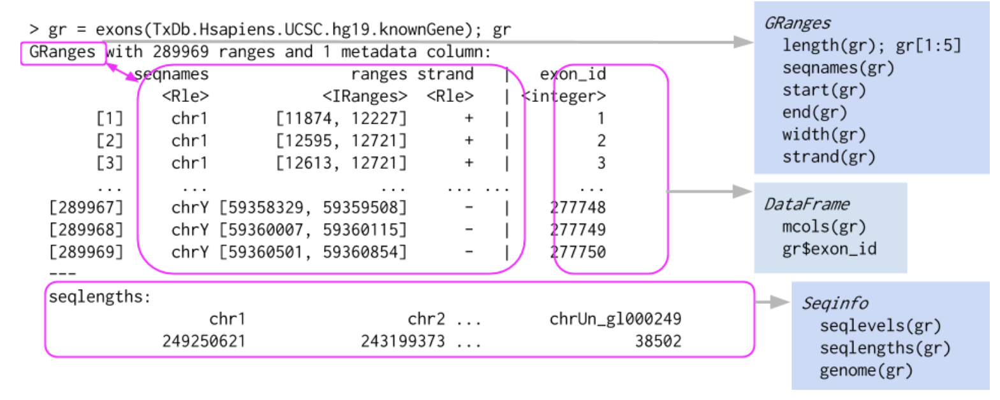
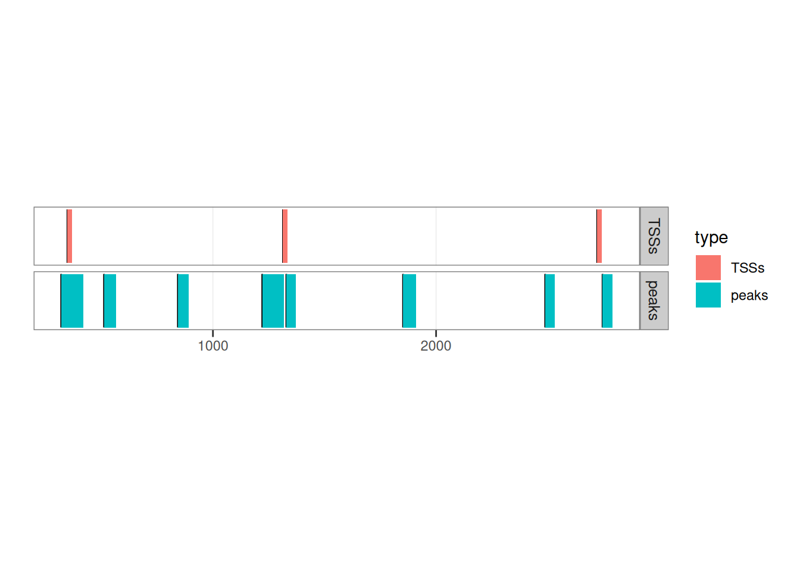
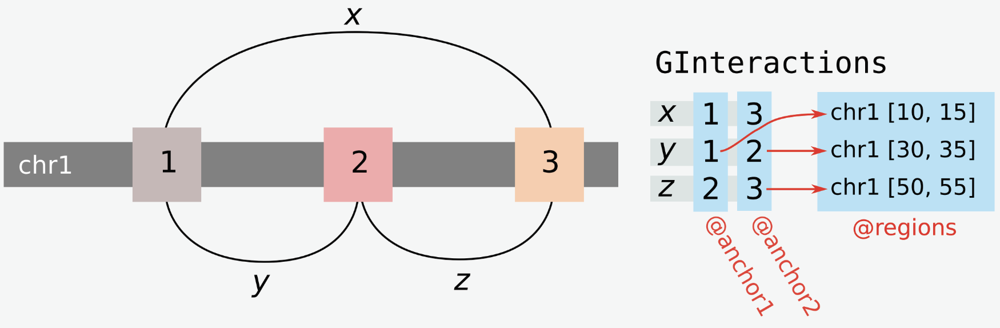
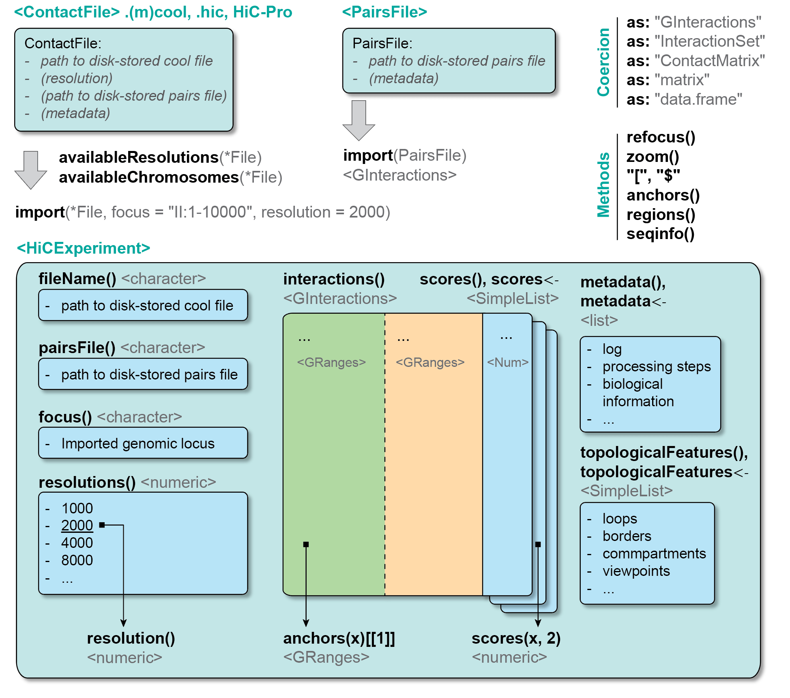

# 2  Hi-C data structures in R

> **NOTE:**
>
> ``` downlit
> library(ggplot2)
> library(GenomicRanges)
> ##  Loading required package: stats4
> ##  Loading required package: BiocGenerics
> ##  Loading required package: generics
> ##  
> ##  Attaching package: 'generics'
> ##  The following objects are masked from 'package:base':
> ##  
> ##      as.difftime, as.factor, as.ordered, intersect, is.element,
> ##      setdiff, setequal, union
> ##  
> ##  Attaching package: 'BiocGenerics'
> ##  The following objects are masked from 'package:stats':
> ##  
> ##      IQR, mad, sd, var, xtabs
> ##  The following object is masked from 'package:utils':
> ##  
> ##      data
> ##  The following objects are masked from 'package:base':
> ##  
> ##      Filter, Find, Map, Position, Reduce, anyDuplicated, aperm,
> ##      append, as.data.frame, basename, cbind, colnames, dirname,
> ##      do.call, duplicated, eval, evalq, get, grep, grepl, is.unsorted,
> ##      lapply, mapply, match, mget, order, paste, pmax, pmax.int, pmin,
> ##      pmin.int, rank, rbind, rownames, sapply, saveRDS, scale,
> ##      sequence, table, tapply, transform, unique, unsplit, which.max,
> ##      which.min
> ##  Loading required package: S4Vectors
> ##  
> ##  Attaching package: 'S4Vectors'
> ##  The following object is masked from 'package:utils':
> ##  
> ##      findMatches
> ##  The following objects are masked from 'package:base':
> ##  
> ##      I, expand.grid, unname
> ##  Loading required package: IRanges
> ##  Loading required package: Seqinfo
> library(InteractionSet)
> ##  Loading required package: SummarizedExperiment
> ##  Loading required package: MatrixGenerics
> ##  Loading required package: matrixStats
> ##  
> ##  Attaching package: 'MatrixGenerics'
> ##  The following objects are masked from 'package:matrixStats':
> ##  
> ##      colAlls, colAnyNAs, colAnys, colAvgsPerRowSet, colCollapse,
> ##      colCounts, colCummaxs, colCummins, colCumprods, colCumsums,
> ##      colDiffs, colIQRDiffs, colIQRs, colLogSumExps, colMadDiffs,
> ##      colMads, colMaxs, colMeans2, colMedians, colMins, colOrderStats,
> ##      colProds, colQuantiles, colRanges, colRanks, colSdDiffs, colSds,
> ##      colSums2, colTabulates, colVarDiffs, colVars, colWeightedMads,
> ##      colWeightedMeans, colWeightedMedians, colWeightedSds,
> ##      colWeightedVars, rowAlls, rowAnyNAs, rowAnys, rowAvgsPerColSet,
> ##      rowCollapse, rowCounts, rowCummaxs, rowCummins, rowCumprods,
> ##      rowCumsums, rowDiffs, rowIQRDiffs, rowIQRs, rowLogSumExps,
> ##      rowMadDiffs, rowMads, rowMaxs, rowMeans2, rowMedians, rowMins,
> ##      rowOrderStats, rowProds, rowQuantiles, rowRanges, rowRanks,
> ##      rowSdDiffs, rowSds, rowSums2, rowTabulates, rowVarDiffs,
> ##      rowVars, rowWeightedMads, rowWeightedMeans, rowWeightedMedians,
> ##      rowWeightedSds, rowWeightedVars
> ##  Loading required package: Biobase
> ##  Welcome to Bioconductor
> ##  
> ##      Vignettes contain introductory material; view with
> ##      'browseVignettes()'. To cite Bioconductor, see
> ##      'citation("Biobase")', and for packages 'citation("pkgname")'.
> ##  
> ##  Attaching package: 'Biobase'
> ##  The following object is masked from 'package:MatrixGenerics':
> ##  
> ##      rowMedians
> ##  The following objects are masked from 'package:matrixStats':
> ##  
> ##      anyMissing, rowMedians
> library(HiCExperiment)
> ##  Consider using the `HiContacts` package to perform advanced genomic operations 
> ##  on `HiCExperiment` objects.
> ##  
> ##  Read "Orchestrating Hi-C analysis with Bioconductor" online book to learn more:
> ##  https://js2264.github.io/OHCA/
> ##  
> ##  Attaching package: 'HiCExperiment'
> ##  The following object is masked from 'package:SummarizedExperiment':
> ##  
> ##      metadata<-
> ##  The following object is masked from 'package:S4Vectors':
> ##  
> ##      metadata<-
> ##  The following object is masked from 'package:ggplot2':
> ##  
> ##      resolution
> library(HiContactsData)
> ##  Loading required package: ExperimentHub
> ##  Loading required package: AnnotationHub
> ##  Loading required package: BiocFileCache
> ##  Loading required package: dbplyr
> ##  OpenTelemetry error: there is no package called 'otelsdk'
> ##  OpenTelemetry error: there is no package called 'otelsdk'
> ##  
> ##  Attaching package: 'AnnotationHub'
> ##  The following object is masked from 'package:Biobase':
> ##  
> ##      cache
> coolf <- HiContactsData('yeast_wt', 'mcool')
> ##  see ?HiContactsData and browseVignettes('HiContactsData') for documentation
> ##  downloading 1 resources
> ##  retrieving 1 resource
> ##  loading from cache
> hicf <- HiContactsData('yeast_wt', 'hic')
> ##  see ?HiContactsData and browseVignettes('HiContactsData') for documentation
> ##  downloading 1 resources
> ##  retrieving 1 resource
> ##  loading from cache
> hicpromatrixf <- HiContactsData('yeast_wt', 'hicpro_matrix')
> ##  see ?HiContactsData and browseVignettes('HiContactsData') for documentation
> ##  downloading 1 resources
> ##  retrieving 1 resource
> ##  loading from cache
> hicproregionsf <- HiContactsData('yeast_wt', 'hicpro_bed')
> ##  see ?HiContactsData and browseVignettes('HiContactsData') for documentation
> ##  downloading 1 resources
> ##  retrieving 1 resource
> ##  loading from cache
> pairsf <- HiContactsData('yeast_wt', 'pairs.gz')
> ##  see ?HiContactsData and browseVignettes('HiContactsData') for documentation
> ##  downloading 1 resources
> ##  retrieving 1 resource
> ##  loading from cache
> ```

> **NOTE:**
>
> This chapter introduces the four main classes offered by `Bioconductor` leveraged to perform Hi-C analysis, describes their structure and how to interact with them:
>
> - `GRanges` (jump to [the section](#granges-class))\
> - `GInteractions` (jump to [the section](#ginteractions-class))\
> - `ContactFile` (jump to [the section](#contactfile-class))\
> - `HiCExperiment` (jump to [the section](#hicexperiment-class))

> **TIP:**
>
> Directly jump to the [last section of this chapter](#visual-summary-of-the-hicexperiment-data-structure) to get a visual representation of these data structures.

## 2.1 `GRanges` class

`GRanges` is a shorthand for `GenomicRanges`, a core class in `Bioconductor`. This class is primarily used to describe genomic ranges of any nature, e.g.  sets of promoters, SNPs, chromatin loop anchors, etc.\
The data structure has been published in the seminal 2015 publication by the `Bioconductor` team (Huber et al. ([2015](#ref-Huber_2015))).

### 2.1.1 `GRanges` fundamentals

The easiest way to generate a `GRanges` object is to coerce it from a vector of genomic coordinates in the UCSC format (e.g. `"chr2:2004-4853"`):

``` downlit
library(GenomicRanges)
gr <- GRanges(c(
    "chr2:2004-7853:+", 
    "chr4:4482-9873:-", 
    "chr5:1943-4203:+", 
    "chr5:4103-5004:+"  
))
gr
##  GRanges object with 4 ranges and 0 metadata columns:
##        seqnames    ranges strand
##           <Rle> <IRanges>  <Rle>
##    [1]     chr2 2004-7853      +
##    [2]     chr4 4482-9873      -
##    [3]     chr5 1943-4203      +
##    [4]     chr5 4103-5004      +
##    -------
##    seqinfo: 3 sequences from an unspecified genome; no seqlengths
```

A single `GRanges` object can contain one or several **“ranges”**, or genomic intervals. To navigate between these ranges, `GRanges` can be subset using the standard `R` single bracket notation `[`:

``` downlit
gr[1]
##  GRanges object with 1 range and 0 metadata columns:
##        seqnames    ranges strand
##           <Rle> <IRanges>  <Rle>
##    [1]     chr2 2004-7853      +
##    -------
##    seqinfo: 3 sequences from an unspecified genome; no seqlengths

gr[1:3]
##  GRanges object with 3 ranges and 0 metadata columns:
##        seqnames    ranges strand
##           <Rle> <IRanges>  <Rle>
##    [1]     chr2 2004-7853      +
##    [2]     chr4 4482-9873      -
##    [3]     chr5 1943-4203      +
##    -------
##    seqinfo: 3 sequences from an unspecified genome; no seqlengths
```

`GenomicRanges` objects aim to provide a natural description of genomic intervals (ranges) and are incredibly versatile. They have four required pieces of information:

- `seqnames` (i.e. chromosome names) (accessible with [`seqnames()`](https://rdrr.io/pkg/Seqinfo/man/seqinfo.html))
- `start` (accessible with [`start()`](https://rdrr.io/r/stats/start.html))
- `end` (accessible with [`end()`](https://rdrr.io/r/stats/start.html))
- `strand` (accessible with [`strand()`](https://rdrr.io/pkg/BiocGenerics/man/strand.html))

``` downlit
seqnames(gr)
##  factor-Rle of length 4 with 3 runs
##    Lengths:    1    1    2
##    Values : chr2 chr4 chr5
##  Levels(3): chr2 chr4 chr5

start(gr)
##  [1] 2004 4482 1943 4103

end(gr)
##  [1] 7853 9873 4203 5004

strand(gr)
##  factor-Rle of length 4 with 3 runs
##    Lengths: 1 1 2
##    Values : + - +
##  Levels(3): + - *
```

Here is a graphical representation of a `GRanges` object, taken from [`Bioconductor` course material](https://www.bioconductor.org/help/course-materials/2015/UseBioconductorFeb2015/):



We will now delve into the detailed structure and operability of `GRanges` objects.

### 2.1.2 `GRanges` metadata

An important aspect of `GRanges` objects is that each entry (range) can have extra optional metadata. This metadata is stored in a rectangular `DataFrame`. Each column can contain a different type of information, e.g. a `numerical` vector, a `factor`, a list, …

One can directly access this `DataFrame` using the [`mcols()`](https://rdrr.io/pkg/S4Vectors/man/Vector-class.html) function, and individual columns of metadata using the `$` notation:

``` downlit
mcols(gr)
##  DataFrame with 4 rows and 0 columns
mcols(gr)$GC <- c(0.45, 0.43, 0.44, 0.42)
mcols(gr)$annotation <- factor(c(NA, 'promoter', 'enhancer', 'centromere'))
mcols(gr)$extended.info <- c(
    list(c(NA)), 
    list(c(date = 2023, source = 'manual')), 
    list(c(date = 2021, source = 'manual')), 
    list(c(date = 2019, source = 'homology'))
)
mcols(gr)
##  DataFrame with 4 rows and 3 columns
##           GC annotation extended.info
##    <numeric>   <factor>        <list>
##  1      0.45 NA                    NA
##  2      0.43 promoter     2023,manual
##  3      0.44 enhancer     2021,manual
##  4      0.42 centromere 2019,homology
```

When metadata columns are defined for a `GRanges` object, they are pasted next to the minimal 4 required `GRanges` fields, separated by a `|` character.

``` downlit
gr
##  GRanges object with 4 ranges and 3 metadata columns:
##        seqnames    ranges strand |        GC annotation extended.info
##           <Rle> <IRanges>  <Rle> | <numeric>   <factor>        <list>
##    [1]     chr2 2004-7853      + |      0.45 NA                  <NA>
##    [2]     chr4 4482-9873      - |      0.43 promoter     2023,manual
##    [3]     chr5 1943-4203      + |      0.44 enhancer     2021,manual
##    [4]     chr5 4103-5004      + |      0.42 centromere 2019,homology
##    -------
##    seqinfo: 3 sequences from an unspecified genome; no seqlengths
```

### 2.1.3 Genomic arithmetics on individual `GRanges` objects

A `GRanges` object primarily describes a set of genomic ranges (*it is in the name!*). Useful genomic-oriented methods have been implemented to investigate individual `GRanges` object from a genomic perspective.

#### 2.1.3.1 Intra-range methods

Standard genomic arithmetics are possible with `GRanges`, e.g.  shifting ranges, resizing, trimming, … These methods are referred to as “intra-range” methods as they work *“one-region-at-a-time”*.

> **NOTE:**
>
> - Each range of the input `GRanges` object is modified independently from the other ranges in the following code chunks.
> - Intra-range operations are **endomorphisms**: they all take `GRanges` inputs and always return `GRanges` objects.

- Shifting each genomic range in a `GRanges` object by a certain number of bases:

``` downlit
gr
##  GRanges object with 4 ranges and 3 metadata columns:
##        seqnames    ranges strand |        GC annotation extended.info
##           <Rle> <IRanges>  <Rle> | <numeric>   <factor>        <list>
##    [1]     chr2 2004-7853      + |      0.45 NA                  <NA>
##    [2]     chr4 4482-9873      - |      0.43 promoter     2023,manual
##    [3]     chr5 1943-4203      + |      0.44 enhancer     2021,manual
##    [4]     chr5 4103-5004      + |      0.42 centromere 2019,homology
##    -------
##    seqinfo: 3 sequences from an unspecified genome; no seqlengths

# ----- Shift all genomic ranges towards the "right" (downstream in `+` strand), by 1000bp:
shift(gr, 1000)
##  GRanges object with 4 ranges and 3 metadata columns:
##        seqnames     ranges strand |        GC annotation extended.info
##           <Rle>  <IRanges>  <Rle> | <numeric>   <factor>        <list>
##    [1]     chr2  3004-8853      + |      0.45 NA                  <NA>
##    [2]     chr4 5482-10873      - |      0.43 promoter     2023,manual
##    [3]     chr5  2943-5203      + |      0.44 enhancer     2021,manual
##    [4]     chr5  5103-6004      + |      0.42 centromere 2019,homology
##    -------
##    seqinfo: 3 sequences from an unspecified genome; no seqlengths

# ----- Shift all genomic ranges towards the "left" (upstream in `+` strand), by 1000bp:
shift(gr, -1000)
##  GRanges object with 4 ranges and 3 metadata columns:
##        seqnames    ranges strand |        GC annotation extended.info
##           <Rle> <IRanges>  <Rle> | <numeric>   <factor>        <list>
##    [1]     chr2 1004-6853      + |      0.45 NA                  <NA>
##    [2]     chr4 3482-8873      - |      0.43 promoter     2023,manual
##    [3]     chr5  943-3203      + |      0.44 enhancer     2021,manual
##    [4]     chr5 3103-4004      + |      0.42 centromere 2019,homology
##    -------
##    seqinfo: 3 sequences from an unspecified genome; no seqlengths
```

- Narrowing each genomic range in a `GRanges` object by a certain number of bases:

``` downlit
gr
##  GRanges object with 4 ranges and 3 metadata columns:
##        seqnames    ranges strand |        GC annotation extended.info
##           <Rle> <IRanges>  <Rle> | <numeric>   <factor>        <list>
##    [1]     chr2 2004-7853      + |      0.45 NA                  <NA>
##    [2]     chr4 4482-9873      - |      0.43 promoter     2023,manual
##    [3]     chr5 1943-4203      + |      0.44 enhancer     2021,manual
##    [4]     chr5 4103-5004      + |      0.42 centromere 2019,homology
##    -------
##    seqinfo: 3 sequences from an unspecified genome; no seqlengths

# ----- Extract 21st-40th subrange for each range in `gr`:
narrow(gr, start = 21, end = 40)
##  GRanges object with 4 ranges and 3 metadata columns:
##        seqnames    ranges strand |        GC annotation extended.info
##           <Rle> <IRanges>  <Rle> | <numeric>   <factor>        <list>
##    [1]     chr2 2024-2043      + |      0.45 NA                  <NA>
##    [2]     chr4 4502-4521      - |      0.43 promoter     2023,manual
##    [3]     chr5 1963-1982      + |      0.44 enhancer     2021,manual
##    [4]     chr5 4123-4142      + |      0.42 centromere 2019,homology
##    -------
##    seqinfo: 3 sequences from an unspecified genome; no seqlengths

width(narrow(gr, start = 21, end = 40))
##  [1] 20 20 20 20
```

- Resizing each genomic range in a `GRanges` object to a certain number of bases:

``` downlit
gr
##  GRanges object with 4 ranges and 3 metadata columns:
##        seqnames    ranges strand |        GC annotation extended.info
##           <Rle> <IRanges>  <Rle> | <numeric>   <factor>        <list>
##    [1]     chr2 2004-7853      + |      0.45 NA                  <NA>
##    [2]     chr4 4482-9873      - |      0.43 promoter     2023,manual
##    [3]     chr5 1943-4203      + |      0.44 enhancer     2021,manual
##    [4]     chr5 4103-5004      + |      0.42 centromere 2019,homology
##    -------
##    seqinfo: 3 sequences from an unspecified genome; no seqlengths

# ----- Resize `gr` entries to 100, fixed at the start of each range:
resize(gr, 100, fix = "start")
##  GRanges object with 4 ranges and 3 metadata columns:
##        seqnames    ranges strand |        GC annotation extended.info
##           <Rle> <IRanges>  <Rle> | <numeric>   <factor>        <list>
##    [1]     chr2 2004-2103      + |      0.45 NA                  <NA>
##    [2]     chr4 9774-9873      - |      0.43 promoter     2023,manual
##    [3]     chr5 1943-2042      + |      0.44 enhancer     2021,manual
##    [4]     chr5 4103-4202      + |      0.42 centromere 2019,homology
##    -------
##    seqinfo: 3 sequences from an unspecified genome; no seqlengths

# ----- Resize `gr` entries to 100, fixed at the start of each range, disregarding strand information:
resize(gr, 100, fix = "start", ignore.strand = TRUE)
##  GRanges object with 4 ranges and 3 metadata columns:
##        seqnames    ranges strand |        GC annotation extended.info
##           <Rle> <IRanges>  <Rle> | <numeric>   <factor>        <list>
##    [1]     chr2 2004-2103      + |      0.45 NA                  <NA>
##    [2]     chr4 4482-4581      - |      0.43 promoter     2023,manual
##    [3]     chr5 1943-2042      + |      0.44 enhancer     2021,manual
##    [4]     chr5 4103-4202      + |      0.42 centromere 2019,homology
##    -------
##    seqinfo: 3 sequences from an unspecified genome; no seqlengths

# ----- Resize `gr` entries to 1 bp, fixed at the center of each range:
resize(gr, 1, fix = "center")
##  GRanges object with 4 ranges and 3 metadata columns:
##        seqnames    ranges strand |        GC annotation extended.info
##           <Rle> <IRanges>  <Rle> | <numeric>   <factor>        <list>
##    [1]     chr2      4928      + |      0.45 NA                  <NA>
##    [2]     chr4      7177      - |      0.43 promoter     2023,manual
##    [3]     chr5      3073      + |      0.44 enhancer     2021,manual
##    [4]     chr5      4553      + |      0.42 centromere 2019,homology
##    -------
##    seqinfo: 3 sequences from an unspecified genome; no seqlengths
```

- Extracting flanking coordinates for each entry in `gr`:

``` downlit
gr
##  GRanges object with 4 ranges and 3 metadata columns:
##        seqnames    ranges strand |        GC annotation extended.info
##           <Rle> <IRanges>  <Rle> | <numeric>   <factor>        <list>
##    [1]     chr2 2004-7853      + |      0.45 NA                  <NA>
##    [2]     chr4 4482-9873      - |      0.43 promoter     2023,manual
##    [3]     chr5 1943-4203      + |      0.44 enhancer     2021,manual
##    [4]     chr5 4103-5004      + |      0.42 centromere 2019,homology
##    -------
##    seqinfo: 3 sequences from an unspecified genome; no seqlengths

# ----- Extract 100bp UPSTREAM of each genomic range, according to range strandness:
flank(gr, 100, start = TRUE)
##  GRanges object with 4 ranges and 3 metadata columns:
##        seqnames    ranges strand |        GC annotation extended.info
##           <Rle> <IRanges>  <Rle> | <numeric>   <factor>        <list>
##    [1]     chr2 1904-2003      + |      0.45 NA                  <NA>
##    [2]     chr4 9874-9973      - |      0.43 promoter     2023,manual
##    [3]     chr5 1843-1942      + |      0.44 enhancer     2021,manual
##    [4]     chr5 4003-4102      + |      0.42 centromere 2019,homology
##    -------
##    seqinfo: 3 sequences from an unspecified genome; no seqlengths

# ----- Extract 1bp DOWNSTREAM of each genomic range, according to range strandness:
flank(gr, 1, start = FALSE)
##  GRanges object with 4 ranges and 3 metadata columns:
##        seqnames    ranges strand |        GC annotation extended.info
##           <Rle> <IRanges>  <Rle> | <numeric>   <factor>        <list>
##    [1]     chr2      7854      + |      0.45 NA                  <NA>
##    [2]     chr4      4481      - |      0.43 promoter     2023,manual
##    [3]     chr5      4204      + |      0.44 enhancer     2021,manual
##    [4]     chr5      5005      + |      0.42 centromere 2019,homology
##    -------
##    seqinfo: 3 sequences from an unspecified genome; no seqlengths
```

Note how here again, strand information is crucial and correctly leveraged to extract “upstream” or “downstream” flanking regions in agreement with genomic range orientation.

- Several arithmetics operators can also directly work with `GRanges`:

``` downlit
gr
##  GRanges object with 4 ranges and 3 metadata columns:
##        seqnames    ranges strand |        GC annotation extended.info
##           <Rle> <IRanges>  <Rle> | <numeric>   <factor>        <list>
##    [1]     chr2 2004-7853      + |      0.45 NA                  <NA>
##    [2]     chr4 4482-9873      - |      0.43 promoter     2023,manual
##    [3]     chr5 1943-4203      + |      0.44 enhancer     2021,manual
##    [4]     chr5 4103-5004      + |      0.42 centromere 2019,homology
##    -------
##    seqinfo: 3 sequences from an unspecified genome; no seqlengths

gr + 100 # ----- Extend each side of the `GRanges` by a given number of bases
##  GRanges object with 4 ranges and 3 metadata columns:
##        seqnames    ranges strand |        GC annotation extended.info
##           <Rle> <IRanges>  <Rle> | <numeric>   <factor>        <list>
##    [1]     chr2 1904-7953      + |      0.45 NA                  <NA>
##    [2]     chr4 4382-9973      - |      0.43 promoter     2023,manual
##    [3]     chr5 1843-4303      + |      0.44 enhancer     2021,manual
##    [4]     chr5 4003-5104      + |      0.42 centromere 2019,homology
##    -------
##    seqinfo: 3 sequences from an unspecified genome; no seqlengths

gr - 200 # ----- Shrink each side of the `GRanges` by a given number of bases 
##  GRanges object with 4 ranges and 3 metadata columns:
##        seqnames    ranges strand |        GC annotation extended.info
##           <Rle> <IRanges>  <Rle> | <numeric>   <factor>        <list>
##    [1]     chr2 2204-7653      + |      0.45 NA                  <NA>
##    [2]     chr4 4682-9673      - |      0.43 promoter     2023,manual
##    [3]     chr5 2143-4003      + |      0.44 enhancer     2021,manual
##    [4]     chr5 4303-4804      + |      0.42 centromere 2019,homology
##    -------
##    seqinfo: 3 sequences from an unspecified genome; no seqlengths

gr * 1000 # ----- Zoom in by a given factor (effectively decreasing the `GRanges` width by the same factor)
##  GRanges object with 4 ranges and 3 metadata columns:
##        seqnames    ranges strand |        GC annotation extended.info
##           <Rle> <IRanges>  <Rle> | <numeric>   <factor>        <list>
##    [1]     chr2 4926-4930      + |      0.45 NA                  <NA>
##    [2]     chr4 7175-7179      - |      0.43 promoter     2023,manual
##    [3]     chr5 3072-3073      + |      0.44 enhancer     2021,manual
##    [4]     chr5 4554-4553      + |      0.42 centromere 2019,homology
##    -------
##    seqinfo: 3 sequences from an unspecified genome; no seqlengths
```

> **WARNING:**
>
> To fully grasp how to operate `GRanges` objects, we highly recommend reading the detailed documentation for this class by typing [`?GenomicRanges`](https://rdrr.io/pkg/GenomicRanges/man/GRanges-class.html) and [`` ?GenomicRanges::`intra-range-methods` ``](https://rdrr.io/pkg/GenomicRanges/man/intra-range-methods.html).

#### 2.1.3.2 Inter-range methods

Compared to “intra-range” methods described above, **inter-range** methods involve comparisons *between* ranges **in a single** GRanges object.

> **NOTE:**
>
> Compared to previous section, the result of each function described below depends on the **entire set of ranges** in the input `GRanges` object.

- Computing the “inverse” genomic ranges, i.e. ranges in-between the input ranges:

``` downlit
gaps(gr)
##  GRanges object with 3 ranges and 0 metadata columns:
##        seqnames    ranges strand
##           <Rle> <IRanges>  <Rle>
##    [1]     chr2    1-2003      +
##    [2]     chr4    1-4481      -
##    [3]     chr5    1-1942      +
##    -------
##    seqinfo: 3 sequences from an unspecified genome; no seqlengths
```

- For each entry in a `GRanges`, finding the index of the preceding/following/nearest genomic range:

``` downlit
precede(gr)
##  [1] NA NA NA NA

follow(gr)
##  [1] NA NA NA NA

nearest(gr)
##  [1] NA NA  4  3
```

- Computing a coverage over a genome, optionally indicated a “score” column from metadata:

``` downlit
coverage(gr, weight = 'GC')
##  RleList of length 3
##  $chr2
##  numeric-Rle of length 7853 with 2 runs
##    Lengths: 2003 5850
##    Values : 0.00 0.45
##  
##  $chr4
##  numeric-Rle of length 9873 with 2 runs
##    Lengths: 4481 5392
##    Values : 0.00 0.43
##  
##  $chr5
##  numeric-Rle of length 5004 with 4 runs
##    Lengths: 1942 2160  101  801
##    Values : 0.00 0.44 0.86 0.42
```

> **WARNING:**
>
> To fully grasp how to operate `GRanges` objects, we highly recommend reading the detailed documentation for this class by typing [`` ?GenomicRanges::`inter-range-methods` ``](https://rdrr.io/pkg/GenomicRanges/man/inter-range-methods.html).

### 2.1.4 Comparing multiple `GRanges` objects

Genomic analysis typically requires intersection of two sets of genomic ranges, e.g. to find which ranges from one set overlap with those from another set.

In the next examples, we will use two `GRanges`:

- `peaks` represents dummy 8 ChIP-seq peaks

``` downlit
peaks <- GRanges(c(
    'chr1:320-418',
    'chr1:512-567',
    'chr1:843-892',
    'chr1:1221-1317', 
    'chr1:1329-1372', 
    'chr1:1852-1909', 
    'chr1:2489-2532', 
    'chr1:2746-2790'
))
peaks
##  GRanges object with 8 ranges and 0 metadata columns:
##        seqnames    ranges strand
##           <Rle> <IRanges>  <Rle>
##    [1]     chr1   320-418      *
##    [2]     chr1   512-567      *
##    [3]     chr1   843-892      *
##    [4]     chr1 1221-1317      *
##    [5]     chr1 1329-1372      *
##    [6]     chr1 1852-1909      *
##    [7]     chr1 2489-2532      *
##    [8]     chr1 2746-2790      *
##    -------
##    seqinfo: 1 sequence from an unspecified genome; no seqlengths
```

- `TSSs` represents dummy 3 gene promoters (± 10bp around the TSS)

``` downlit
genes <- GRanges(c(
    'chr1:358-1292:+',
    'chr1:1324-2343:+', 
    'chr1:2732-2751:+'
))
TSSs <- resize(genes, width = 1, fix = 'start') + 10
TSSs
##  GRanges object with 3 ranges and 0 metadata columns:
##        seqnames    ranges strand
##           <Rle> <IRanges>  <Rle>
##    [1]     chr1   348-368      +
##    [2]     chr1 1314-1334      +
##    [3]     chr1 2722-2742      +
##    -------
##    seqinfo: 1 sequence from an unspecified genome; no seqlengths
```

Let’s see how they overlap by plotting them:

``` downlit
library(ggplot2)
peaks$type <- 'peaks'
TSSs$type <- 'TSSs'
ggplot() + 
    ggbio::geom_rect(c(peaks, TSSs), aes(fill = type), facets = type~.) + 
    ggbio::theme_alignment() + 
    coord_fixed(ratio = 300)
##  Scale for y is already present.
##  Adding another scale for y, which will replace the existing scale.
```



#### 2.1.4.1 Finding overlaps between two `GRanges` sets

- Finding overlaps between a query and a subject

In our case, we want to identify which ChIP-seq peaks overlap with a TSS: the query is the set of peaks and the subject is the set of TSSs.

`findOverlaps` returns a `Hits` object listing which `query` ranges overlap with which `subject` ranges.

``` downlit
ov <- findOverlaps(query = peaks, subject = TSSs)
ov
##  Hits object with 3 hits and 0 metadata columns:
##        queryHits subjectHits
##        <integer>   <integer>
##    [1]         1           1
##    [2]         4           2
##    [3]         5           2
##    -------
##    queryLength: 8 / subjectLength: 3
```

The `Hits` output clearly describes what overlaps with what:

- The query (peak) `#1` overlaps with subject (TSS) `#1`
- The query (peak) `#5` overlaps with subject (TSS) `#2`

> **NOTE:**
>
> Because no other query index or subject index is listed in the `ov` output, none of the remaining ranges from `query` overlap with ranges from `subject`.

- Subsetting by overlaps between a query and a subject

To directly **subset** ranges from `query` overlapping with ranges from a `subject` (e.g. to only keep *peaks* overlapping a *TSS*), we can use the `subsetByOverlaps` function. The output of `subsetByOverlaps` is a subset of the original `GRanges` object provided as a `query`, with retained ranges being unmodified.

``` downlit
subsetByOverlaps(peaks, TSSs)
##  GRanges object with 3 ranges and 1 metadata column:
##        seqnames    ranges strand |        type
##           <Rle> <IRanges>  <Rle> | <character>
##    [1]     chr1   320-418      * |       peaks
##    [2]     chr1 1221-1317      * |       peaks
##    [3]     chr1 1329-1372      * |       peaks
##    -------
##    seqinfo: 1 sequence from an unspecified genome; no seqlengths
```

- Counting overlaps between a query and a subject

Finally, the `countOverlaps` is used to count, for each range in a `query`, how many ranges in the `subject` it overlaps with.

``` downlit
countOverlaps(query = peaks, subject = TSSs)
##  [1] 1 0 0 1 1 0 0 0
```

> **NOTE:**
>
> Note that which `GRanges` goes in `query` or `subject` is crucial! Counting **for each peak, the number of TSSs it overlaps with** is very different from **for each TSS, how many peaks it overlaps with**.
>
> In our case example, it would also be informative to count how many peaks overlap with each TSS, so we’d need to swap `query` and `subject`:
>
> ``` downlit
> countOverlaps(query = TSSs, subject = peaks)
> ##  [1] 1 2 0
> ```
>
> We can add these counts to the original `query` object:
>
> ``` downlit
> TSSs$n_peaks <- countOverlaps(query = TSSs, subject = peaks)
> TSSs
> ##  GRanges object with 3 ranges and 2 metadata columns:
> ##        seqnames    ranges strand |        type   n_peaks
> ##           <Rle> <IRanges>  <Rle> | <character> <integer>
> ##    [1]     chr1   348-368      + |        TSSs         1
> ##    [2]     chr1 1314-1334      + |        TSSs         2
> ##    [3]     chr1 2722-2742      + |        TSSs         0
> ##    -------
> ##    seqinfo: 1 sequence from an unspecified genome; no seqlengths
> ```

- `%over%`, `%within%`, `%outside%` : handy operators

Handy operators exist that return logical vectors (same length as the `query`). They essentially are short-hands for specific [`findOverlaps()`](https://rdrr.io/pkg/IRanges/man/findOverlaps-methods.html) cases.

`<query> %over% <subject>`:

``` downlit
peaks %over% TSSs
##  [1]  TRUE FALSE FALSE  TRUE  TRUE FALSE FALSE FALSE

peaks[peaks %over% TSSs] # ----- Equivalent to `subsetByOverlaps(peaks, TSSs)`
##  GRanges object with 3 ranges and 1 metadata column:
##        seqnames    ranges strand |        type
##           <Rle> <IRanges>  <Rle> | <character>
##    [1]     chr1   320-418      * |       peaks
##    [2]     chr1 1221-1317      * |       peaks
##    [3]     chr1 1329-1372      * |       peaks
##    -------
##    seqinfo: 1 sequence from an unspecified genome; no seqlengths
```

`<query> %within% <subject>`:

``` downlit
peaks %within% TSSs
##  [1] FALSE FALSE FALSE FALSE FALSE FALSE FALSE FALSE

TSSs %within% peaks
##  [1]  TRUE FALSE FALSE
```

`<query> %outside% <subject>`:

``` downlit
peaks %outside% TSSs
##  [1] FALSE  TRUE  TRUE FALSE FALSE  TRUE  TRUE  TRUE
```

> **WARNING:**
>
> To fully grasp how to find overlaps between `GRanges` objects, we highly recommend reading the detailed documentation by typing [`` ?IRanges::`findOverlaps-methods` ``](https://rdrr.io/pkg/IRanges/man/findOverlaps-methods.html).

#### 2.1.4.2 Find nearest range from a subject for each range in a query

`*Overlaps` methods are not always enough to match a `query` to a `subject`. For instance, some peaks in the `query` might be very near to some TSSs in the `subject`, but not quite overlapping.

``` downlit
peaks[8]
##  GRanges object with 1 range and 1 metadata column:
##        seqnames    ranges strand |        type
##           <Rle> <IRanges>  <Rle> | <character>
##    [1]     chr1 2746-2790      * |       peaks
##    -------
##    seqinfo: 1 sequence from an unspecified genome; no seqlengths

TSSs[3]
##  GRanges object with 1 range and 2 metadata columns:
##        seqnames    ranges strand |        type   n_peaks
##           <Rle> <IRanges>  <Rle> | <character> <integer>
##    [1]     chr1 2722-2742      + |        TSSs         0
##    -------
##    seqinfo: 1 sequence from an unspecified genome; no seqlengths
```

- [`nearest()`](https://rdrr.io/pkg/IRanges/man/nearest-methods.html)

Rather than finding the *overlapping* range in a `subject` for each range in a `query`, we can find the `nearest` range.

For each range in the `query`, this returns the *index* of the range in the `subject` to which the `query` is the nearest.

``` downlit
nearest(peaks, TSSs)
##  [1] 1 1 2 2 2 2 3 3

TSSs[nearest(peaks, TSSs)]
##  GRanges object with 8 ranges and 2 metadata columns:
##        seqnames    ranges strand |        type   n_peaks
##           <Rle> <IRanges>  <Rle> | <character> <integer>
##    [1]     chr1   348-368      + |        TSSs         1
##    [2]     chr1   348-368      + |        TSSs         1
##    [3]     chr1 1314-1334      + |        TSSs         2
##    [4]     chr1 1314-1334      + |        TSSs         2
##    [5]     chr1 1314-1334      + |        TSSs         2
##    [6]     chr1 1314-1334      + |        TSSs         2
##    [7]     chr1 2722-2742      + |        TSSs         0
##    [8]     chr1 2722-2742      + |        TSSs         0
##    -------
##    seqinfo: 1 sequence from an unspecified genome; no seqlengths
```

- [`distance()`](https://rdrr.io/pkg/IRanges/man/nearest-methods.html)

Alternatively, one can simply ask to calculate the `distanceToNearest` between ranges in a `query` and ranges in a `subject`.

``` downlit
distanceToNearest(peaks, TSSs)
##  Hits object with 8 hits and 1 metadata column:
##        queryHits subjectHits |  distance
##        <integer>   <integer> | <integer>
##    [1]         1           1 |         0
##    [2]         2           1 |       143
##    [3]         3           2 |       421
##    [4]         4           2 |         0
##    [5]         5           2 |         0
##    [6]         6           2 |       517
##    [7]         7           3 |       189
##    [8]         8           3 |         3
##    -------
##    queryLength: 8 / subjectLength: 3

peaks$distance_to_nearest_TSS <- mcols(distanceToNearest(peaks, TSSs))$distance
```

Note how close from a TSS the 8th peak was. It could be worth considering this as an overlap!

## 2.2 `GInteractions` class

`GRanges` describe genomic ranges and hence are of general use to study 1D genome organization. To study chromatin interactions, we need a way to link pairs of `GRanges`. This is exactly what the `GInteractions` class does. This data structure is defined in the `InteractionSet` package and has been published in the 2016 paper by `Lun et al.` (Lun et al. ([2016](#ref-Lun_2016))).



### 2.2.1 Building a `GInteractions` object from scratch

Let’s first define two parallel `GRanges` objects (i.e. two `GRanges` of same length). Each `GRanges` will contain 5 ranges.

``` downlit
gr_first <- GRanges(c(
    'chr1:1-100', 
    'chr1:1001-2000', 
    'chr1:5001-6000', 
    'chr1:8001-9000', 
    'chr1:7001-8000'  
))
gr_second <- GRanges(c(
    'chr1:1-100', 
    'chr1:3001-4000', 
    'chr1:8001-9000', 
    'chr1:7001-8000', 
    'chr2:13000-14000'  
))
```

Because these two `GRanges` objects are of same length (5), one can “bind” them together by using the `GInteractions`function. This effectively associate each entry from one `GRanges` to the entry aligned in the other `GRanges` object.

``` downlit
library(InteractionSet)
gi <- GInteractions(gr_first, gr_second)
gi
##  GInteractions object with 5 interactions and 0 metadata columns:
##        seqnames1   ranges1     seqnames2     ranges2
##            <Rle> <IRanges>         <Rle>   <IRanges>
##    [1]      chr1     1-100 ---      chr1       1-100
##    [2]      chr1 1001-2000 ---      chr1   3001-4000
##    [3]      chr1 5001-6000 ---      chr1   8001-9000
##    [4]      chr1 8001-9000 ---      chr1   7001-8000
##    [5]      chr1 7001-8000 ---      chr2 13000-14000
##    -------
##    regions: 7 ranges and 0 metadata columns
##    seqinfo: 2 sequences from an unspecified genome; no seqlengths
```

The way `GInteractions` objects are printed in an R console mimics that of `GRanges`, but pairs two “ends” (a.k.a. *anchors*) of an interaction together, each end being represented as a separate `GRanges` range.

- Note that it is possible to have interactions joining two identical anchors.

``` downlit
gi[1]
##  GInteractions object with 1 interaction and 0 metadata columns:
##        seqnames1   ranges1     seqnames2   ranges2
##            <Rle> <IRanges>         <Rle> <IRanges>
##    [1]      chr1     1-100 ---      chr1     1-100
##    -------
##    regions: 7 ranges and 0 metadata columns
##    seqinfo: 2 sequences from an unspecified genome; no seqlengths
```

- It is also technically possible (though not advised) to have interactions for which the “first” end is located after the “second” end along the chromosome.

``` downlit
gi[4]
##  GInteractions object with 1 interaction and 0 metadata columns:
##        seqnames1   ranges1     seqnames2   ranges2
##            <Rle> <IRanges>         <Rle> <IRanges>
##    [1]      chr1 8001-9000 ---      chr1 7001-8000
##    -------
##    regions: 7 ranges and 0 metadata columns
##    seqinfo: 2 sequences from an unspecified genome; no seqlengths
```

- Finally, it is possible to define inter-chromosomal interactions (a.k.a. trans interactions).

``` downlit
gi[5]
##  GInteractions object with 1 interaction and 0 metadata columns:
##        seqnames1   ranges1     seqnames2     ranges2
##            <Rle> <IRanges>         <Rle>   <IRanges>
##    [1]      chr1 7001-8000 ---      chr2 13000-14000
##    -------
##    regions: 7 ranges and 0 metadata columns
##    seqinfo: 2 sequences from an unspecified genome; no seqlengths
```

### 2.2.2 `GInteractions` specific slots

Compared to `GRanges`, extra slots are available for `GInteractions` objects, e.g. `anchors` and `regions`.

#### 2.2.2.1 Anchors

“Anchors” of a single genomic interaction refer to the two ends of this interaction. These anchors can be extracted from a `GInteractions` object using the [`anchors()`](https://rdrr.io/pkg/InteractionSet/man/interaction-accessors.html) function. This outputs a list of two `GRanges`, the first corresponding to the “left” end of interactions (when printed to the console) and the second corresponding to the “right” end of interactions (when printed to the console).

``` downlit
# ----- This extracts the two sets of anchors ("first" and "second") from a GInteractions object
anchors(gi)
##  $first
##  GRanges object with 5 ranges and 0 metadata columns:
##        seqnames    ranges strand
##           <Rle> <IRanges>  <Rle>
##    [1]     chr1     1-100      *
##    [2]     chr1 1001-2000      *
##    [3]     chr1 5001-6000      *
##    [4]     chr1 8001-9000      *
##    [5]     chr1 7001-8000      *
##    -------
##    seqinfo: 2 sequences from an unspecified genome; no seqlengths
##  
##  $second
##  GRanges object with 5 ranges and 0 metadata columns:
##        seqnames      ranges strand
##           <Rle>   <IRanges>  <Rle>
##    [1]     chr1       1-100      *
##    [2]     chr1   3001-4000      *
##    [3]     chr1   8001-9000      *
##    [4]     chr1   7001-8000      *
##    [5]     chr2 13000-14000      *
##    -------
##    seqinfo: 2 sequences from an unspecified genome; no seqlengths

# ----- We can query for the "first" or "second" set of anchors directly
anchors(gi, "first")
##  GRanges object with 5 ranges and 0 metadata columns:
##        seqnames    ranges strand
##           <Rle> <IRanges>  <Rle>
##    [1]     chr1     1-100      *
##    [2]     chr1 1001-2000      *
##    [3]     chr1 5001-6000      *
##    [4]     chr1 8001-9000      *
##    [5]     chr1 7001-8000      *
##    -------
##    seqinfo: 2 sequences from an unspecified genome; no seqlengths

anchors(gi, "second")
##  GRanges object with 5 ranges and 0 metadata columns:
##        seqnames      ranges strand
##           <Rle>   <IRanges>  <Rle>
##    [1]     chr1       1-100      *
##    [2]     chr1   3001-4000      *
##    [3]     chr1   8001-9000      *
##    [4]     chr1   7001-8000      *
##    [5]     chr2 13000-14000      *
##    -------
##    seqinfo: 2 sequences from an unspecified genome; no seqlengths
```

#### 2.2.2.2 Regions

“Regions” of a *set* of interactions refer to the universe of unique anchors represented in a set of interactions. Therefore, the length of the `regions` can only be equal to or strictly lower than twice the length of `anchors`.

The `regions` function returns the regions associated with a `GInteractions` object, stored as a `GRanges` object.

``` downlit
regions(gi)
##  GRanges object with 7 ranges and 0 metadata columns:
##        seqnames      ranges strand
##           <Rle>   <IRanges>  <Rle>
##    [1]     chr1       1-100      *
##    [2]     chr1   1001-2000      *
##    [3]     chr1   3001-4000      *
##    [4]     chr1   5001-6000      *
##    [5]     chr1   7001-8000      *
##    [6]     chr1   8001-9000      *
##    [7]     chr2 13000-14000      *
##    -------
##    seqinfo: 2 sequences from an unspecified genome; no seqlengths

length(regions(gi))
##  [1] 7

length(anchors(gi, "first"))
##  [1] 5
```

### 2.2.3 `GInteractions` methods

`GInteractions` behave as an extension of `GRanges`. For this reason, many methods that work with `GRanges` will work seamlessly with `GInteractions`.

#### 2.2.3.1 Metadata

One can add metadata columns directly to a `GInteractions` object.

``` downlit
mcols(gi)
##  DataFrame with 5 rows and 0 columns
mcols(gi) <- data.frame(
    idx = seq(1, length(gi)),
    type = c("cis", "cis", "cis", "cis", "trans")
)
gi
##  GInteractions object with 5 interactions and 2 metadata columns:
##        seqnames1   ranges1     seqnames2     ranges2 |       idx        type
##            <Rle> <IRanges>         <Rle>   <IRanges> | <integer> <character>
##    [1]      chr1     1-100 ---      chr1       1-100 |         1         cis
##    [2]      chr1 1001-2000 ---      chr1   3001-4000 |         2         cis
##    [3]      chr1 5001-6000 ---      chr1   8001-9000 |         3         cis
##    [4]      chr1 8001-9000 ---      chr1   7001-8000 |         4         cis
##    [5]      chr1 7001-8000 ---      chr2 13000-14000 |         5       trans
##    -------
##    regions: 7 ranges and 0 metadata columns
##    seqinfo: 2 sequences from an unspecified genome; no seqlengths

gi$type
##  [1] "cis"   "cis"   "cis"   "cis"   "trans"
```

Importantly, metadata columns can also be directly added to **regions** of a `GInteractions` object, since these `regions` are a `GRanges` object themselves!

``` downlit
regions(gi)
##  GRanges object with 7 ranges and 0 metadata columns:
##        seqnames      ranges strand
##           <Rle>   <IRanges>  <Rle>
##    [1]     chr1       1-100      *
##    [2]     chr1   1001-2000      *
##    [3]     chr1   3001-4000      *
##    [4]     chr1   5001-6000      *
##    [5]     chr1   7001-8000      *
##    [6]     chr1   8001-9000      *
##    [7]     chr2 13000-14000      *
##    -------
##    seqinfo: 2 sequences from an unspecified genome; no seqlengths
regions(gi)$binID <- seq_along(regions(gi))
regions(gi)$type <- c("P", "P", "P", "E", "E", "P", "P")
regions(gi)
##  GRanges object with 7 ranges and 2 metadata columns:
##        seqnames      ranges strand |     binID        type
##           <Rle>   <IRanges>  <Rle> | <integer> <character>
##    [1]     chr1       1-100      * |         1           P
##    [2]     chr1   1001-2000      * |         2           P
##    [3]     chr1   3001-4000      * |         3           P
##    [4]     chr1   5001-6000      * |         4           E
##    [5]     chr1   7001-8000      * |         5           E
##    [6]     chr1   8001-9000      * |         6           P
##    [7]     chr2 13000-14000      * |         7           P
##    -------
##    seqinfo: 2 sequences from an unspecified genome; no seqlengths
```

#### 2.2.3.2 Sorting `GInteractions`

The `sort` function works seamlessly with `GInteractions` objects. It sorts the interactions using a similar approach to that performed by `pairtools sort ...` for disk-stored `.pairs` files, sorting on the “first” anchor first, then for interactions with the same “first” anchors, sorting on the “second” anchor.

``` downlit
gi
##  GInteractions object with 5 interactions and 2 metadata columns:
##        seqnames1   ranges1     seqnames2     ranges2 |       idx        type
##            <Rle> <IRanges>         <Rle>   <IRanges> | <integer> <character>
##    [1]      chr1     1-100 ---      chr1       1-100 |         1         cis
##    [2]      chr1 1001-2000 ---      chr1   3001-4000 |         2         cis
##    [3]      chr1 5001-6000 ---      chr1   8001-9000 |         3         cis
##    [4]      chr1 8001-9000 ---      chr1   7001-8000 |         4         cis
##    [5]      chr1 7001-8000 ---      chr2 13000-14000 |         5       trans
##    -------
##    regions: 7 ranges and 2 metadata columns
##    seqinfo: 2 sequences from an unspecified genome; no seqlengths

sort(gi)
##  GInteractions object with 5 interactions and 2 metadata columns:
##        seqnames1   ranges1     seqnames2     ranges2 |       idx        type
##            <Rle> <IRanges>         <Rle>   <IRanges> | <integer> <character>
##    [1]      chr1     1-100 ---      chr1       1-100 |         1         cis
##    [2]      chr1 1001-2000 ---      chr1   3001-4000 |         2         cis
##    [3]      chr1 5001-6000 ---      chr1   8001-9000 |         3         cis
##    [4]      chr1 7001-8000 ---      chr2 13000-14000 |         5       trans
##    [5]      chr1 8001-9000 ---      chr1   7001-8000 |         4         cis
##    -------
##    regions: 7 ranges and 2 metadata columns
##    seqinfo: 2 sequences from an unspecified genome; no seqlengths
```

#### 2.2.3.3 Swapping `GInteractions` anchors

For an individual interaction contained in a `GInteractions` object, the “first” and “second” anchors themselves can be sorted as well. This is called “pairs swapping”, and it is performed similarly to `pairtools flip ...` for disk-stored `.pairs` files. This ensures that interactions, when represented as a contact matrix, generate an upper-triangular matrix.

``` downlit
gi
##  GInteractions object with 5 interactions and 2 metadata columns:
##        seqnames1   ranges1     seqnames2     ranges2 |       idx        type
##            <Rle> <IRanges>         <Rle>   <IRanges> | <integer> <character>
##    [1]      chr1     1-100 ---      chr1       1-100 |         1         cis
##    [2]      chr1 1001-2000 ---      chr1   3001-4000 |         2         cis
##    [3]      chr1 5001-6000 ---      chr1   8001-9000 |         3         cis
##    [4]      chr1 8001-9000 ---      chr1   7001-8000 |         4         cis
##    [5]      chr1 7001-8000 ---      chr2 13000-14000 |         5       trans
##    -------
##    regions: 7 ranges and 2 metadata columns
##    seqinfo: 2 sequences from an unspecified genome; no seqlengths

swapAnchors(gi)
##  GInteractions object with 5 interactions and 2 metadata columns:
##        seqnames1   ranges1     seqnames2     ranges2 |       idx        type
##            <Rle> <IRanges>         <Rle>   <IRanges> | <integer> <character>
##    [1]      chr1     1-100 ---      chr1       1-100 |         1         cis
##    [2]      chr1 1001-2000 ---      chr1   3001-4000 |         2         cis
##    [3]      chr1 5001-6000 ---      chr1   8001-9000 |         3         cis
##    [4]      chr1 7001-8000 ---      chr1   8001-9000 |         4         cis
##    [5]      chr1 7001-8000 ---      chr2 13000-14000 |         5       trans
##    -------
##    regions: 7 ranges and 2 metadata columns
##    seqinfo: 2 sequences from an unspecified genome; no seqlengths
```

> **WARNING:**
>
> “Sorting” and “swapping” a `GInteractions` object are two **entirely different actions**:
>
> - “sorting” reorganizes all *rows* (interactions);
> - “swapping” *anchors* reorganizes *“first” and “second” anchors* for each interaction independently.

#### 2.2.3.4 `GInteractions` distance method

“Distance”, when applied to genomic interactions, typically refers to the genomic distance between the two anchors of a single interaction. For `GInteractions`, this is computed using the `pairdist` function.

``` downlit
gi
##  GInteractions object with 5 interactions and 2 metadata columns:
##        seqnames1   ranges1     seqnames2     ranges2 |       idx        type
##            <Rle> <IRanges>         <Rle>   <IRanges> | <integer> <character>
##    [1]      chr1     1-100 ---      chr1       1-100 |         1         cis
##    [2]      chr1 1001-2000 ---      chr1   3001-4000 |         2         cis
##    [3]      chr1 5001-6000 ---      chr1   8001-9000 |         3         cis
##    [4]      chr1 8001-9000 ---      chr1   7001-8000 |         4         cis
##    [5]      chr1 7001-8000 ---      chr2 13000-14000 |         5       trans
##    -------
##    regions: 7 ranges and 2 metadata columns
##    seqinfo: 2 sequences from an unspecified genome; no seqlengths

pairdist(gi)
##  [1]    0 2000 3000 1000   NA
```

Note that for “trans” inter-chromosomal interactions, i.e. interactions with anchors on different chromosomes, the notion of genomic distance is meaningless and for this reason, `pairdist` returns a `NA` value.

The `type` argument of the [`pairdist()`](https://rdrr.io/pkg/InteractionSet/man/distances.html) function can be tweaked to specify which type of “distance” should be computed:

- `mid`: The distance between the midpoints of the two regions (rounded down to the nearest integer) is returned (Default).
- `gap`: The length of the gap between the closest points of the two regions is computed - negative lengths are returned for overlapping regions, indicating the length of the overlap.
- `span`: The distance between the furthermost points of the two regions is computed.
- `diag`: The difference between the anchor indices is returned. This corresponds to a diagonal on the interaction space when bins are used in the ‘regions’ slot of ‘x’.

#### 2.2.3.5 `GInteractions` overlap methods

“Overlaps” for genomic interactions could be computed in different contexts:

- Case 1: Overlap between any of the two anchors of an interaction with a genomic range
- Case 2: Overlap between anchors of an interaction with anchors of another interaction
- Case 3: Spanning of the interaction “across” a genomic range

> Case 1: Overlap between any of the two anchors of an interaction with a genomic range

This is the default behavior of `findOverlaps` when providing a `GInteractions` object as `query` and a `GRanges` as a `subject`.

``` downlit
gr <- GRanges(c("chr1:7501-7600", "chr1:8501-8600"))
findOverlaps(query = gi, subject = gr)
##  Hits object with 4 hits and 0 metadata columns:
##        queryHits subjectHits
##        <integer>   <integer>
##    [1]         3           2
##    [2]         4           1
##    [3]         4           2
##    [4]         5           1
##    -------
##    queryLength: 5 / subjectLength: 2

countOverlaps(gi, gr)
##  [1] 0 0 1 2 1

subsetByOverlaps(gi, gr)
##  GInteractions object with 3 interactions and 2 metadata columns:
##        seqnames1   ranges1     seqnames2     ranges2 |       idx        type
##            <Rle> <IRanges>         <Rle>   <IRanges> | <integer> <character>
##    [1]      chr1 5001-6000 ---      chr1   8001-9000 |         3         cis
##    [2]      chr1 8001-9000 ---      chr1   7001-8000 |         4         cis
##    [3]      chr1 7001-8000 ---      chr2 13000-14000 |         5       trans
##    -------
##    regions: 7 ranges and 2 metadata columns
##    seqinfo: 2 sequences from an unspecified genome; no seqlengths
```

Here again, the order matters!

``` downlit
countOverlaps(gr, gi)
##  [1] 2 2
```

And again, the `%over%` operator can be used here:

``` downlit
gi %over% gr
##  [1] FALSE FALSE  TRUE  TRUE  TRUE

gi[gi %over% gr] # ----- Equivalent to `subsetByOverlaps(gi, gr)`
##  GInteractions object with 3 interactions and 2 metadata columns:
##        seqnames1   ranges1     seqnames2     ranges2 |       idx        type
##            <Rle> <IRanges>         <Rle>   <IRanges> | <integer> <character>
##    [1]      chr1 5001-6000 ---      chr1   8001-9000 |         3         cis
##    [2]      chr1 8001-9000 ---      chr1   7001-8000 |         4         cis
##    [3]      chr1 7001-8000 ---      chr2 13000-14000 |         5       trans
##    -------
##    regions: 7 ranges and 2 metadata columns
##    seqinfo: 2 sequences from an unspecified genome; no seqlengths
```

> Case 2: Overlap between anchors of an interaction with anchors of another interaction

This slightly different scenario involves overlapping two sets of interactions, to see whether any interaction in `Set-1` has its two anchors overlapping anchors from an interaction in `Set-2`.

``` downlit
gi2 <- GInteractions(
    GRanges("chr1:1081-1090"), 
    GRanges("chr1:3401-3501")
)
gi %over% gi2
##  [1] FALSE  TRUE FALSE FALSE FALSE
```

Note that both anchors of an interaction from a `query` have to overlap to a pair of anchors of a single interaction from a `subject` with this method!

``` downlit
gi3 <- GInteractions(
    GRanges("chr1:1-1000"), 
    GRanges("chr1:3401-3501")
)
gi %over% gi3
##  [1] FALSE FALSE FALSE FALSE FALSE
```

> Case 3 : Spanning of the interaction “across” a genomic range

This requires a bit of wrangling, to mimic an overlap between two `GRanges` objects:

``` downlit
gi <- swapAnchors(gi) # ----- Make sure anchors are correctly sorted
gi <- sort(gi) # ----- Make sure interactions are correctly sorted
gi <- gi[!is.na(pairdist(gi))] # ----- Remove inter-chromosomal interactions
spanning_gi <- GRanges(
    seqnames = seqnames(anchors(gi)[[1]]), 
    ranges = IRanges(
        start(anchors(gi)[[1]]), 
        end(anchors(gi)[[2]])
    )
)
spanning_gi 
##  GRanges object with 4 ranges and 0 metadata columns:
##        seqnames    ranges strand
##           <Rle> <IRanges>  <Rle>
##    [1]     chr1     1-100      *
##    [2]     chr1 1001-4000      *
##    [3]     chr1 5001-9000      *
##    [4]     chr1 7001-9000      *
##    -------
##    seqinfo: 2 sequences from an unspecified genome; no seqlengths

spanning_gi %over% gr
##  [1] FALSE FALSE  TRUE  TRUE
```

> **WARNING:**
>
> A detailed manual of overlap methods available for `GInteractions` object can be read by typing [`` ?`Interaction-overlaps` ``](https://rdrr.io/pkg/InteractionSet/man/overlaps.html) in R.

## 2.3 `ContactFile` class

Hi-C contacts can be stored in four different formats (see [previous chapter](../pages/principles.llms.md#binned-contact-matrix-files)):

- As a `.(m)cool` matrix (multi-scores, multi-resolution, indexed)
- As a `.hic` matrix (multi-scores, multi-resolution, indexed)
- As a HiC-pro derived matrix (single-score, single-resolution, non-indexed)
- Un-binned, Hi-C contacts can be stored in `.pairs` files

### 2.3.1 Accessing example Hi-C files

Example contact files can be downloaded using `HiContactsData` function.

``` downlit
library(HiContactsData)
coolf <- HiContactsData('yeast_wt', 'mcool')
##  see ?HiContactsData and browseVignettes('HiContactsData') for documentation
##  loading from cache
```

This fetches files from the cloud, download them locally and returns the path of the local file.

``` downlit
coolf
##                                           EH7702 
##  "/opt/R-cache/R/ExperimentHub/15057bb43fd_7752"
```

Similarly, example files are available for other file formats:

``` downlit
hicf <- HiContactsData('yeast_wt', 'hic')
##  see ?HiContactsData and browseVignettes('HiContactsData') for documentation
##  loading from cache
hicpromatrixf <- HiContactsData('yeast_wt', 'hicpro_matrix')
##  see ?HiContactsData and browseVignettes('HiContactsData') for documentation
##  loading from cache
hicproregionsf <- HiContactsData('yeast_wt', 'hicpro_bed')
##  see ?HiContactsData and browseVignettes('HiContactsData') for documentation
##  loading from cache
pairsf <- HiContactsData('yeast_wt', 'pairs.gz')
##  see ?HiContactsData and browseVignettes('HiContactsData') for documentation
##  loading from cache
```

We can even check the content of some of these files to make sure they are actually what they are:

``` downlit
# ---- HiC-Pro generates a tab-separated `regions.bed` file
readLines(hicproregionsf, 25)
##   [1] "I\t0\t1000"      "I\t1000\t2000"   "I\t2000\t3000"   "I\t3000\t4000"  
##   [5] "I\t4000\t5000"   "I\t5000\t6000"   "I\t6000\t7000"   "I\t7000\t8000"  
##   [9] "I\t8000\t9000"   "I\t9000\t10000"  "I\t10000\t11000" "I\t11000\t12000"
##  [13] "I\t12000\t13000" "I\t13000\t14000" "I\t14000\t15000" "I\t15000\t16000"
##  [17] "I\t16000\t17000" "I\t17000\t18000" "I\t18000\t19000" "I\t19000\t20000"
##  [21] "I\t20000\t21000" "I\t21000\t22000" "I\t22000\t23000" "I\t23000\t24000"
##  [25] "I\t24000\t25000"

# ---- Pairs are also tab-separated 
readLines(pairsf, 25)
##   [1] "## pairs format v1.0"                                                             
##   [2] "#sorted: chr1-pos1-chr2-pos2"                                                     
##   [3] "#columns: readID chr1 pos1 chr2 pos2 strand1 strand2 frag1 frag2"                 
##   [4] "#chromsize: I 230218"                                                             
##   [5] "#chromsize: II 813184"                                                            
##   [6] "#chromsize: III 316620"                                                           
##   [7] "#chromsize: IV 1531933"                                                           
##   [8] "#chromsize: V 576874"                                                             
##   [9] "#chromsize: VI 270161"                                                            
##  [10] "#chromsize: VII 1090940"                                                          
##  [11] "#chromsize: VIII 562643"                                                          
##  [12] "#chromsize: IX 439888"                                                            
##  [13] "#chromsize: X 745751"                                                             
##  [14] "#chromsize: XI 666816"                                                            
##  [15] "#chromsize: XII 1078177"                                                          
##  [16] "#chromsize: XIII 924431"                                                          
##  [17] "#chromsize: XIV 784333"                                                           
##  [18] "#chromsize: XV 1091291"                                                           
##  [19] "#chromsize: XVI 948066"                                                           
##  [20] "#chromsize: Mito 85779"                                                           
##  [21] "NS500150:527:HHGYNBGXF:3:21611:19085:3986\tII\t105\tII\t48548\t+\t-\t1358\t1681"  
##  [22] "NS500150:527:HHGYNBGXF:4:13604:19734:2406\tII\t113\tII\t45003\t-\t+\t1358\t1658"  
##  [23] "NS500150:527:HHGYNBGXF:2:11108:25178:11036\tII\t119\tII\t687251\t-\t+\t1358\t5550"
##  [24] "NS500150:527:HHGYNBGXF:1:22301:8468:1586\tII\t160\tII\t26124\t+\t-\t1358\t1510"   
##  [25] "NS500150:527:HHGYNBGXF:4:23606:24037:2076\tII\t169\tII\t39052\t+\t+\t1358\t1613"
```

### 2.3.2 `ContactFile` fundamentals

A `ContactFile` object **establishes a connection with a disk-stored Hi-C file** (e.g. a `.cool` file, or a `.pairs` file, …). `ContactFile` classes are defined in the `HiCExperiment` package.

`ContactFile`s come in four different flavors:

- `CoolFile`: connection to a `.(m)cool` file
- `HicFile`: connection to a `.hic` file
- `HicproFile`: connection to output files generated by HiC-Pro
- `PairsFile`: connection to a `.pairs` file

To create each flavor of `ContactFile`, one can use the corresponding function:

``` downlit
library(HiCExperiment)

# ----- This creates a connection to a `.(m)cool` file (path stored in `coolf`)
CoolFile(coolf)
##  CoolFile object
##  .mcool file: /opt/R-cache/R/ExperimentHub/15057bb43fd_7752 
##  resolution: 1000 
##  pairs file: 
##  metadata(0):

# ----- This creates a connection to a `.hic` file (path stored in `hicf`)
HicFile(hicf)
##  HicFile object
##  .hic file: /opt/R-cache/R/ExperimentHub/150704d0a00_7836 
##  resolution: 1000 
##  pairs file: 
##  metadata(0):

# ----- This creates a connection to output files from HiC-Pro
HicproFile(hicpromatrixf, hicproregionsf)
##  HicproFile object
##  HiC-Pro files:
##    $ matrix:   /opt/R-cache/R/ExperimentHub/1504e10aea4_7837 
##    $ regions:  /opt/R-cache/R/ExperimentHub/1501db398f4_7838 
##  resolution: 1000 
##  pairs file: 
##  metadata(0):

# ----- This creates a connection to a pairs file
PairsFile(pairsf)
##  PairsFile object
##  resource: /opt/R-cache/R/ExperimentHub/15031c16370_7753
```

### 2.3.3 `ContactFile` slots

Several “slots” (i.e. pieces of information) are attached to a `ContactFile` object:

- The path to the disk-stored contact matrix;
- The active resolution (by default, the finest resolution available in a multi-resolution contact matrix);
- Optionally, the path to a matching `pairs` file (see below);
- Some metadata.

Slots of a `CoolFile` object can be accessed as follow:

``` downlit
cf <- CoolFile(coolf)
cf
##  CoolFile object
##  .mcool file: /opt/R-cache/R/ExperimentHub/15057bb43fd_7752 
##  resolution: 1000 
##  pairs file: 
##  metadata(0):

resolution(cf)
##  [1] 1000

pairsFile(cf)
##  NULL

metadata(cf)
##  list()
```

> **WARNING:**
>
> `ContactFile` objects are only **connections** to a disk-stored HiC file. Although metadata is available, they do not contain actual data!

### 2.3.4 `ContactFile` methods

Two useful methods are available for `ContactFile`s:

- `availableResolutions` checks which resolutions are available in a `ContactFile`.

``` downlit
availableResolutions(cf)
##  resolutions(5): 1000 2000 4000 8000 16000
##  
```

- `availableChromosomes` checks which chromosomes are available in a `ContactFile`, along with their length.

``` downlit
availableChromosomes(cf)
##  Seqinfo object with 16 sequences from an unspecified genome:
##    seqnames seqnames seqlengths isCircular genome
##    1               I     230218       <NA>   <NA>
##    2              II     813184       <NA>   <NA>
##    3             III     316620       <NA>   <NA>
##    4              IV    1531933       <NA>   <NA>
##    5               V     576874       <NA>   <NA>
##    ...           ...        ...        ...    ...
##    12            XII    1078177       <NA>   <NA>
##    13           XIII     924431       <NA>   <NA>
##    14            XIV     784333       <NA>   <NA>
##    15             XV    1091291       <NA>   <NA>
##    16            XVI     948066       <NA>   <NA>
```

## 2.4 `HiCExperiment` class

Based on the previous sections, we have different Bioconductor classes relevant for Hi-C:

- `GInteractions` which can be used to represent genomic interactions in R
- `ContactFile`s which can be used to establish a connection with disk-stored Hi-C files

`HiCExperiment` objects are created when *parsing* a `ContactFile` in R. The `HiCExperiment` class reads a `ContactFile` in memory and store genomic interactions as `GInteractions`. The `HiCExperiment` class is, quite obviously, defined in the `HiCExperiment` package.

### 2.4.1 Creating a `HiCExperiment` object

#### 2.4.1.1 Importing a `ContactFile`

In practice, to create a `HiCExperiment` object from a `ContactFile`, one can use the `import` method.

> **IMPORTANT:**
>
> - Creating a `HiCExperiment` object means ***importing data from a Hi-C matrix*** (e.g.  from a `ContactFile`) in memory in R.\
> - Creating a `HiCExperiment` object from large disk-stored contact matrices can potentially take a long time.

``` downlit
cf <- CoolFile(coolf)
hic <- import(cf)
hic
##  `HiCExperiment` object with 8,757,906 contacts over 12,079 regions 
##  -------
##  fileName: "/opt/R-cache/R/ExperimentHub/15057bb43fd_7752" 
##  focus: "whole genome" 
##  resolutions(5): 1000 2000 4000 8000 16000
##  active resolution: 1000 
##  interactions: 2945692 
##  scores(2): count balanced 
##  topologicalFeatures: compartments(0) borders(0) loops(0) viewpoints(0) 
##  pairsFile: N/A 
##  metadata(0):
```

Printing a `HiCExperiment` to the console will not reveal the actual data stored in the object (it would most likely crash your R session!). Instead, it gives a **summary of the data** stored in the object:

- The `fileName`, i.e. the path to the disk-stored data file
- The `focus`, i.e. the genomic location for which data has been imported (in the example above, `"whole genome"` implies that all the data has been imported in R)
- `resolutions` available in the disk-stored data file (this will be identical to `availableResolutions(cf)`)
- `active resolution` indicates at which resolution the data is currently imported
- `interactions` refers to the actual `GInteractions` imported in R and “hidden” (for now!) in the `HiCExperiment` object
- `scores` refer to different interaction frequency estimates. These can be raw `count`s, `balanced` (if the contact matrix has been previously normalized), or whatever score the end-user want to attribute to each interaction (e.g. ratio of counts between two Hi-C maps, …)
- `topologicalFeatures` is a `list` of `GRanges` or `GInteractions` objects to describe important topological features.
- `pairsFile` is a pointer to an optional disk-stored `.pairs` file from which the contact matrix has been created. This is often useful to estimate some Hi-C metrics.
- `metadata` is a `list` to further describe the experiment.

These pieces of information are called `slots`. They can be directly accessed using `getter` functions, bearing the same name than the slot.

``` downlit
fileName(hic)
##  [1] "/opt/R-cache/R/ExperimentHub/15057bb43fd_7752"

focus(hic)
##  NULL

resolutions(hic)
##  [1]  1000  2000  4000  8000 16000

resolution(hic)
##  [1] 1000

interactions(hic)
##  GInteractions object with 2945692 interactions and 4 metadata columns:
##              seqnames1       ranges1     seqnames2       ranges2 |   bin_id1
##                  <Rle>     <IRanges>         <Rle>     <IRanges> | <numeric>
##          [1]         I        1-1000 ---         I        1-1000 |         0
##          [2]         I        1-1000 ---         I     1001-2000 |         0
##          [3]         I        1-1000 ---         I     2001-3000 |         0
##          [4]         I        1-1000 ---         I     3001-4000 |         0
##          [5]         I        1-1000 ---         I     4001-5000 |         0
##          ...       ...           ... ...       ...           ... .       ...
##    [2945688]       XVI 940001-941000 ---       XVI 942001-943000 |     12070
##    [2945689]       XVI 940001-941000 ---       XVI 943001-944000 |     12070
##    [2945690]       XVI 941001-942000 ---       XVI 941001-942000 |     12071
##    [2945691]       XVI 941001-942000 ---       XVI 942001-943000 |     12071
##    [2945692]       XVI 941001-942000 ---       XVI 943001-944000 |     12071
##                bin_id2     count  balanced
##              <numeric> <numeric> <numeric>
##          [1]         0        15 0.0663491
##          [2]         1        21 0.1273505
##          [3]         2        21 0.0738691
##          [4]         3        38 0.0827051
##          [5]         4        17 0.0591984
##          ...       ...       ...       ...
##    [2945688]     12072        11 0.0575550
##    [2945689]     12073         1       NaN
##    [2945690]     12071        74 0.0504615
##    [2945691]     12072        39 0.1624599
##    [2945692]     12073         1       NaN
##    -------
##    regions: 12079 ranges and 4 metadata columns
##    seqinfo: 16 sequences from an unspecified genome

scores(hic)
##  List of length 2
##  names(2): count balanced

topologicalFeatures(hic)
##  List of length 4
##  names(4): compartments borders loops viewpoints

pairsFile(hic)
##  NULL

metadata(hic)
##  list()
```

`import` also works for other types of `ContactFile` (`HicFile`, `HicproFile`, `PairsFile`), e.g. 

- For `HicFile` and `HicproFile`, `import` seamlessly returns a `HiCExperiment` as well:

``` downlit
hf <- HicFile(hicf)
hic <- import(hf)
hic
##  `HiCExperiment` object with 13,681,280 contacts over 12,165 regions 
##  -------
##  fileName: "/opt/R-cache/R/ExperimentHub/150704d0a00_7836" 
##  focus: "whole genome" 
##  resolutions(5): 1000 2000 4000 8000 16000
##  active resolution: 1000 
##  interactions: 2965693 
##  scores(2): count balanced 
##  topologicalFeatures: compartments(0) borders(0) loops(0) viewpoints(0) 
##  pairsFile: N/A 
##  metadata(0):
```

- For `PairsFile`, the returned object is a representation of Hi-C “pairs” in R, i.e. `GInteractions`

``` downlit
pf <- PairsFile(pairsf)
pairs <- import(pf)
pairs
##  GInteractions object with 471364 interactions and 3 metadata columns:
##             seqnames1   ranges1     seqnames2   ranges2 |     frag1     frag2
##                 <Rle> <IRanges>         <Rle> <IRanges> | <numeric> <numeric>
##         [1]        II       105 ---        II     48548 |      1358      1681
##         [2]        II       113 ---        II     45003 |      1358      1658
##         [3]        II       119 ---        II    687251 |      1358      5550
##         [4]        II       160 ---        II     26124 |      1358      1510
##         [5]        II       169 ---        II     39052 |      1358      1613
##         ...       ...       ... ...       ...       ... .       ...       ...
##    [471360]        II    808605 ---        II    809683 |      6316      6320
##    [471361]        II    808609 ---        II    809917 |      6316      6324
##    [471362]        II    808617 ---        II    809506 |      6316      6319
##    [471363]        II    809447 ---        II    809685 |      6319      6321
##    [471364]        II    809472 ---        II    809675 |      6319      6320
##              distance
##             <integer>
##         [1]     48443
##         [2]     44890
##         [3]    687132
##         [4]     25964
##         [5]     38883
##         ...       ...
##    [471360]      1078
##    [471361]      1308
##    [471362]       889
##    [471363]       238
##    [471364]       203
##    -------
##    regions: 549331 ranges and 0 metadata columns
##    seqinfo: 17 sequences from an unspecified genome
```

#### 2.4.1.2 Customizing the `import`

To reduce the `import` to only parse the data that is relevant to the study, two arguments can be passed to `import`, along with a `ContactFile`.

> **WARNING:**
>
> - `focus`: This can be used to **only parse data for a specific genomic location**.
> - `resolution`: This can be used to choose which resolution to parse the contact matrix at (this is ignored if the `ContactFile` is not multi-resolution, e.g. `.cool` or HiC-Pro generated matrices)

- Import interactions within a single chromosome:

``` downlit
hic <- import(cf, focus = 'II', resolution = 2000)

regions(hic) # ---- `regions()` work on `HiCExperiment` the same way than on `GInteractions`
##  GRanges object with 407 ranges and 4 metadata columns:
##                     seqnames        ranges strand |    bin_id    weight   chr
##                        <Rle>     <IRanges>  <Rle> | <numeric> <numeric> <Rle>
##           II_1_2000       II        1-2000      * |       116       NaN    II
##        II_2001_4000       II     2001-4000      * |       117       NaN    II
##        II_4001_6000       II     4001-6000      * |       118       NaN    II
##        II_6001_8000       II     6001-8000      * |       119       NaN    II
##       II_8001_10000       II    8001-10000      * |       120 0.0461112    II
##                 ...      ...           ...    ... .       ...       ...   ...
##    II_804001_806000       II 804001-806000      * |       518 0.0493107    II
##    II_806001_808000       II 806001-808000      * |       519 0.0611355    II
##    II_808001_810000       II 808001-810000      * |       520       NaN    II
##    II_810001_812000       II 810001-812000      * |       521       NaN    II
##    II_812001_813184       II 812001-813184      * |       522       NaN    II
##                        center
##                     <integer>
##           II_1_2000      1000
##        II_2001_4000      3000
##        II_4001_6000      5000
##        II_6001_8000      7000
##       II_8001_10000      9000
##                 ...       ...
##    II_804001_806000    805000
##    II_806001_808000    807000
##    II_808001_810000    809000
##    II_810001_812000    811000
##    II_812001_813184    812592
##    -------
##    seqinfo: 16 sequences from an unspecified genome

table(seqnames(regions(hic)))
##     I   II  III   IV    V   VI  VII VIII   IX    X   XI  XII XIII  XIV   XV 
##     0  407    0    0    0    0    0    0    0    0    0    0    0    0    0 
##   XVI 
##     0

anchors(hic) # ---- `anchors()` work on `HiCExperiment` the same way than on `GInteractions`
##  $first
##  GRanges object with 34063 ranges and 4 metadata columns:
##            seqnames        ranges strand |    bin_id    weight   chr
##               <Rle>     <IRanges>  <Rle> | <numeric> <numeric> <Rle>
##        [1]       II        1-2000      * |       116       NaN    II
##        [2]       II        1-2000      * |       116       NaN    II
##        [3]       II        1-2000      * |       116       NaN    II
##        [4]       II        1-2000      * |       116       NaN    II
##        [5]       II        1-2000      * |       116       NaN    II
##        ...      ...           ...    ... .       ...       ...   ...
##    [34059]       II 804001-806000      * |       518 0.0493107    II
##    [34060]       II 806001-808000      * |       519 0.0611355    II
##    [34061]       II 806001-808000      * |       519 0.0611355    II
##    [34062]       II 806001-808000      * |       519 0.0611355    II
##    [34063]       II 808001-810000      * |       520       NaN    II
##               center
##            <integer>
##        [1]      1000
##        [2]      1000
##        [3]      1000
##        [4]      1000
##        [5]      1000
##        ...       ...
##    [34059]    805000
##    [34060]    807000
##    [34061]    807000
##    [34062]    807000
##    [34063]    809000
##    -------
##    seqinfo: 16 sequences from an unspecified genome
##  
##  $second
##  GRanges object with 34063 ranges and 4 metadata columns:
##            seqnames        ranges strand |    bin_id    weight   chr
##               <Rle>     <IRanges>  <Rle> | <numeric> <numeric> <Rle>
##        [1]       II        1-2000      * |       116       NaN    II
##        [2]       II     4001-6000      * |       118       NaN    II
##        [3]       II     6001-8000      * |       119       NaN    II
##        [4]       II    8001-10000      * |       120 0.0461112    II
##        [5]       II   10001-12000      * |       121 0.0334807    II
##        ...      ...           ...    ... .       ...       ...   ...
##    [34059]       II 810001-812000      * |       521       NaN    II
##    [34060]       II 806001-808000      * |       519 0.0611355    II
##    [34061]       II 808001-810000      * |       520       NaN    II
##    [34062]       II 810001-812000      * |       521       NaN    II
##    [34063]       II 808001-810000      * |       520       NaN    II
##               center
##            <integer>
##        [1]      1000
##        [2]      5000
##        [3]      7000
##        [4]      9000
##        [5]     11000
##        ...       ...
##    [34059]    811000
##    [34060]    807000
##    [34061]    809000
##    [34062]    811000
##    [34063]    809000
##    -------
##    seqinfo: 16 sequences from an unspecified genome
```

- Import interactions within a segment of a chromosome:

``` downlit
hic <- import(cf, focus = 'II:40000-60000', resolution = 1000)

regions(hic) 
##  GRanges object with 21 ranges and 4 metadata columns:
##                   seqnames      ranges strand |    bin_id    weight   chr
##                      <Rle>   <IRanges>  <Rle> | <numeric> <numeric> <Rle>
##    II_39001_40000       II 39001-40000      * |       270 0.0220798    II
##    II_40001_41000       II 40001-41000      * |       271 0.0246775    II
##    II_41001_42000       II 41001-42000      * |       272 0.0269232    II
##    II_42001_43000       II 42001-43000      * |       273 0.0341849    II
##    II_43001_44000       II 43001-44000      * |       274 0.0265386    II
##               ...      ...         ...    ... .       ...       ...   ...
##    II_55001_56000       II 55001-56000      * |       286 0.0213532    II
##    II_56001_57000       II 56001-57000      * |       287 0.0569839    II
##    II_57001_58000       II 57001-58000      * |       288 0.0338612    II
##    II_58001_59000       II 58001-59000      * |       289 0.0294531    II
##    II_59001_60000       II 59001-60000      * |       290 0.0306662    II
##                      center
##                   <integer>
##    II_39001_40000     39500
##    II_40001_41000     40500
##    II_41001_42000     41500
##    II_42001_43000     42500
##    II_43001_44000     43500
##               ...       ...
##    II_55001_56000     55500
##    II_56001_57000     56500
##    II_57001_58000     57500
##    II_58001_59000     58500
##    II_59001_60000     59500
##    -------
##    seqinfo: 16 sequences from an unspecified genome

anchors(hic)
##  $first
##  GRanges object with 210 ranges and 4 metadata columns:
##          seqnames      ranges strand |    bin_id    weight   chr    center
##             <Rle>   <IRanges>  <Rle> | <numeric> <numeric> <Rle> <integer>
##      [1]       II 40001-41000      * |       271 0.0246775    II     40500
##      [2]       II 40001-41000      * |       271 0.0246775    II     40500
##      [3]       II 40001-41000      * |       271 0.0246775    II     40500
##      [4]       II 40001-41000      * |       271 0.0246775    II     40500
##      [5]       II 40001-41000      * |       271 0.0246775    II     40500
##      ...      ...         ...    ... .       ...       ...   ...       ...
##    [206]       II 57001-58000      * |       288 0.0338612    II     57500
##    [207]       II 57001-58000      * |       288 0.0338612    II     57500
##    [208]       II 58001-59000      * |       289 0.0294531    II     58500
##    [209]       II 58001-59000      * |       289 0.0294531    II     58500
##    [210]       II 59001-60000      * |       290 0.0306662    II     59500
##    -------
##    seqinfo: 16 sequences from an unspecified genome
##  
##  $second
##  GRanges object with 210 ranges and 4 metadata columns:
##          seqnames      ranges strand |    bin_id    weight   chr    center
##             <Rle>   <IRanges>  <Rle> | <numeric> <numeric> <Rle> <integer>
##      [1]       II 40001-41000      * |       271 0.0246775    II     40500
##      [2]       II 41001-42000      * |       272 0.0269232    II     41500
##      [3]       II 42001-43000      * |       273 0.0341849    II     42500
##      [4]       II 43001-44000      * |       274 0.0265386    II     43500
##      [5]       II 44001-45000      * |       275 0.0488968    II     44500
##      ...      ...         ...    ... .       ...       ...   ...       ...
##    [206]       II 58001-59000      * |       289 0.0294531    II     58500
##    [207]       II 59001-60000      * |       290 0.0306662    II     59500
##    [208]       II 58001-59000      * |       289 0.0294531    II     58500
##    [209]       II 59001-60000      * |       290 0.0306662    II     59500
##    [210]       II 59001-60000      * |       290 0.0306662    II     59500
##    -------
##    seqinfo: 16 sequences from an unspecified genome
```

- Import interactions between two chromosomes:

``` downlit
hic2 <- import(cf, focus = 'II|XV', resolution = 4000)

regions(hic2)
##  GRanges object with 477 ranges and 4 metadata columns:
##                       seqnames          ranges strand |    bin_id    weight
##                          <Rle>       <IRanges>  <Rle> | <numeric> <numeric>
##             II_1_4000       II          1-4000      * |        58       NaN
##          II_4001_8000       II       4001-8000      * |        59       NaN
##         II_8001_12000       II      8001-12000      * |        60 0.0274474
##        II_12001_16000       II     12001-16000      * |        61 0.0342116
##        II_16001_20000       II     16001-20000      * |        62 0.0195128
##                   ...      ...             ...    ... .       ...       ...
##    XV_1072001_1076000       XV 1072001-1076000      * |      2783  0.041763
##    XV_1076001_1080000       XV 1076001-1080000      * |      2784       NaN
##    XV_1080001_1084000       XV 1080001-1084000      * |      2785       NaN
##    XV_1084001_1088000       XV 1084001-1088000      * |      2786       NaN
##    XV_1088001_1091291       XV 1088001-1091291      * |      2787       NaN
##                         chr    center
##                       <Rle> <integer>
##             II_1_4000    II      2000
##          II_4001_8000    II      6000
##         II_8001_12000    II     10000
##        II_12001_16000    II     14000
##        II_16001_20000    II     18000
##                   ...   ...       ...
##    XV_1072001_1076000    XV   1074000
##    XV_1076001_1080000    XV   1078000
##    XV_1080001_1084000    XV   1082000
##    XV_1084001_1088000    XV   1086000
##    XV_1088001_1091291    XV   1089646
##    -------
##    seqinfo: 16 sequences from an unspecified genome

anchors(hic2)
##  $first
##  GRanges object with 18032 ranges and 4 metadata columns:
##            seqnames        ranges strand |    bin_id    weight   chr
##               <Rle>     <IRanges>  <Rle> | <numeric> <numeric> <Rle>
##        [1]       II        1-4000      * |        58       NaN    II
##        [2]       II        1-4000      * |        58       NaN    II
##        [3]       II        1-4000      * |        58       NaN    II
##        [4]       II        1-4000      * |        58       NaN    II
##        [5]       II        1-4000      * |        58       NaN    II
##        ...      ...           ...    ... .       ...       ...   ...
##    [18028]       II 808001-812000      * |       260       NaN    II
##    [18029]       II 808001-812000      * |       260       NaN    II
##    [18030]       II 808001-812000      * |       260       NaN    II
##    [18031]       II 808001-812000      * |       260       NaN    II
##    [18032]       II 808001-812000      * |       260       NaN    II
##               center
##            <integer>
##        [1]      2000
##        [2]      2000
##        [3]      2000
##        [4]      2000
##        [5]      2000
##        ...       ...
##    [18028]    810000
##    [18029]    810000
##    [18030]    810000
##    [18031]    810000
##    [18032]    810000
##    -------
##    seqinfo: 16 sequences from an unspecified genome
##  
##  $second
##  GRanges object with 18032 ranges and 4 metadata columns:
##            seqnames          ranges strand |    bin_id    weight   chr
##               <Rle>       <IRanges>  <Rle> | <numeric> <numeric> <Rle>
##        [1]       XV     48001-52000      * |      2527 0.0185354    XV
##        [2]       XV   348001-352000      * |      2602 0.0233750    XV
##        [3]       XV   468001-472000      * |      2632 0.0153615    XV
##        [4]       XV   472001-476000      * |      2633 0.0189624    XV
##        [5]       XV   584001-588000      * |      2661 0.0167715    XV
##        ...      ...             ...    ... .       ...       ...   ...
##    [18028]       XV   980001-984000      * |      2760 0.0187827    XV
##    [18029]       XV   984001-988000      * |      2761 0.0250094    XV
##    [18030]       XV   992001-996000      * |      2763 0.0185599    XV
##    [18031]       XV 1004001-1008000      * |      2766 0.0196942    XV
##    [18032]       XV 1064001-1068000      * |      2781 0.0208220    XV
##               center
##            <integer>
##        [1]     50000
##        [2]    350000
##        [3]    470000
##        [4]    474000
##        [5]    586000
##        ...       ...
##    [18028]    982000
##    [18029]    986000
##    [18030]    994000
##    [18031]   1006000
##    [18032]   1066000
##    -------
##    seqinfo: 16 sequences from an unspecified genome
```

- Import interactions between segments of two chromosomes:

``` downlit
hic3 <- import(cf, focus = 'III:10000-40000|XV:10000-40000', resolution = 2000)

regions(hic3)
##  GRanges object with 32 ranges and 4 metadata columns:
##                    seqnames      ranges strand |    bin_id    weight   chr
##                       <Rle>   <IRanges>  <Rle> | <numeric> <numeric> <Rle>
##     III_8001_10000      III  8001-10000      * |       527       NaN   III
##    III_10001_12000      III 10001-12000      * |       528       NaN   III
##    III_12001_14000      III 12001-14000      * |       529       NaN   III
##    III_14001_16000      III 14001-16000      * |       530 0.0356351   III
##    III_16001_18000      III 16001-18000      * |       531 0.0230693   III
##                ...      ...         ...    ... .       ...       ...   ...
##     XV_30001_32000       XV 30001-32000      * |      5039 0.0482465    XV
##     XV_32001_34000       XV 32001-34000      * |      5040 0.0241580    XV
##     XV_34001_36000       XV 34001-36000      * |      5041 0.0273166    XV
##     XV_36001_38000       XV 36001-38000      * |      5042 0.0542235    XV
##     XV_38001_40000       XV 38001-40000      * |      5043 0.0206849    XV
##                       center
##                    <integer>
##     III_8001_10000      9000
##    III_10001_12000     11000
##    III_12001_14000     13000
##    III_14001_16000     15000
##    III_16001_18000     17000
##                ...       ...
##     XV_30001_32000     31000
##     XV_32001_34000     33000
##     XV_34001_36000     35000
##     XV_36001_38000     37000
##     XV_38001_40000     39000
##    -------
##    seqinfo: 16 sequences from an unspecified genome

anchors(hic3)
##  $first
##  GRanges object with 11 ranges and 4 metadata columns:
##         seqnames      ranges strand |    bin_id    weight   chr    center
##            <Rle>   <IRanges>  <Rle> | <numeric> <numeric> <Rle> <integer>
##     [1]      III 14001-16000      * |       530 0.0356351   III     15000
##     [2]      III 16001-18000      * |       531 0.0230693   III     17000
##     [3]      III 16001-18000      * |       531 0.0230693   III     17000
##     [4]      III 20001-22000      * |       533 0.0343250   III     21000
##     [5]      III 22001-24000      * |       534 0.0258604   III     23000
##     [6]      III 24001-26000      * |       535 0.0290757   III     25000
##     [7]      III 28001-30000      * |       537 0.0290713   III     29000
##     [8]      III 30001-32000      * |       538 0.0266373   III     31000
##     [9]      III 32001-34000      * |       539 0.0201137   III     33000
##    [10]      III 32001-34000      * |       539 0.0201137   III     33000
##    [11]      III 36001-38000      * |       541 0.0220603   III     37000
##    -------
##    seqinfo: 16 sequences from an unspecified genome
##  
##  $second
##  GRanges object with 11 ranges and 4 metadata columns:
##         seqnames      ranges strand |    bin_id    weight   chr    center
##            <Rle>   <IRanges>  <Rle> | <numeric> <numeric> <Rle> <integer>
##     [1]       XV 16001-18000      * |      5032 0.0187250    XV     17000
##     [2]       XV 16001-18000      * |      5032 0.0187250    XV     17000
##     [3]       XV 20001-22000      * |      5034 0.0247973    XV     21000
##     [4]       XV 14001-16000      * |      5031 0.0379727    XV     15000
##     [5]       XV 10001-12000      * |      5029 0.0296913    XV     11000
##     [6]       XV 32001-34000      * |      5040 0.0241580    XV     33000
##     [7]       XV 16001-18000      * |      5032 0.0187250    XV     17000
##     [8]       XV 38001-40000      * |      5043 0.0206849    XV     39000
##     [9]       XV 22001-24000      * |      5035 0.0613856    XV     23000
##    [10]       XV 30001-32000      * |      5039 0.0482465    XV     31000
##    [11]       XV 10001-12000      * |      5029 0.0296913    XV     11000
##    -------
##    seqinfo: 16 sequences from an unspecified genome
```

### 2.4.2 Interacting with `HiCExperiment` data

- An `HiCExperiment` object allows parsing of a disk-stored contact matrix.
- An `HiCExperiment` object operates by wrapping together (1) a `ContactFile` (i.e. a connection to a disk-stored data file) and (2) a `GInteractions` generated by parsing the data file.

We will use the `yeast_hic` `HiCExperiment` object to demonstrate how to parse information from a `HiCExperiment` object.

``` downlit
yeast_hic <- contacts_yeast(full = TRUE)
##  see ?HiContactsData and browseVignettes('HiContactsData') for documentation
##  loading from cache
```

``` downlit
yeast_hic
##  `HiCExperiment` object with 8,757,906 contacts over 763 regions 
##  -------
##  fileName: "/opt/R-cache/R/ExperimentHub/15057bb43fd_7752" 
##  focus: "whole genome" 
##  resolutions(5): 1000 2000 4000 8000 16000
##  active resolution: 16000 
##  interactions: 267709 
##  scores(2): count balanced 
##  topologicalFeatures: compartments(0) borders(0) loops(0) viewpoints(0) centromeres(16) 
##  pairsFile: N/A 
##  metadata(0):
```

#### 2.4.2.1 Interactions

The imported genomic interactions can be directly **exposed** using the `interactions` function and are returned as a `GInteractions` object.

``` downlit
interactions(yeast_hic)
##  GInteractions object with 267709 interactions and 4 metadata columns:
##             seqnames1       ranges1     seqnames2       ranges2 |   bin_id1
##                 <Rle>     <IRanges>         <Rle>     <IRanges> | <numeric>
##         [1]         I       1-16000 ---         I       1-16000 |         0
##         [2]         I       1-16000 ---         I   16001-32000 |         0
##         [3]         I       1-16000 ---         I   32001-48000 |         0
##         [4]         I       1-16000 ---         I   48001-64000 |         0
##         [5]         I       1-16000 ---         I   64001-80000 |         0
##         ...       ...           ... ...       ...           ... .       ...
##    [267705]       XVI 896001-912000 ---       XVI 912001-928000 |       759
##    [267706]       XVI 896001-912000 ---       XVI 928001-944000 |       759
##    [267707]       XVI 912001-928000 ---       XVI 912001-928000 |       760
##    [267708]       XVI 912001-928000 ---       XVI 928001-944000 |       760
##    [267709]       XVI 928001-944000 ---       XVI 928001-944000 |       761
##               bin_id2     count  balanced
##             <numeric> <numeric> <numeric>
##         [1]         0      2836 1.0943959
##         [2]         1      2212 0.9592069
##         [3]         2      1183 0.4385242
##         [4]         3       831 0.2231192
##         [5]         4       310 0.0821255
##         ...       ...       ...       ...
##    [267705]       760      3565  1.236371
##    [267706]       761      1359  0.385016
##    [267707]       760      3534  2.103988
##    [267708]       761      3055  1.485794
##    [267709]       761      4308  1.711565
##    -------
##    regions: 763 ranges and 4 metadata columns
##    seqinfo: 16 sequences from an unspecified genome
```

Because genomic interactions are actually stored as `GInteractions`, `regions` and `anchors` work on `HiCExperiment` objects just as they work with `GInteractions`!

``` downlit
regions(yeast_hic)
##  GRanges object with 763 ranges and 4 metadata columns:
##                      seqnames        ranges strand |    bin_id     weight
##                         <Rle>     <IRanges>  <Rle> | <numeric>  <numeric>
##            I_1_16000        I       1-16000      * |         0  0.0196442
##        I_16001_32000        I   16001-32000      * |         1  0.0220746
##        I_32001_48000        I   32001-48000      * |         2  0.0188701
##        I_48001_64000        I   48001-64000      * |         3  0.0136679
##        I_64001_80000        I   64001-80000      * |         4  0.0134860
##                  ...      ...           ...    ... .       ...        ...
##    XVI_880001_896000      XVI 880001-896000      * |       758 0.00910873
##    XVI_896001_912000      XVI 896001-912000      * |       759 0.01421350
##    XVI_912001_928000      XVI 912001-928000      * |       760 0.02439992
##    XVI_928001_944000      XVI 928001-944000      * |       761 0.01993237
##    XVI_944001_948066      XVI 944001-948066      * |       762        NaN
##                        chr    center
##                      <Rle> <integer>
##            I_1_16000     I      8000
##        I_16001_32000     I     24000
##        I_32001_48000     I     40000
##        I_48001_64000     I     56000
##        I_64001_80000     I     72000
##                  ...   ...       ...
##    XVI_880001_896000   XVI    888000
##    XVI_896001_912000   XVI    904000
##    XVI_912001_928000   XVI    920000
##    XVI_928001_944000   XVI    936000
##    XVI_944001_948066   XVI    946033
##    -------
##    seqinfo: 16 sequences from an unspecified genome

anchors(yeast_hic)
##  $first
##  GRanges object with 267709 ranges and 4 metadata columns:
##             seqnames        ranges strand |    bin_id    weight   chr
##                <Rle>     <IRanges>  <Rle> | <numeric> <numeric> <Rle>
##         [1]        I       1-16000      * |         0 0.0196442     I
##         [2]        I       1-16000      * |         0 0.0196442     I
##         [3]        I       1-16000      * |         0 0.0196442     I
##         [4]        I       1-16000      * |         0 0.0196442     I
##         [5]        I       1-16000      * |         0 0.0196442     I
##         ...      ...           ...    ... .       ...       ...   ...
##    [267705]      XVI 896001-912000      * |       759 0.0142135   XVI
##    [267706]      XVI 896001-912000      * |       759 0.0142135   XVI
##    [267707]      XVI 912001-928000      * |       760 0.0243999   XVI
##    [267708]      XVI 912001-928000      * |       760 0.0243999   XVI
##    [267709]      XVI 928001-944000      * |       761 0.0199324   XVI
##                center
##             <integer>
##         [1]      8000
##         [2]      8000
##         [3]      8000
##         [4]      8000
##         [5]      8000
##         ...       ...
##    [267705]    904000
##    [267706]    904000
##    [267707]    920000
##    [267708]    920000
##    [267709]    936000
##    -------
##    seqinfo: 16 sequences from an unspecified genome
##  
##  $second
##  GRanges object with 267709 ranges and 4 metadata columns:
##             seqnames        ranges strand |    bin_id    weight   chr
##                <Rle>     <IRanges>  <Rle> | <numeric> <numeric> <Rle>
##         [1]        I       1-16000      * |         0 0.0196442     I
##         [2]        I   16001-32000      * |         1 0.0220746     I
##         [3]        I   32001-48000      * |         2 0.0188701     I
##         [4]        I   48001-64000      * |         3 0.0136679     I
##         [5]        I   64001-80000      * |         4 0.0134860     I
##         ...      ...           ...    ... .       ...       ...   ...
##    [267705]      XVI 912001-928000      * |       760 0.0243999   XVI
##    [267706]      XVI 928001-944000      * |       761 0.0199324   XVI
##    [267707]      XVI 912001-928000      * |       760 0.0243999   XVI
##    [267708]      XVI 928001-944000      * |       761 0.0199324   XVI
##    [267709]      XVI 928001-944000      * |       761 0.0199324   XVI
##                center
##             <integer>
##         [1]      8000
##         [2]     24000
##         [3]     40000
##         [4]     56000
##         [5]     72000
##         ...       ...
##    [267705]    920000
##    [267706]    936000
##    [267707]    920000
##    [267708]    936000
##    [267709]    936000
##    -------
##    seqinfo: 16 sequences from an unspecified genome
```

#### 2.4.2.2 Bins and seqinfo

Additional useful information can be recovered from a `HiCExperiment` object. This includes:

- The `seqinfo` of the `HiCExperiment`:

``` downlit
seqinfo(yeast_hic)
##  Seqinfo object with 16 sequences from an unspecified genome:
##    seqnames seqnames seqlengths isCircular genome
##    1               I     230218       <NA>   <NA>
##    2              II     813184       <NA>   <NA>
##    3             III     316620       <NA>   <NA>
##    4              IV    1531933       <NA>   <NA>
##    5               V     576874       <NA>   <NA>
##    ...           ...        ...        ...    ...
##    12            XII    1078177       <NA>   <NA>
##    13           XIII     924431       <NA>   <NA>
##    14            XIV     784333       <NA>   <NA>
##    15             XV    1091291       <NA>   <NA>
##    16            XVI     948066       <NA>   <NA>
```

This lists the different chromosomes available to parse along with their length.

- The `bins` of the `HiCExperiment`:

``` downlit
bins(yeast_hic)
##  GRanges object with 763 ranges and 2 metadata columns:
##                      seqnames        ranges strand |    bin_id     weight
##                         <Rle>     <IRanges>  <Rle> | <numeric>  <numeric>
##            I_1_16000        I       1-16000      * |         0  0.0196442
##        I_16001_32000        I   16001-32000      * |         1  0.0220746
##        I_32001_48000        I   32001-48000      * |         2  0.0188701
##        I_48001_64000        I   48001-64000      * |         3  0.0136679
##        I_64001_80000        I   64001-80000      * |         4  0.0134860
##                  ...      ...           ...    ... .       ...        ...
##    XVI_880001_896000      XVI 880001-896000      * |       758 0.00910873
##    XVI_896001_912000      XVI 896001-912000      * |       759 0.01421350
##    XVI_912001_928000      XVI 912001-928000      * |       760 0.02439992
##    XVI_928001_944000      XVI 928001-944000      * |       761 0.01993237
##    XVI_944001_948066      XVI 944001-948066      * |       762        NaN
##    -------
##    seqinfo: 16 sequences from an unspecified genome
```

> **WARNING:**
>
> `bins` are **not** equivalent to `regions` of an `HiCExperiment`.
>
> - `bins` refer to all the **possible** `regions` of a `HiCExperiment`. For instance, for a `HiCExperiment` with a total genome size of `1,000,000` and a resolution of `2000`, `bins` will always return a `GRanges` object with `500` ranges.
> - `regions`, on the opposite, refer to the union of `anchors` of all the `interactions` imported in a `HiCExperiment` object.
>
> Thus, all the `regions` will necessarily be a subset of the `HiCExperiment` `bins`, or equal to `bins` if no focus has been specified when importing a `ContactFile`.

#### 2.4.2.3 Scores

Of course, what the end-user would be looking for is the **frequency** for each genomic interaction. Such frequency scores are available using the `scores` function. `scores` returns a list with a number of different types of scores.

``` downlit
head(scores(yeast_hic))
##  List of length 2
##  names(2): count balanced

head(scores(yeast_hic, "count"))
##  [1] 2836 2212 1183  831  310  159

head(scores(yeast_hic, "balanced"))
##  [1] 1.09439586 0.95920688 0.43852417 0.22311917 0.08212549 0.03345221
```

Calling `interactions(hic)` returns a `GInteractions` with `scores` already stored in extra columns. This short-hand allows one to dynamically check `scores` directly from the `interactions` output.

``` downlit
interactions(yeast_hic)
##  GInteractions object with 267709 interactions and 4 metadata columns:
##             seqnames1       ranges1     seqnames2       ranges2 |   bin_id1
##                 <Rle>     <IRanges>         <Rle>     <IRanges> | <numeric>
##         [1]         I       1-16000 ---         I       1-16000 |         0
##         [2]         I       1-16000 ---         I   16001-32000 |         0
##         [3]         I       1-16000 ---         I   32001-48000 |         0
##         [4]         I       1-16000 ---         I   48001-64000 |         0
##         [5]         I       1-16000 ---         I   64001-80000 |         0
##         ...       ...           ... ...       ...           ... .       ...
##    [267705]       XVI 896001-912000 ---       XVI 912001-928000 |       759
##    [267706]       XVI 896001-912000 ---       XVI 928001-944000 |       759
##    [267707]       XVI 912001-928000 ---       XVI 912001-928000 |       760
##    [267708]       XVI 912001-928000 ---       XVI 928001-944000 |       760
##    [267709]       XVI 928001-944000 ---       XVI 928001-944000 |       761
##               bin_id2     count  balanced
##             <numeric> <numeric> <numeric>
##         [1]         0      2836 1.0943959
##         [2]         1      2212 0.9592069
##         [3]         2      1183 0.4385242
##         [4]         3       831 0.2231192
##         [5]         4       310 0.0821255
##         ...       ...       ...       ...
##    [267705]       760      3565  1.236371
##    [267706]       761      1359  0.385016
##    [267707]       760      3534  2.103988
##    [267708]       761      3055  1.485794
##    [267709]       761      4308  1.711565
##    -------
##    regions: 763 ranges and 4 metadata columns
##    seqinfo: 16 sequences from an unspecified genome

head(interactions(yeast_hic)$count)
##  [1] 2836 2212 1183  831  310  159
```

#### 2.4.2.4 topologicalFeatures

In Hi-C studies, “topological features” refer to genomic structures identified (usually from a Hi-C map, but not necessarily). For instance, one may want to study known structural loops anchored at CTCF sites, or interactions around or over centromeres, or simply specific genomic “viewpoints”.

`HiCExperiment` objects can store `topologicalFeatures` to facilitate this analysis. By default, four empty `topologicalFeatures` are stored in a list:

- `compartments`
- `borders`
- `loops`
- `viewpoints`

Additional `topologicalFeatures` can be added to this list (read [next chapter](parsing.llms.md) for more detail).

``` downlit
topologicalFeatures(yeast_hic)
##  List of length 5
##  names(5): compartments borders loops viewpoints centromeres

topologicalFeatures(yeast_hic, 'centromeres')
##  GRanges object with 16 ranges and 0 metadata columns:
##         seqnames        ranges strand
##            <Rle>     <IRanges>  <Rle>
##     [1]        I 151583-151641      +
##     [2]       II 238361-238419      +
##     [3]      III 114322-114380      +
##     [4]       IV 449879-449937      +
##     [5]        V 152522-152580      +
##     ...      ...           ...    ...
##    [12]      XII 151366-151424      +
##    [13]     XIII 268222-268280      +
##    [14]      XIV 628588-628646      +
##    [15]       XV 326897-326955      +
##    [16]      XVI 556255-556313      +
##    -------
##    seqinfo: 17 sequences (1 circular) from R64-1-1 genome
```

#### 2.4.2.5 pairsFile

As a contact matrix is typically obtained from binning a `.pairs` file, it is often the case that the matching `.pairs` file is available to then end-user. A `PairsFile` can thus be created and associated to the corresponding `HiCExperiment` object. This allows more accurate estimation of contact distribution, e.g. when calculating distance-dependent genomic interaction frequency.

``` downlit
pairsFile(yeast_hic) <- pairsf

pairsFile(yeast_hic)
##                                           EH7703 
##  "/opt/R-cache/R/ExperimentHub/15031c16370_7753"

readLines(pairsFile(yeast_hic), 25)
##   [1] "## pairs format v1.0"                                                             
##   [2] "#sorted: chr1-pos1-chr2-pos2"                                                     
##   [3] "#columns: readID chr1 pos1 chr2 pos2 strand1 strand2 frag1 frag2"                 
##   [4] "#chromsize: I 230218"                                                             
##   [5] "#chromsize: II 813184"                                                            
##   [6] "#chromsize: III 316620"                                                           
##   [7] "#chromsize: IV 1531933"                                                           
##   [8] "#chromsize: V 576874"                                                             
##   [9] "#chromsize: VI 270161"                                                            
##  [10] "#chromsize: VII 1090940"                                                          
##  [11] "#chromsize: VIII 562643"                                                          
##  [12] "#chromsize: IX 439888"                                                            
##  [13] "#chromsize: X 745751"                                                             
##  [14] "#chromsize: XI 666816"                                                            
##  [15] "#chromsize: XII 1078177"                                                          
##  [16] "#chromsize: XIII 924431"                                                          
##  [17] "#chromsize: XIV 784333"                                                           
##  [18] "#chromsize: XV 1091291"                                                           
##  [19] "#chromsize: XVI 948066"                                                           
##  [20] "#chromsize: Mito 85779"                                                           
##  [21] "NS500150:527:HHGYNBGXF:3:21611:19085:3986\tII\t105\tII\t48548\t+\t-\t1358\t1681"  
##  [22] "NS500150:527:HHGYNBGXF:4:13604:19734:2406\tII\t113\tII\t45003\t-\t+\t1358\t1658"  
##  [23] "NS500150:527:HHGYNBGXF:2:11108:25178:11036\tII\t119\tII\t687251\t-\t+\t1358\t5550"
##  [24] "NS500150:527:HHGYNBGXF:1:22301:8468:1586\tII\t160\tII\t26124\t+\t-\t1358\t1510"   
##  [25] "NS500150:527:HHGYNBGXF:4:23606:24037:2076\tII\t169\tII\t39052\t+\t+\t1358\t1613"
```

#### 2.4.2.6 Importing a `PairsFile`

The `.pairs` file linked to a `HiCExperiment` object can itself be imported in a `GInteractions` object:

``` downlit
import(pairsFile(yeast_hic), format = 'pairs')
##  GInteractions object with 471364 interactions and 3 metadata columns:
##             seqnames1   ranges1     seqnames2   ranges2 |     frag1     frag2
##                 <Rle> <IRanges>         <Rle> <IRanges> | <numeric> <numeric>
##         [1]        II       105 ---        II     48548 |      1358      1681
##         [2]        II       113 ---        II     45003 |      1358      1658
##         [3]        II       119 ---        II    687251 |      1358      5550
##         [4]        II       160 ---        II     26124 |      1358      1510
##         [5]        II       169 ---        II     39052 |      1358      1613
##         ...       ...       ... ...       ...       ... .       ...       ...
##    [471360]        II    808605 ---        II    809683 |      6316      6320
##    [471361]        II    808609 ---        II    809917 |      6316      6324
##    [471362]        II    808617 ---        II    809506 |      6316      6319
##    [471363]        II    809447 ---        II    809685 |      6319      6321
##    [471364]        II    809472 ---        II    809675 |      6319      6320
##              distance
##             <integer>
##         [1]     48443
##         [2]     44890
##         [3]    687132
##         [4]     25964
##         [5]     38883
##         ...       ...
##    [471360]      1078
##    [471361]      1308
##    [471362]       889
##    [471363]       238
##    [471364]       203
##    -------
##    regions: 549331 ranges and 0 metadata columns
##    seqinfo: 17 sequences from an unspecified genome
```

Note that these `GInteractions` are **not** binned, contrary to `interactions` extracted from a `HiCExperiment`. Anchors of the interactions listed in the `GInteractions` imported from a disk-stored `.pairs` file are all of width `1`.

## 2.5 Visual summary of the `HiCExperiment` data structure

The `HiCExperiment` data structure provided by the `HiCExperiment` package inherits methods from core `GInteractions` and `BiocFile` classes to provide a flexible representation of Hi-C data in `R`. It allows random access-based queries to seamlessly import parts or all the data contained in disk-stored Hi-C contact matrices in a variety of formats.



# Session info

> **NOTE:**
>
> ``` downlit
> sessioninfo::session_info(include_base = TRUE)
> ##  ─ Session info ────────────────────────────────────────────────────────────
> ##   setting  value
> ##   version  R version 4.6.1 (2026-06-24)
> ##   os       Ubuntu 24.04.4 LTS
> ##   system   x86_64, linux-gnu
> ##   ui       X11
> ##   language (EN)
> ##   collate  C
> ##   ctype    en_US.UTF-8
> ##   tz       Etc/UTC
> ##   date     2026-10-05
> ##   pandoc   3.11 @ /usr/bin/ (via rmarkdown)
> ##   quarto   1.11.5 @ /usr/local/bin/quarto
> ##  
> ##  ─ Packages ────────────────────────────────────────────────────────────────
> ##   package              * version   date (UTC) lib source
> ##   abind                  1.4-8     2024-09-12 [2] RSPM (R 4.6.0)
> ##   AnnotationDbi          1.75.2    2026-07-21 [2] Bioconductor 3.24 (R 4.6.1)
> ##   AnnotationFilter       1.37.0    2026-04-28 [2] Bioconductor 3.24 (R 4.6.1)
> ##   AnnotationHub        * 4.3.2     2026-06-30 [2] Bioconductor 3.24 (R 4.6.1)
> ##   backports              1.5.1     2026-04-03 [2] RSPM (R 4.6.0)
> ##   base                 * 4.6.1     2026-09-11 [3] local
> ##   base64enc              0.1-6     2026-02-02 [2] RSPM (R 4.6.0)
> ##   Biobase              * 2.73.2    2026-07-29 [2] Bioconductor 3.24 (R 4.6.1)
> ##   BiocBaseUtils          1.15.1    2026-05-10 [2] Bioconductor 3.24 (R 4.6.1)
> ##   BiocFileCache        * 3.3.0     2026-04-28 [2] Bioconductor 3.24 (R 4.6.1)
> ##   BiocGenerics         * 0.59.12   2026-08-11 [2] Bioconductor 3.24 (R 4.6.1)
> ##   BiocIO                 1.23.3    2026-04-29 [2] Bioconductor 3.24 (R 4.6.1)
> ##   BiocManager            1.30.27   2025-11-14 [2] CRAN (R 4.6.1)
> ##   BiocParallel           1.47.0    2026-04-28 [2] Bioconductor 3.24 (R 4.6.1)
> ##   BiocVersion            3.24.0    2026-04-28 [2] Bioconductor 3.24 (R 4.6.1)
> ##   Biostrings             2.81.9    2026-09-06 [2] Bioconductor 3.24 (R 4.6.1)
> ##   biovizBase             1.61.0    2026-04-28 [2] Bioconductor 3.24 (R 4.6.1)
> ##   bit                    4.6.0     2025-03-06 [2] RSPM (R 4.6.0)
> ##   bit64                  4.8.6     2026-09-01 [2] RSPM (R 4.6.0)
> ##   bitops                 1.1-0     2026-07-30 [2] RSPM (R 4.6.0)
> ##   blob                   1.3.0     2026-01-14 [2] RSPM (R 4.6.0)
> ##   BSgenome               1.81.1    2026-07-29 [2] Bioconductor 3.24 (R 4.6.1)
> ##   cachem                 1.1.0     2024-05-16 [2] RSPM (R 4.6.0)
> ##   checkmate              2.3.4     2026-02-03 [2] RSPM (R 4.6.0)
> ##   cigarillo              1.3.1     2026-07-13 [2] Bioconductor 3.24 (R 4.6.1)
> ##   cli                    3.6.6     2026-04-09 [2] RSPM (R 4.6.0)
> ##   cluster                2.1.8.3   2026-07-30 [2] RSPM (R 4.6.0)
> ##   codetools              0.2-20    2024-03-31 [3] CRAN (R 4.6.1)
> ##   colorspace             2.1-3     2026-07-12 [2] RSPM (R 4.6.0)
> ##   compiler               4.6.1     2026-09-11 [3] local
> ##   crayon                 1.5.3     2024-06-20 [2] RSPM (R 4.6.0)
> ##   curl                   8.0.0     2026-08-25 [2] RSPM (R 4.6.0)
> ##   data.table             1.18.6.1  2026-08-24 [2] RSPM (R 4.6.0)
> ##   datasets             * 4.6.1     2026-09-11 [3] local
> ##   DBI                    1.3.0     2026-02-25 [2] RSPM (R 4.6.0)
> ##   dbplyr               * 2.6.0     2026-06-17 [2] RSPM (R 4.6.0)
> ##   DelayedArray           0.39.8    2026-09-30 [2] Bioconductor 3.24 (R 4.6.1)
> ##   dichromat              2.0-1     2026-07-22 [2] RSPM (R 4.6.0)
> ##   digest                 0.6.39    2025-11-19 [2] RSPM (R 4.6.0)
> ##   dplyr                  1.2.1     2026-04-03 [2] RSPM (R 4.6.0)
> ##   ensembldb              2.37.3    2026-06-07 [2] Bioconductor 3.24 (R 4.6.1)
> ##   evaluate               1.0.5     2025-08-27 [2] RSPM (R 4.6.0)
> ##   ExperimentHub        * 3.3.2     2026-08-12 [2] Bioconductor 3.24 (R 4.6.1)
> ##   farver                 2.1.2     2024-05-13 [2] RSPM (R 4.6.0)
> ##   fastmap                1.2.0     2024-05-15 [2] RSPM (R 4.6.0)
> ##   filelock               1.0.3     2023-12-11 [2] RSPM (R 4.6.0)
> ##   foreign                0.8-91    2026-01-29 [3] CRAN (R 4.6.1)
> ##   Formula                1.2-6     2026-08-03 [2] RSPM (R 4.6.0)
> ##   generics             * 0.1.4     2025-05-09 [2] RSPM (R 4.6.0)
> ##   GenomeInfoDb           1.49.1    2026-05-24 [2] Bioconductor 3.24 (R 4.6.1)
> ##   GenomicAlignments      1.49.2    2026-09-02 [2] Bioconductor 3.24 (R 4.6.1)
> ##   GenomicFeatures        1.65.0    2026-04-28 [2] Bioconductor 3.24 (R 4.6.1)
> ##   GenomicRanges        * 1.65.4    2026-09-02 [2] Bioconductor 3.24 (R 4.6.1)
> ##   ggbio                  1.61.0    2026-04-28 [2] Bioconductor 3.24 (R 4.6.1)
> ##   ggplot2              * 4.0.3     2026-04-22 [2] RSPM (R 4.6.0)
> ##   glue                   1.8.1     2026-04-17 [2] RSPM (R 4.6.0)
> ##   graph                  1.91.0    2026-04-28 [2] Bioconductor 3.24 (R 4.6.1)
> ##   graphics             * 4.6.1     2026-09-11 [3] local
> ##   grDevices            * 4.6.1     2026-09-11 [3] local
> ##   grid                   4.6.1     2026-09-11 [3] local
> ##   gridExtra              2.3.1     2026-06-25 [2] RSPM (R 4.6.0)
> ##   gtable                 0.3.6     2024-10-25 [2] RSPM (R 4.6.0)
> ##   HiCExperiment        * 1.13.1    2026-10-04 [2] Bioconductor 3.24 (R 4.6.1)
> ##   HiContactsData       * 1.5.3     2026-10-05 [2] Github (js2264/HiContactsData@d5bebe7)
> ##   Hmisc                  5.3-0     2026-09-06 [2] RSPM (R 4.6.0)
> ##   htmlTable              2.5.0     2026-04-22 [2] RSPM (R 4.6.0)
> ##   htmltools              0.5.9     2025-12-04 [2] RSPM (R 4.6.0)
> ##   htmlwidgets            1.6.4     2023-12-06 [2] RSPM (R 4.6.0)
> ##   httr                   1.4.9     2026-09-01 [2] RSPM (R 4.6.0)
> ##   httr2                  1.3.0     2026-07-13 [2] RSPM (R 4.6.0)
> ##   InteractionSet       * 1.41.0    2026-04-28 [2] Bioconductor 3.24 (R 4.6.1)
> ##   IRanges              * 2.47.5    2026-08-27 [2] Bioconductor 3.24 (R 4.6.1)
> ##   jsonlite               2.0.0     2025-03-27 [2] RSPM (R 4.6.0)
> ##   KEGGREST               1.53.6    2026-07-23 [2] Bioconductor 3.24 (R 4.6.1)
> ##   knitr                  1.52      2026-09-06 [2] RSPM (R 4.6.0)
> ##   labeling               0.4.3     2023-08-29 [2] RSPM (R 4.6.0)
> ##   lattice                0.23-1    2026-08-12 [2] RSPM (R 4.6.0)
> ##   lazyeval               0.2.3     2026-04-04 [2] RSPM (R 4.6.0)
> ##   lifecycle              1.0.5     2026-01-08 [2] RSPM (R 4.6.0)
> ##   magrittr               2.0.5     2026-04-04 [2] RSPM (R 4.6.0)
> ##   Matrix                 1.7-6     2026-07-25 [2] RSPM (R 4.6.0)
> ##   MatrixGenerics       * 1.25.0    2026-04-28 [2] Bioconductor 3.24 (R 4.6.1)
> ##   matrixStats          * 1.5.0     2025-01-07 [2] RSPM (R 4.6.0)
> ##   memoise                2.0.1     2021-11-26 [2] RSPM (R 4.6.0)
> ##   methods              * 4.6.1     2026-09-11 [3] local
> ##   nnet                   7.3-21    2026-08-03 [2] RSPM (R 4.6.0)
> ##   OrganismDbi            1.55.1    2026-04-29 [2] Bioconductor 3.24 (R 4.6.1)
> ##   otel                   0.2.0     2025-08-29 [2] RSPM (R 4.6.0)
> ##   parallel               4.6.1     2026-09-11 [3] local
> ##   pillar                 1.11.1    2025-09-17 [2] RSPM (R 4.6.0)
> ##   pkgconfig              2.0.3     2019-09-22 [2] RSPM (R 4.6.0)
> ##   plyr                   1.8.9     2023-10-02 [2] RSPM (R 4.6.0)
> ##   png                    0.1-9     2026-03-15 [2] RSPM (R 4.6.0)
> ##   ProtGenerics           1.45.0    2026-04-28 [2] Bioconductor 3.24 (R 4.6.1)
> ##   purrr                  1.2.2     2026-04-10 [2] RSPM (R 4.6.0)
> ##   R6                     2.6.1     2025-02-15 [2] RSPM (R 4.6.0)
> ##   rappdirs               0.3.4     2026-01-17 [2] RSPM (R 4.6.0)
> ##   RBGL                   1.89.0    2026-04-28 [2] Bioconductor 3.24 (R 4.6.1)
> ##   RColorBrewer           1.1-3     2022-04-03 [2] RSPM (R 4.6.0)
> ##   Rcpp                   1.1.2     2026-07-05 [2] RSPM (R 4.6.0)
> ##   RCurl                  1.98-1.20 2026-08-21 [2] RSPM (R 4.6.0)
> ##   reshape2               1.4.5     2025-11-12 [2] RSPM (R 4.6.0)
> ##   restfulr               0.0.17    2026-06-11 [2] RSPM (R 4.6.0)
> ##   rhdf5                  2.57.18   2026-09-23 [2] Bioconductor 3.24 (R 4.6.1)
> ##   rhdf5filters           1.25.4    2026-08-06 [2] Bioconductor 3.24 (R 4.6.1)
> ##   Rhdf5lib               2.1.0     2026-04-28 [2] Bioconductor 3.24 (R 4.6.1)
> ##   rjson                  0.2.23    2024-09-16 [2] RSPM (R 4.6.0)
> ##   rlang                  1.3.0     2026-07-05 [2] RSPM (R 4.6.0)
> ##   rmarkdown              2.32      2026-09-01 [2] RSPM (R 4.6.0)
> ##   rpart                  4.1.27    2026-03-27 [3] CRAN (R 4.6.1)
> ##   Rsamtools              2.29.0    2026-04-28 [2] Bioconductor 3.24 (R 4.6.1)
> ##   RSQLite                3.53.3    2026-06-30 [2] RSPM (R 4.6.0)
> ##   rstudioapi             0.19.0    2026-06-11 [2] RSPM (R 4.6.0)
> ##   rtracklayer            1.73.0    2026-04-28 [2] Bioconductor 3.24 (R 4.6.1)
> ##   S4Arrays               1.13.2    2026-09-30 [2] Bioconductor 3.24 (R 4.6.1)
> ##   S4Vectors            * 0.51.10   2026-09-16 [2] Bioconductor 3.24 (R 4.6.1)
> ##   S7                     0.2.2     2026-04-22 [2] RSPM (R 4.6.0)
> ##   scales                 1.4.0     2025-04-24 [2] RSPM (R 4.6.0)
> ##   Seqinfo              * 1.3.2     2026-08-27 [2] Bioconductor 3.24 (R 4.6.1)
> ##   sessioninfo            1.2.4     2026-06-04 [2] RSPM (R 4.6.0)
> ##   SparseArray            1.13.4    2026-09-30 [2] Bioconductor 3.24 (R 4.6.1)
> ##   stats                * 4.6.1     2026-09-11 [3] local
> ##   stats4               * 4.6.1     2026-09-11 [3] local
> ##   strawr                 0.0.92    2024-07-16 [2] RSPM (R 4.6.0)
> ##   stringi                1.8.9     2026-08-04 [2] RSPM (R 4.6.0)
> ##   stringr                1.6.0     2025-11-04 [2] RSPM (R 4.6.0)
> ##   SummarizedExperiment * 1.43.0    2026-04-28 [2] Bioconductor 3.24 (R 4.6.1)
> ##   tibble                 3.3.1     2026-01-11 [2] RSPM (R 4.6.0)
> ##   tidyselect             1.2.1     2024-03-11 [2] RSPM (R 4.6.0)
> ##   tools                  4.6.1     2026-09-11 [3] local
> ##   tzdb                   0.5.0     2025-03-15 [2] RSPM (R 4.6.0)
> ##   UCSC.utils             1.9.0     2026-04-28 [2] Bioconductor 3.24 (R 4.6.1)
> ##   utils                * 4.6.1     2026-09-11 [3] local
> ##   VariantAnnotation      1.59.4    2026-07-24 [2] Bioconductor 3.24 (R 4.6.1)
> ##   vctrs                  0.7.3     2026-04-11 [2] RSPM (R 4.6.0)
> ##   vroom                  1.7.1     2026-03-31 [2] RSPM (R 4.6.0)
> ##   withr                  3.0.3     2026-06-19 [2] RSPM (R 4.6.0)
> ##   xfun                   0.61      2026-09-16 [2] RSPM (R 4.6.0)
> ##   XML                    3.99-0.25 2026-09-27 [2] RSPM (R 4.6.0)
> ##   XVector                0.53.0    2026-04-28 [2] Bioconductor 3.24 (R 4.6.1)
> ##   yaml                   2.3.12    2025-12-10 [2] RSPM (R 4.6.0)
> ##  
> ##   [1] /tmp/RtmpIHYEk6/Rinstb5256c58e
> ##   [2] /usr/local/lib/R/site-library
> ##   [3] /usr/local/lib/R/library
> ##   * ── Packages attached to the search path.
> ##  
> ##  ───────────────────────────────────────────────────────────────────────────
> ```

# References

Huber, W., Carey, V. J., Gentleman, R., Anders, S., Carlson, M., Carvalho, B. S., Bravo, H. C., Davis, S., Gatto, L., Girke, T., Gottardo, R., Hahne, F., Hansen, K. D., Irizarry, R. A., Lawrence, M., Love, M. I., MacDonald, J., Obenchain, V., Oleś, A. K., … Morgan, M. (2015). Orchestrating high-throughput genomic analysis with bioconductor. *Nature Methods*, *12*(2), 115–121. <https://doi.org/10.1038/nmeth.3252>

Lun, A. T. L., Perry, M., & Ing-Simmons, E. (2016). Infrastructure for genomic interactions: Bioconductor classes for hi-c, ChIA-PET and related experiments. *F1000Research*, *5*, 950. <https://doi.org/10.12688/f1000research.8759.2>
