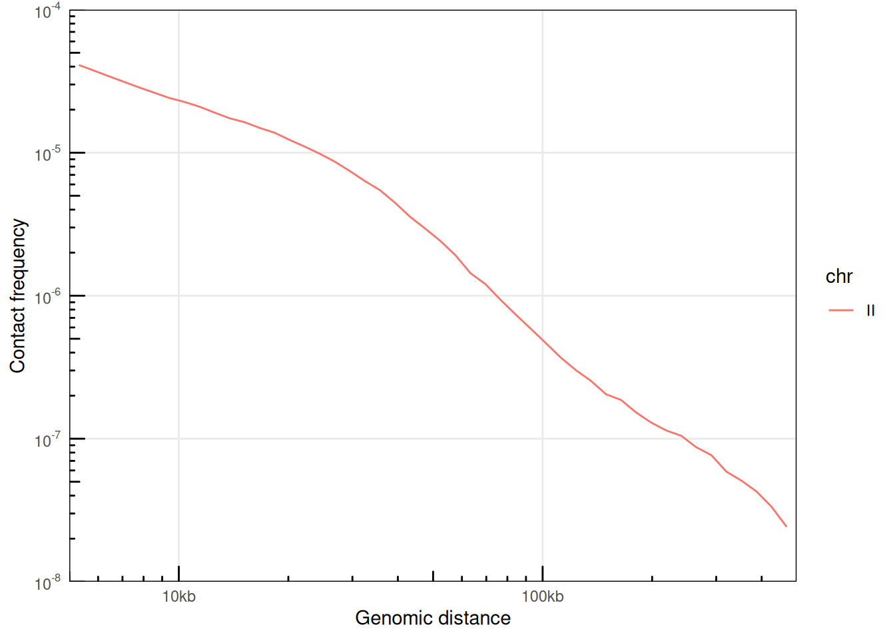
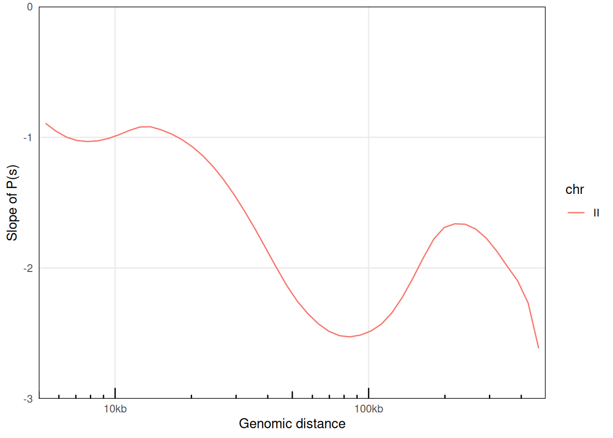
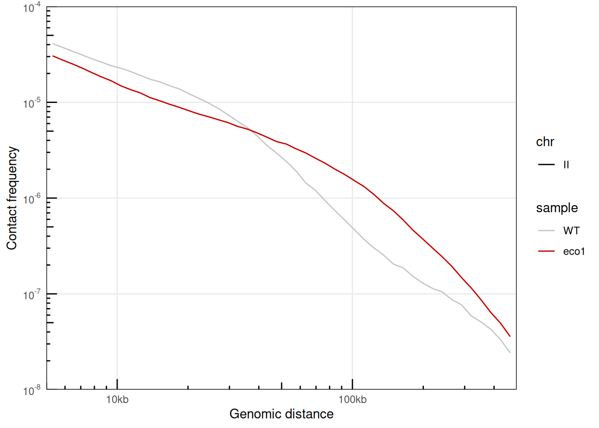
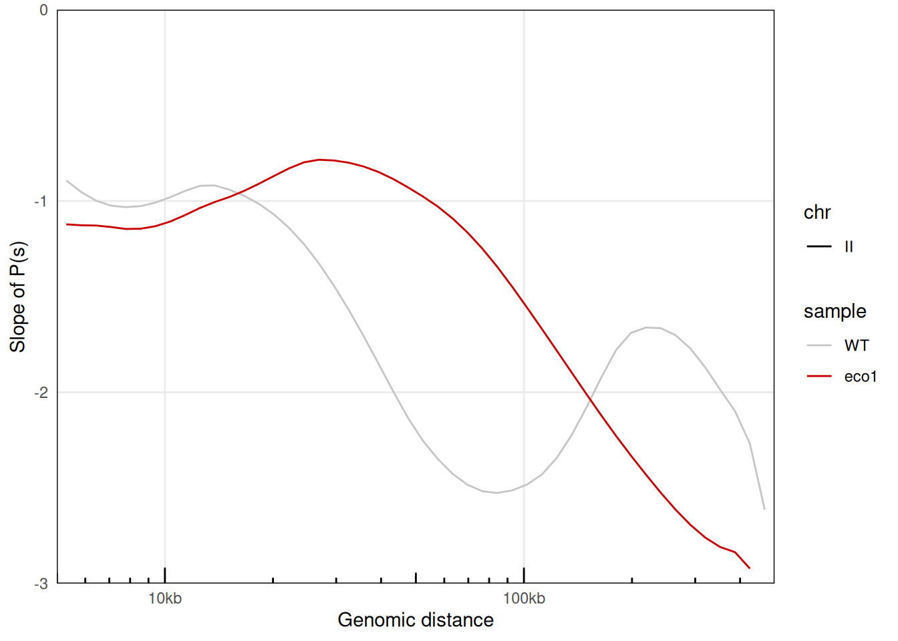
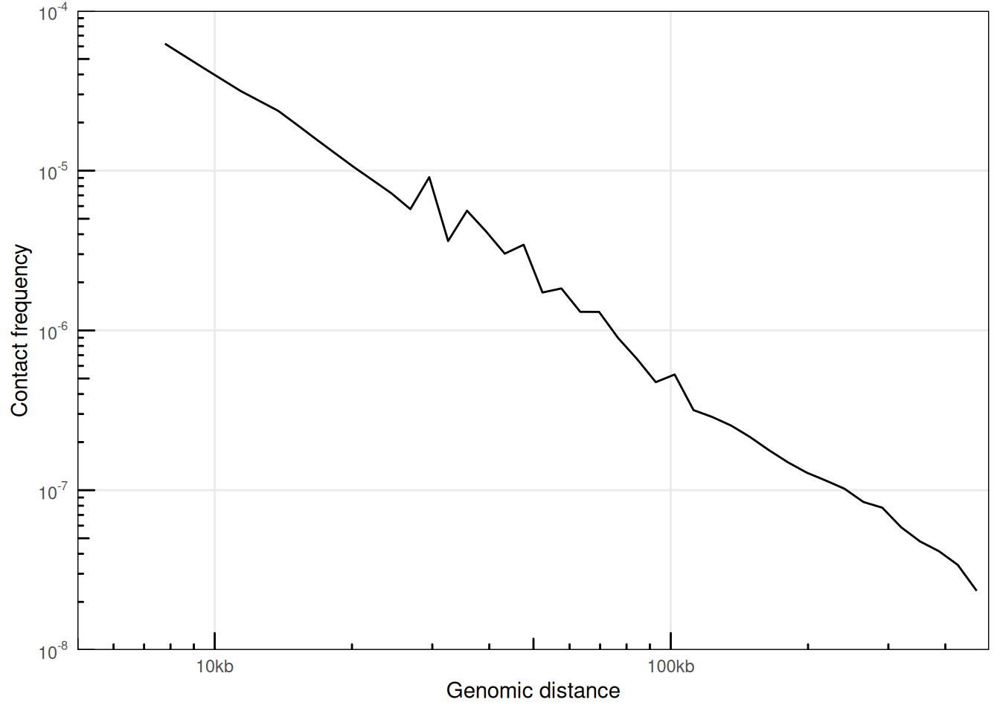
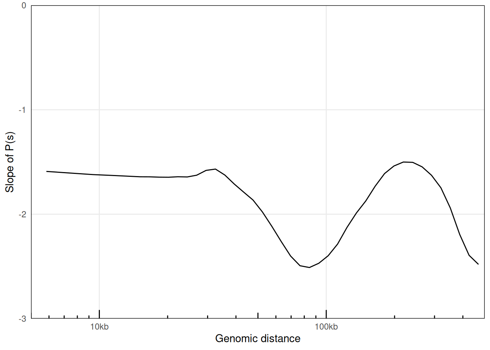
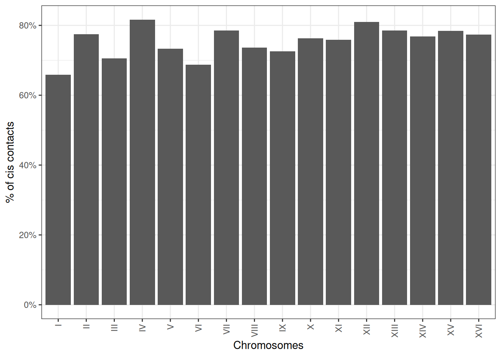
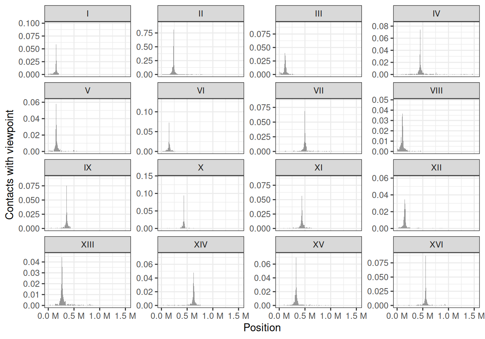
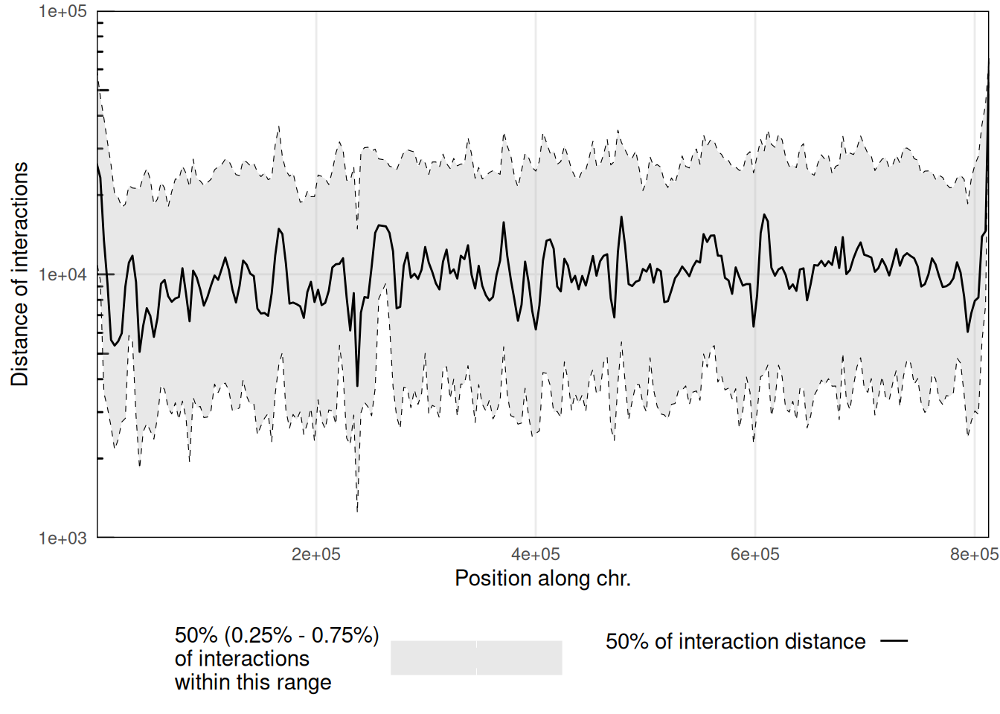
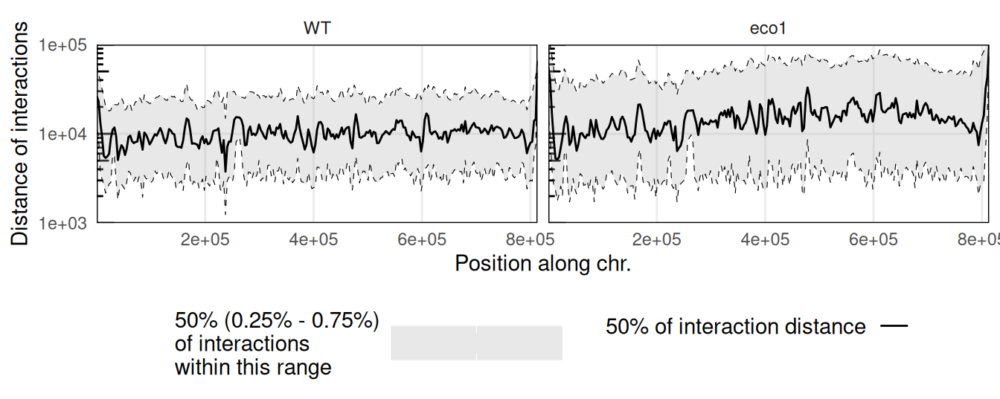

# 6  Interactions-centric analysis

> **NOTE:**
>
> ``` downlit
> library(dplyr)
> ##  
> ##  Attaching package: 'dplyr'
> ##  The following objects are masked from 'package:stats':
> ##  
> ##      filter, lag
> ##  The following objects are masked from 'package:base':
> ##  
> ##      intersect, setdiff, setequal, union
> library(ggplot2)
> library(GenomicRanges)
> ##  Loading required package: stats4
> ##  Loading required package: BiocGenerics
> ##  Loading required package: generics
> ##  
> ##  Attaching package: 'generics'
> ##  The following object is masked from 'package:dplyr':
> ##  
> ##      explain
> ##  The following objects are masked from 'package:base':
> ##  
> ##      as.difftime, as.factor, as.ordered, intersect, is.element,
> ##      setdiff, setequal, union
> ##  
> ##  Attaching package: 'BiocGenerics'
> ##  The following object is masked from 'package:dplyr':
> ##  
> ##      combine
> ##  The following objects are masked from 'package:stats':
> ##  
> ##      IQR, mad, sd, var, xtabs
> ##  The following object is masked from 'package:utils':
> ##  
> ##      data
> ##  The following objects are masked from 'package:base':
> ##  
> ##      Filter, Find, Map, Position, Reduce, anyDuplicated, aperm,
> ##      append, as.data.frame, basename, cbind, colnames, dirname,
> ##      do.call, duplicated, eval, evalq, get, grep, grepl, is.unsorted,
> ##      lapply, mapply, match, mget, order, paste, pmax, pmax.int, pmin,
> ##      pmin.int, rank, rbind, rownames, sapply, saveRDS, scale,
> ##      sequence, table, tapply, transform, unique, unsplit, which.max,
> ##      which.min
> ##  Loading required package: S4Vectors
> ##  
> ##  Attaching package: 'S4Vectors'
> ##  The following objects are masked from 'package:dplyr':
> ##  
> ##      first, rename
> ##  The following object is masked from 'package:utils':
> ##  
> ##      findMatches
> ##  The following objects are masked from 'package:base':
> ##  
> ##      I, expand.grid, unname
> ##  Loading required package: IRanges
> ##  
> ##  Attaching package: 'IRanges'
> ##  The following objects are masked from 'package:dplyr':
> ##  
> ##      collapse, desc, slice
> ##  Loading required package: Seqinfo
> library(InteractionSet)
> ##  Loading required package: SummarizedExperiment
> ##  Loading required package: MatrixGenerics
> ##  Loading required package: matrixStats
> ##  
> ##  Attaching package: 'matrixStats'
> ##  The following object is masked from 'package:dplyr':
> ##  
> ##      count
> ##  
> ##  Attaching package: 'MatrixGenerics'
> ##  The following objects are masked from 'package:matrixStats':
> ##  
> ##      colAlls, colAnyNAs, colAnys, colAvgsPerRowSet, colCollapse,
> ##      colCounts, colCummaxs, colCummins, colCumprods, colCumsums,
> ##      colDiffs, colIQRDiffs, colIQRs, colLogSumExps, colMadDiffs,
> ##      colMads, colMaxs, colMeans2, colMedians, colMins, colOrderStats,
> ##      colProds, colQuantiles, colRanges, colRanks, colSdDiffs, colSds,
> ##      colSums2, colTabulates, colVarDiffs, colVars, colWeightedMads,
> ##      colWeightedMeans, colWeightedMedians, colWeightedSds,
> ##      colWeightedVars, rowAlls, rowAnyNAs, rowAnys, rowAvgsPerColSet,
> ##      rowCollapse, rowCounts, rowCummaxs, rowCummins, rowCumprods,
> ##      rowCumsums, rowDiffs, rowIQRDiffs, rowIQRs, rowLogSumExps,
> ##      rowMadDiffs, rowMads, rowMaxs, rowMeans2, rowMedians, rowMins,
> ##      rowOrderStats, rowProds, rowQuantiles, rowRanges, rowRanks,
> ##      rowSdDiffs, rowSds, rowSums2, rowTabulates, rowVarDiffs,
> ##      rowVars, rowWeightedMads, rowWeightedMeans, rowWeightedMedians,
> ##      rowWeightedSds, rowWeightedVars
> ##  Loading required package: Biobase
> ##  Welcome to Bioconductor
> ##  
> ##      Vignettes contain introductory material; view with
> ##      'browseVignettes()'. To cite Bioconductor, see
> ##      'citation("Biobase")', and for packages 'citation("pkgname")'.
> ##  
> ##  Attaching package: 'Biobase'
> ##  The following object is masked from 'package:MatrixGenerics':
> ##  
> ##      rowMedians
> ##  The following objects are masked from 'package:matrixStats':
> ##  
> ##      anyMissing, rowMedians
> library(HiCExperiment)
> ##  Consider using the `HiContacts` package to perform advanced genomic operations 
> ##  on `HiCExperiment` objects.
> ##  
> ##  Read "Orchestrating Hi-C analysis with Bioconductor" online book to learn more:
> ##  https://js2264.github.io/OHCA/
> ##  
> ##  Attaching package: 'HiCExperiment'
> ##  The following object is masked from 'package:SummarizedExperiment':
> ##  
> ##      metadata<-
> ##  The following object is masked from 'package:S4Vectors':
> ##  
> ##      metadata<-
> ##  The following object is masked from 'package:ggplot2':
> ##  
> ##      resolution
> library(HiContactsData)
> ##  Loading required package: ExperimentHub
> ##  Loading required package: AnnotationHub
> ##  Loading required package: BiocFileCache
> ##  Loading required package: dbplyr
> ##  
> ##  Attaching package: 'dbplyr'
> ##  The following objects are masked from 'package:dplyr':
> ##  
> ##      ident, sql, sql_escape_ident, sql_escape_string
> ##  OpenTelemetry error: there is no package called 'otelsdk'
> ##  OpenTelemetry error: there is no package called 'otelsdk'
> ##  
> ##  Attaching package: 'AnnotationHub'
> ##  The following object is masked from 'package:Biobase':
> ##  
> ##      cache
> library(HiContacts)
> ##  Registered S3 methods overwritten by 'readr':
> ##    method                    from 
> ##    as.data.frame.spec_tbl_df vroom
> ##    as_tibble.spec_tbl_df     vroom
> ##    format.col_spec           vroom
> ##    print.col_spec            vroom
> ##    print.collector           vroom
> ##    print.date_names          vroom
> ##    print.locale              vroom
> ##    str.col_spec              vroom
> library(rtracklayer)
> ##  
> ##  Attaching package: 'rtracklayer'
> ##  The following object is masked from 'package:AnnotationHub':
> ##  
> ##      hubUrl
> coolf <- HiContactsData('yeast_wt', 'mcool')
> ##  see ?HiContactsData and browseVignettes('HiContactsData') for documentation
> ##  loading from cache
> pairsf <- HiContactsData('yeast_wt', 'pairs.gz')
> ##  see ?HiContactsData and browseVignettes('HiContactsData') for documentation
> ##  loading from cache
> ```

> **NOTE:**
>
> This chapter focuses on the various analytical tools offered by `HiContacts` to compute interaction-related metrics from a `HiCExperiment` object.

**Interaction-centric** analyses consider a `HiCExperiment` object from the “interactions” perspective to perform a range of operations on genomic interactions.\
This encompasses:

- Computing the “distance law” (a.k.a. P(s)), i.e. the distance-dependent interaction frequency
- Computing profiles of interactions between a locus of interest and the rest of the genome, (a.k.a. virtual 4C profiles)
- Computing cis/trans interaction ratios
- Computing distribution of distance-dependent interaction frequency along chromosomes, a.k.a. scalograms

> **NOTE:**
>
> - Contrary to functions presented in the previous chapter, the functions described in this chapter are **not** endomorphisms: they take `HiCExperiment` objects as input and generally return data frames rather than modified `HiCExperiment` objects.
> - Internally, most of the functions presented in this chapter make a call to `interactions(<HiCExperiment>)` to coerce it into `GInteractions`.

> **TIP:**
>
> To demonstrate `HiContacts` functionalities, we will create an `HiCExperiment` object from an example `.cool` file provided in the `HiContactsData` package.
>
> ``` downlit
> library(HiCExperiment)
> library(HiContactsData)
>
> # ---- This downloads example `.mcool` and `.pairs` files and caches them locally 
> coolf <- HiContactsData('yeast_wt', 'mcool')
> ##  see ?HiContactsData and browseVignettes('HiContactsData') for documentation
> ##  loading from cache
> pairsf <- HiContactsData('yeast_wt', 'pairs.gz')
> ##  see ?HiContactsData and browseVignettes('HiContactsData') for documentation
> ##  loading from cache
>
> # ---- This creates a connection to the disk-stored `.mcool` file
> cf <- CoolFile(coolf)
> cf
> ##  CoolFile object
> ##  .mcool file: /opt/R-cache/R/ExperimentHub/15091e8cc7_7752 
> ##  resolution: 1000 
> ##  pairs file: 
> ##  metadata(0):
>
> # ---- This creates a connection to the disk-stored `.pairs` file
> pf <- PairsFile(pairsf)
> pf
> ##  PairsFile object
> ##  resource: /opt/R-cache/R/ExperimentHub/15073fb07c3_7753
>
> # ---- This imports contacts from the chromosome `II` at resolution `2000`
> hic <- import(cf, focus = 'II', resolution = 2000)
> ```
>
> ``` downlit
> hic
> ##  `HiCExperiment` object with 471,364 contacts over 407 regions 
> ##  -------
> ##  fileName: "/opt/R-cache/R/ExperimentHub/15091e8cc7_7752" 
> ##  focus: "II" 
> ##  resolutions(5): 1000 2000 4000 8000 16000
> ##  active resolution: 2000 
> ##  interactions: 34063 
> ##  scores(2): count balanced 
> ##  topologicalFeatures: compartments(0) borders(0) loops(0) viewpoints(0) 
> ##  pairsFile: N/A 
> ##  metadata(0):
> ```

## 6.1 Distance law(s)

### 6.1.1 P(s) from a single `.pairs` file

Distance laws are generally computed directly from `.pairs` files. This is because the `.pairs` files are at 1-bp resolution whereas the contact matrices (for example from `.cool` files) are binned at a minimum resolution.

An example `.pairs` file can be fetched from the `ExperimentHub` database using the `HiContactsData` package.

``` downlit
library(HiCExperiment)
library(HiContactsData)
pairsf <- HiContactsData('yeast_wt', 'pairs.gz')
##  see ?HiContactsData and browseVignettes('HiContactsData') for documentation
##  loading from cache
pf <- PairsFile(pairsf)
```

``` downlit
pf
##  PairsFile object
##  resource: /opt/R-cache/R/ExperimentHub/15073fb07c3_7753
```

If needed, `PairsFile` connections can be imported directly into a `GInteractions` object with [`import()`](https://rdrr.io/pkg/BiocIO/man/IO.html).

``` downlit
import(pf)
##  GInteractions object with 471364 interactions and 3 metadata columns:
##             seqnames1   ranges1     seqnames2   ranges2 |     frag1     frag2
##                 <Rle> <IRanges>         <Rle> <IRanges> | <numeric> <numeric>
##         [1]        II       105 ---        II     48548 |      1358      1681
##         [2]        II       113 ---        II     45003 |      1358      1658
##         [3]        II       119 ---        II    687251 |      1358      5550
##         [4]        II       160 ---        II     26124 |      1358      1510
##         [5]        II       169 ---        II     39052 |      1358      1613
##         ...       ...       ... ...       ...       ... .       ...       ...
##    [471360]        II    808605 ---        II    809683 |      6316      6320
##    [471361]        II    808609 ---        II    809917 |      6316      6324
##    [471362]        II    808617 ---        II    809506 |      6316      6319
##    [471363]        II    809447 ---        II    809685 |      6319      6321
##    [471364]        II    809472 ---        II    809675 |      6319      6320
##              distance
##             <integer>
##         [1]     48443
##         [2]     44890
##         [3]    687132
##         [4]     25964
##         [5]     38883
##         ...       ...
##    [471360]      1078
##    [471361]      1308
##    [471362]       889
##    [471363]       238
##    [471364]       203
##    -------
##    regions: 549331 ranges and 0 metadata columns
##    seqinfo: 17 sequences from an unspecified genome
```

We can compute a P(s) per chromosome from this `.pairs` file using the `distanceLaw` function.

``` downlit
library(HiContacts)
ps <- distanceLaw(pf, by_chr = TRUE) 
##  Importing pairs file /opt/R-cache/R/ExperimentHub/15073fb07c3_7753 in memory. This may take a while...
ps
##  # A tibble: 115 × 6
##    chr   binned_distance          p     norm_p norm_p_unity slope
##    <chr>           <dbl>      <dbl>      <dbl>        <dbl> <dbl>
##  1 II                 14 0.00000212 0.00000106         2.27  0   
##  2 II                 16 0.0000170  0.0000170         36.4   1.56
##  3 II                 17 0.0000361  0.0000180         38.6   1.55
##  4 II                 19 0.0000424  0.0000212         45.5   1.55
##  5 II                 21 0.0000467  0.0000233         50.0   1.54
##  6 II                 23 0.0000870  0.0000290         62.1   1.53
##  # ℹ 109 more rows
```

The [`plotPs()`](https://rdrr.io/pkg/HiContacts/man/plotPs.html) and [`plotPsSlope()`](https://rdrr.io/pkg/HiContacts/man/plotPs.html) functions are convenient `ggplot2`-based functions with pre-configured settings optimized for P(s) visualization.

``` downlit
library(ggplot2)
plotPs(ps, aes(x = binned_distance, y = norm_p, color = chr))
##  Warning: Removed 67 rows containing missing values or values outside the scale range
##  (`geom_line()`).
```



``` downlit
plotPsSlope(ps, aes(x = binned_distance, y = slope, color = chr))
##  Warning: Removed 67 rows containing missing values or values outside the scale range
##  (`geom_line()`).
```



### 6.1.2 P(s) for multiple `.pairs` files

Let’s first import a second example dataset. We’ll import pairs identified in a *eco1* yeast mutant.

``` downlit
eco1_pairsf <- HiContactsData('yeast_eco1', 'pairs.gz')
##  see ?HiContactsData and browseVignettes('HiContactsData') for documentation
##  downloading 1 resources
##  retrieving 1 resource
##  loading from cache
eco1_pf <- PairsFile(eco1_pairsf)
```

``` downlit
eco1_ps <- distanceLaw(eco1_pf, by_chr = TRUE) 
##  Importing pairs file /opt/R-cache/R/ExperimentHub/74639b34732_7755 in memory. This may take a while...
eco1_ps
##  # A tibble: 115 × 6
##    chr   binned_distance          p     norm_p norm_p_unity slope
##    <chr>           <dbl>      <dbl>      <dbl>        <dbl> <dbl>
##  1 II                 14 0.00000201 0.00000100        0.660  0   
##  2 II                 16 0.0000221  0.0000221        14.5    1.46
##  3 II                 17 0.0000492  0.0000246        16.2    1.46
##  4 II                 19 0.0000412  0.0000206        13.5    1.45
##  5 II                 21 0.0000653  0.0000326        21.5    1.45
##  6 II                 23 0.0000803  0.0000268        17.6    1.44
##  # ℹ 109 more rows
```

A little data wrangling can help plotting the distance laws for 2 different samples in the same plot.

``` downlit
library(dplyr)
merged_ps <- rbind(
    ps |> mutate(sample = 'WT'), 
    eco1_ps |> mutate(sample = 'eco1')
)
plotPs(merged_ps, aes(x = binned_distance, y = norm_p, color = sample, linetype = chr)) + 
    scale_color_manual(values = c('#c6c6c6', '#ca0000'))
##  Warning: Removed 134 rows containing missing values or values outside the scale range
##  (`geom_line()`).
```



``` downlit
plotPsSlope(merged_ps, aes(x = binned_distance, y = slope, color = sample, linetype = chr)) + 
    scale_color_manual(values = c('#c6c6c6', '#ca0000'))
##  Warning: Removed 135 rows containing missing values or values outside the scale range
##  (`geom_line()`).
```



### 6.1.3 P(s) from `HiCExperiment` objects

Alternatively, distance laws can be computed from binned matrices directly by providing `HiCExperiment` objects. For deeply sequenced datasets, this can be significantly faster than when using original `.pairs` files, but the smoothness of the resulting curves will be greatly impacted, notably at short distances.

``` downlit
ps_from_hic <- distanceLaw(hic, by_chr = TRUE) 
##  pairsFile not specified. The P(s) curve will be an approximation.
plotPs(ps_from_hic, aes(x = binned_distance, y = norm_p))
##  Warning: Removed 9 rows containing missing values or values outside the scale range
##  (`geom_line()`).
```



``` downlit
plotPsSlope(ps_from_hic, aes(x = binned_distance, y = slope))
##  Warning: Removed 8 rows containing missing values or values outside the scale range
##  (`geom_line()`).
```



## 6.2 Cis/trans ratios

The ratio between cis interactions and trans interactions is often used to assess the overall quality of a Hi-C dataset. It can be computed *per chromosome* using the [`cisTransRatio()`](https://rdrr.io/pkg/HiContacts/man/cisTransRatio.html) function. You will need to provide a **genome-wide** `HiCExperiment` to estimate cis/trans ratios!

``` downlit
full_hic <- import(cf, resolution = 2000)
ct <- cisTransRatio(full_hic) 
ct
##  # A tibble: 16 × 6
##  # Groups:   chr [16]
##    chr       cis  trans n_total cis_pct trans_pct
##    <fct>   <dbl>  <dbl>   <dbl>   <dbl>     <dbl>
##  1 I      186326  96738  283064   0.658     0.342
##  2 II     942728 273966 1216694   0.775     0.225
##  3 III    303980 127087  431067   0.705     0.295
##  4 IV    1858062 418218 2276280   0.816     0.184
##  5 V      607090 220873  827963   0.733     0.267
##  6 VI     280282 127771  408053   0.687     0.313
##  # ℹ 10 more rows
```

It can be plotted using `ggplot2`-based visualization functions.

``` downlit
ggplot(ct, aes(x = chr, y = cis_pct)) + 
    geom_col(position = position_stack()) + 
    theme_bw() + 
    guides(x=guide_axis(angle = 90)) + 
    scale_y_continuous(labels = scales::percent) + 
    labs(x = 'Chromosomes', y = '% of cis contacts')
```



Cis/trans contact ratios will greatly vary **depending on the cell cycle phase the sample is in!** For instance, chromosomes during the mitosis phase of the cell cycle have very little trans contacts, due to their structural organization and individualization.

## 6.3 Virtual 4C profiles

Interaction profile of a genomic locus of interest with its surrounding environment or the rest of the genome is frequently generated. In some cases, this can help in identifying and/or comparing regulatory or structural interactions.

For instance, we can compute the genome-wide virtual 4C profile of interactions anchored at the centromere in chromosome `II` (located at ~ 238kb).

``` downlit
library(GenomicRanges)
v4C <- virtual4C(full_hic, viewpoint = GRanges("II:230001-240000"))
v4C
##  GRanges object with 6045 ranges and 4 metadata columns:
##           seqnames        ranges strand |       score    center in_viewpoint
##              <Rle>     <IRanges>  <Rle> |   <numeric> <numeric>    <logical>
##       [1]        I        1-2000      * |  0.00000000    1000.5        FALSE
##       [2]        I     2001-4000      * |  0.00000000    3000.5        FALSE
##       [3]        I     4001-6000      * |  0.00129049    5000.5        FALSE
##       [4]        I     6001-8000      * |  0.00000000    7000.5        FALSE
##       [5]        I    8001-10000      * |  0.00000000    9000.5        FALSE
##       ...      ...           ...    ... .         ...       ...          ...
##    [6041]      XVI 940001-942000      * | 0.000775721    941000        FALSE
##    [6042]      XVI 942001-944000      * | 0.000000000    943000        FALSE
##    [6043]      XVI 944001-946000      * | 0.000000000    945000        FALSE
##    [6044]      XVI 946001-948000      * | 0.000000000    947000        FALSE
##    [6045]      XVI 948001-948066      * | 0.000000000    948034        FALSE
##                  viewpoint
##                <character>
##       [1] II:230001-240000
##       [2] II:230001-240000
##       [3] II:230001-240000
##       [4] II:230001-240000
##       [5] II:230001-240000
##       ...              ...
##    [6041] II:230001-240000
##    [6042] II:230001-240000
##    [6043] II:230001-240000
##    [6044] II:230001-240000
##    [6045] II:230001-240000
##    -------
##    seqinfo: 16 sequences from an unspecified genome; no seqlengths
```

`ggplot2` can be used to visualize the 4C-like profile over multiple chromosomes.

``` downlit
df <- as_tibble(v4C)
ggplot(df, aes(x = center, y = score)) + 
    geom_area(position = "identity", alpha = 0.5) + 
    theme_bw() + 
    labs(x = "Position", y = "Contacts with viewpoint") +
    scale_x_continuous(labels = scales::unit_format(unit = "M", scale = 1e-06)) + 
    facet_wrap(~seqnames, scales = 'free_y')
```



This clearly highlights trans interactions of the chromosome `II` centromere with the centromeres from other chromosomes.

## 6.4 Scalograms

Scalograms were introduced in Lioy et al. ([2018](#ref-Lioy_2018)) to investigate distance-dependent contact frequencies for individual genomic bins along chromosomes.\
To generate a scalogram, one needs to provide a `HiCExperiment` object with a valid associated `pairsFile`.

``` downlit
pairsFile(hic) <- pairsf
scalo <- scalogram(hic) 
##  Importing pairs file /opt/R-cache/R/ExperimentHub/15073fb07c3_7753 in memory. This may take a while...
plotScalogram(scalo |> filter(chr == 'II'), ylim = c(1e3, 1e5))
```



Several scalograms can be plotted together to compare distance-dependent contact frequencies along a given chromosome in different samples.

``` downlit
eco1_hic <- import(
    CoolFile(HiContactsData('yeast_eco1', 'mcool')), 
    focus = 'II', 
    resolution = 2000
)
##  see ?HiContactsData and browseVignettes('HiContactsData') for documentation
##  loading from cache
eco1_pairsf <- HiContactsData('yeast_eco1', 'pairs.gz')
##  see ?HiContactsData and browseVignettes('HiContactsData') for documentation
##  loading from cache
pairsFile(eco1_hic) <- eco1_pairsf
eco1_scalo <- scalogram(eco1_hic) 
##  Importing pairs file /opt/R-cache/R/ExperimentHub/74639b34732_7755 in memory. This may take a while...
merged_scalo <- rbind(
    scalo |> mutate(sample = 'WT'), 
    eco1_scalo |> mutate(sample = 'eco1')
)
plotScalogram(merged_scalo |> filter(chr == 'II'), ylim = c(1e3, 1e5)) + 
    facet_grid(~sample)
```



This example points out the overall longer interactions within the long arm of the chromosome `II` in an `eco1` mutant.

# Session info

> **NOTE:**
>
> ``` downlit
> sessioninfo::session_info(include_base = TRUE)
> ##  ─ Session info ────────────────────────────────────────────────────────────
> ##   setting  value
> ##   version  R version 4.6.1 (2026-06-24)
> ##   os       Ubuntu 24.04.4 LTS
> ##   system   x86_64, linux-gnu
> ##   ui       X11
> ##   language (EN)
> ##   collate  C
> ##   ctype    en_US.UTF-8
> ##   tz       Etc/UTC
> ##   date     2026-10-06
> ##   pandoc   3.11 @ /usr/bin/ (via rmarkdown)
> ##   quarto   1.11.5 @ /usr/local/bin/quarto
> ##  
> ##  ─ Packages ────────────────────────────────────────────────────────────────
> ##   package              * version   date (UTC) lib source
> ##   abind                  1.4-8     2024-09-12 [2] RSPM (R 4.6.0)
> ##   AnnotationDbi          1.75.2    2026-07-21 [2] Bioconductor 3.24 (R 4.6.1)
> ##   AnnotationHub        * 4.3.2     2026-06-30 [2] Bioconductor 3.24 (R 4.6.1)
> ##   base                 * 4.6.1     2026-09-11 [3] local
> ##   beeswarm               0.4.0     2021-06-01 [2] RSPM (R 4.6.0)
> ##   Biobase              * 2.73.2    2026-07-29 [2] Bioconductor 3.24 (R 4.6.1)
> ##   BiocBaseUtils          1.15.1    2026-05-10 [2] Bioconductor 3.24 (R 4.6.1)
> ##   BiocFileCache        * 3.3.0     2026-04-28 [2] Bioconductor 3.24 (R 4.6.1)
> ##   BiocGenerics         * 0.59.12   2026-08-11 [2] Bioconductor 3.24 (R 4.6.1)
> ##   BiocIO                 1.23.3    2026-04-29 [2] Bioconductor 3.24 (R 4.6.1)
> ##   BiocManager            1.30.27   2025-11-14 [2] CRAN (R 4.6.1)
> ##   BiocParallel           1.47.0    2026-04-28 [2] Bioconductor 3.24 (R 4.6.1)
> ##   BiocVersion            3.24.0    2026-04-28 [2] Bioconductor 3.24 (R 4.6.1)
> ##   Biostrings             2.81.9    2026-09-06 [2] Bioconductor 3.24 (R 4.6.1)
> ##   bit                    4.6.0     2025-03-06 [2] RSPM (R 4.6.0)
> ##   bit64                  4.8.6     2026-09-01 [2] RSPM (R 4.6.0)
> ##   bitops                 1.1-0     2026-07-30 [2] RSPM (R 4.6.0)
> ##   blob                   1.3.0     2026-01-14 [2] RSPM (R 4.6.0)
> ##   cachem                 1.1.0     2024-05-16 [2] RSPM (R 4.6.0)
> ##   cigarillo              1.3.1     2026-07-13 [2] Bioconductor 3.24 (R 4.6.1)
> ##   cli                    3.6.6     2026-04-09 [2] RSPM (R 4.6.0)
> ##   codetools              0.2-20    2024-03-31 [3] CRAN (R 4.6.1)
> ##   compiler               4.6.1     2026-09-11 [3] local
> ##   crayon                 1.5.3     2024-06-20 [2] RSPM (R 4.6.0)
> ##   curl                   8.0.0     2026-08-25 [2] RSPM (R 4.6.0)
> ##   datasets             * 4.6.1     2026-09-11 [3] local
> ##   DBI                    1.3.0     2026-02-25 [2] RSPM (R 4.6.0)
> ##   dbplyr               * 2.6.0     2026-06-17 [2] RSPM (R 4.6.0)
> ##   DelayedArray           0.39.8    2026-09-30 [2] Bioconductor 3.24 (R 4.6.1)
> ##   dichromat              2.0-1     2026-07-22 [2] RSPM (R 4.6.0)
> ##   digest                 0.6.39    2025-11-19 [2] RSPM (R 4.6.0)
> ##   dplyr                * 1.2.1     2026-04-03 [2] RSPM (R 4.6.0)
> ##   evaluate               1.0.5     2025-08-27 [2] RSPM (R 4.6.0)
> ##   ExperimentHub        * 3.3.2     2026-08-12 [2] Bioconductor 3.24 (R 4.6.1)
> ##   farver                 2.1.2     2024-05-13 [2] RSPM (R 4.6.0)
> ##   fastmap                1.2.0     2024-05-15 [2] RSPM (R 4.6.0)
> ##   filelock               1.0.3     2023-12-11 [2] RSPM (R 4.6.0)
> ##   generics             * 0.1.4     2025-05-09 [2] RSPM (R 4.6.0)
> ##   GenomeInfoDb           1.49.1    2026-05-24 [2] Bioconductor 3.24 (R 4.6.1)
> ##   GenomicAlignments      1.49.2    2026-09-02 [2] Bioconductor 3.24 (R 4.6.1)
> ##   GenomicRanges        * 1.65.4    2026-09-02 [2] Bioconductor 3.24 (R 4.6.1)
> ##   ggbeeswarm             0.7.3     2025-11-29 [2] RSPM (R 4.6.0)
> ##   ggplot2              * 4.0.3     2026-04-22 [2] RSPM (R 4.6.0)
> ##   ggrastr                1.0.2     2023-06-01 [2] RSPM (R 4.6.0)
> ##   glue                   1.8.1     2026-04-17 [2] RSPM (R 4.6.0)
> ##   graphics             * 4.6.1     2026-09-11 [3] local
> ##   grDevices            * 4.6.1     2026-09-11 [3] local
> ##   grid                   4.6.1     2026-09-11 [3] local
> ##   gtable                 0.3.6     2024-10-25 [2] RSPM (R 4.6.0)
> ##   HiCExperiment        * 1.13.1    2026-10-04 [2] Bioconductor 3.24 (R 4.6.1)
> ##   HiContacts           * 1.15.2    2026-10-04 [2] Bioconductor 3.24 (R 4.6.1)
> ##   HiContactsData       * 1.5.3     2026-10-06 [2] Github (js2264/HiContactsData@d5bebe7)
> ##   hms                    1.1.4     2025-10-17 [2] RSPM (R 4.6.0)
> ##   htmltools              0.5.9     2025-12-04 [2] RSPM (R 4.6.0)
> ##   htmlwidgets            1.6.4     2023-12-06 [2] RSPM (R 4.6.0)
> ##   httr                   1.4.9     2026-09-01 [2] RSPM (R 4.6.0)
> ##   httr2                  1.3.0     2026-07-13 [2] RSPM (R 4.6.0)
> ##   InteractionSet       * 1.41.0    2026-04-28 [2] Bioconductor 3.24 (R 4.6.1)
> ##   IRanges              * 2.47.5    2026-08-27 [2] Bioconductor 3.24 (R 4.6.1)
> ##   jsonlite               2.0.0     2025-03-27 [2] RSPM (R 4.6.0)
> ##   KEGGREST               1.53.6    2026-07-23 [2] Bioconductor 3.24 (R 4.6.1)
> ##   knitr                  1.52      2026-09-06 [2] RSPM (R 4.6.0)
> ##   labeling               0.4.3     2023-08-29 [2] RSPM (R 4.6.0)
> ##   lattice                0.23-1    2026-08-12 [2] RSPM (R 4.6.0)
> ##   lifecycle              1.0.5     2026-01-08 [2] RSPM (R 4.6.0)
> ##   magrittr               2.0.5     2026-04-04 [2] RSPM (R 4.6.0)
> ##   Matrix                 1.7-6     2026-07-25 [2] RSPM (R 4.6.0)
> ##   MatrixGenerics       * 1.25.0    2026-04-28 [2] Bioconductor 3.24 (R 4.6.1)
> ##   matrixStats          * 1.5.0     2025-01-07 [2] RSPM (R 4.6.0)
> ##   memoise                2.0.1     2021-11-26 [2] RSPM (R 4.6.0)
> ##   methods              * 4.6.1     2026-09-11 [3] local
> ##   otel                   0.2.0     2025-08-29 [2] RSPM (R 4.6.0)
> ##   parallel               4.6.1     2026-09-11 [3] local
> ##   pillar                 1.11.1    2025-09-17 [2] RSPM (R 4.6.0)
> ##   pkgconfig              2.0.3     2019-09-22 [2] RSPM (R 4.6.0)
> ##   png                    0.1-9     2026-03-15 [2] RSPM (R 4.6.0)
> ##   purrr                  1.2.2     2026-04-10 [2] RSPM (R 4.6.0)
> ##   R6                     2.6.1     2025-02-15 [2] RSPM (R 4.6.0)
> ##   rappdirs               0.3.4     2026-01-17 [2] RSPM (R 4.6.0)
> ##   RColorBrewer           1.1-3     2022-04-03 [2] RSPM (R 4.6.0)
> ##   Rcpp                   1.1.2     2026-07-05 [2] RSPM (R 4.6.0)
> ##   RCurl                  1.98-1.20 2026-08-21 [2] RSPM (R 4.6.0)
> ##   readr                  2.2.0     2026-02-19 [2] RSPM (R 4.6.0)
> ##   restfulr               0.0.17    2026-06-11 [2] RSPM (R 4.6.0)
> ##   rhdf5                  2.57.18   2026-09-23 [2] Bioconductor 3.24 (R 4.6.1)
> ##   rhdf5filters           1.25.4    2026-08-06 [2] Bioconductor 3.24 (R 4.6.1)
> ##   Rhdf5lib               2.1.0     2026-04-28 [2] Bioconductor 3.24 (R 4.6.1)
> ##   rjson                  0.2.23    2024-09-16 [2] RSPM (R 4.6.0)
> ##   rlang                  1.3.0     2026-07-05 [2] RSPM (R 4.6.0)
> ##   rmarkdown              2.32      2026-09-01 [2] RSPM (R 4.6.0)
> ##   Rsamtools              2.29.0    2026-04-28 [2] Bioconductor 3.24 (R 4.6.1)
> ##   RSpectra               0.16-2    2024-07-18 [2] RSPM (R 4.6.0)
> ##   RSQLite                3.53.3    2026-06-30 [2] RSPM (R 4.6.0)
> ##   rtracklayer          * 1.73.0    2026-04-28 [2] Bioconductor 3.24 (R 4.6.1)
> ##   S4Arrays               1.13.2    2026-09-30 [2] Bioconductor 3.24 (R 4.6.1)
> ##   S4Vectors            * 0.51.10   2026-09-16 [2] Bioconductor 3.24 (R 4.6.1)
> ##   S7                     0.2.2     2026-04-22 [2] RSPM (R 4.6.0)
> ##   scales                 1.4.0     2025-04-24 [2] RSPM (R 4.6.0)
> ##   Seqinfo              * 1.3.2     2026-08-27 [2] Bioconductor 3.24 (R 4.6.1)
> ##   sessioninfo            1.2.4     2026-06-04 [2] RSPM (R 4.6.0)
> ##   SparseArray            1.13.4    2026-09-30 [2] Bioconductor 3.24 (R 4.6.1)
> ##   stats                * 4.6.1     2026-09-11 [3] local
> ##   stats4               * 4.6.1     2026-09-11 [3] local
> ##   strawr                 0.0.92    2024-07-16 [2] RSPM (R 4.6.0)
> ##   stringi                1.8.9     2026-08-04 [2] RSPM (R 4.6.0)
> ##   stringr                1.6.0     2025-11-04 [2] RSPM (R 4.6.0)
> ##   SummarizedExperiment * 1.43.0    2026-04-28 [2] Bioconductor 3.24 (R 4.6.1)
> ##   tibble                 3.3.1     2026-01-11 [2] RSPM (R 4.6.0)
> ##   tidyr                  1.3.2     2025-12-19 [2] RSPM (R 4.6.0)
> ##   tidyselect             1.2.1     2024-03-11 [2] RSPM (R 4.6.0)
> ##   tools                  4.6.1     2026-09-11 [3] local
> ##   tzdb                   0.5.0     2025-03-15 [2] RSPM (R 4.6.0)
> ##   UCSC.utils             1.9.0     2026-04-28 [2] Bioconductor 3.24 (R 4.6.1)
> ##   utf8                   1.2.6     2025-06-08 [2] RSPM (R 4.6.0)
> ##   utils                * 4.6.1     2026-09-11 [3] local
> ##   vctrs                  0.7.3     2026-04-11 [2] RSPM (R 4.6.0)
> ##   vipor                  0.4.7     2023-12-18 [2] RSPM (R 4.6.0)
> ##   vroom                  1.7.1     2026-03-31 [2] RSPM (R 4.6.0)
> ##   withr                  3.0.3     2026-06-19 [2] RSPM (R 4.6.0)
> ##   xfun                   0.61      2026-09-16 [2] RSPM (R 4.6.0)
> ##   XML                    3.99-0.25 2026-09-27 [2] RSPM (R 4.6.0)
> ##   XVector                0.53.0    2026-04-28 [2] Bioconductor 3.24 (R 4.6.1)
> ##   yaml                   2.3.12    2025-12-10 [2] RSPM (R 4.6.0)
> ##  
> ##   [1] /tmp/Rtmpu8u3NE/Rinstb3e0c7701
> ##   [2] /usr/local/lib/R/site-library
> ##   [3] /usr/local/lib/R/library
> ##   * ── Packages attached to the search path.
> ##  
> ##  ───────────────────────────────────────────────────────────────────────────
> ```

# References

Lioy, V. S., Cournac, A., Marbouty, M., Duigou, S., Mozziconacci, J., Espéli, O., Boccard, F., & Koszul, R. (2018). Multiscale structuring of the e. Coli chromosome by nucleoid-associated and condensin proteins. *Cell*, *172*(4), 771–783.e18. <https://doi.org/10.1016/j.cell.2017.12.027>
