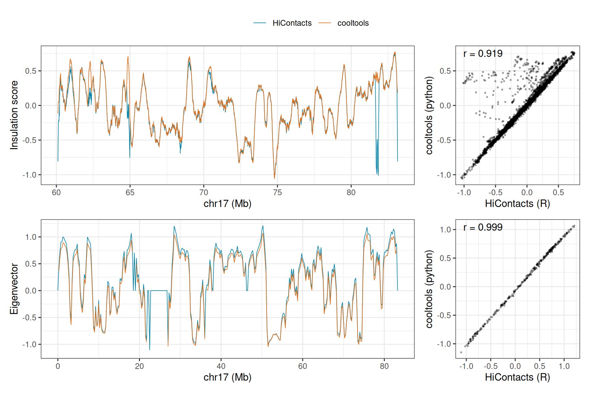

# 10  Interoperability with `python`: `cooltools`

> **NOTE:**
>
> ``` downlit
> ## `reticulate` is attached first, so that `import()` refers to
> ## `HiCExperiment`'s rather than to `reticulate`'s
> library(reticulate)
> library(dplyr)
> ##  
> ##  Attaching package: 'dplyr'
> ##  The following objects are masked from 'package:stats':
> ##  
> ##      filter, lag
> ##  The following objects are masked from 'package:base':
> ##  
> ##      intersect, setdiff, setequal, union
> library(ggplot2)
> library(patchwork)
> library(GenomicRanges)
> ##  Loading required package: stats4
> ##  Loading required package: BiocGenerics
> ##  Loading required package: generics
> ##  
> ##  Attaching package: 'generics'
> ##  The following object is masked from 'package:dplyr':
> ##  
> ##      explain
> ##  The following objects are masked from 'package:base':
> ##  
> ##      as.difftime, as.factor, as.ordered, intersect, is.element,
> ##      setdiff, setequal, union
> ##  
> ##  Attaching package: 'BiocGenerics'
> ##  The following object is masked from 'package:dplyr':
> ##  
> ##      combine
> ##  The following objects are masked from 'package:stats':
> ##  
> ##      IQR, mad, sd, var, xtabs
> ##  The following object is masked from 'package:utils':
> ##  
> ##      data
> ##  The following objects are masked from 'package:base':
> ##  
> ##      Filter, Find, Map, Position, Reduce, anyDuplicated, aperm,
> ##      append, as.data.frame, basename, cbind, colnames, dirname,
> ##      do.call, duplicated, eval, evalq, get, grep, grepl, is.unsorted,
> ##      lapply, mapply, match, mget, order, paste, pmax, pmax.int, pmin,
> ##      pmin.int, rank, rbind, rownames, sapply, saveRDS, scale,
> ##      sequence, table, tapply, transform, unique, unsplit, which.max,
> ##      which.min
> ##  Loading required package: S4Vectors
> ##  
> ##  Attaching package: 'S4Vectors'
> ##  The following objects are masked from 'package:dplyr':
> ##  
> ##      first, rename
> ##  The following object is masked from 'package:utils':
> ##  
> ##      findMatches
> ##  The following objects are masked from 'package:base':
> ##  
> ##      I, expand.grid, unname
> ##  Loading required package: IRanges
> ##  
> ##  Attaching package: 'IRanges'
> ##  The following objects are masked from 'package:dplyr':
> ##  
> ##      collapse, desc, slice
> ##  Loading required package: Seqinfo
> library(HiCExperiment)
> ##  Consider using the `HiContacts` package to perform advanced genomic operations 
> ##  on `HiCExperiment` objects.
> ##  
> ##  Read "Orchestrating Hi-C analysis with Bioconductor" online book to learn more:
> ##  https://js2264.github.io/OHCA/
> ##  
> ##  Attaching package: 'HiCExperiment'
> ##  The following object is masked from 'package:S4Vectors':
> ##  
> ##      metadata<-
> ##  The following object is masked from 'package:ggplot2':
> ##  
> ##      resolution
> library(HiContactsData)
> ##  Loading required package: ExperimentHub
> ##  Loading required package: AnnotationHub
> ##  Loading required package: BiocFileCache
> ##  Loading required package: dbplyr
> ##  
> ##  Attaching package: 'dbplyr'
> ##  The following objects are masked from 'package:dplyr':
> ##  
> ##      ident, sql, sql_escape_ident, sql_escape_string
> ##  OpenTelemetry error: there is no package called 'otelsdk'
> ##  OpenTelemetry error: there is no package called 'otelsdk'
> library(HiContacts)
> ##  Registered S3 methods overwritten by 'readr':
> ##    method                    from 
> ##    as.data.frame.spec_tbl_df vroom
> ##    as_tibble.spec_tbl_df     vroom
> ##    format.col_spec           vroom
> ##    print.col_spec            vroom
> ##    print.collector           vroom
> ##    print.date_names          vroom
> ##    print.locale              vroom
> ##    str.col_spec              vroom
> library(BiocParallel)
> BiocBook::setup_python()
> ##  ✔ Using the `python` already configured for this session: '/opt/R-cache/R/BiocBook/envs/OHCA/bin/python'
> ```

> **NOTE:**
>
> This chapter shows how `python` tools dedicated to Hi-C analysis can be used side by side with `HiCExperiment` and `HiContacts`, within a single analysis:
>
> - Running `cooltools` (Open2C, Abdennur, Abraham, et al. ([2024](#ref-Open2C_2024))) on a `.mcool` file fetched in `R`;
> - Passing objects between `R` and `python`, in both directions;
> - Comparing the insulation scores and A/B compartments computed by `HiContacts` and by `cooltools` from the same data.

## 10.1 Why `cooltools`?

`cooltools` is the `python` toolkit developed by the Open2C community to analyze contact matrices stored in `.cool`/`.mcool` files, built on top of `cooler` (Abdennur & Mirny ([2019](#ref-Abdennur_2019))) and `bioframe` (Open2C, Abdennur, Fudenberg, et al. ([2024](#ref-Open2C_2024_bioframe))). It is the reference implementation of many analyses covered in this book, and the 4DN consortium uses it to compute the insulation and compartment tracks it distributes (see the [chapter on public Hi-C data portals](../pages/disseminating.llms.md)).

Running it next to `HiContacts` is useful to compare results, to reproduce published analyses, or to use features only available in one of them. The `python` code of this chapter is executed every time the book is built, including when the *Bioconductor Build System* rebuilds it.

## 10.2 Setting up `python`

`python` chunks of this book are executed through `reticulate`, in a `python` session living alongside the `R` session. `R` objects are available from `python` as `r.<object>`, and `python` objects from `R` as `py$<object>`.

> **TIP:**
>
> The `python` packages used in this chapter are declared, with pinned versions, in the `conda` environment file of the book (`inst/requirements.yml`):
>
>     ## The conda environment this book's python chunks run in, created at build
>     ## time by BiocBook::setup_python(). Any edit to this file gives the book a new
>     ## environment on the next render.
>     ##
>     ## Versions are pinned so that the rendered book does not change without a
>     ## commit. `nodefaults` keeps the Anaconda `defaults` channel out.
>     name:
>         OHCA
>     channels:
>         - conda-forge
>         - bioconda
>         - nodefaults
>     dependencies:
>         - python=3.12
>         - cooler=0.10.4
>         - cooltools=0.7.1
>         - bioframe=0.8.0
>         - pandas=2.3.3
>         ## matplotlib >= 3.11 links libraqm, which needs a more recent harfbuzz
>         ## than the one R sessions have already loaded on the Bioconductor images
>         ## (Ubuntu 24.04): `import matplotlib` then fails
>         - matplotlib-base=3.10
>
> [`BiocBook::setup_python()`](https://rdrr.io/pkg/BiocBook/man/BiocBook-python.html), called at the top of this chapter, creates this environment if needed (fetching a standalone `micromamba` if it finds none on the machine) and activates it with `reticulate`. In the book’s `Docker` image, the environment is already installed and activated.

## 10.3 Fetching data in `R`, reading it in `python`

This chapter uses the micro-C dataset (Krietenstein et al. ([2020](#ref-Krietenstein_2020))) already analyzed in the [chapter on topological features](../pages/topological-features.llms.md). It contains intra-chromosomal interactions within `chr17`, binned at `5000`, `100000` and `250000` bp. The `.mcool` file is fetched from `R`…

``` downlit
mcool <- unname(HiContactsData('microC', 'mcool'))
##  see ?HiContactsData and browseVignettes('HiContactsData') for documentation
##  loading from cache
mcool
##  [1] "/opt/R-cache/R/ExperimentHub/109b6e5d8c72_8601"
```

… and opened in `python` with `cooler`, using the file path defined in `R`:

``` python
import cooler
clr = cooler.Cooler(f"{r.mcool}::/resolutions/5000")
clr.info
##  {'bin-size': 5000, 'bin-type': 'fixed', 'creation-date': '2023-04-03T09:47:43.335412', 'format': 'HDF5::Cooler', 'format-url': 'https://github.com/open2c/cooler', 'format-version': 3, 'generated-by': 'cooler-0.9.1', 'genome-assembly': 'unknown', 'metadata': {}, 'nbins': 16652, 'nchroms': 1, 'nnz': 10086139, 'storage-mode': 'symmetric-upper', 'sum': 10086710}
```

## 10.4 Insulation and domain boundaries

`cooltools.insulation()` computes the diamond insulation score (Crane et al. ([2015](#ref-Crane_2015))) and calls domain boundaries. To match the analysis of the [topological features chapter](../pages/topological-features.llms.md), it is run on the long arm of `chr17` (from 60 Mb), at 5 kb resolution, with a 100 kb window. `bioframe` defines this genomic region as a “view”:

``` python
import bioframe
import cooltools
view_chr17q = bioframe.make_viewframe([("chr17", 60_000_000, 83_257_441, "chr17q")])
insulation = cooltools.insulation(clr, [100_000], view_df = view_chr17q, verbose = False)
insulation[["chrom", "start", "end", "log2_insulation_score_100000", "is_boundary_100000"]].dropna()
##         chrom     start  ...  log2_insulation_score_100000  is_boundary_100000
##  12000  chr17  60000000  ...                      0.750176               False
##  12001  chr17  60005000  ...                      0.774725               False
##  12002  chr17  60010000  ...                      0.771112               False
##  12003  chr17  60015000  ...                      0.771112               False
##  12004  chr17  60020000  ...                      0.771112               False
##  ...      ...       ...  ...                           ...                 ...
##  16636  chr17  83180000  ...                      0.048813               False
##  16637  chr17  83185000  ...                      0.007739               False
##  16638  chr17  83190000  ...                     -0.050490               False
##  16639  chr17  83195000  ...                     -0.093605               False
##  16640  chr17  83200000  ...                     -0.118614               False
##  
##  [4641 rows x 5 columns]
```

`cooltools` called 31 domain boundaries on this arm.

## 10.5 A/B compartments: from `R` to `python` and back

`cooltools.eigs_cis()` computes the eigenvectors of the contact matrix, and orients them with a “phasing track” (such as the GC content of each genomic bin), so that positive values correspond to the A compartment.

The 250 kb bins of the contact matrix are listed in `python`…

``` python
clr_250kb = cooler.Cooler(f"{r.mcool}::/resolutions/250000")
bins = clr_250kb.bins()[:][["chrom", "start", "end"]]
```

… their GC content is computed in `R`, from the `BSgenome` reference sequence used throughout this book…

``` downlit
hg38 <- BSgenome.Hsapiens.UCSC.hg38::BSgenome.Hsapiens.UCSC.hg38
bins <- makeGRangesFromDataFrame(py$bins, starts.in.df.are.0based = TRUE)
GC <- Biostrings::letterFrequency(
    Biostrings::getSeq(hg38, bins), letters = "GC", as.prob = TRUE
)[, 1]
gc_track <- data.frame(py$bins, GC = GC)
head(gc_track)
##    chrom   start     end       GC
##  0 chr17       0  250000 0.383084
##  1 chr17  250000  500000 0.433972
##  2 chr17  500000  750000 0.465556
##  3 chr17  750000 1000000 0.503592
##  4 chr17 1000000 1250000 0.547712
##  5 chr17 1250000 1500000 0.508480
```

… and the GC track is passed back to `python` to phase the eigenvectors:

``` python
view_chr17 = bioframe.make_viewframe([("chr17", 0, 83_257_441, "chr17")])
eigenvalues, eigenvectors = cooltools.eigs_cis(
    clr_250kb, phasing_track = r.gc_track, view_df = view_chr17, n_eigs = 3
)
eigenvectors.dropna().head()
##     chrom    start      end    weight        E1        E2        E3
##  1  chr17   250000   500000  0.006269  0.370079  0.451831 -0.511430
##  2  chr17   500000   750000  0.005672  0.601148  0.727578 -0.505331
##  3  chr17   750000  1000000  0.005286  0.781408  0.734928 -0.216928
##  4  chr17  1000000  1250000  0.004646  0.796056  0.599781 -0.063727
##  5  chr17  1250000  1500000  0.005207  0.890587  0.693586  0.120893
```

## 10.6 Do `R` and `python` agree?

The same analyses are run with `HiContacts`, exactly as in the [chapter on topological features](../pages/topological-features.llms.md):

``` downlit
microC <- import(CoolFile(mcool), resolution = 250000)
microC_compts <- getCompartments(microC, genome = hg38)
##  Going through preflight checklist...
##  Parsing intra-chromosomal contacts for each chromosome...
##  Computing eigenvectors for each chromosome...
hic <- zoom(microC, 5000) |>
    refocus('chr17:60000001-83257441') |>
    getDiamondInsulation(window_size = 100000, BPPARAM = SerialParam(progressbar = FALSE)) |>
    getBorders()
##  Going through preflight checklist...
##  Scan each window and compute diamond insulation score...
##  Annotating diamond score prominence for each window...
```

The `python` results are retrieved in `R` as `data.frame`s, and matched to the `HiContacts` results bin by bin (`python` coordinates are 0-based, `R` coordinates are 1-based):

``` downlit
insulation <- tibble(
    start = start(metadata(hic)$insulation) - 1,
    HiContacts = metadata(hic)$insulation$insulation
) |> inner_join(
    tibble(start = py$insulation$start, cooltools = py$insulation$log2_insulation_score_100000),
    by = "start"
)
compartments <- tibble(
    start = start(metadata(microC_compts)$eigens) - 1,
    HiContacts = metadata(microC_compts)$eigens$eigen
) |> inner_join(
    tibble(start = py$eigenvectors$start, cooltools = py$eigenvectors$E1),
    by = "start"
)
cors <- c(
    insulation = cor(insulation$HiContacts, insulation$cooltools, use = "complete.obs"),
    compartments = cor(compartments$HiContacts, compartments$cooltools, use = "complete.obs")
)
cors
##    insulation compartments 
##     0.9188905    0.9994918
```

``` downlit
tracks <- function(df, ylab) {
    tidyr::pivot_longer(df, c(HiContacts, cooltools), names_to = "tool") |>
        ggplot(aes(x = start / 1e6, y = value, colour = tool)) +
        geom_line(linewidth = 0.3, na.rm = TRUE) +
        scale_colour_manual(values = c(HiContacts = "#0484a9", cooltools = "#e2711d")) +
        labs(x = "chr17 (Mb)", y = ylab, colour = NULL) +
        theme_bw() +
        theme(legend.position = "top")
}
scatter <- function(df, r) {
    ggplot(df, aes(x = HiContacts, y = cooltools)) +
        geom_point(size = 0.4, alpha = 0.3, na.rm = TRUE) +
        annotate("text", x = -Inf, y = Inf, hjust = -0.2, vjust = 1.5,
            label = sprintf("r = %.3f", r)) +
        labs(x = "HiContacts (R)", y = "cooltools (python)") +
        theme_bw()
}
wrap_plots(
    tracks(insulation, "Insulation score"), scatter(insulation, cors[["insulation"]]),
    tracks(compartments, "Eigenvector"), scatter(compartments, cors[["compartments"]]),
    ncol = 2, widths = c(3, 1), guides = "collect"
) & theme(legend.position = "top")
```



Figure 10.1: Insulation scores (top, `chr17` long arm, 5 kb) and A/B compartment eigenvectors (bottom, `chr17`, 250 kb) computed by `HiContacts` (`R`) and by `cooltools` (`python`) from the same micro-C contact matrix.

Both tools agree closely ([Figure fig-r-vs-python](#fig-r-vs-python)). The compartment eigenvectors are almost identical (Pearson correlation of 0.999), and so are their signs, both being phased with the same GC track. Insulation scores are highly correlated as well (0.919): the two implementations differ in how they normalize the score (by its median in `cooltools`, by its mean in `HiContacts`) and handle bins filtered out by the balancing, not in what they measure.

Domain boundaries, on the other hand, are called from these scores with different procedures. Both keep the local minima of the insulation score that are prominent enough, but [`HiContacts::getBorders()`](https://rdrr.io/pkg/HiContacts/man/getDiamondInsulation.html) measures each minimum against the next local maximum and uses a fixed threshold (`0.2` by default), while `cooltools.insulation()` uses the topographic prominence of each minimum and sets its threshold from their distribution (Li’s method, by default). The two tools therefore call different sets of boundaries from very similar scores:

``` downlit
borders_HiContacts <- topologicalFeatures(hic, "borders")
borders_cooltools <- py$insulation |> 
    filter(is_boundary_100000) |> 
    makeGRangesFromDataFrame(starts.in.df.are.0based = TRUE)
c(
    HiContacts = length(borders_HiContacts), 
    cooltools = length(borders_cooltools), 
    `HiContacts borders within 10 kb of a cooltools boundary` = 
        sum(overlapsAny(borders_HiContacts, borders_cooltools, maxgap = 10000))
)
##                                               HiContacts 
##                                                       21 
##                                                cooltools 
##                                                       31 
##  HiContacts borders within 10 kb of a cooltools boundary 
##                                                        3
```

Comparing boundaries between studies, or between tools, thus requires using the same calling procedure on both sides, rather than comparing lists of boundaries called by different tools.

# Session info

> **NOTE:**
>
> ``` downlit
> sessioninfo::session_info(include_base = TRUE)
> ##  ─ Session info ────────────────────────────────────────────────────────────
> ##   setting  value
> ##   version  R version 4.6.1 (2026-06-24)
> ##   os       Ubuntu 24.04.4 LTS
> ##   system   x86_64, linux-gnu
> ##   ui       X11
> ##   language (EN)
> ##   collate  C
> ##   ctype    en_US.UTF-8
> ##   tz       Etc/UTC
> ##   date     2026-10-05
> ##   pandoc   3.11 @ /usr/bin/ (via rmarkdown)
> ##   quarto   1.11.5 @ /usr/local/bin/quarto
> ##  
> ##  ─ Packages ────────────────────────────────────────────────────────────────
> ##   package                     * version   date (UTC) lib source
> ##   abind                         1.4-8     2024-09-12 [2] RSPM (R 4.6.0)
> ##   AnnotationDbi                 1.75.2    2026-07-21 [2] Bioconductor 3.24 (R 4.6.1)
> ##   AnnotationHub               * 4.3.2     2026-06-30 [2] Bioconductor 3.24 (R 4.6.1)
> ##   askpass                       1.2.1     2024-10-04 [2] RSPM (R 4.6.0)
> ##   base                        * 4.6.1     2026-09-11 [3] local
> ##   beeswarm                      0.4.0     2021-06-01 [2] RSPM (R 4.6.0)
> ##   Biobase                       2.73.2    2026-07-29 [2] Bioconductor 3.24 (R 4.6.1)
> ##   BiocBaseUtils                 1.15.1    2026-05-10 [2] Bioconductor 3.24 (R 4.6.1)
> ##   BiocBook                      1.11.1    2026-09-06 [2] Bioconductor 3.24 (R 4.6.1)
> ##   BiocFileCache               * 3.3.0     2026-04-28 [2] Bioconductor 3.24 (R 4.6.1)
> ##   BiocGenerics                * 0.59.12   2026-08-11 [2] Bioconductor 3.24 (R 4.6.1)
> ##   BiocIO                        1.23.3    2026-04-29 [2] Bioconductor 3.24 (R 4.6.1)
> ##   BiocManager                   1.30.27   2025-11-14 [2] CRAN (R 4.6.1)
> ##   BiocParallel                * 1.47.0    2026-04-28 [2] Bioconductor 3.24 (R 4.6.1)
> ##   BiocVersion                   3.24.0    2026-04-28 [2] Bioconductor 3.24 (R 4.6.1)
> ##   Biostrings                    2.81.9    2026-09-06 [2] Bioconductor 3.24 (R 4.6.1)
> ##   bit                           4.6.0     2025-03-06 [2] RSPM (R 4.6.0)
> ##   bit64                         4.8.6     2026-09-01 [2] RSPM (R 4.6.0)
> ##   bitops                        1.1-0     2026-07-30 [2] RSPM (R 4.6.0)
> ##   blob                          1.3.0     2026-01-14 [2] RSPM (R 4.6.0)
> ##   BSgenome                      1.81.1    2026-07-29 [2] Bioconductor 3.24 (R 4.6.1)
> ##   BSgenome.Hsapiens.UCSC.hg38   1.4.5     2026-07-20 [2] Bioconductor
> ##   cachem                        1.1.0     2024-05-16 [2] RSPM (R 4.6.0)
> ##   cigarillo                     1.3.1     2026-07-13 [2] Bioconductor 3.24 (R 4.6.1)
> ##   cli                           3.6.6     2026-04-09 [2] RSPM (R 4.6.0)
> ##   codetools                     0.2-20    2024-03-31 [3] CRAN (R 4.6.1)
> ##   compiler                      4.6.1     2026-09-11 [3] local
> ##   crayon                        1.5.3     2024-06-20 [2] RSPM (R 4.6.0)
> ##   credentials                   2.0.3     2025-09-12 [2] RSPM (R 4.6.0)
> ##   curl                          8.0.0     2026-08-25 [2] RSPM (R 4.6.0)
> ##   datasets                    * 4.6.1     2026-09-11 [3] local
> ##   DBI                           1.3.0     2026-02-25 [2] RSPM (R 4.6.0)
> ##   dbplyr                      * 2.6.0     2026-06-17 [2] RSPM (R 4.6.0)
> ##   DelayedArray                  0.39.8    2026-09-30 [2] Bioconductor 3.24 (R 4.6.1)
> ##   dichromat                     2.0-1     2026-07-22 [2] RSPM (R 4.6.0)
> ##   digest                        0.6.39    2025-11-19 [2] RSPM (R 4.6.0)
> ##   dplyr                       * 1.2.1     2026-04-03 [2] RSPM (R 4.6.0)
> ##   evaluate                      1.0.5     2025-08-27 [2] RSPM (R 4.6.0)
> ##   ExperimentHub               * 3.3.2     2026-08-12 [2] Bioconductor 3.24 (R 4.6.1)
> ##   farver                        2.1.2     2024-05-13 [2] RSPM (R 4.6.0)
> ##   fastmap                       1.2.0     2024-05-15 [2] RSPM (R 4.6.0)
> ##   filelock                      1.0.3     2023-12-11 [2] RSPM (R 4.6.0)
> ##   fs                            2.1.0     2026-04-18 [2] RSPM (R 4.6.0)
> ##   generics                    * 0.1.4     2025-05-09 [2] RSPM (R 4.6.0)
> ##   GenomeInfoDb                  1.49.1    2026-05-24 [2] Bioconductor 3.24 (R 4.6.1)
> ##   GenomicAlignments             1.49.2    2026-09-02 [2] Bioconductor 3.24 (R 4.6.1)
> ##   GenomicRanges               * 1.65.4    2026-09-02 [2] Bioconductor 3.24 (R 4.6.1)
> ##   gert                          2.4.1     2026-08-19 [2] RSPM (R 4.6.0)
> ##   ggbeeswarm                    0.7.3     2025-11-29 [2] RSPM (R 4.6.0)
> ##   ggplot2                     * 4.0.3     2026-04-22 [2] RSPM (R 4.6.0)
> ##   ggrastr                       1.0.2     2023-06-01 [2] RSPM (R 4.6.0)
> ##   gh                            1.6.1     2026-07-20 [2] RSPM (R 4.6.0)
> ##   gitcreds                      0.1.2     2022-09-08 [2] RSPM (R 4.6.0)
> ##   glue                          1.8.1     2026-04-17 [2] RSPM (R 4.6.0)
> ##   graphics                    * 4.6.1     2026-09-11 [3] local
> ##   grDevices                   * 4.6.1     2026-09-11 [3] local
> ##   grid                          4.6.1     2026-09-11 [3] local
> ##   gtable                        0.3.6     2024-10-25 [2] RSPM (R 4.6.0)
> ##   HiCExperiment               * 1.13.1    2026-10-04 [2] Bioconductor 3.24 (R 4.6.1)
> ##   HiContacts                  * 1.15.2    2026-10-04 [2] Bioconductor 3.24 (R 4.6.1)
> ##   HiContactsData              * 1.5.3     2026-10-05 [2] Github (js2264/HiContactsData@d5bebe7)
> ##   hms                           1.1.4     2025-10-17 [2] RSPM (R 4.6.0)
> ##   htmltools                     0.5.9     2025-12-04 [2] RSPM (R 4.6.0)
> ##   htmlwidgets                   1.6.4     2023-12-06 [2] RSPM (R 4.6.0)
> ##   httr                          1.4.9     2026-09-01 [2] RSPM (R 4.6.0)
> ##   httr2                         1.3.0     2026-07-13 [2] RSPM (R 4.6.0)
> ##   InteractionSet                1.41.0    2026-04-28 [2] Bioconductor 3.24 (R 4.6.1)
> ##   IRanges                     * 2.47.5    2026-08-27 [2] Bioconductor 3.24 (R 4.6.1)
> ##   jsonlite                      2.0.0     2025-03-27 [2] RSPM (R 4.6.0)
> ##   KEGGREST                      1.53.6    2026-07-23 [2] Bioconductor 3.24 (R 4.6.1)
> ##   knitr                         1.52      2026-09-06 [2] RSPM (R 4.6.0)
> ##   labeling                      0.4.3     2023-08-29 [2] RSPM (R 4.6.0)
> ##   lattice                       0.23-1    2026-08-12 [2] RSPM (R 4.6.0)
> ##   lifecycle                     1.0.5     2026-01-08 [2] RSPM (R 4.6.0)
> ##   magrittr                      2.0.5     2026-04-04 [2] RSPM (R 4.6.0)
> ##   Matrix                        1.7-6     2026-07-25 [2] RSPM (R 4.6.0)
> ##   MatrixGenerics                1.25.0    2026-04-28 [2] Bioconductor 3.24 (R 4.6.1)
> ##   matrixStats                   1.5.0     2025-01-07 [2] RSPM (R 4.6.0)
> ##   memoise                       2.0.1     2021-11-26 [2] RSPM (R 4.6.0)
> ##   methods                     * 4.6.1     2026-09-11 [3] local
> ##   openssl                       2.4.2     2026-06-09 [2] RSPM (R 4.6.0)
> ##   otel                          0.2.0     2025-08-29 [2] RSPM (R 4.6.0)
> ##   pak                           0.11.1    2026-07-22 [2] RSPM (R 4.6.0)
> ##   parallel                      4.6.1     2026-09-11 [3] local
> ##   patchwork                   * 1.3.2     2025-08-25 [2] RSPM (R 4.6.0)
> ##   pillar                        1.11.1    2025-09-17 [2] RSPM (R 4.6.0)
> ##   pkgconfig                     2.0.3     2019-09-22 [2] RSPM (R 4.6.0)
> ##   png                           0.1-9     2026-03-15 [2] RSPM (R 4.6.0)
> ##   purrr                         1.2.2     2026-04-10 [2] RSPM (R 4.6.0)
> ##   R6                            2.6.1     2025-02-15 [2] RSPM (R 4.6.0)
> ##   rappdirs                      0.3.4     2026-01-17 [2] RSPM (R 4.6.0)
> ##   RColorBrewer                  1.1-3     2022-04-03 [2] RSPM (R 4.6.0)
> ##   Rcpp                          1.1.2     2026-07-05 [2] RSPM (R 4.6.0)
> ##   RCurl                         1.98-1.20 2026-08-21 [2] RSPM (R 4.6.0)
> ##   readr                         2.2.0     2026-02-19 [2] RSPM (R 4.6.0)
> ##   renv                          1.3.0     2026-09-29 [2] RSPM (R 4.6.0)
> ##   restfulr                      0.0.17    2026-06-11 [2] RSPM (R 4.6.0)
> ##   reticulate                  * 1.47.0    2026-09-03 [2] RSPM (R 4.6.0)
> ##   rhdf5                         2.57.18   2026-09-23 [2] Bioconductor 3.24 (R 4.6.1)
> ##   rhdf5filters                  1.25.4    2026-08-06 [2] Bioconductor 3.24 (R 4.6.1)
> ##   Rhdf5lib                      2.1.0     2026-04-28 [2] Bioconductor 3.24 (R 4.6.1)
> ##   rjson                         0.2.23    2024-09-16 [2] RSPM (R 4.6.0)
> ##   rlang                         1.3.0     2026-07-05 [2] RSPM (R 4.6.0)
> ##   rmarkdown                     2.32      2026-09-01 [2] RSPM (R 4.6.0)
> ##   rprojroot                     2.1.1     2025-08-26 [2] RSPM (R 4.6.0)
> ##   Rsamtools                     2.29.0    2026-04-28 [2] Bioconductor 3.24 (R 4.6.1)
> ##   RSpectra                      0.16-2    2024-07-18 [2] RSPM (R 4.6.0)
> ##   RSQLite                       3.53.3    2026-06-30 [2] RSPM (R 4.6.0)
> ##   rtracklayer                   1.73.0    2026-04-28 [2] Bioconductor 3.24 (R 4.6.1)
> ##   S4Arrays                      1.13.2    2026-09-30 [2] Bioconductor 3.24 (R 4.6.1)
> ##   S4Vectors                   * 0.51.10   2026-09-16 [2] Bioconductor 3.24 (R 4.6.1)
> ##   S7                            0.2.2     2026-04-22 [2] RSPM (R 4.6.0)
> ##   scales                        1.4.0     2025-04-24 [2] RSPM (R 4.6.0)
> ##   Seqinfo                     * 1.3.2     2026-08-27 [2] Bioconductor 3.24 (R 4.6.1)
> ##   sessioninfo                   1.2.4     2026-06-04 [2] RSPM (R 4.6.0)
> ##   SparseArray                   1.13.4    2026-09-30 [2] Bioconductor 3.24 (R 4.6.1)
> ##   stats                       * 4.6.1     2026-09-11 [3] local
> ##   stats4                      * 4.6.1     2026-09-11 [3] local
> ##   strawr                        0.0.92    2024-07-16 [2] RSPM (R 4.6.0)
> ##   stringi                       1.8.9     2026-08-04 [2] RSPM (R 4.6.0)
> ##   stringr                       1.6.0     2025-11-04 [2] RSPM (R 4.6.0)
> ##   SummarizedExperiment          1.43.0    2026-04-28 [2] Bioconductor 3.24 (R 4.6.1)
> ##   sys                           3.4.3     2024-10-04 [2] RSPM (R 4.6.0)
> ##   tibble                        3.3.1     2026-01-11 [2] RSPM (R 4.6.0)
> ##   tidyr                         1.3.2     2025-12-19 [2] RSPM (R 4.6.0)
> ##   tidyselect                    1.2.1     2024-03-11 [2] RSPM (R 4.6.0)
> ##   tools                         4.6.1     2026-09-11 [3] local
> ##   tzdb                          0.5.0     2025-03-15 [2] RSPM (R 4.6.0)
> ##   UCSC.utils                    1.9.0     2026-04-28 [2] Bioconductor 3.24 (R 4.6.1)
> ##   usethis                       3.2.2     2026-09-10 [2] RSPM (R 4.6.0)
> ##   utils                       * 4.6.1     2026-09-11 [3] local
> ##   vctrs                         0.7.3     2026-04-11 [2] RSPM (R 4.6.0)
> ##   vipor                         0.4.7     2023-12-18 [2] RSPM (R 4.6.0)
> ##   vroom                         1.7.1     2026-03-31 [2] RSPM (R 4.6.0)
> ##   withr                         3.0.3     2026-06-19 [2] RSPM (R 4.6.0)
> ##   xfun                          0.61      2026-09-16 [2] RSPM (R 4.6.0)
> ##   XML                           3.99-0.25 2026-09-27 [2] RSPM (R 4.6.0)
> ##   XVector                       0.53.0    2026-04-28 [2] Bioconductor 3.24 (R 4.6.1)
> ##   yaml                          2.3.12    2025-12-10 [2] RSPM (R 4.6.0)
> ##  
> ##   [1] /tmp/RtmpIHYEk6/Rinstb5256c58e
> ##   [2] /usr/local/lib/R/site-library
> ##   [3] /usr/local/lib/R/library
> ##   * ── Packages attached to the search path.
> ##  
> ##  ─ Python configuration ────────────────────────────────────────────────────
> ##   python:         /opt/R-cache/R/BiocBook/envs/OHCA/bin/python
> ##   libpython:      /opt/R-cache/R/BiocBook/envs/OHCA/lib/libpython3.12.so
> ##   pythonhome:     /opt/R-cache/R/BiocBook/envs/OHCA:/opt/R-cache/R/BiocBook/envs/OHCA
> ##   version:        3.12.14 (main, Sep  2 2026, 23:27:36) [GCC 15.3.0]
> ##   numpy:          /opt/R-cache/R/BiocBook/envs/OHCA/lib/python3.12/site-packages/numpy
> ##   numpy_version:  1.26.4
> ##   
> ##   NOTE: Python version was forced by RETICULATE_PYTHON
> ##  
> ##  ───────────────────────────────────────────────────────────────────────────
> ```

# References

Abdennur, N., & Mirny, L. A. (2019). Cooler: Scalable storage for hi-c data and other genomically labeled arrays. *Bioinformatics*, *36*(1), 311–316. <https://doi.org/10.1093/bioinformatics/btz540>

Crane, E., Bian, Q., McCord, R. P., Lajoie, B. R., Wheeler, B. S., Ralston, E. J., Uzawa, S., Dekker, J., & Meyer, B. J. (2015). Condensin-driven remodelling of x chromosome topology during dosage compensation. *Nature*, *523*(7559), 240–244. <https://doi.org/10.1038/nature14450>

Krietenstein, N., Abraham, S., Venev, S. V., Abdennur, N., Gibcus, J., Hsieh, T.-H. S., Parsi, K. M., Yang, L., Maehr, R., Mirny, L. A., Dekker, J., & Rando, O. J. (2020). Ultrastructural details of mammalian chromosome architecture. *Molecular Cell*, *78*(3), 554–565.e7. <https://doi.org/10.1016/j.molcel.2020.03.003>

Open2C, Abdennur, N., Abraham, S., Fudenberg, G., Flyamer, I. M., Galitsyna, A. A., Goloborodko, A., Imakaev, M., Oksuz, B. A., Venev, S. V., & Xiao, Y. (2024). Cooltools: Enabling high-resolution hi-c analysis in python. *PLOS Computational Biology*, *20*(5), e1012067. <https://doi.org/10.1371/journal.pcbi.1012067>

Open2C, Abdennur, N., Fudenberg, G., Flyamer, I. M., Galitsyna, A. A., Goloborodko, A., Imakaev, M., & Venev, S. V. (2024). Bioframe: Operations on genomic intervals in pandas dataframes. *Bioinformatics*, *40*(2), btae088. <https://doi.org/10.1093/bioinformatics/btae088>
