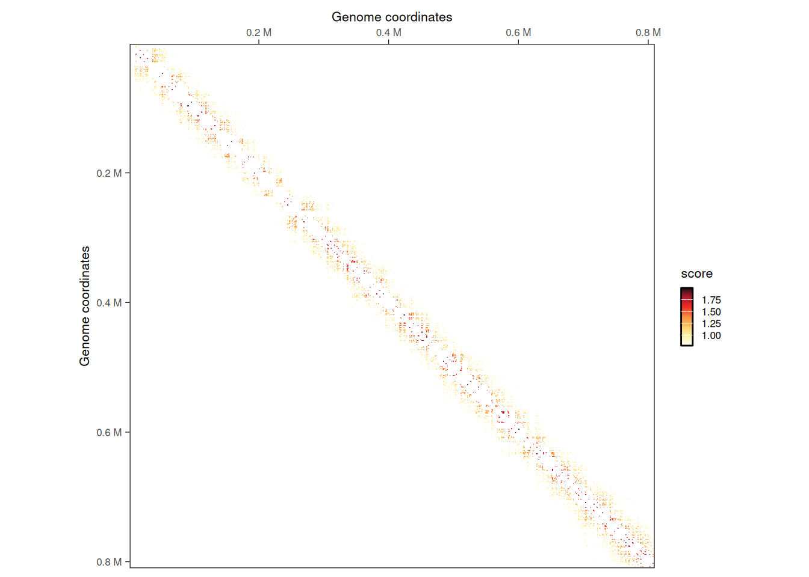
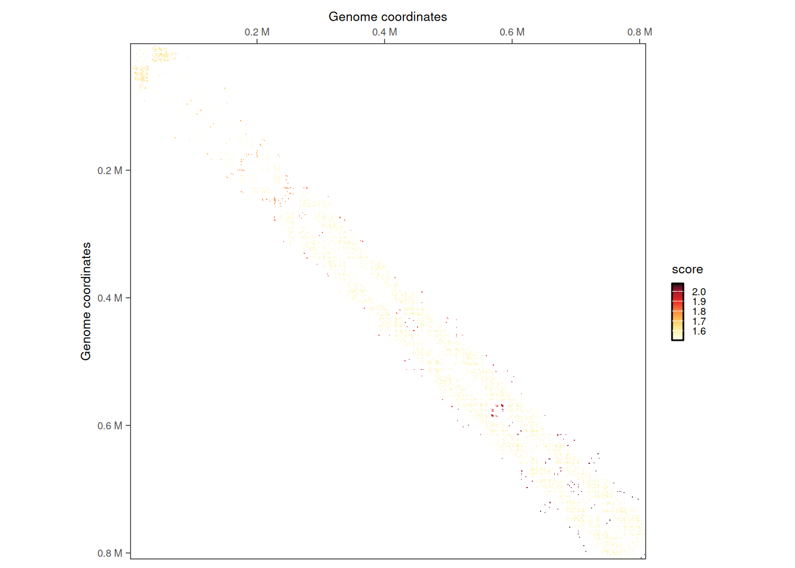
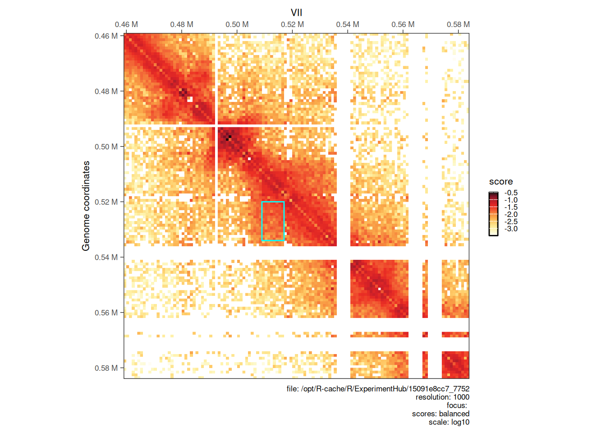

# 9  Interoperability: using HiCExperiment with other R packages

> **NOTE:**
>
> ``` downlit
> library(ggplot2)
> library(purrr)
> library(GenomicRanges)
> ##  Loading required package: stats4
> ##  Loading required package: BiocGenerics
> ##  Loading required package: generics
> ##  
> ##  Attaching package: 'generics'
> ##  The following objects are masked from 'package:base':
> ##  
> ##      as.difftime, as.factor, as.ordered, intersect, is.element,
> ##      setdiff, setequal, union
> ##  
> ##  Attaching package: 'BiocGenerics'
> ##  The following objects are masked from 'package:stats':
> ##  
> ##      IQR, mad, sd, var, xtabs
> ##  The following object is masked from 'package:utils':
> ##  
> ##      data
> ##  The following objects are masked from 'package:base':
> ##  
> ##      Filter, Find, Map, Position, Reduce, anyDuplicated, aperm,
> ##      append, as.data.frame, basename, cbind, colnames, dirname,
> ##      do.call, duplicated, eval, evalq, get, grep, grepl, is.unsorted,
> ##      lapply, mapply, match, mget, order, paste, pmax, pmax.int, pmin,
> ##      pmin.int, rank, rbind, rownames, sapply, saveRDS, scale,
> ##      sequence, table, tapply, transform, unique, unsplit, which.max,
> ##      which.min
> ##  Loading required package: S4Vectors
> ##  
> ##  Attaching package: 'S4Vectors'
> ##  The following object is masked from 'package:utils':
> ##  
> ##      findMatches
> ##  The following objects are masked from 'package:base':
> ##  
> ##      I, expand.grid, unname
> ##  Loading required package: IRanges
> ##  
> ##  Attaching package: 'IRanges'
> ##  The following object is masked from 'package:purrr':
> ##  
> ##      reduce
> ##  Loading required package: Seqinfo
> library(InteractionSet)
> ##  Loading required package: SummarizedExperiment
> ##  Loading required package: MatrixGenerics
> ##  Loading required package: matrixStats
> ##  
> ##  Attaching package: 'MatrixGenerics'
> ##  The following objects are masked from 'package:matrixStats':
> ##  
> ##      colAlls, colAnyNAs, colAnys, colAvgsPerRowSet, colCollapse,
> ##      colCounts, colCummaxs, colCummins, colCumprods, colCumsums,
> ##      colDiffs, colIQRDiffs, colIQRs, colLogSumExps, colMadDiffs,
> ##      colMads, colMaxs, colMeans2, colMedians, colMins, colOrderStats,
> ##      colProds, colQuantiles, colRanges, colRanks, colSdDiffs, colSds,
> ##      colSums2, colTabulates, colVarDiffs, colVars, colWeightedMads,
> ##      colWeightedMeans, colWeightedMedians, colWeightedSds,
> ##      colWeightedVars, rowAlls, rowAnyNAs, rowAnys, rowAvgsPerColSet,
> ##      rowCollapse, rowCounts, rowCummaxs, rowCummins, rowCumprods,
> ##      rowCumsums, rowDiffs, rowIQRDiffs, rowIQRs, rowLogSumExps,
> ##      rowMadDiffs, rowMads, rowMaxs, rowMeans2, rowMedians, rowMins,
> ##      rowOrderStats, rowProds, rowQuantiles, rowRanges, rowRanks,
> ##      rowSdDiffs, rowSds, rowSums2, rowTabulates, rowVarDiffs,
> ##      rowVars, rowWeightedMads, rowWeightedMeans, rowWeightedMedians,
> ##      rowWeightedSds, rowWeightedVars
> ##  Loading required package: Biobase
> ##  Welcome to Bioconductor
> ##  
> ##      Vignettes contain introductory material; view with
> ##      'browseVignettes()'. To cite Bioconductor, see
> ##      'citation("Biobase")', and for packages 'citation("pkgname")'.
> ##  
> ##  Attaching package: 'Biobase'
> ##  The following object is masked from 'package:MatrixGenerics':
> ##  
> ##      rowMedians
> ##  The following objects are masked from 'package:matrixStats':
> ##  
> ##      anyMissing, rowMedians
> library(HiCExperiment)
> ##  Consider using the `HiContacts` package to perform advanced genomic operations 
> ##  on `HiCExperiment` objects.
> ##  
> ##  Read "Orchestrating Hi-C analysis with Bioconductor" online book to learn more:
> ##  https://js2264.github.io/OHCA/
> ##  
> ##  Attaching package: 'HiCExperiment'
> ##  The following object is masked from 'package:SummarizedExperiment':
> ##  
> ##      metadata<-
> ##  The following object is masked from 'package:S4Vectors':
> ##  
> ##      metadata<-
> ##  The following object is masked from 'package:ggplot2':
> ##  
> ##      resolution
> library(HiContactsData)
> ##  Loading required package: ExperimentHub
> ##  Loading required package: AnnotationHub
> ##  Loading required package: BiocFileCache
> ##  Loading required package: dbplyr
> ##  OpenTelemetry error: there is no package called 'otelsdk'
> ##  OpenTelemetry error: there is no package called 'otelsdk'
> ##  
> ##  Attaching package: 'AnnotationHub'
> ##  The following object is masked from 'package:Biobase':
> ##  
> ##      cache
> library(plyinteractions)
> ##  Loading required package: plyranges
> ##  Loading required package: dplyr
> ##  
> ##  Attaching package: 'dplyr'
> ##  The following objects are masked from 'package:dbplyr':
> ##  
> ##      ident, sql, sql_escape_ident, sql_escape_string
> ##  The following object is masked from 'package:Biobase':
> ##  
> ##      combine
> ##  The following object is masked from 'package:matrixStats':
> ##  
> ##      count
> ##  The following objects are masked from 'package:GenomicRanges':
> ##  
> ##      intersect, setdiff, union
> ##  The following object is masked from 'package:Seqinfo':
> ##  
> ##      intersect
> ##  The following objects are masked from 'package:IRanges':
> ##  
> ##      collapse, desc, intersect, setdiff, slice, union
> ##  The following objects are masked from 'package:S4Vectors':
> ##  
> ##      first, intersect, rename, setdiff, setequal, union
> ##  The following objects are masked from 'package:BiocGenerics':
> ##  
> ##      combine, intersect, setdiff, setequal, union
> ##  The following object is masked from 'package:generics':
> ##  
> ##      explain
> ##  The following objects are masked from 'package:stats':
> ##  
> ##      filter, lag
> ##  The following objects are masked from 'package:base':
> ##  
> ##      intersect, setdiff, setequal, union
> ##  
> ##  Attaching package: 'plyranges'
> ##  The following objects are masked from 'package:dplyr':
> ##  
> ##      between, n, n_distinct
> ##  
> ##  Attaching package: 'plyinteractions'
> ##  The following objects are masked from 'package:plyranges':
> ##  
> ##      flank_downstream, flank_left, flank_right, flank_upstream,
> ##      shift_downstream, shift_left, shift_right, shift_upstream
> ##  The following object is masked from 'package:ggplot2':
> ##  
> ##      annotate
> library(multiHiCcompare)
> ##  
> ##  Attaching package: 'multiHiCcompare'
> ##  The following object is masked from 'package:HiCExperiment':
> ##  
> ##      resolution
> ##  The following object is masked from 'package:ggplot2':
> ##  
> ##      resolution
> library(dplyr)
> library(tidyr)
> ##  
> ##  Attaching package: 'tidyr'
> ##  The following object is masked from 'package:S4Vectors':
> ##  
> ##      expand
> ```

> **NOTE:**
>
> This notebook illustrates how to use a range of popular Hi-C—related `R` packages with `HiCExperiment` objects. Conversion to the data structures supported by the following packages is illustrated here:
>
> - `diffHic`
> - `multiHiCcompare`
> - `TopDom`
> - `GOTHiC`

## 9.1 diffHic

`diffHic` is the first R package dedicated to Hi-C processing and analysis (Lun & Smyth ([2015](#ref-Lun_2015))). It is packed with useful functions to generate a contact matrix from read pairs and to perform downstream investigation, including normalization, 2D “peak” (i.e. loops) finding and aggregation, differential interaction between samples, etc. It works seamlessly with the `InteractionSet` class of object, which can be easily obtained from a `HiCExperiment` object.

To do so, we first need to extract `GInteractions` from one or several `HiCExperiment` objects and **create** a single `InteractionSet` object.

``` downlit
library(InteractionSet)
library(GenomicRanges)
library(HiCExperiment)
library(HiContactsData)

# ---- This downloads an example `.mcool` file and caches it locally 
coolf <- HiContactsData('yeast_wt', 'mcool')
##  see ?HiContactsData and browseVignettes('HiContactsData') for documentation
##  loading from cache
cool <- import(coolf, format = 'cool')
gi <- cool |> 
    interactions() |> 
    as("ReverseStrictGInteractions")
iset <- InteractionSet(
    assays = list(
        counts = matrix(gi$count, ncol = 1), 
        balanced = matrix(gi$balanced, ncol = 1)
    ), 
    interactions = gi, 
    colData = data.frame(lib = c("WT"), totals = sum(gi$count))
)
```

From there, we can **filter** interactions to only retain those with significant enrichment over background.

``` downlit
library(diffHic)
set.seed(1234)

# --- Filter to find aggregated interactions
enrichments <- enrichedPairs(iset)
filter <- filterPeaks(enrichments, min.enrich = log2(1.2), min.diag = 5)
filtered_iset <- iset[filter]
filtered_iset
##  class: InteractionSet 
##  dim: 41872 1 
##  metadata(0):
##  assays(2): counts balanced
##  rownames: NULL
##  rowData names(4): bin_id1 bin_id2 count balanced
##  colnames: NULL
##  colData names(2): lib totals
##  type: ReverseStrictGInteractions
##  regions: 12079

# --- Visualize filtered interactions 
library(plyinteractions)
library(HiContacts)
##  Registered S3 methods overwritten by 'readr':
##    method                    from 
##    as.data.frame.spec_tbl_df vroom
##    as_tibble.spec_tbl_df     vroom
##    format.col_spec           vroom
##    print.col_spec            vroom
##    print.collector           vroom
##    print.date_names          vroom
##    print.locale              vroom
##    str.col_spec              vroom
interactions(filtered_iset) |> 
    filter(seqnames2 == 'II', seqnames1 == seqnames2) |> 
    plotMatrix(use.scores = 'count')
```



Next, we can cluster filtered interactions that are next to each other.

``` downlit
# --- Cluster interactions to find loops
clustered_iset <- clusterPairs(filtered_iset, tol = 5000)
clustered_iset$interactions 
##  ReverseStrictGInteractions object with 1644 interactions and 0 metadata columns:
##           seqnames1       ranges1 strand1     seqnames2       ranges2 strand2
##               <Rle>     <IRanges>   <Rle>         <Rle>     <IRanges>   <Rle>
##       [1]         I  15001-149000       * ---         I      1-122000       *
##       [2]         I 133001-148000       * ---         I 127001-139000       *
##       [3]         I 154001-160000       * ---         I 128001-149000       *
##       [4]         I 168001-173000       * ---         I 138001-148000       *
##       [5]         I 184001-196000       * ---         I   15001-23000       *
##       ...       ...           ...     ... ...       ...           ...     ...
##    [1640]       XVI 897001-898000       * ---       XVI 831001-832000       *
##    [1641]       XVI 907001-910000       * ---       XVI 840001-843000       *
##    [1642]       XVI 926001-934000       * ---       XVI 872001-878000       *
##    [1643]       XVI 933001-934000       * ---       XVI 858001-859000       *
##    [1644]       XVI 933001-942000       * ---       XVI 928001-934000       *
##    -------
##    regions: 2822 ranges and 0 metadata columns
##    seqinfo: 16 sequences from an unspecified genome

# --- Visualize clustered interactions 
interactions(filtered_iset) |> 
    mutate(cluster = clustered_iset$indices[[1]]) |> 
    filter(seqnames2 == 'II', seqnames1 == seqnames2) |> 
    plotMatrix(use.scores = 'cluster')
```



Finally, we can visualize identified individual interaction clusters identified with `diffHic` using `HiContacts`.

``` downlit
# --- Plot matrix at a clustered loops
cgi <- clustered_iset$interactions[554]
seqn <- seqnames(anchors(cgi, type="second"))
start <- start(anchors(cgi, type="second")) - 50000
end <- end(anchors(cgi, type="first")) + 50000
interactions_peak <- GRanges(seqn, IRanges(start, end))
p <- plotMatrix(cool[interactions_peak])

library(ggplot2)
an <- anchors(cgi)
p + geom_rect(
    data = data.frame(xmin = start(an[[2]]), xmax = end(an[[2]]), ymin = start(an[[1]]), ymax = end(an[[1]])), 
    aes(xmin = xmin, xmax = xmax, ymin = ymin, ymax = ymax), 
    inherit.aes = FALSE, 
    fill = NA, 
    colour = 'cyan'
)
```



## 9.2 multiHiCcompare

The `multiHiCcompare` package provides functions for joint normalization and difference detection in multiple Hi-C datasets (Stansfield et al. ([2019](#ref-Stansfield_2019))). According to its excerpt, to perform differential interaction analysis, it requires a `list` of **raw counts** for different samples/replicates, stored in **data frames with four columns** (`chr`, `start1`, `start2`, `count`).\
Manipulate a `HiCExperiment` object to coerce it into such structure is straightforward.

``` downlit
library(dplyr)
library(tidyr)
library(purrr)
coolf_wt <- HiContactsData('yeast_wt', 'mcool')
##  see ?HiContactsData and browseVignettes('HiContactsData') for documentation
##  loading from cache
coolf_eco1 <- HiContactsData('yeast_eco1', 'mcool')
##  see ?HiContactsData and browseVignettes('HiContactsData') for documentation
##  loading from cache
hics <- list(
    "wt" = import(coolf_wt, format = 'cool'),
    "eco1" = import(coolf_eco1, format = 'cool')
)
hics_list <- map(hics, ~ .x['XI'] |> 
    as.data.frame() |>
    mutate(chr = 1) |> 
    relocate(chr) |>
    select(chr, start1, start2, count)
)
head(hics_list[[1]])
##    chr start1 start2 count
##  1   1      1      1     2
##  2   1      1   1001     3
##  3   1      1   2001     3
##  4   1      1   3001    13
##  5   1      1   4001     9
##  6   1      1   5001    13
```

Once this list is generated, the classical `multiHiCcompare` workflow can be applied: first run [`make_hicexp()`](https://rdrr.io/pkg/multiHiCcompare/man/make_hicexp.html), followed by [`cyclic_loess()`](https://rdrr.io/pkg/multiHiCcompare/man/cyclic_loess.html), then [`hic_exactTest()`](https://rdrr.io/pkg/multiHiCcompare/man/hic_exactTest.html) and finally [`results()`](https://rdrr.io/pkg/multiHiCcompare/man/results.html):

``` downlit
DI <- hics_list |> 
    make_hicexp(
        data_list = hics_list, 
        groups = factor(c(1, 2))
    ) |> 
    cyclic_loess() |> 
    hic_exactTest() |> 
    results()
DI
##           chr region1 region2     D      logFC    logCPM    p.value     p.adj
##         <num>   <int>   <int> <num>      <num>     <num>      <num>     <num>
##      1:     1       1    1001     1  0.4279414  6.382927 0.78960192 1.0000000
##      2:     1       1    3001     3  1.0325237  8.339327 0.06035705 0.9501367
##      3:     1       1    4001     4  0.6862141  7.597689 0.34723639 1.0000000
##      4:     1       1    5001     5  0.5124878  7.960339 0.43133791 1.0000000
##      5:     1       1    6001     6 -0.3568672  8.563374 0.52289982 1.0000000
##     ---                                                                      
##  22637:     1  663001  666001     3 -1.1680738  7.158551 0.17500113 1.0000000
##  22638:     1  664001  664001     0  1.4530501  8.536212 0.16535151 1.0000000
##  22639:     1  664001  665001     1 -0.1014769  8.166275 1.00000000 1.0000000
##  22640:     1  665001  665001     0 -0.3110054 10.013750 0.60075706 1.0000000
##  22641:     1  665001  666001     1 -0.4989794  7.750157 0.41481212 1.0000000
```

## 9.3 TopDom

The `TopDom` method is widely used to annotate topological domains in genomes from Hi-C data (Shin et al. ([2015](#ref-Shin_2015))). The `TopDom` package was created to implement this method in `R` (Bengtsson et al. ([2020](#ref-Bengtsson_2020))).

Unfortunately, the format of the input to `TopDom` is rather tricky (see [`?TopDom::readHiC`](https://rdrr.io/pkg/TopDom/man/readHiC.html)). The following chunk of code shows how to coerce a `HiCExperiment` object into a `TopDom`-compatible object.

``` downlit
library(TopDom)
hic <- import(coolf_wt, format = 'cool')
HiCExperiment2TopDom <- function(hic, chr) {
    data <- list()
    cm <- as(hic[chr], 'ContactMatrix')
    data$counts <- as.matrix(cm) |> base::as.matrix()
    data$counts[is.na(data$counts)] <- 0
    data$bins <- regions(cm) |> 
        as.data.frame() |> 
        select(seqnames, start, end) |>
        mutate(seqnames = as.character(seqnames)) |>
        mutate(id = 1:n(), start = start - 1) |> 
        relocate(id) |> 
        dplyr::rename(chr = seqnames, from.coord = start, to.coord = end)
    class(data) <- 'TopDomData'
    return(data)
}
hic_topdom <- HiCExperiment2TopDom(hic, "II")
hic_topdom
##  TopDomData:
##  bins:
##  'data.frame':   813 obs. of  4 variables:
##   $ id        : int  1 2 3 4 5 6 7 8 9 10 ...
##   $ chr       : chr  "II" "II" "II" "II" ...
##   $ from.coord: num  0 1000 2000 3000 4000 5000 6000 7000 8000 9000 ...
##   $ to.coord  : int  1000 2000 3000 4000 5000 6000 7000 8000 9000 10000 ...
##  counts:
##   num [1:813, 1:813] 0 0 0 0 0 0 0 0 0 0 ...
```

Now that we have coerced a `HiCExperiment` object into a `TopDom`-compatible object, we can use the main `TopDom` function to annotate topological domains.

``` downlit
domains <- TopDom::TopDom(hic_topdom, window.size = 5)
domains
##  TopDom:
##  Parameters:
##  - window.size: 5
##  - statFilter: TRUE
##  binSignal:
##  'data.frame':   813 obs. of  7 variables:
##   $ id        : int  1 2 3 4 5 6 7 8 9 10 ...
##   $ chr       : chr  "II" "II" "II" "II" ...
##   $ from.coord: num  0 1000 2000 3000 4000 5000 6000 7000 8000 9000 ...
##   $ to.coord  : int  1000 2000 3000 4000 5000 6000 7000 8000 9000 10000 ...
##   $ local.ext : num  -0.5 -0.5 -0.5 -0.5 -0.5 -0.5 -0.5 -0.5 0 0 ...
##   $ mean.cf   : num  0 0 0 0 0 ...
##   $ pvalue    : num  1 1 1 1 1 ...
##  domain:
##  'data.frame':   61 obs. of  7 variables:
##   $ chr       : chr  "II" "II" "II" "II" ...
##   $ from.id   : int  1 9 31 36 47 61 76 82 91 102 ...
##   $ from.coord: num  0 8000 30000 35000 46000 60000 75000 81000 90000 101000 ...
##   $ to.id     : int  8 30 35 46 60 75 81 90 101 136 ...
##   $ to.coord  : num  8000 30000 35000 46000 60000 75000 81000 90000 101000 136000 ...
##   $ tag       : chr  "gap" "domain" "gap" "domain" ...
##   $ size      : num  8000 22000 5000 11000 14000 15000 6000 9000 11000 35000 ...
##  bed:
##  'data.frame':   61 obs. of  4 variables:
##   $ chrom     : chr  "II" "II" "II" "II" ...
##   $ chromStart: num  0 8000 30000 35000 46000 60000 75000 81000 90000 101000 ...
##   $ chromEnd  : num  8000 30000 35000 46000 60000 75000 81000 90000 101000 136000 ...
##   $ name      : chr  "gap" "domain" "gap" "domain" ...
```

The resulting `domains` object can be used to extract annotated domains, store them in `topologicalFeatures` of the original `HiCExperiment`, and optionally write a `bed` file to export them in text.

``` downlit
topologicalFeatures(hic, 'domain') <- domains$bed |> 
    mutate(chromStart = chromStart + 1) |> 
    filter(name == 'domain') |> 
    makeGRangesFromDataFrame()
topologicalFeatures(hic, 'domain')
##  GRanges object with 52 ranges and 0 metadata columns:
##         seqnames        ranges strand
##            <Rle>     <IRanges>  <Rle>
##     [1]       II    8001-30000      *
##     [2]       II   35001-46000      *
##     [3]       II   46001-60000      *
##     [4]       II   60001-75000      *
##     [5]       II   75001-81000      *
##     ...      ...           ...    ...
##    [48]       II 664001-681000      *
##    [49]       II 681001-707000      *
##    [50]       II 707001-714000      *
##    [51]       II 714001-761000      *
##    [52]       II 761001-806000      *
##    -------
##    seqinfo: 1 sequence from an unspecified genome; no seqlengths

rtracklayer::export(topologicalFeatures(hic, 'domain'), 'hic_domains.bed')
```

## 9.4 GOTHiC

`GOTHiC` relies on a cumulative binomial test to detect interactions between distal genomic loci that have significantly more reads than expected by chance in Hi-C experiments (Mifsud et al. ([2017](#ref-Mifsud_2017))).

> **IMPORTANT:**
>
> Unfortunately, the main `GOTHiC` function require two `.bam` files as input. These files are often deleted due to their larger size, while the filtered `pairs` file itself is retained.
>
> Moreover, the internal nuts and bolts of the main `GOTHiC` function perform several operations that are not required in modern workflows:
>
> 1.  [Filtering pairs from same restriction fragment](https://code.bioconductor.org/browse/GOTHiC/blob/RELEASE_3_17/R/GOTHiC.R#L814); this step is now usually taken care of automatically, e.g. with `HiCool` Hi-C processing package.
> 2.  [Filtering short-range pairs](https://code.bioconductor.org/browse/GOTHiC/blob/RELEASE_3_17/R/GOTHiC.R#L826); the `GOTHiC` package hard-codes a 10kb lower threshold for minimum pair distance. More advanced optimized filtering approaches have been implemented since then, to circumvent the need for such hard-coded threshold.
> 3.  [Binning pairs](https://code.bioconductor.org/browse/GOTHiC/blob/RELEASE_3_17/R/GOTHiC.R#L834); this step is also already taken care of, when working with Hi-C matrices in modern formats, e.g. with `.(m)cool` files.

Based on these facts, we can simplify the binomial test function provided by `GOTHiC` so that it can directly used binned interactions imported as a `HiCExperiment` object in `R`.

Show the code for `GOTHiC_binomial` function

``` downlit
GOTHiC_binomial <- function(x) {

    if (length(trans(x)) != 0) stop("Only `cis` interactions can be used here.")
    ints <- interactions(x) |>
        as.data.frame() |> 
        select(seqnames1, start1, seqnames2, start2, count) |>
        dplyr::rename(chr1 = seqnames1, locus1 = start1, chr2 = seqnames2, locus2 = start2, frequencies = count) |>
        mutate(locus1 = locus1 - 1, locus2 = locus2 - 1) |>
        mutate(int1 = paste0(chr1, '_', locus1), int2 = paste0(chr2, '_', locus2))
    
    numberOfReadPairs <- sum(ints$frequencies)
    all_bins <- unique(c(unique(ints$int1), unique(ints$int2)))
    all_bins <- sort(all_bins)
    upperhalfBinNumber <- (length(all_bins)^2 - length(all_bins))/2

    cov <- ints |> 
        group_by(int1) |> 
        tally(frequencies) |> 
        full_join(ints |> 
            group_by(int2) |> 
            tally(frequencies), 
            by = c('int1' = 'int2')
        ) |> 
        rowwise() |> 
        mutate(coverage = sum(n.x, n.y, na.rm = TRUE)) |> 
        ungroup() |>
        mutate(relative_coverage = coverage/sum(coverage))
    
    results <- mutate(ints,
        cov1 = left_join(ints, select(cov, int1, relative_coverage), by = c('int1' = 'int1'))$relative_coverage, 
        cov2 = left_join(ints, select(cov, int1, relative_coverage), by = c('int2' = 'int1'))$relative_coverage,
        probability = cov1 * cov2 * 2 * 1/(1 - sum(cov$relative_coverage^2)),
        predicted = probability * numberOfReadPairs
    ) |> 
    rowwise() |>
    mutate(
        pvalue = binom.test(
            frequencies, 
            numberOfReadPairs, 
            probability,
            alternative = "greater"
        )$p.value
    ) |> 
    ungroup() |> 
    mutate(
        logFoldChange = log2(frequencies / predicted), 
        qvalue = stats::p.adjust(pvalue, method = "BH", n = upperhalfBinNumber)
    )

    scores(x, "probability") <- results$probability
    scores(x, "predicted") <- results$predicted
    scores(x, "pvalue") <- results$pvalue
    scores(x, "qvalue") <- results$qvalue
    scores(x, "logFoldChange") <- results$logFoldChange

    return(x)

} 
```

``` downlit
res <- GOTHiC_binomial(hic["II"])
res
##  `HiCExperiment` object with 471,364 contacts over 802 regions 
##  -------
##  fileName: "/opt/R-cache/R/ExperimentHub/15091e8cc7_7752" 
##  focus: "II" 
##  resolutions(5): 1000 2000 4000 8000 16000
##  active resolution: 1000 
##  interactions: 74360 
##  scores(7): count balanced probability predicted pvalue qvalue logFoldChange 
##  topologicalFeatures: compartments(0) borders(0) loops(0) viewpoints(0) domain(52) 
##  pairsFile: N/A 
##  metadata(0):

interactions(res)
##  GInteractions object with 74360 interactions and 9 metadata columns:
##            seqnames1       ranges1 strand1     seqnames2       ranges2
##                <Rle>     <IRanges>   <Rle>         <Rle>     <IRanges>
##        [1]        II        1-1000       * ---        II     1001-2000
##        [2]        II        1-1000       * ---        II     5001-6000
##        [3]        II        1-1000       * ---        II     6001-7000
##        [4]        II        1-1000       * ---        II     8001-9000
##        [5]        II        1-1000       * ---        II    9001-10000
##        ...       ...           ...     ... ...       ...           ...
##    [74356]        II 807001-808000       * ---        II 809001-810000
##    [74357]        II 807001-808000       * ---        II 810001-811000
##    [74358]        II 808001-809000       * ---        II 808001-809000
##    [74359]        II 808001-809000       * ---        II 809001-810000
##    [74360]        II 809001-810000       * ---        II 809001-810000
##            strand2 |   bin_id1   bin_id2     count  balanced probability
##              <Rle> | <numeric> <numeric> <numeric> <numeric>   <numeric>
##        [1]       * |       231       232         1       NaN 7.83580e-09
##        [2]       * |       231       236         2       NaN 2.81318e-08
##        [3]       * |       231       237         1       NaN 2.02960e-08
##        [4]       * |       231       239         2       NaN 6.73108e-08
##        [5]       * |       231       240         3       NaN 7.37336e-08
##        ...     ... .       ...       ...       ...       ...         ...
##    [74356]       * |      1038      1040         8 0.0472023 3.85638e-07
##    [74357]       * |      1038      1041         1       NaN 5.03006e-08
##    [74358]       * |      1039      1039         1       NaN 8.74604e-08
##    [74359]       * |      1039      1040         7       NaN 1.02111e-07
##    [74360]       * |      1040      1040         2 0.0411355 1.19216e-07
##             predicted      pvalue      qvalue logFoldChange
##             <numeric>   <numeric>   <numeric>     <numeric>
##        [1] 0.00369352 3.68670e-03 0.063385760       8.08079
##        [2] 0.01326033 8.71446e-05 0.001926954       7.23674
##        [3] 0.00956681 9.52120e-03 0.150288341       6.70775
##        [4] 0.03172791 4.92808e-04 0.009806734       5.97810
##        [5] 0.03475538 6.81713e-06 0.000173165       6.43158
##        ...        ...         ...         ...           ...
##    [74356]  0.1817758 2.51560e-11 1.07966e-09       5.45977
##    [74357]  0.0237099 2.34310e-02 3.38098e-01       5.39837
##    [74358]  0.0412257 4.03875e-02 5.49519e-01       4.60031
##    [74359]  0.0481315 1.13834e-13 5.77259e-12       7.18423
##    [74360]  0.0561941 1.52097e-03 2.79707e-02       5.15344
##    -------
##    regions: 802 ranges and 4 metadata columns
##    seqinfo: 16 sequences from an unspecified genome
```

# Session info

> **NOTE:**
>
> ``` downlit
> sessioninfo::session_info(include_base = TRUE)
> ##  ─ Session info ────────────────────────────────────────────────────────────
> ##   setting  value
> ##   version  R version 4.6.1 (2026-06-24)
> ##   os       Ubuntu 24.04.4 LTS
> ##   system   x86_64, linux-gnu
> ##   ui       X11
> ##   language (EN)
> ##   collate  C
> ##   ctype    en_US.UTF-8
> ##   tz       Etc/UTC
> ##   date     2026-10-06
> ##   pandoc   3.11 @ /usr/bin/ (via rmarkdown)
> ##   quarto   1.11.5 @ /usr/local/bin/quarto
> ##  
> ##  ─ Packages ────────────────────────────────────────────────────────────────
> ##   package              * version    date (UTC) lib source
> ##   abind                  1.4-8      2024-09-12 [2] RSPM (R 4.6.0)
> ##   AnnotationDbi          1.75.2     2026-07-21 [2] Bioconductor 3.24 (R 4.6.1)
> ##   AnnotationHub        * 4.3.2      2026-06-30 [2] Bioconductor 3.24 (R 4.6.1)
> ##   base                 * 4.6.1      2026-09-11 [3] local
> ##   beeswarm               0.4.0      2021-06-01 [2] RSPM (R 4.6.0)
> ##   Biobase              * 2.73.2     2026-07-29 [2] Bioconductor 3.24 (R 4.6.1)
> ##   BiocBaseUtils          1.15.1     2026-05-10 [2] Bioconductor 3.24 (R 4.6.1)
> ##   BiocFileCache        * 3.3.0      2026-04-28 [2] Bioconductor 3.24 (R 4.6.1)
> ##   BiocGenerics         * 0.59.12    2026-08-11 [2] Bioconductor 3.24 (R 4.6.1)
> ##   BiocIO                 1.23.3     2026-04-29 [2] Bioconductor 3.24 (R 4.6.1)
> ##   BiocManager            1.30.27    2025-11-14 [2] CRAN (R 4.6.1)
> ##   BiocParallel           1.47.0     2026-04-28 [2] Bioconductor 3.24 (R 4.6.1)
> ##   BiocVersion            3.24.0     2026-04-28 [2] Bioconductor 3.24 (R 4.6.1)
> ##   Biostrings             2.81.9     2026-09-06 [2] Bioconductor 3.24 (R 4.6.1)
> ##   bit                    4.6.0      2025-03-06 [2] RSPM (R 4.6.0)
> ##   bit64                  4.8.6      2026-09-01 [2] RSPM (R 4.6.0)
> ##   bitops                 1.1-0      2026-07-30 [2] RSPM (R 4.6.0)
> ##   blob                   1.3.0      2026-01-14 [2] RSPM (R 4.6.0)
> ##   BSgenome               1.81.1     2026-07-29 [2] Bioconductor 3.24 (R 4.6.1)
> ##   cachem                 1.1.0      2024-05-16 [2] RSPM (R 4.6.0)
> ##   Cairo                  1.7-0      2025-10-29 [2] RSPM (R 4.6.0)
> ##   calibrate              1.7.7      2020-06-19 [2] RSPM (R 4.6.0)
> ##   cigarillo              1.3.1      2026-07-13 [2] Bioconductor 3.24 (R 4.6.1)
> ##   cli                    3.6.6      2026-04-09 [2] RSPM (R 4.6.0)
> ##   codetools              0.2-20     2024-03-31 [3] CRAN (R 4.6.1)
> ##   compiler               4.6.1      2026-09-11 [3] local
> ##   crayon                 1.5.3      2024-06-20 [2] RSPM (R 4.6.0)
> ##   csaw                   1.47.1     2026-07-14 [2] Bioconductor 3.24 (R 4.6.1)
> ##   curl                   8.0.0      2026-08-25 [2] RSPM (R 4.6.0)
> ##   data.table             1.18.6.1   2026-08-24 [2] RSPM (R 4.6.0)
> ##   datasets             * 4.6.1      2026-09-11 [3] local
> ##   DBI                    1.3.0      2026-02-25 [2] RSPM (R 4.6.0)
> ##   dbplyr               * 2.6.0      2026-06-17 [2] RSPM (R 4.6.0)
> ##   DelayedArray           0.39.8     2026-09-30 [2] Bioconductor 3.24 (R 4.6.1)
> ##   dichromat              2.0-1      2026-07-22 [2] RSPM (R 4.6.0)
> ##   diffHic              * 1.45.0     2026-04-28 [2] Bioconductor 3.24 (R 4.6.1)
> ##   digest                 0.6.39     2025-11-19 [2] RSPM (R 4.6.0)
> ##   dplyr                * 1.2.1      2026-04-03 [2] RSPM (R 4.6.0)
> ##   edgeR                  4.99.6     2026-09-13 [2] Bioconductor 3.24 (R 4.6.1)
> ##   evaluate               1.0.5      2025-08-27 [2] RSPM (R 4.6.0)
> ##   ExperimentHub        * 3.3.2      2026-08-12 [2] Bioconductor 3.24 (R 4.6.1)
> ##   farver                 2.1.2      2024-05-13 [2] RSPM (R 4.6.0)
> ##   fastmap                1.2.0      2024-05-15 [2] RSPM (R 4.6.0)
> ##   filelock               1.0.3      2023-12-11 [2] RSPM (R 4.6.0)
> ##   generics             * 0.1.4      2025-05-09 [2] RSPM (R 4.6.0)
> ##   GenomeInfoDb           1.49.1     2026-05-24 [2] Bioconductor 3.24 (R 4.6.1)
> ##   GenomeInfoDbData       1.2.15     2026-07-20 [2] Bioconductor
> ##   GenomicAlignments      1.49.2     2026-09-02 [2] Bioconductor 3.24 (R 4.6.1)
> ##   GenomicRanges        * 1.65.4     2026-09-02 [2] Bioconductor 3.24 (R 4.6.1)
> ##   ggbeeswarm             0.7.3      2025-11-29 [2] RSPM (R 4.6.0)
> ##   ggplot2              * 4.0.3      2026-04-22 [2] RSPM (R 4.6.0)
> ##   ggrastr                1.0.2      2023-06-01 [2] RSPM (R 4.6.0)
> ##   glue                   1.8.1      2026-04-17 [2] RSPM (R 4.6.0)
> ##   graphics             * 4.6.1      2026-09-11 [3] local
> ##   grDevices            * 4.6.1      2026-09-11 [3] local
> ##   grid                   4.6.1      2026-09-11 [3] local
> ##   gridExtra              2.3.1      2026-06-25 [2] RSPM (R 4.6.0)
> ##   gtable                 0.3.6      2024-10-25 [2] RSPM (R 4.6.0)
> ##   gtools                 3.9.5      2023-11-20 [2] RSPM (R 4.6.0)
> ##   HiCcompare             1.35.2     2026-10-01 [2] Bioconductor 3.24 (R 4.6.1)
> ##   HiCExperiment        * 1.13.1     2026-10-04 [2] Bioconductor 3.24 (R 4.6.1)
> ##   HiContacts           * 1.15.2     2026-10-04 [2] Bioconductor 3.24 (R 4.6.1)
> ##   HiContactsData       * 1.5.3      2026-10-06 [2] Github (js2264/HiContactsData@d5bebe7)
> ##   hms                    1.1.4      2025-10-17 [2] RSPM (R 4.6.0)
> ##   htmltools              0.5.9      2025-12-04 [2] RSPM (R 4.6.0)
> ##   htmlwidgets            1.6.4      2023-12-06 [2] RSPM (R 4.6.0)
> ##   httr                   1.4.9      2026-09-01 [2] RSPM (R 4.6.0)
> ##   httr2                  1.3.0      2026-07-13 [2] RSPM (R 4.6.0)
> ##   InteractionSet       * 1.41.0     2026-04-28 [2] Bioconductor 3.24 (R 4.6.1)
> ##   IRanges              * 2.47.5     2026-08-27 [2] Bioconductor 3.24 (R 4.6.1)
> ##   jsonlite               2.0.0      2025-03-27 [2] RSPM (R 4.6.0)
> ##   KEGGREST               1.53.6     2026-07-23 [2] Bioconductor 3.24 (R 4.6.1)
> ##   KernSmooth             2.23-27    2026-08-12 [2] RSPM (R 4.6.0)
> ##   knitr                  1.52       2026-09-06 [2] RSPM (R 4.6.0)
> ##   labeling               0.4.3      2023-08-29 [2] RSPM (R 4.6.0)
> ##   lattice                0.23-1     2026-08-12 [2] RSPM (R 4.6.0)
> ##   lifecycle              1.0.5      2026-01-08 [2] RSPM (R 4.6.0)
> ##   limma                  3.99.0     2026-08-31 [2] Bioconductor 3.24 (R 4.6.1)
> ##   locfit                 1.5-9.12   2025-03-05 [2] RSPM (R 4.6.0)
> ##   magrittr               2.0.5      2026-04-04 [2] RSPM (R 4.6.0)
> ##   MASS                   7.3-66     2026-07-15 [2] RSPM (R 4.6.0)
> ##   mathjaxr               2.0-0      2025-12-01 [2] RSPM (R 4.6.0)
> ##   Matrix                 1.7-6      2026-07-25 [2] RSPM (R 4.6.0)
> ##   MatrixGenerics       * 1.25.0     2026-04-28 [2] Bioconductor 3.24 (R 4.6.1)
> ##   matrixStats          * 1.5.0      2025-01-07 [2] RSPM (R 4.6.0)
> ##   memoise                2.0.1      2021-11-26 [2] RSPM (R 4.6.0)
> ##   metap                  1.14       2026-05-01 [2] RSPM (R 4.6.0)
> ##   metapod                1.21.0     2026-04-28 [2] Bioconductor 3.24 (R 4.6.1)
> ##   methods              * 4.6.1      2026-09-11 [3] local
> ##   mgcv                   1.9-4      2025-11-07 [3] CRAN (R 4.6.1)
> ##   mnormt                 2.1.2      2026-01-27 [2] RSPM (R 4.6.0)
> ##   multcomp               1.4-32     2026-08-21 [2] RSPM (R 4.6.0)
> ##   multiHiCcompare      * 1.31.1     2026-07-09 [2] Bioconductor 3.24 (R 4.6.1)
> ##   multtest               2.69.0     2026-04-28 [2] Bioconductor 3.24 (R 4.6.1)
> ##   mutoss                 0.1-14     2026-01-08 [2] RSPM (R 4.6.0)
> ##   mvtnorm                1.4-2      2026-07-12 [2] RSPM (R 4.6.0)
> ##   nlme                   3.1-171    2026-09-01 [2] RSPM (R 4.6.0)
> ##   numDeriv               2016.8-1.1 2019-06-06 [2] RSPM (R 4.6.0)
> ##   otel                   0.2.0      2025-08-29 [2] RSPM (R 4.6.0)
> ##   parallel               4.6.1      2026-09-11 [3] local
> ##   pbapply                1.7-5      2026-09-01 [2] RSPM (R 4.6.0)
> ##   pheatmap               1.0.13     2025-06-05 [2] RSPM (R 4.6.0)
> ##   pillar                 1.11.1     2025-09-17 [2] RSPM (R 4.6.0)
> ##   pkgconfig              2.0.3      2019-09-22 [2] RSPM (R 4.6.0)
> ##   plotrix                3.8-14     2026-02-13 [2] RSPM (R 4.6.0)
> ##   plyinteractions      * 1.11.1     2026-10-04 [2] Bioconductor 3.24 (R 4.6.1)
> ##   plyr                   1.8.9      2023-10-02 [2] RSPM (R 4.6.0)
> ##   plyranges            * 1.33.2     2026-07-30 [2] Bioconductor 3.24 (R 4.6.1)
> ##   png                    0.1-9      2026-03-15 [2] RSPM (R 4.6.0)
> ##   purrr                * 1.2.2      2026-04-10 [2] RSPM (R 4.6.0)
> ##   qqconf                 1.3.2      2023-04-14 [2] RSPM (R 4.6.0)
> ##   qqman                  0.1.9      2023-08-23 [2] RSPM (R 4.6.0)
> ##   R6                     2.6.1      2025-02-15 [2] RSPM (R 4.6.0)
> ##   rappdirs               0.3.4      2026-01-17 [2] RSPM (R 4.6.0)
> ##   rbibutils              2.4.1      2026-01-21 [2] RSPM (R 4.6.0)
> ##   RColorBrewer           1.1-3      2022-04-03 [2] RSPM (R 4.6.0)
> ##   Rcpp                   1.1.2      2026-07-05 [2] RSPM (R 4.6.0)
> ##   RCurl                  1.98-1.20  2026-08-21 [2] RSPM (R 4.6.0)
> ##   Rdpack                 2.6.6      2026-02-08 [2] RSPM (R 4.6.0)
> ##   readr                  2.2.0      2026-02-19 [2] RSPM (R 4.6.0)
> ##   reshape2               1.4.5      2025-11-12 [2] RSPM (R 4.6.0)
> ##   restfulr               0.0.17     2026-06-11 [2] RSPM (R 4.6.0)
> ##   rhdf5                  2.57.18    2026-09-23 [2] Bioconductor 3.24 (R 4.6.1)
> ##   rhdf5filters           1.25.4     2026-08-06 [2] Bioconductor 3.24 (R 4.6.1)
> ##   Rhdf5lib               2.1.0      2026-04-28 [2] Bioconductor 3.24 (R 4.6.1)
> ##   Rhtslib                3.9.0      2026-04-28 [2] Bioconductor 3.24 (R 4.6.1)
> ##   rjson                  0.2.23     2024-09-16 [2] RSPM (R 4.6.0)
> ##   rlang                  1.3.0      2026-07-05 [2] RSPM (R 4.6.0)
> ##   rmarkdown              2.32       2026-09-01 [2] RSPM (R 4.6.0)
> ##   Rsamtools              2.29.0     2026-04-28 [2] Bioconductor 3.24 (R 4.6.1)
> ##   RSpectra               0.16-2     2024-07-18 [2] RSPM (R 4.6.0)
> ##   RSQLite                3.53.3     2026-06-30 [2] RSPM (R 4.6.0)
> ##   rtracklayer            1.73.0     2026-04-28 [2] Bioconductor 3.24 (R 4.6.1)
> ##   S4Arrays               1.13.2     2026-09-30 [2] Bioconductor 3.24 (R 4.6.1)
> ##   S4Vectors            * 0.51.10    2026-09-16 [2] Bioconductor 3.24 (R 4.6.1)
> ##   S7                     0.2.2      2026-04-22 [2] RSPM (R 4.6.0)
> ##   sandwich               3.1-3      2026-08-03 [2] RSPM (R 4.6.0)
> ##   scales                 1.4.0      2025-04-24 [2] RSPM (R 4.6.0)
> ##   Seqinfo              * 1.3.2      2026-08-27 [2] Bioconductor 3.24 (R 4.6.1)
> ##   sessioninfo            1.2.4      2026-06-04 [2] RSPM (R 4.6.0)
> ##   sn                     2.1.3      2026-02-24 [2] RSPM (R 4.6.0)
> ##   SparseArray            1.13.4     2026-09-30 [2] Bioconductor 3.24 (R 4.6.1)
> ##   splines                4.6.1      2026-09-11 [3] local
> ##   statmod                1.5.2      2026-05-17 [2] RSPM (R 4.6.0)
> ##   stats                * 4.6.1      2026-09-11 [3] local
> ##   stats4               * 4.6.1      2026-09-11 [3] local
> ##   strawr                 0.0.92     2024-07-16 [2] RSPM (R 4.6.0)
> ##   stringi                1.8.9      2026-08-04 [2] RSPM (R 4.6.0)
> ##   stringr                1.6.0      2025-11-04 [2] RSPM (R 4.6.0)
> ##   SummarizedExperiment * 1.43.0     2026-04-28 [2] Bioconductor 3.24 (R 4.6.1)
> ##   survival               3.8-12     2026-09-09 [2] RSPM (R 4.6.0)
> ##   TFisher                0.2.1      2026-08-25 [2] RSPM (R 4.6.0)
> ##   TH.data                1.1-5      2025-11-17 [2] RSPM (R 4.6.0)
> ##   tibble                 3.3.1      2026-01-11 [2] RSPM (R 4.6.0)
> ##   tidyr                * 1.3.2      2025-12-19 [2] RSPM (R 4.6.0)
> ##   tidyselect             1.2.1      2024-03-11 [2] RSPM (R 4.6.0)
> ##   tools                  4.6.1      2026-09-11 [3] local
> ##   TopDom               * 0.10.2     2026-08-31 [2] RSPM (R 4.6.0)
> ##   tzdb                   0.5.0      2025-03-15 [2] RSPM (R 4.6.0)
> ##   UCSC.utils             1.9.0      2026-04-28 [2] Bioconductor 3.24 (R 4.6.1)
> ##   utils                * 4.6.1      2026-09-11 [3] local
> ##   vctrs                  0.7.3      2026-04-11 [2] RSPM (R 4.6.0)
> ##   vipor                  0.4.7      2023-12-18 [2] RSPM (R 4.6.0)
> ##   vroom                  1.7.1      2026-03-31 [2] RSPM (R 4.6.0)
> ##   withr                  3.0.3      2026-06-19 [2] RSPM (R 4.6.0)
> ##   xfun                   0.61       2026-09-16 [2] RSPM (R 4.6.0)
> ##   XML                    3.99-0.25  2026-09-27 [2] RSPM (R 4.6.0)
> ##   XVector                0.53.0     2026-04-28 [2] Bioconductor 3.24 (R 4.6.1)
> ##   yaml                   2.3.12     2025-12-10 [2] RSPM (R 4.6.0)
> ##   zoo                    1.9-1      2026-09-25 [2] RSPM (R 4.6.0)
> ##  
> ##   [1] /tmp/Rtmpu8u3NE/Rinstb3e0c7701
> ##   [2] /usr/local/lib/R/site-library
> ##   [3] /usr/local/lib/R/library
> ##   * ── Packages attached to the search path.
> ##  
> ##  ───────────────────────────────────────────────────────────────────────────
> ```

# References

Bengtsson, H., Shin, H., Lazaris, H., Hu, G., & Zhou, X. (2020). *R package TopDom: An efficient and deterministic method for identifying topological domains in genomes*. <https://github.com/HenrikBengtsson/TopDom>

Lun, A. T. L., & Smyth, G. K. (2015). diffHic: a Bioconductor package to detect differential genomic interactions in Hi-C data. *BMC Bioinf.*, *16*(1), 1–11. <https://doi.org/10.1186/s12859-015-0683-0>

Mifsud, B., Martincorena, I., Darbo, E., Sugar, R., Schoenfelder, S., Fraser, P., & Luscombe, N. M. (2017). GOTHiC, a probabilistic model to resolve complex biases and to identify real interactions in hi-c data. *PLOS ONE*, *12*(4), e0174744. <https://doi.org/10.1371/journal.pone.0174744>

Shin, H., Shi, Y., Dai, C., Tjong, H., Gong, K., Alber, F., & Zhou, X. J. (2015). TopDom: An efficient and deterministic method for identifying topological domains in genomes. *Nucleic Acids Research*, *44*(7), e70–e70. <https://doi.org/10.1093/nar/gkv1505>

Stansfield, J. C., Cresswell, K. G., & Dozmorov, M. G. (2019). multiHiCcompare: Joint normalization and comparative analysis of complex hi-c experiments. *Bioinformatics*, *35*(17), 2916–2923. <https://doi.org/10.1093/bioinformatics/btz048>
