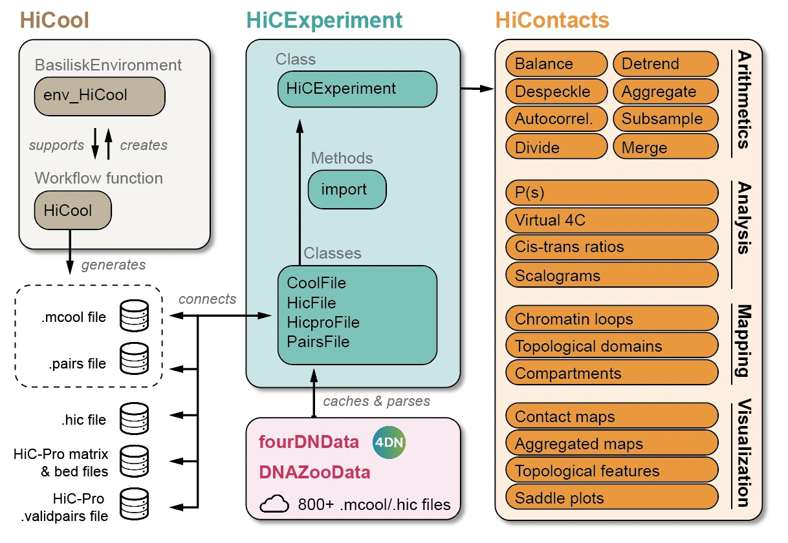
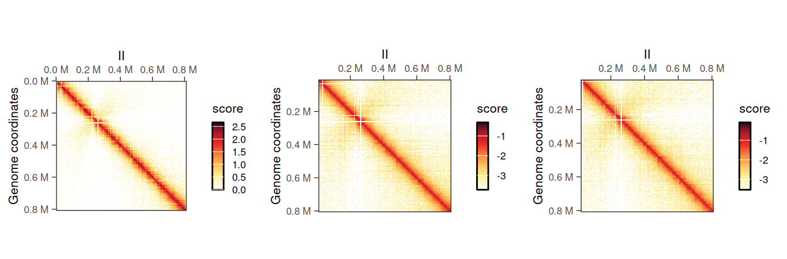
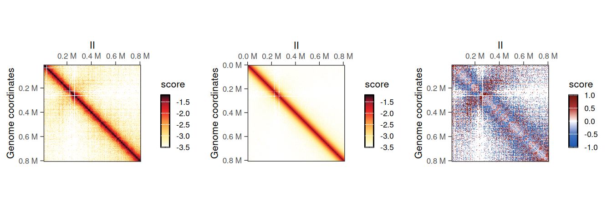
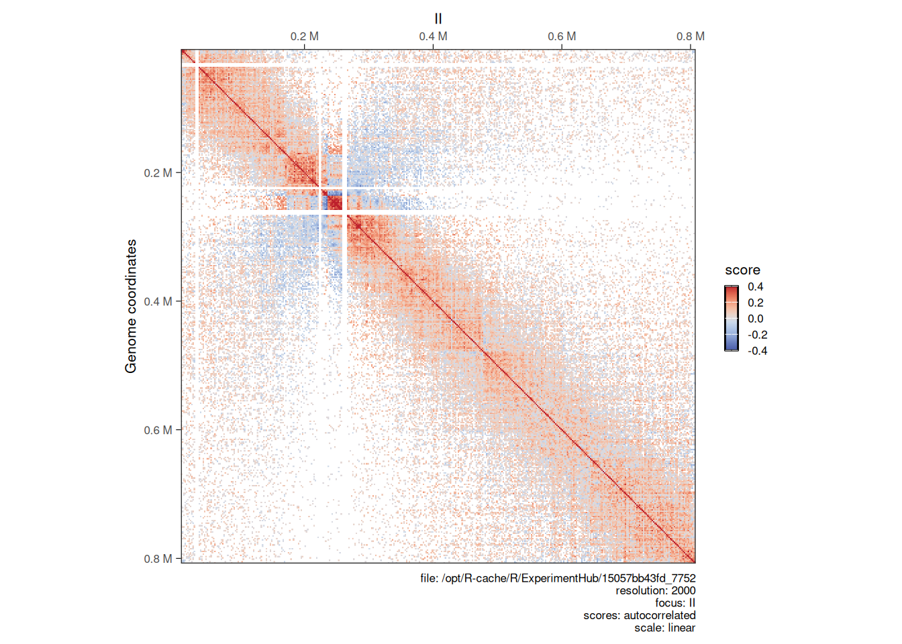
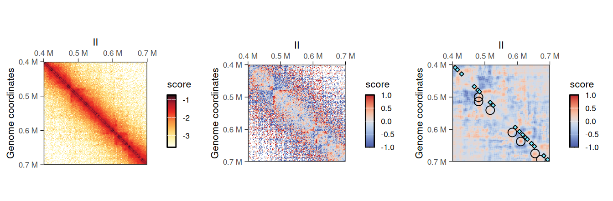
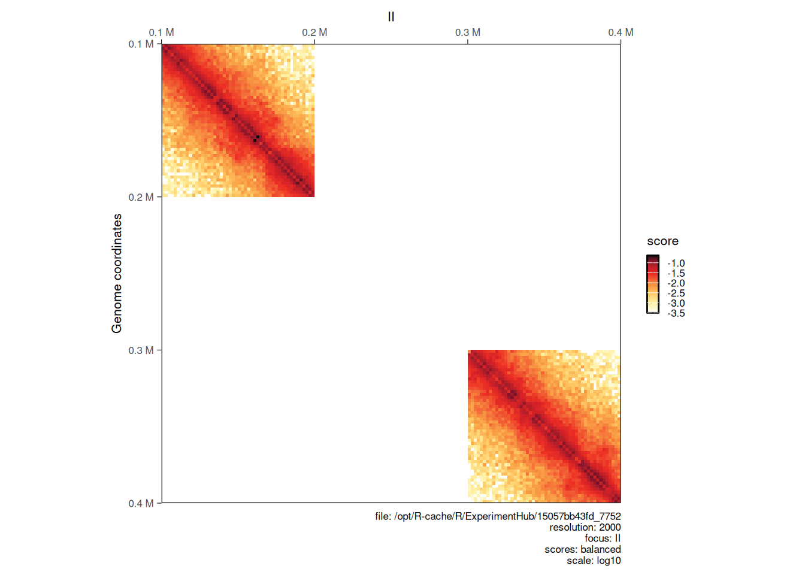
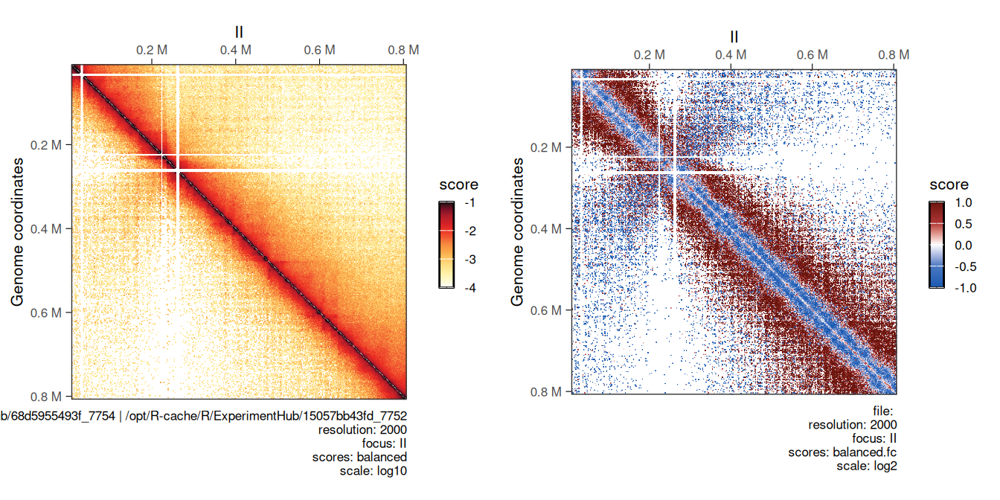

# 5  Matrix-centric analysis

> **NOTE:**
>
> ``` downlit
> library(ggplot2)
> library(GenomicRanges)
> ##  Loading required package: stats4
> ##  Loading required package: BiocGenerics
> ##  Loading required package: generics
> ##  
> ##  Attaching package: 'generics'
> ##  The following objects are masked from 'package:base':
> ##  
> ##      as.difftime, as.factor, as.ordered, intersect, is.element,
> ##      setdiff, setequal, union
> ##  
> ##  Attaching package: 'BiocGenerics'
> ##  The following objects are masked from 'package:stats':
> ##  
> ##      IQR, mad, sd, var, xtabs
> ##  The following object is masked from 'package:utils':
> ##  
> ##      data
> ##  The following objects are masked from 'package:base':
> ##  
> ##      Filter, Find, Map, Position, Reduce, anyDuplicated, aperm,
> ##      append, as.data.frame, basename, cbind, colnames, dirname,
> ##      do.call, duplicated, eval, evalq, get, grep, grepl, is.unsorted,
> ##      lapply, mapply, match, mget, order, paste, pmax, pmax.int, pmin,
> ##      pmin.int, rank, rbind, rownames, sapply, saveRDS, scale,
> ##      sequence, table, tapply, transform, unique, unsplit, which.max,
> ##      which.min
> ##  Loading required package: S4Vectors
> ##  
> ##  Attaching package: 'S4Vectors'
> ##  The following object is masked from 'package:utils':
> ##  
> ##      findMatches
> ##  The following objects are masked from 'package:base':
> ##  
> ##      I, expand.grid, unname
> ##  Loading required package: IRanges
> ##  Loading required package: Seqinfo
> library(InteractionSet)
> ##  Loading required package: SummarizedExperiment
> ##  Loading required package: MatrixGenerics
> ##  Loading required package: matrixStats
> ##  
> ##  Attaching package: 'MatrixGenerics'
> ##  The following objects are masked from 'package:matrixStats':
> ##  
> ##      colAlls, colAnyNAs, colAnys, colAvgsPerRowSet, colCollapse,
> ##      colCounts, colCummaxs, colCummins, colCumprods, colCumsums,
> ##      colDiffs, colIQRDiffs, colIQRs, colLogSumExps, colMadDiffs,
> ##      colMads, colMaxs, colMeans2, colMedians, colMins, colOrderStats,
> ##      colProds, colQuantiles, colRanges, colRanks, colSdDiffs, colSds,
> ##      colSums2, colTabulates, colVarDiffs, colVars, colWeightedMads,
> ##      colWeightedMeans, colWeightedMedians, colWeightedSds,
> ##      colWeightedVars, rowAlls, rowAnyNAs, rowAnys, rowAvgsPerColSet,
> ##      rowCollapse, rowCounts, rowCummaxs, rowCummins, rowCumprods,
> ##      rowCumsums, rowDiffs, rowIQRDiffs, rowIQRs, rowLogSumExps,
> ##      rowMadDiffs, rowMads, rowMaxs, rowMeans2, rowMedians, rowMins,
> ##      rowOrderStats, rowProds, rowQuantiles, rowRanges, rowRanks,
> ##      rowSdDiffs, rowSds, rowSums2, rowTabulates, rowVarDiffs,
> ##      rowVars, rowWeightedMads, rowWeightedMeans, rowWeightedMedians,
> ##      rowWeightedSds, rowWeightedVars
> ##  Loading required package: Biobase
> ##  Welcome to Bioconductor
> ##  
> ##      Vignettes contain introductory material; view with
> ##      'browseVignettes()'. To cite Bioconductor, see
> ##      'citation("Biobase")', and for packages 'citation("pkgname")'.
> ##  
> ##  Attaching package: 'Biobase'
> ##  The following object is masked from 'package:MatrixGenerics':
> ##  
> ##      rowMedians
> ##  The following objects are masked from 'package:matrixStats':
> ##  
> ##      anyMissing, rowMedians
> library(HiCExperiment)
> ##  Consider using the `HiContacts` package to perform advanced genomic operations 
> ##  on `HiCExperiment` objects.
> ##  
> ##  Read "Orchestrating Hi-C analysis with Bioconductor" online book to learn more:
> ##  https://js2264.github.io/OHCA/
> ##  
> ##  Attaching package: 'HiCExperiment'
> ##  The following object is masked from 'package:SummarizedExperiment':
> ##  
> ##      metadata<-
> ##  The following object is masked from 'package:S4Vectors':
> ##  
> ##      metadata<-
> ##  The following object is masked from 'package:ggplot2':
> ##  
> ##      resolution
> library(HiContactsData)
> ##  Loading required package: ExperimentHub
> ##  Loading required package: AnnotationHub
> ##  Loading required package: BiocFileCache
> ##  Loading required package: dbplyr
> ##  OpenTelemetry error: there is no package called 'otelsdk'
> ##  OpenTelemetry error: there is no package called 'otelsdk'
> ##  
> ##  Attaching package: 'AnnotationHub'
> ##  The following object is masked from 'package:Biobase':
> ##  
> ##      cache
> library(HiContacts)
> ##  Registered S3 methods overwritten by 'readr':
> ##    method                    from 
> ##    as.data.frame.spec_tbl_df vroom
> ##    as_tibble.spec_tbl_df     vroom
> ##    format.col_spec           vroom
> ##    print.col_spec            vroom
> ##    print.collector           vroom
> ##    print.date_names          vroom
> ##    print.locale              vroom
> ##    str.col_spec              vroom
> library(rtracklayer)
> ##  
> ##  Attaching package: 'rtracklayer'
> ##  The following object is masked from 'package:AnnotationHub':
> ##  
> ##      hubUrl
> ```

> **NOTE:**
>
> This chapter focuses on the various analytical tools offered by `HiContacts` to compute matrix-related metrics from a `HiCExperiment` object.

In the first part of this book, we have seen how to query parts or all of the data contained in Hi-C contact matrices using the `HiCExperiment` object ([Chapter 2](../pages/data-representation.llms.md#hicexperiment-class)), how to manipulate `HiCExperiment` objects ([Chapter 3](../pages/parsing.llms.md)) and how to visualize Hi-C contact matrices as heatmaps ([Chapter 4](../pages/visualization.llms.md)).

The `HiContacts` package directly operates on `HiCExperiment` objects and extends its usability by providing a comprehensive toolkit to analyze Hi-C data, focusing on four main topics:

- Contact matrix-centric analyses (this chapter)
- Interactions-centric analyses ([Chapter 6](../pages/interactions-centric.llms.md))
- Structural feature annotations ([Chapter 7](../pages/topological-features.llms.md))
- Hi-C visualization (see [previous chapter](../pages/visualization.llms.md))

**Matrix-centric** analyses consider a `HiCExperiment` object from the “matrix” perspective to perform a range of matrix-based operations. This encompasses:

- Computing observed/expected (O/E) map
- Computing auto-correlation map
- Smoothing out a contact map
- Merging multiple Hi-C maps together
- Comparing two Hi-C maps to each other



> **NOTE:**
>
> - All the functions described in this chapter are **endomorphisms**: they take `HiCExperiment` objects as input and return modified `HiCExperiment` objects.
> - Internally, most of the functions presented in this chapter make a call to `as.matrix(<HiCExperiment>)` to coerce it into a `matrix`.

> **TIP:**
>
> To demonstrate `HiContacts` functionalities, we will create an `HiCExperiment` object from an example `.cool` file provided in the `HiContactsData` package.
>
> ``` downlit
> library(HiCExperiment)
> library(HiContactsData)
>
> # ---- This downloads an example `.mcool` file and caches it locally 
> coolf <- HiContactsData('yeast_wt', 'mcool')
> ##  see ?HiContactsData and browseVignettes('HiContactsData') for documentation
> ##  loading from cache
>
> # ---- This creates a connection to the disk-stored `.mcool` file
> cf <- CoolFile(coolf)
> cf
> ##  CoolFile object
> ##  .mcool file: /opt/R-cache/R/ExperimentHub/15057bb43fd_7752 
> ##  resolution: 1000 
> ##  pairs file: 
> ##  metadata(0):
>
> # ---- This imports contacts from the chromosome `II` at resolution `2000`
> hic <- import(cf, focus = 'II', resolution = 2000)
> ```
>
> ``` downlit
> hic
> ##  `HiCExperiment` object with 471,364 contacts over 407 regions 
> ##  -------
> ##  fileName: "/opt/R-cache/R/ExperimentHub/15057bb43fd_7752" 
> ##  focus: "II" 
> ##  resolutions(5): 1000 2000 4000 8000 16000
> ##  active resolution: 2000 
> ##  interactions: 34063 
> ##  scores(2): count balanced 
> ##  topologicalFeatures: compartments(0) borders(0) loops(0) viewpoints(0) 
> ##  pairsFile: N/A 
> ##  metadata(0):
> ```

## 5.1 Operations in an individual matrix

### 5.1.1 Balancing a raw interaction count map

Hi-C sequencing coverage is systematically affected by multiple confounding factors, e.g.  density of restriction sites, GC%, genome mappability, etc.. Overall, it generally ends up not homogenous throughout the entire genome and this leads to artifacts in un-normalized `count` matrices.

To correct for sequencing coverage heterogeneity of raw `count` maps, Hi-C data can be normalized using matrix balancing approaches (Cournac et al. ([2012](#ref-Cournac_2012)), Imakaev et al. ([2012](#ref-Imakaev_2012))). This is generally done directly on the disk-stored matrices using out-of-memory strategies (e.g. with `cooler balance <.cool>`). However, if contact matrix files are imported into a `HiCExperiment` object but no `balanced` scores are available, in-memory balancing can be performed using the `normalize` function. This adds an extra `ICE` element in `scores` list (while the `interactions` themselves are unmodified).

``` downlit
normalized_hic <- normalize(hic)
normalized_hic
##  `HiCExperiment` object with 471,364 contacts over 407 regions 
##  -------
##  fileName: "/opt/R-cache/R/ExperimentHub/15057bb43fd_7752" 
##  focus: "II" 
##  resolutions(5): 1000 2000 4000 8000 16000
##  active resolution: 2000 
##  interactions: 34063 
##  scores(3): count balanced ICE 
##  topologicalFeatures: compartments(0) borders(0) loops(0) viewpoints(0) 
##  pairsFile: N/A 
##  metadata(0):
```

It is possible to plot the different `scores` of the resulting object to visualize the newly computed `scores`. In this example, `ICE` scores should be nearly identical to `balanced` scores, which were originally imported from the disk-stored contact matrix.

``` downlit
cowplot::plot_grid(
    plotMatrix(normalized_hic, use.scores = 'count', caption = FALSE),
    plotMatrix(normalized_hic, use.scores = 'balanced', caption = FALSE),
    plotMatrix(normalized_hic, use.scores = 'ICE', caption = FALSE), 
    nrow = 1
)
```



### 5.1.2 Computing observed/expected (O/E) map

The most prominent feature of a balanced Hi-C matrix is the strong main diagonal. This main diagonal is observed because interactions between immediate adjacent genomic loci are more prone to happen than interactions spanning longer genomic distances. This “expected” behavior is due to the polymer nature of the chromosomes being studied, and can be locally estimated using the distance-dependent interaction frequency (a.k.a. the “distance law”, or P(s)). It can be used to compute an `expected` matrix on interactions.

When it is desirable to “mask” this polymer behavior to emphasize topological structures formed by chromosomes, one can divide a given balanced matrix by its `expected` matrix, i.e. calculate the observed/expected (O/E) map. This is sometimes called “detrending”, as it effectively removes the average polymer behavior from the balanced matrix.

The `detrend` function performs this operation on a given `HiCExperiment` object. It adds two extra elements in `scores` list: `expected` and `detrended` metrics (while the `interactions` themselves are unmodified).

``` downlit
detrended_hic <- detrend(hic)
detrended_hic
##  `HiCExperiment` object with 471,364 contacts over 407 regions 
##  -------
##  fileName: "/opt/R-cache/R/ExperimentHub/15057bb43fd_7752" 
##  focus: "II" 
##  resolutions(5): 1000 2000 4000 8000 16000
##  active resolution: 2000 
##  interactions: 34063 
##  scores(4): count balanced expected detrended 
##  topologicalFeatures: compartments(0) borders(0) loops(0) viewpoints(0) 
##  pairsFile: N/A 
##  metadata(0):
```

Topological features will be visually more prominent in the O/E `detrended` Hi-C map.

``` downlit
cowplot::plot_grid(
    plotMatrix(detrended_hic, use.scores = 'balanced', scale = 'log10', limits = c(-3.5, -1.2), caption = FALSE),
    plotMatrix(detrended_hic, use.scores = 'expected', scale = 'log10', limits = c(-3.5, -1.2), caption = FALSE),
    plotMatrix(detrended_hic, use.scores = 'detrended', scale = 'linear', limits = c(-1, 1), cmap = bwrColors(), caption = FALSE), 
    nrow = 1
)
```



> **NOTE:**
>
> - `expected` scores are in `linear` scale and ± in the same amplitude than `balanced` scores;
> - `detrended` scores are in `log2` scale, in general approximately centered around 0. When plotting `detrended` scores, `scale = linear` should be set to prevent the default `log10` scaling.

### 5.1.3 Computing autocorrelated map

Correlation matrices are often calculated from balanced Hi-C matrices. For instance, in genomes composed of eu- and heterochromatin, a correlation matrix can be used to reveal a checkerboard pattern emphasizing the segregation of chromatin into two A/B compartments (Lieberman-Aiden et al. ([2009](#ref-Lieberman_Aiden_2009))).

The `autocorrelate` function is used to compute a correlation matrix of a `HiCExperiment` object. For each pair of interacting loci, the `autocorrelated` score represents the correlation between their respective interaction profiles with the rest of the genome.

``` downlit
autocorr_hic <- autocorrelate(hic)
autocorr_hic
##  `HiCExperiment` object with 471,364 contacts over 407 regions 
##  -------
##  fileName: "/opt/R-cache/R/ExperimentHub/15057bb43fd_7752" 
##  focus: "II" 
##  resolutions(5): 1000 2000 4000 8000 16000
##  active resolution: 2000 
##  interactions: 34063 
##  scores(5): count balanced expected detrended autocorrelated 
##  topologicalFeatures: compartments(0) borders(0) loops(0) viewpoints(0) 
##  pairsFile: N/A 
##  metadata(0):
```

Since these metrics represent correlation scores, they range between `-1` and `1`. Two loci with an `autocorrelated` score close to `-1` have anti-correlated interaction profiles, while two loci with a `autocorrelated` score close to `1` are likely to interact with shared targets.

``` downlit
summary(scores(autocorr_hic, 'autocorrelated'))
##       Min.   1st Qu.    Median      Mean   3rd Qu.      Max.       NAs 
##  -0.415614  0.002486  0.050404  0.064474  0.103600  1.000000       564
```

Correlated and anti-correlated loci will be visually represented in the `autocorrelated` Hi-C map in red and blue pixels, respectively.

> **NOTE:**
>
> Here we have illustrated how to compute an autocorrelation matrix from a `HiCExperiment` object using the example **yeast** Hi-C experiment. Bear in mind that this is unusual and not very useful, as yeast chromatin is not segregated in two compartments but rather follows a Rabl conformation (Duan et al. ([2010](#ref-Duan_2010))). An example of autocorrelation map from a vertebrate Hi-C experiment (for which chromatin is segregated in A/B compartments) is shown in [Chapter 10](../pages/workflow-chicken.llms.md).

``` downlit
plotMatrix(
    autocorr_hic, 
    use.scores = 'autocorrelated', 
    scale = 'linear', 
    limits = c(-0.4, 0.4), 
    cmap = bgrColors()
)
```



> **NOTE:**
>
> - `autocorrelated` scores are in `linear` scale, in general approximately centered around 0. When plotting `autocorrelated` scores, `scale = linear` should be set to prevent the default `log10` scaling.
> - `limits` should be manually set to `c(-x, x)` (`0 < x <= 1`) to ensure that the color range is effectively centered on `0`.

### 5.1.4 Despeckling (smoothing out) a contact map

Shallow-sequenced Hi-C libraries or matrices binned with an overly small bin size sometimes produce “grainy” Hi-C maps with noisy backgrounds. A grainy map may also be obtained when dividing two matrices, e.g. when computing the O/E ratio with `detrend`. This is particularly true for sparser long-range interactions. To overcome such limitations, `HiCExperiment` objects can be “`despeckle`d” to smooth out focal speckles.

``` downlit
hic2 <- detrend(hic['II:400000-700000'])
hic2 <- despeckle(hic2, use.scores = 'detrended', focal.size = 2)
hic2
##  `HiCExperiment` object with 168,785 contacts over 150 regions 
##  -------
##  fileName: "/opt/R-cache/R/ExperimentHub/15057bb43fd_7752" 
##  focus: "II:400,000-700,000" 
##  resolutions(5): 1000 2000 4000 8000 16000
##  active resolution: 2000 
##  interactions: 11325 
##  scores(5): count balanced expected detrended detrended.despeckled 
##  topologicalFeatures: compartments(0) borders(0) loops(0) viewpoints(0) 
##  pairsFile: N/A 
##  metadata(0):
```

The added `<use.scores>.despeckled` scores correspond to scores averaged using a window, whose width is provided with the `focal.size` argument. This results in a smoother Hi-C heatmap, effectively removing the “speckles” observed at longer range.

``` downlit
library(InteractionSet)
loops <- system.file('extdata', 'S288C-loops.bedpe', package = 'HiCExperiment') |> 
    import() |> 
    makeGInteractionsFromGRangesPairs()
borders <- system.file('extdata', 'S288C-borders.bed', package = 'HiCExperiment') |> 
    import()
cowplot::plot_grid(
    plotMatrix(hic2, caption = FALSE),
    plotMatrix(hic2, use.scores = 'detrended', scale = 'linear', limits = c(-1, 1), caption = FALSE),
    plotMatrix(
        hic2, 
        use.scores = 'detrended.despeckled', 
        scale = 'linear', 
        limits = c(-1, 1), 
        caption = FALSE, 
        loops = loops, 
        borders = borders
    ),
    nrow = 1
)
```



> **NOTE:**
>
> `despeckled` scores are in the same scale than the `scores` they were computed from.

## 5.2 Operations between multiple matrices

### 5.2.1 Merging maps

Hi-C libraries are often sequenced in multiple rounds, for example when high genome coverage is required. This results in multiple contact matrix files being generated. The `merge` function can be used to bind several `HiCExperiment` objects into a single one.

The different `HiCExperiment` objects do not need to all have identical `regions`, as shown in the following example.

``` downlit
hic_sub1 <- subsetByOverlaps(hic, GRanges("II:100001-200000"))
hic_sub2 <- subsetByOverlaps(hic, GRanges("II:300001-400000"))
bound_hic <- merge(hic_sub1, hic_sub2)
plotMatrix(bound_hic)
```



### 5.2.2 Computing ratio between two maps

Comparing two Hi-C maps can be useful to infer which genomic loci are differentially interacting between experimental conditions. Comparing two `HiCExperiment` objects can be done in `R` using the `divide` function.

For example, we can divide the *eco1* mutant Hi-C data by wild-type Hi-C dataset using the `divide` function.

``` downlit
hic_eco1 <- import(
    CoolFile(HiContactsData('yeast_eco1', 'mcool')), 
    focus = 'II', 
    resolution = 2000
)
##  see ?HiContactsData and browseVignettes('HiContactsData') for documentation
##  loading from cache
```

``` downlit
div_contacts <- divide(hic_eco1, by = hic) 
div_contacts
##  `HiCExperiment` object with 996,154 contacts over 407 regions 
##  -------
##  fileName: N/A 
##  focus: "II" 
##  resolutions(1): 2000
##  active resolution: 2000 
##  interactions: 60894 
##  scores(6): count.x balanced.x count.by balanced.by balanced.fc balanced.l2fc 
##  topologicalFeatures: () 
##  pairsFile: N/A 
##  metadata(2): hce_list operation
```

We can visually compare wild-type and *eco1* maps side by side (left) and their ratio map (right). This highlights the depletion of short-range and increase of long-range interactions in the *eco1* dataset.

``` downlit
cowplot::plot_grid(
    plotMatrix(hic_eco1, compare.to = hic, limits = c(-4, -1)), 
    plotMatrix(
        div_contacts, 
        use.scores = 'balanced.fc', 
        scale = 'log2', 
        limits = c(-1, 1),
        cmap = bwrColors()
    )
)
##  [1] "/opt/R-cache/R/ExperimentHub/68d5955493f_7754 | /opt/R-cache/R/ExperimentHub/15057bb43fd_7752"
```



# Session info

> **NOTE:**
>
> ``` downlit
> sessioninfo::session_info(include_base = TRUE)
> ##  ─ Session info ────────────────────────────────────────────────────────────
> ##   setting  value
> ##   version  R version 4.6.1 (2026-06-24)
> ##   os       Ubuntu 24.04.4 LTS
> ##   system   x86_64, linux-gnu
> ##   ui       X11
> ##   language (EN)
> ##   collate  C
> ##   ctype    en_US.UTF-8
> ##   tz       Etc/UTC
> ##   date     2026-10-05
> ##   pandoc   3.11 @ /usr/bin/ (via rmarkdown)
> ##   quarto   1.11.5 @ /usr/local/bin/quarto
> ##  
> ##  ─ Packages ────────────────────────────────────────────────────────────────
> ##   package              * version   date (UTC) lib source
> ##   abind                  1.4-8     2024-09-12 [2] RSPM (R 4.6.0)
> ##   AnnotationDbi          1.75.2    2026-07-21 [2] Bioconductor 3.24 (R 4.6.1)
> ##   AnnotationHub        * 4.3.2     2026-06-30 [2] Bioconductor 3.24 (R 4.6.1)
> ##   backports              1.5.1     2026-04-03 [2] RSPM (R 4.6.0)
> ##   base                 * 4.6.1     2026-09-11 [3] local
> ##   base64enc              0.1-6     2026-02-02 [2] RSPM (R 4.6.0)
> ##   beeswarm               0.4.0     2021-06-01 [2] RSPM (R 4.6.0)
> ##   Biobase              * 2.73.2    2026-07-29 [2] Bioconductor 3.24 (R 4.6.1)
> ##   BiocBaseUtils          1.15.1    2026-05-10 [2] Bioconductor 3.24 (R 4.6.1)
> ##   BiocFileCache        * 3.3.0     2026-04-28 [2] Bioconductor 3.24 (R 4.6.1)
> ##   BiocGenerics         * 0.59.12   2026-08-11 [2] Bioconductor 3.24 (R 4.6.1)
> ##   BiocIO                 1.23.3    2026-04-29 [2] Bioconductor 3.24 (R 4.6.1)
> ##   BiocManager            1.30.27   2025-11-14 [2] CRAN (R 4.6.1)
> ##   BiocParallel           1.47.0    2026-04-28 [2] Bioconductor 3.24 (R 4.6.1)
> ##   BiocVersion            3.24.0    2026-04-28 [2] Bioconductor 3.24 (R 4.6.1)
> ##   Biostrings             2.81.9    2026-09-06 [2] Bioconductor 3.24 (R 4.6.1)
> ##   bit                    4.6.0     2025-03-06 [2] RSPM (R 4.6.0)
> ##   bit64                  4.8.6     2026-09-01 [2] RSPM (R 4.6.0)
> ##   bitops                 1.1-0     2026-07-30 [2] RSPM (R 4.6.0)
> ##   blob                   1.3.0     2026-01-14 [2] RSPM (R 4.6.0)
> ##   cachem                 1.1.0     2024-05-16 [2] RSPM (R 4.6.0)
> ##   Cairo                  1.7-0     2025-10-29 [2] RSPM (R 4.6.0)
> ##   checkmate              2.3.4     2026-02-03 [2] RSPM (R 4.6.0)
> ##   cigarillo              1.3.1     2026-07-13 [2] Bioconductor 3.24 (R 4.6.1)
> ##   cli                    3.6.6     2026-04-09 [2] RSPM (R 4.6.0)
> ##   cluster                2.1.8.3   2026-07-30 [2] RSPM (R 4.6.0)
> ##   codetools              0.2-20    2024-03-31 [3] CRAN (R 4.6.1)
> ##   colorspace             2.1-3     2026-07-12 [2] RSPM (R 4.6.0)
> ##   compiler               4.6.1     2026-09-11 [3] local
> ##   cowplot                1.2.0     2025-07-07 [2] RSPM (R 4.6.0)
> ##   crayon                 1.5.3     2024-06-20 [2] RSPM (R 4.6.0)
> ##   curl                   8.0.0     2026-08-25 [2] RSPM (R 4.6.0)
> ##   data.table             1.18.6.1  2026-08-24 [2] RSPM (R 4.6.0)
> ##   datasets             * 4.6.1     2026-09-11 [3] local
> ##   DBI                    1.3.0     2026-02-25 [2] RSPM (R 4.6.0)
> ##   dbplyr               * 2.6.0     2026-06-17 [2] RSPM (R 4.6.0)
> ##   DelayedArray           0.39.8    2026-09-30 [2] Bioconductor 3.24 (R 4.6.1)
> ##   dichromat              2.0-1     2026-07-22 [2] RSPM (R 4.6.0)
> ##   digest                 0.6.39    2025-11-19 [2] RSPM (R 4.6.0)
> ##   doParallel             1.0.17    2022-02-07 [2] RSPM (R 4.6.0)
> ##   dplyr                  1.2.1     2026-04-03 [2] RSPM (R 4.6.0)
> ##   dynamicTreeCut         1.63-1    2016-03-11 [2] RSPM (R 4.6.0)
> ##   evaluate               1.0.5     2025-08-27 [2] RSPM (R 4.6.0)
> ##   ExperimentHub        * 3.3.2     2026-08-12 [2] Bioconductor 3.24 (R 4.6.1)
> ##   farver                 2.1.2     2024-05-13 [2] RSPM (R 4.6.0)
> ##   fastcluster            1.3.0     2025-05-07 [2] RSPM (R 4.6.0)
> ##   fastmap                1.2.0     2024-05-15 [2] RSPM (R 4.6.0)
> ##   filelock               1.0.3     2023-12-11 [2] RSPM (R 4.6.0)
> ##   foreach                1.5.2     2022-02-02 [2] RSPM (R 4.6.0)
> ##   foreign                0.8-91    2026-01-29 [3] CRAN (R 4.6.1)
> ##   Formula                1.2-6     2026-08-03 [2] RSPM (R 4.6.0)
> ##   generics             * 0.1.4     2025-05-09 [2] RSPM (R 4.6.0)
> ##   GenomicAlignments      1.49.2    2026-09-02 [2] Bioconductor 3.24 (R 4.6.1)
> ##   GenomicRanges        * 1.65.4    2026-09-02 [2] Bioconductor 3.24 (R 4.6.1)
> ##   ggbeeswarm             0.7.3     2025-11-29 [2] RSPM (R 4.6.0)
> ##   ggplot2              * 4.0.3     2026-04-22 [2] RSPM (R 4.6.0)
> ##   ggrastr                1.0.2     2023-06-01 [2] RSPM (R 4.6.0)
> ##   glue                   1.8.1     2026-04-17 [2] RSPM (R 4.6.0)
> ##   graphics             * 4.6.1     2026-09-11 [3] local
> ##   grDevices            * 4.6.1     2026-09-11 [3] local
> ##   grid                   4.6.1     2026-09-11 [3] local
> ##   gridExtra              2.3.1     2026-06-25 [2] RSPM (R 4.6.0)
> ##   gtable                 0.3.6     2024-10-25 [2] RSPM (R 4.6.0)
> ##   HiCExperiment        * 1.13.1    2026-10-04 [2] Bioconductor 3.24 (R 4.6.1)
> ##   HiContacts           * 1.15.2    2026-10-04 [2] Bioconductor 3.24 (R 4.6.1)
> ##   HiContactsData       * 1.5.3     2026-10-05 [2] Github (js2264/HiContactsData@d5bebe7)
> ##   Hmisc                  5.3-0     2026-09-06 [2] RSPM (R 4.6.0)
> ##   hms                    1.1.4     2025-10-17 [2] RSPM (R 4.6.0)
> ##   htmlTable              2.5.0     2026-04-22 [2] RSPM (R 4.6.0)
> ##   htmltools              0.5.9     2025-12-04 [2] RSPM (R 4.6.0)
> ##   htmlwidgets            1.6.4     2023-12-06 [2] RSPM (R 4.6.0)
> ##   httr                   1.4.9     2026-09-01 [2] RSPM (R 4.6.0)
> ##   httr2                  1.3.0     2026-07-13 [2] RSPM (R 4.6.0)
> ##   impute                 1.87.0    2026-04-28 [2] Bioconductor 3.24 (R 4.6.1)
> ##   InteractionSet       * 1.41.0    2026-04-28 [2] Bioconductor 3.24 (R 4.6.1)
> ##   IRanges              * 2.47.5    2026-08-27 [2] Bioconductor 3.24 (R 4.6.1)
> ##   iterators              1.0.14    2022-02-05 [2] RSPM (R 4.6.0)
> ##   jsonlite               2.0.0     2025-03-27 [2] RSPM (R 4.6.0)
> ##   KEGGREST               1.53.6    2026-07-23 [2] Bioconductor 3.24 (R 4.6.1)
> ##   knitr                  1.52      2026-09-06 [2] RSPM (R 4.6.0)
> ##   labeling               0.4.3     2023-08-29 [2] RSPM (R 4.6.0)
> ##   lattice                0.23-1    2026-08-12 [2] RSPM (R 4.6.0)
> ##   lifecycle              1.0.5     2026-01-08 [2] RSPM (R 4.6.0)
> ##   magrittr               2.0.5     2026-04-04 [2] RSPM (R 4.6.0)
> ##   Matrix                 1.7-6     2026-07-25 [2] RSPM (R 4.6.0)
> ##   MatrixGenerics       * 1.25.0    2026-04-28 [2] Bioconductor 3.24 (R 4.6.1)
> ##   matrixStats          * 1.5.0     2025-01-07 [2] RSPM (R 4.6.0)
> ##   memoise                2.0.1     2021-11-26 [2] RSPM (R 4.6.0)
> ##   methods              * 4.6.1     2026-09-11 [3] local
> ##   nnet                   7.3-21    2026-08-03 [2] RSPM (R 4.6.0)
> ##   otel                   0.2.0     2025-08-29 [2] RSPM (R 4.6.0)
> ##   parallel               4.6.1     2026-09-11 [3] local
> ##   pillar                 1.11.1    2025-09-17 [2] RSPM (R 4.6.0)
> ##   pkgconfig              2.0.3     2019-09-22 [2] RSPM (R 4.6.0)
> ##   png                    0.1-9     2026-03-15 [2] RSPM (R 4.6.0)
> ##   preprocessCore         1.75.1    2026-08-31 [2] Bioconductor 3.24 (R 4.6.1)
> ##   purrr                  1.2.2     2026-04-10 [2] RSPM (R 4.6.0)
> ##   R6                     2.6.1     2025-02-15 [2] RSPM (R 4.6.0)
> ##   rappdirs               0.3.4     2026-01-17 [2] RSPM (R 4.6.0)
> ##   RColorBrewer           1.1-3     2022-04-03 [2] RSPM (R 4.6.0)
> ##   Rcpp                   1.1.2     2026-07-05 [2] RSPM (R 4.6.0)
> ##   RCurl                  1.98-1.20 2026-08-21 [2] RSPM (R 4.6.0)
> ##   readr                  2.2.0     2026-02-19 [2] RSPM (R 4.6.0)
> ##   restfulr               0.0.17    2026-06-11 [2] RSPM (R 4.6.0)
> ##   rhdf5                  2.57.18   2026-09-23 [2] Bioconductor 3.24 (R 4.6.1)
> ##   rhdf5filters           1.25.4    2026-08-06 [2] Bioconductor 3.24 (R 4.6.1)
> ##   Rhdf5lib               2.1.0     2026-04-28 [2] Bioconductor 3.24 (R 4.6.1)
> ##   rjson                  0.2.23    2024-09-16 [2] RSPM (R 4.6.0)
> ##   rlang                  1.3.0     2026-07-05 [2] RSPM (R 4.6.0)
> ##   rmarkdown              2.32      2026-09-01 [2] RSPM (R 4.6.0)
> ##   rpart                  4.1.27    2026-03-27 [3] CRAN (R 4.6.1)
> ##   Rsamtools              2.29.0    2026-04-28 [2] Bioconductor 3.24 (R 4.6.1)
> ##   RSpectra               0.16-2    2024-07-18 [2] RSPM (R 4.6.0)
> ##   RSQLite                3.53.3    2026-06-30 [2] RSPM (R 4.6.0)
> ##   rstudioapi             0.19.0    2026-06-11 [2] RSPM (R 4.6.0)
> ##   rtracklayer          * 1.73.0    2026-04-28 [2] Bioconductor 3.24 (R 4.6.1)
> ##   S4Arrays               1.13.2    2026-09-30 [2] Bioconductor 3.24 (R 4.6.1)
> ##   S4Vectors            * 0.51.10   2026-09-16 [2] Bioconductor 3.24 (R 4.6.1)
> ##   S7                     0.2.2     2026-04-22 [2] RSPM (R 4.6.0)
> ##   scales                 1.4.0     2025-04-24 [2] RSPM (R 4.6.0)
> ##   Seqinfo              * 1.3.2     2026-08-27 [2] Bioconductor 3.24 (R 4.6.1)
> ##   sessioninfo            1.2.4     2026-06-04 [2] RSPM (R 4.6.0)
> ##   SparseArray            1.13.4    2026-09-30 [2] Bioconductor 3.24 (R 4.6.1)
> ##   splines                4.6.1     2026-09-11 [3] local
> ##   stats                * 4.6.1     2026-09-11 [3] local
> ##   stats4               * 4.6.1     2026-09-11 [3] local
> ##   strawr                 0.0.92    2024-07-16 [2] RSPM (R 4.6.0)
> ##   stringi                1.8.9     2026-08-04 [2] RSPM (R 4.6.0)
> ##   stringr                1.6.0     2025-11-04 [2] RSPM (R 4.6.0)
> ##   SummarizedExperiment * 1.43.0    2026-04-28 [2] Bioconductor 3.24 (R 4.6.1)
> ##   survival               3.8-12    2026-09-09 [2] RSPM (R 4.6.0)
> ##   terra                  1.9-50    2026-09-08 [2] RSPM (R 4.6.0)
> ##   tibble                 3.3.1     2026-01-11 [2] RSPM (R 4.6.0)
> ##   tidyr                  1.3.2     2025-12-19 [2] RSPM (R 4.6.0)
> ##   tidyselect             1.2.1     2024-03-11 [2] RSPM (R 4.6.0)
> ##   tools                  4.6.1     2026-09-11 [3] local
> ##   tzdb                   0.5.0     2025-03-15 [2] RSPM (R 4.6.0)
> ##   utils                * 4.6.1     2026-09-11 [3] local
> ##   vctrs                  0.7.3     2026-04-11 [2] RSPM (R 4.6.0)
> ##   vipor                  0.4.7     2023-12-18 [2] RSPM (R 4.6.0)
> ##   vroom                  1.7.1     2026-03-31 [2] RSPM (R 4.6.0)
> ##   WGCNA                  1.74      2026-01-30 [2] RSPM (R 4.6.0)
> ##   withr                  3.0.3     2026-06-19 [2] RSPM (R 4.6.0)
> ##   xfun                   0.61      2026-09-16 [2] RSPM (R 4.6.0)
> ##   XML                    3.99-0.25 2026-09-27 [2] RSPM (R 4.6.0)
> ##   XVector                0.53.0    2026-04-28 [2] Bioconductor 3.24 (R 4.6.1)
> ##   yaml                   2.3.12    2025-12-10 [2] RSPM (R 4.6.0)
> ##  
> ##   [1] /tmp/RtmpIHYEk6/Rinstb5256c58e
> ##   [2] /usr/local/lib/R/site-library
> ##   [3] /usr/local/lib/R/library
> ##   * ── Packages attached to the search path.
> ##  
> ##  ───────────────────────────────────────────────────────────────────────────
> ```

# References

Cournac, A., Marie-Nelly, H., Marbouty, M., Koszul, R., & Mozziconacci, J. (2012). Normalization of a chromosomal contact map. *BMC Genomics*, *13*(1). <https://doi.org/10.1186/1471-2164-13-436>

Duan, Z., Andronescu, M., Schutz, K., McIlwain, S., Kim, Y. J., Lee, C., Shendure, J., Fields, S., Blau, C. A., & Noble, W. S. (2010). A three-dimensional model of the yeast genome. *Nature*, *465*(7296), 363–367. <https://doi.org/10.1038/nature08973>

Imakaev, M., Fudenberg, G., McCord, R. P., Naumova, N., Goloborodko, A., Lajoie, B. R., Dekker, J., & Mirny, L. A. (2012). Iterative correction of hi-c data reveals hallmarks of chromosome organization. *Nature Methods*, *9*(10), 999–1003. <https://doi.org/10.1038/nmeth.2148>

Lieberman-Aiden, E., Berkum, N. L. van, Williams, L., Imakaev, M., Ragoczy, T., Telling, A., Amit, I., Lajoie, B. R., Sabo, P. J., Dorschner, M. O., Sandstrom, R., Bernstein, B., Bender, M. A., Groudine, M., Gnirke, A., Stamatoyannopoulos, J., Mirny, L. A., Lander, E. S., & Dekker, J. (2009). Comprehensive mapping of long-range interactions reveals folding principles of the human genome. *Science*, *326*(5950), 289–293. <https://doi.org/10.1126/science.1181369>
