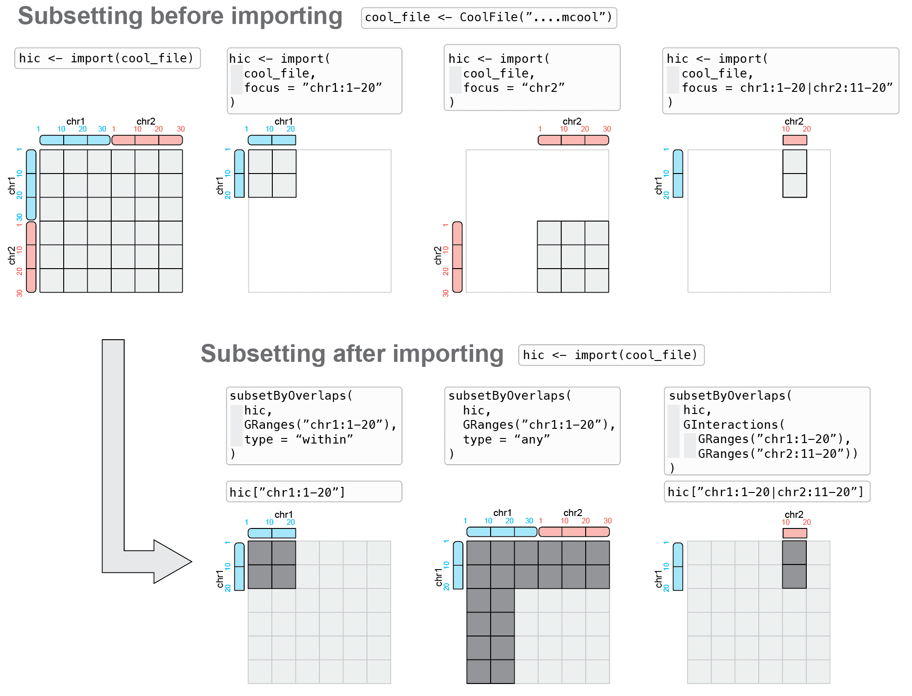

# 3  Manipulating Hi-C data in R

> **NOTE:**
>
> ``` downlit
> library(ggplot2)
> library(GenomicRanges)
> ##  Loading required package: stats4
> ##  Loading required package: BiocGenerics
> ##  Loading required package: generics
> ##  
> ##  Attaching package: 'generics'
> ##  The following objects are masked from 'package:base':
> ##  
> ##      as.difftime, as.factor, as.ordered, intersect, is.element,
> ##      setdiff, setequal, union
> ##  
> ##  Attaching package: 'BiocGenerics'
> ##  The following objects are masked from 'package:stats':
> ##  
> ##      IQR, mad, sd, var, xtabs
> ##  The following object is masked from 'package:utils':
> ##  
> ##      data
> ##  The following objects are masked from 'package:base':
> ##  
> ##      Filter, Find, Map, Position, Reduce, anyDuplicated, aperm,
> ##      append, as.data.frame, basename, cbind, colnames, dirname,
> ##      do.call, duplicated, eval, evalq, get, grep, grepl, is.unsorted,
> ##      lapply, mapply, match, mget, order, paste, pmax, pmax.int, pmin,
> ##      pmin.int, rank, rbind, rownames, sapply, saveRDS, scale,
> ##      sequence, table, tapply, transform, unique, unsplit, which.max,
> ##      which.min
> ##  Loading required package: S4Vectors
> ##  
> ##  Attaching package: 'S4Vectors'
> ##  The following object is masked from 'package:utils':
> ##  
> ##      findMatches
> ##  The following objects are masked from 'package:base':
> ##  
> ##      I, expand.grid, unname
> ##  Loading required package: IRanges
> ##  Loading required package: Seqinfo
> library(InteractionSet)
> ##  Loading required package: SummarizedExperiment
> ##  Loading required package: MatrixGenerics
> ##  Loading required package: matrixStats
> ##  
> ##  Attaching package: 'MatrixGenerics'
> ##  The following objects are masked from 'package:matrixStats':
> ##  
> ##      colAlls, colAnyNAs, colAnys, colAvgsPerRowSet, colCollapse,
> ##      colCounts, colCummaxs, colCummins, colCumprods, colCumsums,
> ##      colDiffs, colIQRDiffs, colIQRs, colLogSumExps, colMadDiffs,
> ##      colMads, colMaxs, colMeans2, colMedians, colMins, colOrderStats,
> ##      colProds, colQuantiles, colRanges, colRanks, colSdDiffs, colSds,
> ##      colSums2, colTabulates, colVarDiffs, colVars, colWeightedMads,
> ##      colWeightedMeans, colWeightedMedians, colWeightedSds,
> ##      colWeightedVars, rowAlls, rowAnyNAs, rowAnys, rowAvgsPerColSet,
> ##      rowCollapse, rowCounts, rowCummaxs, rowCummins, rowCumprods,
> ##      rowCumsums, rowDiffs, rowIQRDiffs, rowIQRs, rowLogSumExps,
> ##      rowMadDiffs, rowMads, rowMaxs, rowMeans2, rowMedians, rowMins,
> ##      rowOrderStats, rowProds, rowQuantiles, rowRanges, rowRanks,
> ##      rowSdDiffs, rowSds, rowSums2, rowTabulates, rowVarDiffs,
> ##      rowVars, rowWeightedMads, rowWeightedMeans, rowWeightedMedians,
> ##      rowWeightedSds, rowWeightedVars
> ##  Loading required package: Biobase
> ##  Welcome to Bioconductor
> ##  
> ##      Vignettes contain introductory material; view with
> ##      'browseVignettes()'. To cite Bioconductor, see
> ##      'citation("Biobase")', and for packages 'citation("pkgname")'.
> ##  
> ##  Attaching package: 'Biobase'
> ##  The following object is masked from 'package:MatrixGenerics':
> ##  
> ##      rowMedians
> ##  The following objects are masked from 'package:matrixStats':
> ##  
> ##      anyMissing, rowMedians
> library(HiCExperiment)
> ##  Consider using the `HiContacts` package to perform advanced genomic operations 
> ##  on `HiCExperiment` objects.
> ##  
> ##  Read "Orchestrating Hi-C analysis with Bioconductor" online book to learn more:
> ##  https://js2264.github.io/OHCA/
> ##  
> ##  Attaching package: 'HiCExperiment'
> ##  The following object is masked from 'package:SummarizedExperiment':
> ##  
> ##      metadata<-
> ##  The following object is masked from 'package:S4Vectors':
> ##  
> ##      metadata<-
> ##  The following object is masked from 'package:ggplot2':
> ##  
> ##      resolution
> library(HiContactsData)
> ##  Loading required package: ExperimentHub
> ##  Loading required package: AnnotationHub
> ##  Loading required package: BiocFileCache
> ##  Loading required package: dbplyr
> ##  OpenTelemetry error: there is no package called 'otelsdk'
> ##  OpenTelemetry error: there is no package called 'otelsdk'
> ##  
> ##  Attaching package: 'AnnotationHub'
> ##  The following object is masked from 'package:Biobase':
> ##  
> ##      cache
> ```

> **NOTE:**
>
> This chapter focuses on:
>
> - Modifying information associated with an existing `HiCExperiment` object
> - Subsetting a `HiCExperiment` object
> - Coercing a `HiCExperiment` object in a base data structure

> **IMPORTANT:**
>
> - An `HiCExperiment` object allows random access parsing of a disk-stored contact matrix.
> - An `HiCExperiment` object operates by wrapping together (1) a `ContactFile` (i.e. a connection to a disk-stored data file) and (2) a `GInteractions` generated by parsing the data file.

> **WARNING:**
>
> - Creating a connection to a disk-stored contact matrix:
>
> ``` downlit
> # coolf <- "<path-to-disk-stored-contact-matrix.cool>"
> coolf <- HiContactsData('yeast_wt', 'mcool')
> ##  see ?HiContactsData and browseVignettes('HiContactsData') for documentation
> ##  loading from cache
> cf <- CoolFile(coolf)
> availableResolutions(cf)
> ##  resolutions(5): 1000 2000 4000 8000 16000
> ##  
>
> availableChromosomes(cf)
> ##  Seqinfo object with 16 sequences from an unspecified genome:
> ##    seqnames seqnames seqlengths isCircular genome
> ##    1               I     230218       <NA>   <NA>
> ##    2              II     813184       <NA>   <NA>
> ##    3             III     316620       <NA>   <NA>
> ##    4              IV    1531933       <NA>   <NA>
> ##    5               V     576874       <NA>   <NA>
> ##    ...           ...        ...        ...    ...
> ##    12            XII    1078177       <NA>   <NA>
> ##    13           XIII     924431       <NA>   <NA>
> ##    14            XIV     784333       <NA>   <NA>
> ##    15             XV    1091291       <NA>   <NA>
> ##    16            XVI     948066       <NA>   <NA>
> ```
>
> - Importing a contact matrix over a specific genomic location, at a given resolution:
>
> ``` downlit
> hic <- import(cf, focus = 'II:10000-50000', resolution = 4000)
> hic
> ##  `HiCExperiment` object with 10,801 contacts over 11 regions 
> ##  -------
> ##  fileName: "/opt/R-cache/R/ExperimentHub/15057bb43fd_7752" 
> ##  focus: "II:10,000-50,000" 
> ##  resolutions(5): 1000 2000 4000 8000 16000
> ##  active resolution: 4000 
> ##  interactions: 45 
> ##  scores(2): count balanced 
> ##  topologicalFeatures: compartments(0) borders(0) loops(0) viewpoints(0) 
> ##  pairsFile: N/A 
> ##  metadata(0):
> ```
>
> - Recovering genomic interactions stored in a `HiCExperiment`:
>
> ``` downlit
> interactions(hic)
> ##  GInteractions object with 45 interactions and 4 metadata columns:
> ##         seqnames1     ranges1     seqnames2     ranges2 |   bin_id1   bin_id2
> ##             <Rle>   <IRanges>         <Rle>   <IRanges> | <numeric> <numeric>
> ##     [1]        II 12001-16000 ---        II 12001-16000 |        61        61
> ##     [2]        II 12001-16000 ---        II 16001-20000 |        61        62
> ##     [3]        II 12001-16000 ---        II 20001-24000 |        61        63
> ##     [4]        II 12001-16000 ---        II 24001-28000 |        61        64
> ##     [5]        II 12001-16000 ---        II 28001-32000 |        61        65
> ##     ...       ...         ... ...       ...         ... .       ...       ...
> ##    [41]        II 36001-40000 ---        II 40001-44000 |        67        68
> ##    [42]        II 36001-40000 ---        II 44001-48000 |        67        69
> ##    [43]        II 40001-44000 ---        II 40001-44000 |        68        68
> ##    [44]        II 40001-44000 ---        II 44001-48000 |        68        69
> ##    [45]        II 44001-48000 ---        II 44001-48000 |        69        69
> ##             count  balanced
> ##         <numeric> <numeric>
> ##     [1]       213  0.249303
> ##     [2]       673  0.449271
> ##     [3]       325  0.210001
> ##     [4]       137  0.125732
> ##     [5]        77  0.106917
> ##     ...       ...       ...
> ##    [41]       941  0.358860
> ##    [42]       275  0.114972
> ##    [43]       675  0.253868
> ##    [44]       497  0.204920
> ##    [45]       295  0.133344
> ##    -------
> ##    regions: 11 ranges and 4 metadata columns
> ##    seqinfo: 16 sequences from an unspecified genome
> ```

> **TIP:**
>
> To demonstrate how to manipulate a `HiCExperiment` object, we will create an `HiCExperiment` object from an example `.cool` file provided in the `HiContactsData` package.
>
> ``` downlit
> library(HiCExperiment)
> library(HiContactsData)
>
> # ---- This downloads an example `.mcool` file and caches it locally 
> coolf <- HiContactsData('yeast_wt', 'mcool')
> ##  see ?HiContactsData and browseVignettes('HiContactsData') for documentation
> ##  loading from cache
>
> # ---- This creates a connection to the disk-stored `.mcool` file
> cf <- CoolFile(coolf)
> cf
> ##  CoolFile object
> ##  .mcool file: /opt/R-cache/R/ExperimentHub/15057bb43fd_7752 
> ##  resolution: 1000 
> ##  pairs file: 
> ##  metadata(0):
>
> # ---- This imports contacts from the long arm of chromosome `II`, at resolution `2000`
> hic <- import(cf, focus = 'II:300001-813184', resolution = 2000)
> hic
> ##  `HiCExperiment` object with 306,212 contacts over 257 regions 
> ##  -------
> ##  fileName: "/opt/R-cache/R/ExperimentHub/15057bb43fd_7752" 
> ##  focus: "II:300,001-813,184" 
> ##  resolutions(5): 1000 2000 4000 8000 16000
> ##  active resolution: 2000 
> ##  interactions: 18513 
> ##  scores(2): count balanced 
> ##  topologicalFeatures: compartments(0) borders(0) loops(0) viewpoints(0) 
> ##  pairsFile: N/A 
> ##  metadata(0):
> ```

## 3.1 Subsetting a contact matrix

Two entirely different approaches are possible to subset of a Hi-C contact matrix:

- **Subsetting before importing**: leveraging random access to a **disk-stored** contact matrix to **only import interactions overlapping with a genomic locus of interest**.

- **Subsetting after importing**: parsing the **entire contact matrix** in memory, and **subsequently** subset interactions overlapping with a genomic locus of interest.



### 3.1.1 Subsetting **before** import: with `focus`

Specifying a `focus` **when** importing a dataset in R (i.e. `"Subset first, then parse"`) is generally the recommended approach to import Hi-C data in R.

The `focus` argument can be set when `import`ing a `ContactFile` in R, as follows:

``` downlit
## This code is not evaluated
## Change `focus = "..."` accordingly (see below)
import(cf, focus = "...")
```

This ensures that only the needed data is parsed in R, reducing memory load and accelerating the import. Thus, this should be the preferred way of parsing `HiCExperiment` data, as disk-stored contact matrices allow **efficient random access to indexed data**.

`focus` can be any of the following string types:

``` downlit
#   "II"                                  --> import contacts over an entire chromosome
#   "II:300001-800000"                    --> import on-diagonal contacts within a chromosome
#   "II:300001-400000|II:600001-700000"   --> import off-diagonal contacts within a chromosome
#   "II|III"                              --> import contacts between two chromosomes
#   "II:300001-800000|V:1-500000"         --> import contacts between segments of two chromosomes
```

> **IMPORTANT:**
>
> - Subsetting to a specific **on-diagonal** genomic location using standard UCSC coordinates query:
>
> ``` downlit
> import(cf, focus = 'II:300001-800000', resolution = 2000)
> ##  `HiCExperiment` object with 301,018 contacts over 250 regions 
> ##  -------
> ##  fileName: "/opt/R-cache/R/ExperimentHub/15057bb43fd_7752" 
> ##  focus: "II:300,001-800,000" 
> ##  resolutions(5): 1000 2000 4000 8000 16000
> ##  active resolution: 2000 
> ##  interactions: 17974 
> ##  scores(2): count balanced 
> ##  topologicalFeatures: compartments(0) borders(0) loops(0) viewpoints(0) 
> ##  pairsFile: N/A 
> ##  metadata(0):
> ```
>
> - Subsetting to a specific **off-diagonal** genomic location using pairs of coordinates query:
>
> ``` downlit
> import(cf, focus = 'II:300001-400000|II:600001-700000', resolution = 2000)
> ##  `HiCExperiment` object with 402 contacts over 100 regions 
> ##  -------
> ##  fileName: "/opt/R-cache/R/ExperimentHub/15057bb43fd_7752" 
> ##  focus: "II:300001-400000|II:600001-700000" 
> ##  resolutions(5): 1000 2000 4000 8000 16000
> ##  active resolution: 2000 
> ##  interactions: 357 
> ##  scores(2): count balanced 
> ##  topologicalFeatures: compartments(0) borders(0) loops(0) viewpoints(0) 
> ##  pairsFile: N/A 
> ##  metadata(0):
> ```
>
> - Subsetting interactions to retain those constrained within a single chromosome:
>
> ``` downlit
> import(cf, focus = 'II', resolution = 2000)
> ##  `HiCExperiment` object with 471,364 contacts over 407 regions 
> ##  -------
> ##  fileName: "/opt/R-cache/R/ExperimentHub/15057bb43fd_7752" 
> ##  focus: "II" 
> ##  resolutions(5): 1000 2000 4000 8000 16000
> ##  active resolution: 2000 
> ##  interactions: 34063 
> ##  scores(2): count balanced 
> ##  topologicalFeatures: compartments(0) borders(0) loops(0) viewpoints(0) 
> ##  pairsFile: N/A 
> ##  metadata(0):
> ```
>
> - Subsetting interactions to retain those between two chromosomes:
>
> ``` downlit
> import(cf, focus = 'II|III', resolution = 2000)
> ##  `HiCExperiment` object with 9,092 contacts over 566 regions 
> ##  -------
> ##  fileName: "/opt/R-cache/R/ExperimentHub/15057bb43fd_7752" 
> ##  focus: "II|III" 
> ##  resolutions(5): 1000 2000 4000 8000 16000
> ##  active resolution: 2000 
> ##  interactions: 7438 
> ##  scores(2): count balanced 
> ##  topologicalFeatures: compartments(0) borders(0) loops(0) viewpoints(0) 
> ##  pairsFile: N/A 
> ##  metadata(0):
> ```
>
> - Subsetting interactions to retain those between parts of two chromosomes:
>
> ``` downlit
> import(cf, focus = 'II:300001-800000|V:1-500000', resolution = 2000)
> ##  `HiCExperiment` object with 7,147 contacts over 500 regions 
> ##  -------
> ##  fileName: "/opt/R-cache/R/ExperimentHub/15057bb43fd_7752" 
> ##  focus: "II:300001-800000|V:1-500000" 
> ##  resolutions(5): 1000 2000 4000 8000 16000
> ##  active resolution: 2000 
> ##  interactions: 6523 
> ##  scores(2): count balanced 
> ##  topologicalFeatures: compartments(0) borders(0) loops(0) viewpoints(0) 
> ##  pairsFile: N/A 
> ##  metadata(0):
> ```

### 3.1.2 Subsetting **after** import

It may sometimes be desirable to import a full dataset from disk first, and **only then** perform in-memory subsetting of the `HiCExperiment` object (i.e. `"Parse first, then subset"`). **This is for example necessary when the end user aims to investigate subsets of interactions across a large number of different areas of a contact matrix.**

Several strategies are possible to allow subsetting of imported data, either with `subsetByOverlaps` or `[`.

#### 3.1.2.1 `subsetByOverlaps(<HiCExperiment>, <GRanges>)`

`subsetByOverlaps` can take a `HiCExperiment` as a `query` and a `GRanges` as a query. In this case, the `GRanges` is used to extract a subset of a `HiCExperiment` **constrained** within a specific genomic location.

``` downlit
telomere <- GRanges("II:700001-813184")
subsetByOverlaps(hic, telomere) |> interactions()
##  GInteractions object with 1540 interactions and 4 metadata columns:
##           seqnames1       ranges1     seqnames2       ranges2 |   bin_id1
##               <Rle>     <IRanges>         <Rle>     <IRanges> | <numeric>
##       [1]        II 700001-702000 ---        II 700001-702000 |       466
##       [2]        II 700001-702000 ---        II 702001-704000 |       466
##       [3]        II 700001-702000 ---        II 704001-706000 |       466
##       [4]        II 700001-702000 ---        II 706001-708000 |       466
##       [5]        II 700001-702000 ---        II 708001-710000 |       466
##       ...       ...           ... ...       ...           ... .       ...
##    [1536]        II 804001-806000 ---        II 810001-812000 |       518
##    [1537]        II 806001-808000 ---        II 806001-808000 |       519
##    [1538]        II 806001-808000 ---        II 808001-810000 |       519
##    [1539]        II 806001-808000 ---        II 810001-812000 |       519
##    [1540]        II 808001-810000 ---        II 808001-810000 |       520
##             bin_id2     count  balanced
##           <numeric> <numeric> <numeric>
##       [1]       466        30 0.0283618
##       [2]       467       145 0.0709380
##       [3]       468       124 0.0704979
##       [4]       469        59 0.0510221
##       [5]       470        59 0.0384004
##       ...       ...       ...       ...
##    [1536]       521         1       NaN
##    [1537]       519        15 0.0560633
##    [1538]       520        25       NaN
##    [1539]       521         1       NaN
##    [1540]       520        10       NaN
##    -------
##    regions: 57 ranges and 4 metadata columns
##    seqinfo: 16 sequences from an unspecified genome
```

By default, `subsetByOverlaps(hic, telomere)` will only recover interactions **constrained** within `telomere`, i.e. interactions for which both ends are in `telomere`.

Alternatively, `type = "any"` can be specified to get all interactions with at least one of their anchors within `telomere`.

``` downlit
subsetByOverlaps(hic, telomere, type = "any") |> interactions()
##  GInteractions object with 6041 interactions and 4 metadata columns:
##           seqnames1       ranges1     seqnames2       ranges2 |   bin_id1
##               <Rle>     <IRanges>         <Rle>     <IRanges> | <numeric>
##       [1]        II 300001-302000 ---        II 702001-704000 |       266
##       [2]        II 300001-302000 ---        II 704001-706000 |       266
##       [3]        II 300001-302000 ---        II 768001-770000 |       266
##       [4]        II 300001-302000 ---        II 784001-786000 |       266
##       [5]        II 302001-304000 ---        II 740001-742000 |       267
##       ...       ...           ... ...       ...           ... .       ...
##    [6037]        II 804001-806000 ---        II 810001-812000 |       518
##    [6038]        II 806001-808000 ---        II 806001-808000 |       519
##    [6039]        II 806001-808000 ---        II 808001-810000 |       519
##    [6040]        II 806001-808000 ---        II 810001-812000 |       519
##    [6041]        II 808001-810000 ---        II 808001-810000 |       520
##             bin_id2     count    balanced
##           <numeric> <numeric>   <numeric>
##       [1]       467         1 0.000590999
##       [2]       468         1 0.000686799
##       [3]       500         1 0.000728215
##       [4]       508         1 0.000923092
##       [5]       486         1 0.000382222
##       ...       ...       ...         ...
##    [6037]       521         1         NaN
##    [6038]       519        15   0.0560633
##    [6039]       520        25         NaN
##    [6040]       521         1         NaN
##    [6041]       520        10         NaN
##    -------
##    regions: 257 ranges and 4 metadata columns
##    seqinfo: 16 sequences from an unspecified genome
```

#### 3.1.2.2 `<HiCExperiment>["..."]`

The square bracket operator `[` allows for more advanced textual queries, similarly to `focus` arguments that can be used when importing contact matrices in memory.

**This ensures that only the needed data is parsed in R, reducing memory load and accelerating the import.** Thus, this should be the preferred way of parsing `HiCExperiment` data, as disk-stored contact matrices allow efficient random access to indexed data.

The following string types can be used to subset a `HiCExperiment` object with the `[` notation:

``` downlit
#   "II"                                  --> import contacts over an entire chromosome
#   "II:300001-800000"                    --> import on-diagonal contacts within a chromosome
#   "II:300001-400000|II:600001-700000"   --> import off-diagonal contacts within a chromosome
#   "II|III"                              --> import contacts between two chromosomes
#   "II:300001-800000|V:1-500000"         --> import contacts between segments of two chromosomes
#   c("II", "III", "IV")                  --> import contacts within and between several chromosomes
```

> **IMPORTANT:**
>
> - Subsetting to a specific **on-diagonal** genomic location using standard UCSC coordinates query:
>
> ``` downlit
> hic["II:800001-813184"]
> ##  `HiCExperiment` object with 1,040 contacts over 6 regions 
> ##  -------
> ##  fileName: "/opt/R-cache/R/ExperimentHub/15057bb43fd_7752" 
> ##  focus: "II:800,001-813,184" 
> ##  resolutions(5): 1000 2000 4000 8000 16000
> ##  active resolution: 2000 
> ##  interactions: 19 
> ##  scores(2): count balanced 
> ##  topologicalFeatures: compartments(0) borders(0) loops(0) viewpoints(0) 
> ##  pairsFile: N/A 
> ##  metadata(0):
> ```
>
> - Subsetting to a specific **off-diagonal** genomic location using pairs of coordinates query:
>
> ``` downlit
> hic["II:300001-320000|II:800001-813184"]
> ##  `HiCExperiment` object with 3 contacts over 6 regions 
> ##  -------
> ##  fileName: "/opt/R-cache/R/ExperimentHub/15057bb43fd_7752" 
> ##  focus: "II:300001-320000|II:800001-813184" 
> ##  resolutions(5): 1000 2000 4000 8000 16000
> ##  active resolution: 2000 
> ##  interactions: 3 
> ##  scores(2): count balanced 
> ##  topologicalFeatures: compartments(0) borders(0) loops(0) viewpoints(0) 
> ##  pairsFile: N/A 
> ##  metadata(0):
> ```
>
> - Subsetting interactions to retain those constrained within a single chromosome:
>
> ``` downlit
> hic["II"]
> ##  `HiCExperiment` object with 306,212 contacts over 257 regions 
> ##  -------
> ##  fileName: "/opt/R-cache/R/ExperimentHub/15057bb43fd_7752" 
> ##  focus: "II" 
> ##  resolutions(5): 1000 2000 4000 8000 16000
> ##  active resolution: 2000 
> ##  interactions: 18513 
> ##  scores(2): count balanced 
> ##  topologicalFeatures: compartments(0) borders(0) loops(0) viewpoints(0) 
> ##  pairsFile: N/A 
> ##  metadata(0):
> ```
>
> - Subsetting interactions to retain those between two chromosomes:
>
> ``` downlit
> hic["II|IV"]
> ##  `HiCExperiment` object with 0 contacts over 0 regions 
> ##  -------
> ##  fileName: "/opt/R-cache/R/ExperimentHub/15057bb43fd_7752" 
> ##  focus: "II:1-813184|IV:1-1531933" 
> ##  resolutions(5): 1000 2000 4000 8000 16000
> ##  active resolution: 2000 
> ##  interactions: 0 
> ##  scores(2): count balanced 
> ##  topologicalFeatures: compartments(0) borders(0) loops(0) viewpoints(0) 
> ##  pairsFile: N/A 
> ##  metadata(0):
> ```
>
> - Subsetting interactions to retain those between segments of two chromosomes:
>
> ``` downlit
> hic["II:300001-320000|IV:1-100000"]
> ##  `HiCExperiment` object with 0 contacts over 0 regions 
> ##  -------
> ##  fileName: "/opt/R-cache/R/ExperimentHub/15057bb43fd_7752" 
> ##  focus: "II:300001-320000|IV:1-100000" 
> ##  resolutions(5): 1000 2000 4000 8000 16000
> ##  active resolution: 2000 
> ##  interactions: 0 
> ##  scores(2): count balanced 
> ##  topologicalFeatures: compartments(0) borders(0) loops(0) viewpoints(0) 
> ##  pairsFile: N/A 
> ##  metadata(0):
> ```
>
> - Subsetting interactions to retain those constrained within several chromosomes:
>
> ``` downlit
> hic[c('II', 'III', 'IV')]
> ##  `HiCExperiment` object with 306,212 contacts over 257 regions 
> ##  -------
> ##  fileName: "/opt/R-cache/R/ExperimentHub/15057bb43fd_7752" 
> ##  focus: "II, III, IV" 
> ##  resolutions(5): 1000 2000 4000 8000 16000
> ##  active resolution: 2000 
> ##  interactions: 18513 
> ##  scores(2): count balanced 
> ##  topologicalFeatures: compartments(0) borders(0) loops(0) viewpoints(0) 
> ##  pairsFile: N/A 
> ##  metadata(0):
> ```
>
> Some notes:
>
> - This last example (subsetting for a vector of several chromosomes) is the only scenario for which `[`-based in-memory subsetting of pre-imported data is the only way to go, as such subsetting is not possible with `focus` from disk-stored data.
> - All the other `[` subsetting scenarii illustrated above can be achieved more efficiently using the `focus` argument when `import`ing data into a `HiCExperiment` object.
> - However, keep in mind that subsetting preserves extra data, e.g. added `scores`, `topologicalFeatures`, `metadata` or `pairsFile`, whereas this information is lost using `focus` with `import`.

### 3.1.3 Zooming on a `HiCExperiment`

“Zooming” refers to dynamically changing the **resolution** of a `HiCExperiment`. By `zoom`ing a `HiCExperiment`, one can refine or coarsen the contact matrix. This operation takes a`ContactFile` and `focus` from an existing `HiCExperiment` input and re-generates a new `HiCExperiment` with updated `resolution`, `interactions` and `scores`. Note that `zoom` will preserve existing `metadata`, `topologicalFeatures` and `pairsFile` information.

``` downlit
hic
##  `HiCExperiment` object with 306,212 contacts over 257 regions 
##  -------
##  fileName: "/opt/R-cache/R/ExperimentHub/15057bb43fd_7752" 
##  focus: "II:300,001-813,184" 
##  resolutions(5): 1000 2000 4000 8000 16000
##  active resolution: 2000 
##  interactions: 18513 
##  scores(2): count balanced 
##  topologicalFeatures: compartments(0) borders(0) loops(0) viewpoints(0) 
##  pairsFile: N/A 
##  metadata(0):

zoom(hic, 4000)
##  `HiCExperiment` object with 306,212 contacts over 129 regions 
##  -------
##  fileName: "/opt/R-cache/R/ExperimentHub/15057bb43fd_7752" 
##  focus: "II:300,001-813,184" 
##  resolutions(5): 1000 2000 4000 8000 16000
##  active resolution: 4000 
##  interactions: 6800 
##  scores(2): count balanced 
##  topologicalFeatures: compartments(0) borders(0) loops(0) viewpoints(0) 
##  pairsFile: N/A 
##  metadata(0):

zoom(hic, 1000)
##  `HiCExperiment` object with 306,212 contacts over 514 regions 
##  -------
##  fileName: "/opt/R-cache/R/ExperimentHub/15057bb43fd_7752" 
##  focus: "II:300,001-813,184" 
##  resolutions(5): 1000 2000 4000 8000 16000
##  active resolution: 1000 
##  interactions: 44363 
##  scores(2): count balanced 
##  topologicalFeatures: compartments(0) borders(0) loops(0) viewpoints(0) 
##  pairsFile: N/A 
##  metadata(0):
```

> **NOTE:**
>
> The sum of raw counts do not change after `zoom`ing, however the number of individual `interactions` and `regions` changes.
>
> ``` downlit
> length(hic)
> ##  [1] 18513
> length(zoom(hic, 1000))
> ##  [1] 44363
> length(zoom(hic, 4000))
> ##  [1] 6800
> sum(scores(hic, "count"))
> ##  [1] 306212
> sum(scores(zoom(hic, 1000), "count"))
> ##  [1] 306212
> sum(scores(zoom(hic, 4000), "count"))
> ##  [1] 306212
> ```

> **IMPORTANT:**
>
> - `zoom` does not change the `focus`! It only affects the `resolution` (and consequently, the `interactions`).
> - `zoom` will only work for multi-resolution contact matrices, e.g. `.mcool` or `.hic`.

## 3.2 Updating an `HiCExperiment` object

> **TIP:**
>
> - `fileName(hic)`: ⛔️ (obtained from disk-stored file)
> - `focus(hic)`: 🤔 (see [subsetting section](#subsetting-methods))
> - `resolutions(hic)`: ⛔️ (obtained from disk-stored file)
> - `resolution(hic)`: 🤔 (see [zooming section](#zooming-on-a-hicexperiment))
> - `interactions(hic)`: ⛔️ (obtained from disk-stored file)
> - `scores(hic)`: ✅
> - `topologicalFeatures(hic)`: ✅
> - `pairsFile(hic)`: ✅
> - `metadata(hic)`: ✅

### 3.2.1 Immutable slots

An `HiCExperiment` object acts as an interface exposing disk-stored data. This implies that the `fileName` slot itself is immutable (i.e. **cannot** be changed). This should be obvious, as a `HiCExperiment` *has to* be associated with a disk-stored contact matrix to properly function (except in some advanced cases developed in next chapters).

For this reason, methods to manually modify `interactions` and `resolutions` slots are also **not** exposed in the `HiCExperiment` package.

A corollary of this is that the associated `regions` and `anchors` of an `HiCExperiment` should **not** be modified by hand either, since they are directly linked to `interactions`.

### 3.2.2 Mutable slots

That being said, `HiCExperiment` objects are flexible and can be partially modified in memory without having to change/overwrite the original, disk-stored contact matrix.

Several `slots` can be modified in memory: `slots`, `topologicalFeatures`, `pairsFile` and `metadata`.

#### 3.2.2.1 `scores`

We have seen in the previous chapter that scores are stored in a `list` and are available using the `scores` function.

``` downlit
scores(hic)
##  List of length 2
##  names(2): count balanced

head(scores(hic, "count"))
##  [1]  7 92 75 61 38 43

head(scores(hic, "balanced"))
##  [1] 0.009657438 0.076622340 0.054101992 0.042940512 0.040905212 0.029293930
```

Extra scores can be added to this list, e.g. to describe the “expected” interaction frequency for each interaction stored in the `HiCExperiment` object). This can be achieved using the `scores()<-` function.

``` downlit
scores(hic, "random") <- runif(length(hic))

scores(hic)
##  List of length 3
##  names(3): count balanced random

head(scores(hic, "random"))
##  [1] 0.8146293 0.3307768 0.6607427 0.3224511 0.2932789 0.6150977
```

#### 3.2.2.2 `topologicalFeatures`

The end-user can create additional `topologicalFeatures` or modify the existing ones using the `topologicalFeatures()<-` function.

``` downlit
topologicalFeatures(hic, 'CTCF') <- GRanges(c(
    "II:340-352", 
    "II:3520-3532", 
    "II:7980-7992", 
    "II:9240-9252" 
))
topologicalFeatures(hic, 'CTCF')
##  GRanges object with 4 ranges and 0 metadata columns:
##        seqnames    ranges strand
##           <Rle> <IRanges>  <Rle>
##    [1]       II   340-352      *
##    [2]       II 3520-3532      *
##    [3]       II 7980-7992      *
##    [4]       II 9240-9252      *
##    -------
##    seqinfo: 1 sequence from an unspecified genome; no seqlengths

topologicalFeatures(hic, 'loops') <- GInteractions(
    topologicalFeatures(hic, 'CTCF')[rep(1:3, each = 3)],
    topologicalFeatures(hic, 'CTCF')[rep(1:3, 3)]
)
topologicalFeatures(hic, 'loops')
##  GInteractions object with 9 interactions and 0 metadata columns:
##        seqnames1   ranges1     seqnames2   ranges2
##            <Rle> <IRanges>         <Rle> <IRanges>
##    [1]        II   340-352 ---        II   340-352
##    [2]        II   340-352 ---        II 3520-3532
##    [3]        II   340-352 ---        II 7980-7992
##    [4]        II 3520-3532 ---        II   340-352
##    [5]        II 3520-3532 ---        II 3520-3532
##    [6]        II 3520-3532 ---        II 7980-7992
##    [7]        II 7980-7992 ---        II   340-352
##    [8]        II 7980-7992 ---        II 3520-3532
##    [9]        II 7980-7992 ---        II 7980-7992
##    -------
##    regions: 3 ranges and 0 metadata columns
##    seqinfo: 1 sequence from an unspecified genome; no seqlengths

hic
##  `HiCExperiment` object with 306,212 contacts over 257 regions 
##  -------
##  fileName: "/opt/R-cache/R/ExperimentHub/15057bb43fd_7752" 
##  focus: "II:300,001-813,184" 
##  resolutions(5): 1000 2000 4000 8000 16000
##  active resolution: 2000 
##  interactions: 18513 
##  scores(3): count balanced random 
##  topologicalFeatures: compartments(0) borders(0) loops(9) viewpoints(0) CTCF(4) 
##  pairsFile: N/A 
##  metadata(0):
```

All these objects can be used in `*Overlap` methods, as they all extend the `GRanges` class of objects.

``` downlit
# ---- This counts the number of times `CTCF` anchors are being used in the 
#      `loops` `GInteractions` object
countOverlaps(
    query = topologicalFeatures(hic, 'CTCF'), 
    subject = topologicalFeatures(hic, 'loops')
)
##  [1] 5 5 5 0
```

#### 3.2.2.3 `pairsFile`

If `pairsFile` is not specified when importing the `ContactFile` into a `HiCExperiment` object, one can add it later.

``` downlit
pairsf <- HiContactsData('yeast_wt', 'pairs.gz')
##  see ?HiContactsData and browseVignettes('HiContactsData') for documentation
##  loading from cache
```

``` downlit
pairsFile(hic) <- pairsf
hic
##  `HiCExperiment` object with 306,212 contacts over 257 regions 
##  -------
##  fileName: "/opt/R-cache/R/ExperimentHub/15057bb43fd_7752" 
##  focus: "II:300,001-813,184" 
##  resolutions(5): 1000 2000 4000 8000 16000
##  active resolution: 2000 
##  interactions: 18513 
##  scores(3): count balanced random 
##  topologicalFeatures: compartments(0) borders(0) loops(9) viewpoints(0) CTCF(4) 
##  pairsFile: /opt/R-cache/R/ExperimentHub/15031c16370_7753 
##  metadata(0):
```

#### 3.2.2.4 `metadata`

Metadata associated with a `HiCExperiment` can be updated at any point.

``` downlit
metadata(hic) <- list(
    info = "HiCExperiment created from an example .mcool file from `HiContactsData`", 
    date = date()
)
metadata(hic)
##  $info
##  [1] "HiCExperiment created from an example .mcool file from `HiContactsData`"
##  
##  $date
##  [1] "Mon Oct  5 21:41:18 2026"
```

## 3.3 Coercing `HiCExperiment` objects

Convenient coercing functions exist to transform data stored as a `HiCExperiment` into another class.

- [`as.matrix()`](https://rdrr.io/r/base/matrix.html): allows to coerce the `HiCExperiment` into a `sparse` or `dense` matrix (using the `sparse` logical argument, `TRUE` by default) and choosing specific `scores` of interest (using the `use.scores` argument, `"balanced"` by default).

``` downlit
# ----- `as.matrix` coerces a `HiCExperiment` into a dense `matrix` by default 
as.matrix(hic) |> class()
##  [1] "matrix" "array"

as.matrix(hic) |> dim()
##  [1] 257 257

# ----- One can specify which scores should be used when coercing into a matrix
as.matrix(hic, use.scores = "balanced")[1:5, 1:5]
##              [,1]       [,2]       [,3]       [,4]       [,5]
##  [1,] 0.009657438 0.07662234 0.05410199 0.04294051 0.04090521
##  [2,] 0.076622340 0.05128277 0.09841564 0.06926737 0.05263611
##  [3,] 0.054101992 0.09841564 0.05657589 0.08723160 0.07316890
##  [4,] 0.042940512 0.06926737 0.08723160 0.03699543 0.08403496
##  [5,] 0.040905212 0.05263611 0.07316890 0.08403496 0.04787415

as.matrix(hic, use.scores = "count")[1:5, 1:5]
##       [,1] [,2] [,3] [,4] [,5]
##  [1,]    7   92   75   61   38
##  [2,]   92  102  226  163   81
##  [3,]   75  226  150  237  130
##  [4,]   61  163  237  103  153
##  [5,]   38   81  130  153   57

# ----- If needed, one can coerce a HiCExperiment into a sparse matrix
as.matrix(hic, use.scores = "count", sparse = TRUE)[1:5, 1:5]
##  5 x 5 sparse Matrix of class "dgTMatrix"
##                         
##  [1,]  7  92  75  61  38
##  [2,] 92 102 226 163  81
##  [3,] 75 226 150 237 130
##  [4,] 61 163 237 103 153
##  [5,] 38  81 130 153  57
```

- [`as.data.frame()`](https://rdrr.io/pkg/BiocGenerics/man/as.data.frame.html): simply coercing `interactions` into a rectangular data frame

``` downlit
as.data.frame(hic) |> head()
##    seqnames1 start1   end1 width1 strand1 bin_id1    weight1 center1
##  1        II 300001 302000   2000       *     266 0.03714342  301000
##  2        II 300001 302000   2000       *     266 0.03714342  301000
##  3        II 300001 302000   2000       *     266 0.03714342  301000
##  4        II 300001 302000   2000       *     266 0.03714342  301000
##  5        II 300001 302000   2000       *     266 0.03714342  301000
##  6        II 300001 302000   2000       *     266 0.03714342  301000
##    seqnames2 start2   end2 width2 strand2 bin_id2    weight2 center2 count
##  1        II 300001 302000   2000       *     266 0.03714342  301000     7
##  2        II 302001 304000   2000       *     267 0.02242258  303000    92
##  3        II 304001 306000   2000       *     268 0.01942093  305000    75
##  4        II 306001 308000   2000       *     269 0.01895202  307000    61
##  5        II 308001 310000   2000       *     270 0.02898098  309000    38
##  6        II 310001 312000   2000       *     271 0.01834118  311000    43
##       balanced    random
##  1 0.009657438 0.8146293
##  2 0.076622340 0.3307768
##  3 0.054101992 0.6607427
##  4 0.042940512 0.3224511
##  5 0.040905212 0.2932789
##  6 0.029293930 0.6150977
```

> **WARNING:**
>
> These coercing methods only operate on `interactions` and `scores`, and discard all other information, e.g. regarding genomic `regions`, available `resolutions`, associated `metadata`, `pairsFile` or `topologicalFeatures`.

# Session info

> **NOTE:**
>
> ``` downlit
> sessioninfo::session_info(include_base = TRUE)
> ##  ─ Session info ────────────────────────────────────────────────────────────
> ##   setting  value
> ##   version  R version 4.6.1 (2026-06-24)
> ##   os       Ubuntu 24.04.4 LTS
> ##   system   x86_64, linux-gnu
> ##   ui       X11
> ##   language (EN)
> ##   collate  C
> ##   ctype    en_US.UTF-8
> ##   tz       Etc/UTC
> ##   date     2026-10-05
> ##   pandoc   3.11 @ /usr/bin/ (via rmarkdown)
> ##   quarto   1.11.5 @ /usr/local/bin/quarto
> ##  
> ##  ─ Packages ────────────────────────────────────────────────────────────────
> ##   package              * version date (UTC) lib source
> ##   abind                  1.4-8   2024-09-12 [2] RSPM (R 4.6.0)
> ##   AnnotationDbi          1.75.2  2026-07-21 [2] Bioconductor 3.24 (R 4.6.1)
> ##   AnnotationHub        * 4.3.2   2026-06-30 [2] Bioconductor 3.24 (R 4.6.1)
> ##   base                 * 4.6.1   2026-09-11 [3] local
> ##   Biobase              * 2.73.2  2026-07-29 [2] Bioconductor 3.24 (R 4.6.1)
> ##   BiocBaseUtils          1.15.1  2026-05-10 [2] Bioconductor 3.24 (R 4.6.1)
> ##   BiocFileCache        * 3.3.0   2026-04-28 [2] Bioconductor 3.24 (R 4.6.1)
> ##   BiocGenerics         * 0.59.12 2026-08-11 [2] Bioconductor 3.24 (R 4.6.1)
> ##   BiocIO                 1.23.3  2026-04-29 [2] Bioconductor 3.24 (R 4.6.1)
> ##   BiocManager            1.30.27 2025-11-14 [2] CRAN (R 4.6.1)
> ##   BiocParallel           1.47.0  2026-04-28 [2] Bioconductor 3.24 (R 4.6.1)
> ##   BiocVersion            3.24.0  2026-04-28 [2] Bioconductor 3.24 (R 4.6.1)
> ##   Biostrings             2.81.9  2026-09-06 [2] Bioconductor 3.24 (R 4.6.1)
> ##   bit                    4.6.0   2025-03-06 [2] RSPM (R 4.6.0)
> ##   bit64                  4.8.6   2026-09-01 [2] RSPM (R 4.6.0)
> ##   blob                   1.3.0   2026-01-14 [2] RSPM (R 4.6.0)
> ##   cachem                 1.1.0   2024-05-16 [2] RSPM (R 4.6.0)
> ##   cli                    3.6.6   2026-04-09 [2] RSPM (R 4.6.0)
> ##   codetools              0.2-20  2024-03-31 [3] CRAN (R 4.6.1)
> ##   compiler               4.6.1   2026-09-11 [3] local
> ##   crayon                 1.5.3   2024-06-20 [2] RSPM (R 4.6.0)
> ##   curl                   8.0.0   2026-08-25 [2] RSPM (R 4.6.0)
> ##   datasets             * 4.6.1   2026-09-11 [3] local
> ##   DBI                    1.3.0   2026-02-25 [2] RSPM (R 4.6.0)
> ##   dbplyr               * 2.6.0   2026-06-17 [2] RSPM (R 4.6.0)
> ##   DelayedArray           0.39.8  2026-09-30 [2] Bioconductor 3.24 (R 4.6.1)
> ##   dichromat              2.0-1   2026-07-22 [2] RSPM (R 4.6.0)
> ##   digest                 0.6.39  2025-11-19 [2] RSPM (R 4.6.0)
> ##   dplyr                  1.2.1   2026-04-03 [2] RSPM (R 4.6.0)
> ##   evaluate               1.0.5   2025-08-27 [2] RSPM (R 4.6.0)
> ##   ExperimentHub        * 3.3.2   2026-08-12 [2] Bioconductor 3.24 (R 4.6.1)
> ##   farver                 2.1.2   2024-05-13 [2] RSPM (R 4.6.0)
> ##   fastmap                1.2.0   2024-05-15 [2] RSPM (R 4.6.0)
> ##   filelock               1.0.3   2023-12-11 [2] RSPM (R 4.6.0)
> ##   generics             * 0.1.4   2025-05-09 [2] RSPM (R 4.6.0)
> ##   GenomicRanges        * 1.65.4  2026-09-02 [2] Bioconductor 3.24 (R 4.6.1)
> ##   ggplot2              * 4.0.3   2026-04-22 [2] RSPM (R 4.6.0)
> ##   glue                   1.8.1   2026-04-17 [2] RSPM (R 4.6.0)
> ##   graphics             * 4.6.1   2026-09-11 [3] local
> ##   grDevices            * 4.6.1   2026-09-11 [3] local
> ##   grid                   4.6.1   2026-09-11 [3] local
> ##   gtable                 0.3.6   2024-10-25 [2] RSPM (R 4.6.0)
> ##   HiCExperiment        * 1.13.1  2026-10-04 [2] Bioconductor 3.24 (R 4.6.1)
> ##   HiContactsData       * 1.5.3   2026-10-05 [2] Github (js2264/HiContactsData@d5bebe7)
> ##   htmltools              0.5.9   2025-12-04 [2] RSPM (R 4.6.0)
> ##   htmlwidgets            1.6.4   2023-12-06 [2] RSPM (R 4.6.0)
> ##   httr                   1.4.9   2026-09-01 [2] RSPM (R 4.6.0)
> ##   httr2                  1.3.0   2026-07-13 [2] RSPM (R 4.6.0)
> ##   InteractionSet       * 1.41.0  2026-04-28 [2] Bioconductor 3.24 (R 4.6.1)
> ##   IRanges              * 2.47.5  2026-08-27 [2] Bioconductor 3.24 (R 4.6.1)
> ##   jsonlite               2.0.0   2025-03-27 [2] RSPM (R 4.6.0)
> ##   KEGGREST               1.53.6  2026-07-23 [2] Bioconductor 3.24 (R 4.6.1)
> ##   knitr                  1.52    2026-09-06 [2] RSPM (R 4.6.0)
> ##   lattice                0.23-1  2026-08-12 [2] RSPM (R 4.6.0)
> ##   lifecycle              1.0.5   2026-01-08 [2] RSPM (R 4.6.0)
> ##   magrittr               2.0.5   2026-04-04 [2] RSPM (R 4.6.0)
> ##   Matrix                 1.7-6   2026-07-25 [2] RSPM (R 4.6.0)
> ##   MatrixGenerics       * 1.25.0  2026-04-28 [2] Bioconductor 3.24 (R 4.6.1)
> ##   matrixStats          * 1.5.0   2025-01-07 [2] RSPM (R 4.6.0)
> ##   memoise                2.0.1   2021-11-26 [2] RSPM (R 4.6.0)
> ##   methods              * 4.6.1   2026-09-11 [3] local
> ##   otel                   0.2.0   2025-08-29 [2] RSPM (R 4.6.0)
> ##   parallel               4.6.1   2026-09-11 [3] local
> ##   pillar                 1.11.1  2025-09-17 [2] RSPM (R 4.6.0)
> ##   pkgconfig              2.0.3   2019-09-22 [2] RSPM (R 4.6.0)
> ##   png                    0.1-9   2026-03-15 [2] RSPM (R 4.6.0)
> ##   purrr                  1.2.2   2026-04-10 [2] RSPM (R 4.6.0)
> ##   R6                     2.6.1   2025-02-15 [2] RSPM (R 4.6.0)
> ##   rappdirs               0.3.4   2026-01-17 [2] RSPM (R 4.6.0)
> ##   RColorBrewer           1.1-3   2022-04-03 [2] RSPM (R 4.6.0)
> ##   Rcpp                   1.1.2   2026-07-05 [2] RSPM (R 4.6.0)
> ##   rhdf5                  2.57.18 2026-09-23 [2] Bioconductor 3.24 (R 4.6.1)
> ##   rhdf5filters           1.25.4  2026-08-06 [2] Bioconductor 3.24 (R 4.6.1)
> ##   Rhdf5lib               2.1.0   2026-04-28 [2] Bioconductor 3.24 (R 4.6.1)
> ##   rlang                  1.3.0   2026-07-05 [2] RSPM (R 4.6.0)
> ##   rmarkdown              2.32    2026-09-01 [2] RSPM (R 4.6.0)
> ##   RSQLite                3.53.3  2026-06-30 [2] RSPM (R 4.6.0)
> ##   S4Arrays               1.13.2  2026-09-30 [2] Bioconductor 3.24 (R 4.6.1)
> ##   S4Vectors            * 0.51.10 2026-09-16 [2] Bioconductor 3.24 (R 4.6.1)
> ##   S7                     0.2.2   2026-04-22 [2] RSPM (R 4.6.0)
> ##   scales                 1.4.0   2025-04-24 [2] RSPM (R 4.6.0)
> ##   Seqinfo              * 1.3.2   2026-08-27 [2] Bioconductor 3.24 (R 4.6.1)
> ##   sessioninfo            1.2.4   2026-06-04 [2] RSPM (R 4.6.0)
> ##   SparseArray            1.13.4  2026-09-30 [2] Bioconductor 3.24 (R 4.6.1)
> ##   stats                * 4.6.1   2026-09-11 [3] local
> ##   stats4               * 4.6.1   2026-09-11 [3] local
> ##   strawr                 0.0.92  2024-07-16 [2] RSPM (R 4.6.0)
> ##   SummarizedExperiment * 1.43.0  2026-04-28 [2] Bioconductor 3.24 (R 4.6.1)
> ##   tibble                 3.3.1   2026-01-11 [2] RSPM (R 4.6.0)
> ##   tidyselect             1.2.1   2024-03-11 [2] RSPM (R 4.6.0)
> ##   tools                  4.6.1   2026-09-11 [3] local
> ##   tzdb                   0.5.0   2025-03-15 [2] RSPM (R 4.6.0)
> ##   utils                * 4.6.1   2026-09-11 [3] local
> ##   vctrs                  0.7.3   2026-04-11 [2] RSPM (R 4.6.0)
> ##   vroom                  1.7.1   2026-03-31 [2] RSPM (R 4.6.0)
> ##   withr                  3.0.3   2026-06-19 [2] RSPM (R 4.6.0)
> ##   xfun                   0.61    2026-09-16 [2] RSPM (R 4.6.0)
> ##   XVector                0.53.0  2026-04-28 [2] Bioconductor 3.24 (R 4.6.1)
> ##   yaml                   2.3.12  2025-12-10 [2] RSPM (R 4.6.0)
> ##  
> ##   [1] /tmp/RtmpIHYEk6/Rinstb5256c58e
> ##   [2] /usr/local/lib/R/site-library
> ##   [3] /usr/local/lib/R/library
> ##   * ── Packages attached to the search path.
> ##  
> ##  ───────────────────────────────────────────────────────────────────────────
> ```

# References
