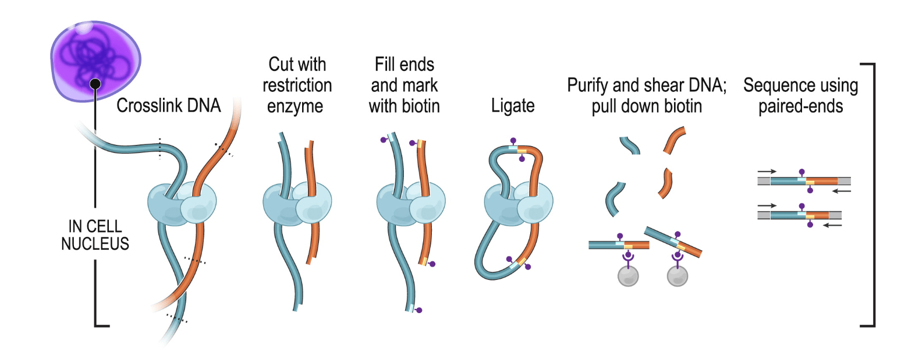
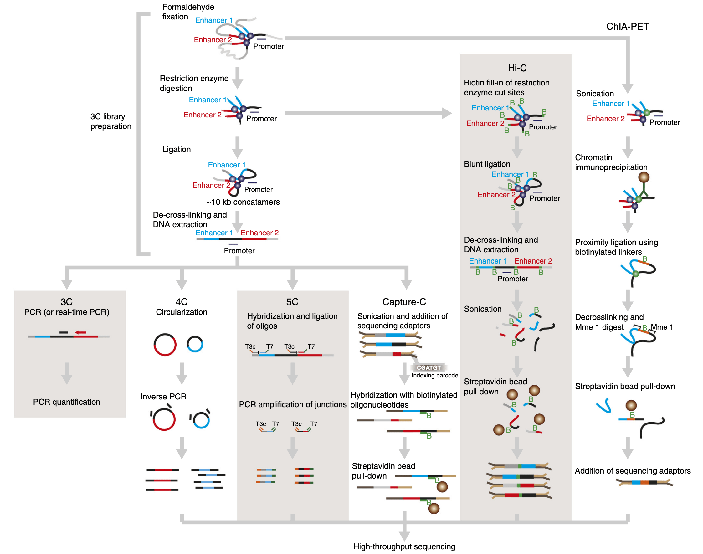
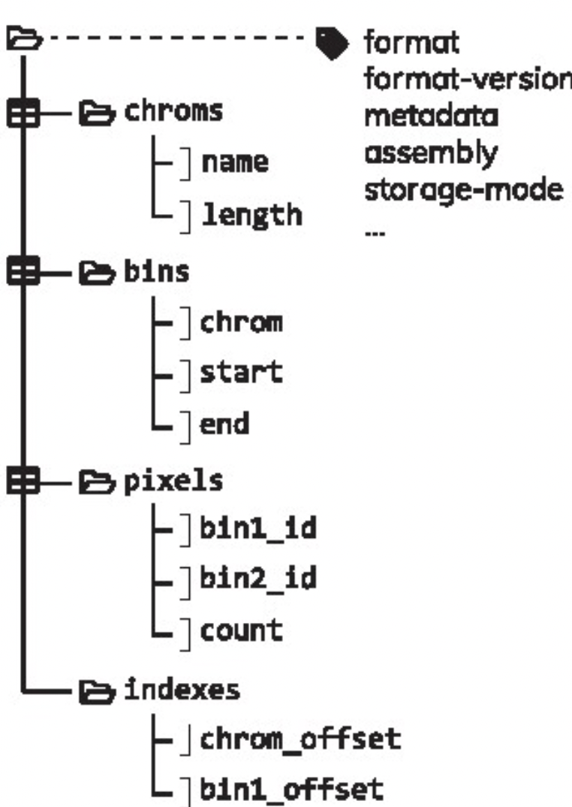
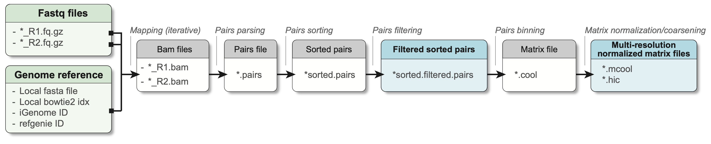

# 1  Hi-C pre-processing steps

> **NOTE:**
>
> ``` downlit
> library(HiContactsData)
> ##  Loading required package: ExperimentHub
> ##  Loading required package: BiocGenerics
> ##  Loading required package: generics
> ##  
> ##  Attaching package: 'generics'
> ##  The following objects are masked from 'package:base':
> ##  
> ##      as.difftime, as.factor, as.ordered, intersect, is.element,
> ##      setdiff, setequal, union
> ##  
> ##  Attaching package: 'BiocGenerics'
> ##  The following objects are masked from 'package:stats':
> ##  
> ##      IQR, mad, sd, var, xtabs
> ##  The following object is masked from 'package:utils':
> ##  
> ##      data
> ##  The following objects are masked from 'package:base':
> ##  
> ##      Filter, Find, Map, Position, Reduce, anyDuplicated, aperm,
> ##      append, as.data.frame, basename, cbind, colnames, dirname,
> ##      do.call, duplicated, eval, evalq, get, grep, grepl, is.unsorted,
> ##      lapply, mapply, match, mget, order, paste, pmax, pmax.int, pmin,
> ##      pmin.int, rank, rbind, rownames, sapply, saveRDS, scale,
> ##      sequence, table, tapply, transform, unique, unsplit, which.max,
> ##      which.min
> ##  Loading required package: AnnotationHub
> ##  Loading required package: BiocFileCache
> ##  Loading required package: dbplyr
> ##  OpenTelemetry error: there is no package called 'otelsdk'
> ##  OpenTelemetry error: there is no package called 'otelsdk'
> ```

> **NOTE:**
>
> This chapter introduces the reader to general Hi-C experimental and computational steps to perform the pre-processing of Hi-C. This encompasses read alignment, pairs generation and filtering and pairs binning into a contact matrix file.

## 1.1 Experimental considerations

### 1.1.1 Experimental approach

The Hi-C procedure (Lieberman-Aiden et al. ([2009](#ref-Lieberman_Aiden_2009))) stems from the clever combination of high-throughput sequencing and Chromatin Conformation Capture (3C) experimental approach (Dekker et al. ([2002](#ref-Dekker_2002))).\
In Hi-C, chromatin is crosslinked within intact nuclei and enzymatically digested (usually with one or several restriction enzymes, but Hi-C variants using MNase or DNase exist). End-repair introduces biotinylated dNTPs and is followed by religation, which generates chimeric DNA fragments consisting of genomic loci originally lying in spatial proximity, usually crosslinked to a shared protein complex. After religation, DNA fragments are sheared, biotin-containing fragments are pulled-down and converted into a sequencing library.



### 1.1.2 C variants

A number of C variants have been proposed since the publication of the original 3C method (reviewed by Davies et al. ([2017](#ref-Davies_2017))), the main ones being Capture-C and ChIA-PET (see procedure below).



Capture-C is useful to quantify interactions between a set of regulatory elements of interest. ChIA-PET, on the other hand, can identify interactions mediated by a specific protein of interest. Finally, an increasing number of Hi-C approaches rely on long-read sequencing (e.g. Deshpande et al. ([2022](#ref-Deshpande_2022)), Tavares-Cadete et al. ([2020](#ref-Tavares_Cadete_2020))) to identify clusters of 3D contacts.

### 1.1.3 Sequencing

Hi-C libraries are traditionally sequenced with short-read technology, and are by essence paired-end libraries. For this reason, the end result of the experimental side of the Hi-C consists of **two fastq files**, each one containing sequences for one extremity of the DNA fragments purified during Hi-C. These are the two files we need to move on to the computational side of Hi-C.

Fastq files are plain text files (usually compressed, with the `.gz` extension). They are generated by the sequencing machine during a sequencing run, and for Hi-C, necessarily come in pairs, generally called `*_R1.fq.gz` and `*_R2.fq.gz`.

Here is the first read listed in `sample_R1.fq.gz` file:

```
@SRR5399542.1.1 DH1DQQN1:393:H9GEWADXX:1:1101:1187:2211 length=24
CAACTTCAATACCAGCAGCAGCAA
+
CCCFFFFFHHHHHJJJJJIJJJJJ
```

And here is the first read listed in `sample_R2.fq.gz` file:

```
@SRR5399542.1.1 DH1DQQN1:393:H9GEWADXX:1:1101:1187:2211 length=24
GCTGTTGTTGTTGTTGTATTTGCA
+
@@@FFFFFFHHHHIJJIJJHIIEH
```

These two reads are the first listed in their respective file. Notice how they bear the same name (first line): **they form a pair**. The second line corresponds to the sequence read by the sequencer, the third line is a single `+` separator, and the last line indicates the per-base sequencing quality following a nebulous cypher.

## 1.2 Hi-C file formats

Two important output files are typically generated during Hi-C data pre-processing:

- A **“pairs” file**;
- A **binned “contact matrix”** file

We will now describe the structure of these different types of files. Directly jump to the [next chapter](../pages/data-representation.llms.md) if you want to know more about importing data from a contact matrix or a pairs file in R.

### 1.2.1 Pairs files

A “pairs” file (optionally, but generally filtered and sorted) is the direct output of processing Hi-C fastq files. It stores information about putative proximity contacts identified by digestion/religation, in the lossless, human-readable, indexable format: the `.pairs` format.

A `.pairs` file is organized in a `header` followed by a `body`:

- `header`: starts with `#`
  - Required entries
    - First line: `## pairs format v1.0`
    - `#columns`: column contents and ordering (e.g. `#columns: readID chr1 pos1 chr2 pos2 strand1 strand2 <column_name> <column_name> ...`)
    - `#chromsize`: chromosome names and their size in bp, one chromosome per line, in the same order that defines ordering between mates (e.g. `#chromsize: chr1 230218`). Chromosome order is actually defined by this header, not by the order of pairs listed in the `body`!
  - Optional entries with reserved header keys (`sorted`, `shape`, `command`, `genome_assembly`)
    - `#sorted`: to indicate the sorting mechanism (e.g. `#sorted: chr1-chr2-pos1-pos2`, `#sorted: chr1-pos1`, `#sorted: none`)
    - `#shape`: to specify whether the matrix is stored as upper triangle or lower triangle (`#shape: upper triangle`, `#shape: lower triangle`)
    - `#command`: to specify any command, e.g. the command used to generate the pairs file (`#command: bam2pairs mysample.bam mysample`)
    - `#genome_assembly`: to specify the genome assembly (e.g. `#genome_assembly: hg38`)
- `body`: tab-separated columns
  - 7 reserved (4 of them required) columns:
    - `readID, chr1, pos1, chr2, pos2, strand1, strand2`
    - Columns 2-5 (`chr1, pos1, chr2, pos2`) are required and cannot have missing values
    - For column 1, 6 & 7: missing values are annotated with a single-character dummy (`.`)
  - 2 extra reserved, optional column **names**:
    - `frag1`, `frag2`: restriction enzyme fragment index used by `Juicer`
  - Any number of optional columns can be added

```
## pairs format v1.0
#sorted: chr1-chr2-pos1-pos2
#shape: upper triangle
#genome_assembly: hg38
#chromsize: chr1 249250621
#chromsize: chr2 243199373
#chromsize: chr3 198022430
...
#columns: readID chr1 pos1 chr2 pos2 strand1 strand2
EAS139:136:FC706VJ:2:2104:23462:197393 chr1 10000 chr1 20000 + +
EAS139:136:FC706VJ:2:8762:23765:128766 chr1 50000 chr1 70000 + +
EAS139:136:FC706VJ:2:2342:15343:9863 chr1 60000 chr2 10000 + +
EAS139:136:FC706VJ:2:1286:25:275154 chr1 30000 chr3 40000 + -
```

[More information](https://github.com/4dn-dcic/pairix/blob/master/pairs_format_specification.md) about the conventions related to this text file are provided by the [4DN consortium](https://www.4dnucleome.org/), which originally formalized the specifications of this file format.

### 1.2.2 Binned contact matrix files

#### 1.2.2.1 Binning pairs into a matrix

The action of “binning” a `.pairs` file into a contact matrix consists in (1) *discretizing* a genome reference into genomic *bins*, (2) attributing bins for each pair’s extremity and (3) computing the interaction frequency between any pair of genomic bins, i.e. the “contact matrix”.

For instance, here is a dummy `.pairs` file with a total of 5 pairs:

```
## pairs format v1.0
#sorted: chr1-chr2-pos1-pos2
#columns: readID chr1 pos1 chr2 pos2 strand1 strand2
#chromsize: chr1 389
. chr1 162 chr1 172 . . 
. chr1 180 chr1 192 . . 
. chr1 183 chr1 254 . .
. chr1 221 chr1 273 . . 
. chr1 254 chr1 298 . . 
```

Note that this genome reference is made of a single chromosome (`chr1`), very short (length of `389`). By binning this chromosome in 100bp-wide bins (`100` bp is the *`resolution`*), one would obtain the following four `bins`:

```
<chr>  <pos> <bin>
chr1   1     100
chr1   101   200
chr1   201   300
chr1   301   389
```

Each pair extremity can be changed to an integer indicating the position of the `bin` it falls in, e.g. for the left-hand extremity of the pairs file printed hereinabove (`bin1`):

    <chr1>  <pos1>  ->  <bin1>
    chr1    162     ->  2
    chr1    180     ->  2
    chr1    183     ->  2
    chr1    221     ->  3
    chr1    254     ->  3

Similarly for the right-hand extremity of the pairs file (`bin2`):

    <chr2>  <pos2>  ->  <bin2>
    chr1    172     ->  chr1 2
    chr1    192     ->  chr1 2
    chr1    254     ->  chr1 3
    chr1    273     ->  chr1 3
    chr1    298     ->  chr1 3

By pasting side-to-side the left-hand and right-hand extremities of each pair, the `.pairs` file can be turned into something like:

    <bin1> <bin2>
    2      2
    2      2
    2      3
    3      3
    3      3

And if we now count the number of each `<bin1> <bin2>` combination, adding a third `<count>` column, we end up with a `count.matrix` text file:

```
<bin1> <bin2>  <count>
2      2       2
2      3       1
3      3       2
```

This `count.matrix` file lists a total of 5 pairs, and in which bin each extremity of each pair is contained. Thus, a count matrix is a lossy file format, as it “rounds up” the position of each pair’s extremity to the genomic bin containing it.

This “i-j-x” 3-column format, in which `i-j` relate to a pair of “coordinates” indices (or a pair of genomic bin indices) in a matrix, and `x` relates to a score associated with the pair of indices, is generally called a “COO sparse matrix”.

In this context, the `regions.bed` acts as a secondary “dictionary” describing the nature of `i` and `j` indices, i.e. the location of genomic bins.

#### 1.2.2.2 Plain-text matrices: HiC-Pro style

The HiC-Pro pipeline (Servant et al. ([2015](#ref-Servant_2015))) outputs 2 text files: a `regions.bed` file and a `count.matrix` file. They are generated by the exact process explained above.

Together, these two files can describe the interaction frequency between any pair of genomic loci. They are non-binarized text files, and as such are technically human-readable. However, it is relatively hard to get a grasp of these files compared to a plain `.pairs` file, as information regarding genomic bins and interaction frequencies are stored in separate files. Moreover, because they are non-binarized, these files often end up using a large disk space and cannot be easily indexed. This prevents easy subsetting of the data stored in these files.

`.(m)cool` and `.hic` file formats are two standards addressing these limitations.

#### 1.2.2.3 `.(m)cool` matrices

The `.cool` format has been formally defined in Abdennur & Mirny ([2019](#ref-Abdennur_2019)) and is a particular type of `HDF5` (`Hierarchical Data Format`) file. It is an indexed archive file storing rectangular tables called:

- `bins`: containing the same information than the `regions.bed` file;
- `pixels`: containing the same information than the `count.matrix` (each “`pixel`” is a pair of 2 `bins` and has one or several associated `score`s);
- `chroms`: summarizing the order and length of the chromosomes present in a Hi-C contact matrix;
- `indexes`: allowing `random access`, i.e. parsing of only a subset of the data without having to read through the entire set of data.



A single `.pairs` file binned at different resolutions can also be saved into a single, multi-resolution `.mcool` file. `.mcool` essentially consists of nested `.cool` files.

Importantly, as an `HDF5`-based format, `.cool` files are binarized, indexed and highly-compressed. This has two major benefits:

1.  **Smaller disk storage footprint**
2.  **Rapid subsetting of the data** through [random access](https://en.wikipedia.org/wiki/Random_access#:~:text=Random%20access%20,may%20be%20in%20the%20set.)

Moreover, parsing `.cool` files is possible using `HDF` standard APIs.

#### 1.2.2.4 `.hic` matrices

The `.hic` format is another type of binarized, indexed and highly-compressed file (Durand et al. ([2016](#ref-Durand_2016))). It can store virtually the same information than a `.cool` file. However, parsing `.hic` files is not as straightforward as `.cool` files, as it does not rely on a generic file standard. Still, the `straw` library has been implemented in several computing languages to facilitate parsing of `.hic` files (Durand et al. ([2016](#ref-Durand_2016))).

## 1.3 Pre-processing Hi-C data

### 1.3.1 Processing workflow

Fundamentally, the main steps performed to pre-process Hi-C are:

1.  Separate read mapping
2.  Pairs parsing
3.  Pairs sorting
4.  Pairs filtering
5.  Pairs binning into a contact matrix
6.  Normalization of contact matrix and multi-resolution matrix generation



In practice, a minimal workflow to pre-process Hi-C data is the following (adapted from Open2C et al. ([2023](#ref-Open2C_2023))):

``` sh
## This chunk of code is not executed when rendering this book. 
## Note these fields have to be replaced by appropriate variables: 
##    <index>
##    <input.R1.fq.gz>
##    <input.R2.fq.gz>
##    <chromsizes.txt>
##    <prefix>
bwa mem2 -SP5M <index> <input.R1.fq.gz> <input.R2.fq.gz> \
    | pairtools parse -c <chromsizes.txt> \
    | pairtools sort \
    | pairtools dedup \
    | cooler cload pairs -c1 2 -p1 3 -c2 4 -p2 5 <chromsizes.txt>:10000 - <prefix>.cool
cooler zoomify --balance --nproc 32 --resolutions 5000N --out <prefix>.mcool <prefix>.cool
```

Several pipelines have been developed to facilitate Hi-C data pre-processing. A few of them stand out from the crowd:

- `nf-distiller`: a combination of an aligner + `pairtools` + `cooler`
- `HiC-pro` (Servant et al. ([2015](#ref-Servant_2015)))
- `Juicer` (Durand et al. ([2016](#ref-Durand_2016)))

> **NOTE:**
>
> For larger genomes (\> 1Gb) with more than few tens of M of reads per fastq (e.g. \> 100M), we recommend pre-processing data on an HPC cluster. Aligners, pairs processing and matrix binning can greatly benefit from parallelization over multiple CPUs (Open2C et al. ([2023](#ref-Open2C_2023)))).\
> To scale **up** data pre-processing, we recommend to rely on an efficient read mapper such as `bwa`, followed by pairs parsing, sorting and deduplication with `pairtools` and binning with `cooler`.

### 1.3.2 hicstuff: lightweight Hi-C pipeline

`hicstuff` is an integrated workflow to process Hi-C data. Some advantages compared to solutions mentioned above are its simplicity, flexibility and lightweight. For shallow sequencing or Hi-C on smaller genomes, it efficiently parses fastq reads and processes data into binned contact matrices with a single terminal command.

`hicstuff` provides both a command-line interface (`CLI`) and a python `API` to process fastq reads into a binned contact matrix. A processing pipeline can be launched using the standard command `pipeline` as follows:

``` sh
## This chunk of code is not executed when rendering this book. 
## Note these fields have to be replaced by appropriate variables: 
##    <hicstuff-options>
##    <genome.fa>
##    <input.R1.fq.gz>
##    <input.R2.fq.gz>
hicstuff pipeline \
   <hicstuff-options> \
   --genome <genome.fa> \
   <input.R1.fq.gz> \
   <input.R2.fq.gz>  
```

`hicstuff` documentation website is available [here: https://hicstuff.readthedocs.io/](https://hicstuff.readthedocs.io/en/latest/) to read more about available options and internal processing steps.

### 1.3.3 HiCool: hicstuff within R

`hicstuff` is available as a standalone (`conda install -c bioconda hicstuff` it!). It is also shipped in an R package: `HiCool`. Thus, `HiCool` can process fastq files directly within an R console.

#### 1.3.3.1 Executing HiCool

To demonstrate this, we first fetch example `.fastq` files:

``` downlit
library(HiContactsData)
r1 <- HiContactsData(sample = 'yeast_wt', format = 'fastq_R1')
##  see ?HiContactsData and browseVignettes('HiContactsData') for documentation
##  downloading 1 resources
##  retrieving 1 resource
##  loading from cache
r2 <- HiContactsData(sample = 'yeast_wt', format = 'fastq_R2')
##  see ?HiContactsData and browseVignettes('HiContactsData') for documentation
##  downloading 1 resources
##  retrieving 1 resource
##  loading from cache

r1
##                                          EH7783 
##  "/opt/R-cache/R/ExperimentHub/fb5fb4785e_7833"

r2
##                                          EH7784 
##  "/opt/R-cache/R/ExperimentHub/fb364ef175_7834"
```

We then load the `HiCool` library and execute the main `HiCool` function.

``` downlit
## Note that HiCool processing is not actually performed when rendering this book 
library(HiCool)
HiCool(
    r1, 
    r2, 
    restriction = 'DpnII,HinfI', 
    resolutions = c(4000, 8000, 16000), 
    genome = 'R64-1-1', 
    output = './HiCool/'
)
```

> **IMPORTANT:**
>
> `HiCool` relies on `basilisk` R package to set up an underlying, self-managed `python` environment. Some packages from this environment are not yet available for ARM chips (e.g. M1/2/3 in newer on macbooks) or Windows. For this reason, `HiCool`-supported features are not available on these machines.

#### 1.3.3.2 HiCool arguments

Several arguments can be passed to `HiCool` and some are worth mentioning them:

- `restriction`: (default: `"DpnII,HinfI"`)\
- `resolutions`: (default: `NULL`, automatically inferring resolutions based on genome size)\
- `iterative`: (default: `TRUE`)\
- `filter`: (default: `TRUE`)\
- `balancing_args`: (default: `" --cis-only --min-nnz 3 --mad-max 7 "`)\
- `threads`: (default: `1L`)

Other `HiCool` arguments can be listed by checking `HiCool` documentation in R: `?HiCool::HiCool`.

#### 1.3.3.3 HiCool outputs

We can check the generated output files placed in the `HiCool/` directory.

``` downlit
## This chunk of code is not executed when rendering this book. 
fs::dir_tree('HiCool/')
```

- The `*.pairs` and `*.mcool` files are the pairs and contact matrix files, respectively. **These are the output files the end-user is generally looking for.**
- The `*.html` file is a report summarizing pairs numbers, filtering, etc…
- The `*.log` file contains all output and error messages, as well as the full list of commands that have been executed to pre-process the input dataset.
- The `*.pdf` graphic files provide a visual representation of the distribution of informative/non-informative pairs.

> **TIP:**
>
> All the files generated by a single `HiCool` pipeline execution contain the same 6-letter unique hash to make sure they are not overwritten if re-executing the same command.

## 1.4 Exploratory data analysis of processed Hi-C files

Once Hi-C raw data has been transformed into a set of processed files, exploratory data analysis is typically conducted following two main routes:

- Data visualization;
- Data investigation.

During the last decade, a number of softwares have been developed to unlock **Hi-C data visualization and investigation**. Here we provide a non-exhaustive list of notable tools developed throughout the recent years for downstream Hi-C analysis, selected from [this longer list](https://github.com/mdozmorov/HiC_tools).

- 2012-2015:

  - HiTC (2012)
  - HiCCUPS (2014)
  - HiCseg (2014)
  - Fit-Hi-C (2014)
  - HiC-Pro (2015)
  - diffHic (2015)
  - cooltools (2015)
  - HiCUP (2015)
  - HiCPlotter (2015)
  - HiFive (2015)

- 2016-2019:

  - CHiCAGO (2016)
  - TADbit (2017)
  - HiCRep (2017)
  - HiC-DC (2017)
  - GoTHIC (2017)
  - HiCExplorer (2018)
  - Boost-HiC (2018)
  - HiCcompare (2018)
  - HiPiler (2018)
  - coolpuppy (2019)

- 2020-present:

  - Serpentine (2020)
  - CHESS (2020)
  - DeepHiC (2020)
  - Chromosight (2020)
  - Mustache (2020)
  - TADcompare (2020)
  - POSSUM (2021)
  - Calder (2021)
  - HICDCPlus (2021)
  - plotgardener (2021)
  - GENOVA (2021)

All references as well as many other softwares and references are available [here](https://github.com/mdozmorov/HiC_tools).

# Session info

> **NOTE:**
>
> ``` downlit
> sessioninfo::session_info(include_base = TRUE)
> ##  ─ Session info ────────────────────────────────────────────────────────────
> ##   setting  value
> ##   version  R version 4.6.1 (2026-06-24)
> ##   os       Ubuntu 24.04.4 LTS
> ##   system   x86_64, linux-gnu
> ##   ui       X11
> ##   language (EN)
> ##   collate  C
> ##   ctype    en_US.UTF-8
> ##   tz       Etc/UTC
> ##   date     2026-10-05
> ##   pandoc   3.11 @ /usr/bin/ (via rmarkdown)
> ##   quarto   1.11.5 @ /usr/local/bin/quarto
> ##  
> ##  ─ Packages ────────────────────────────────────────────────────────────────
> ##   package        * version date (UTC) lib source
> ##   AnnotationDbi    1.75.2  2026-07-21 [2] Bioconductor 3.24 (R 4.6.1)
> ##   AnnotationHub  * 4.3.2   2026-06-30 [2] Bioconductor 3.24 (R 4.6.1)
> ##   base           * 4.6.1   2026-09-11 [3] local
> ##   Biobase          2.73.2  2026-07-29 [2] Bioconductor 3.24 (R 4.6.1)
> ##   BiocBaseUtils    1.15.1  2026-05-10 [2] Bioconductor 3.24 (R 4.6.1)
> ##   BiocFileCache  * 3.3.0   2026-04-28 [2] Bioconductor 3.24 (R 4.6.1)
> ##   BiocGenerics   * 0.59.12 2026-08-11 [2] Bioconductor 3.24 (R 4.6.1)
> ##   BiocManager      1.30.27 2025-11-14 [2] CRAN (R 4.6.1)
> ##   BiocVersion      3.24.0  2026-04-28 [2] Bioconductor 3.24 (R 4.6.1)
> ##   Biostrings       2.81.9  2026-09-06 [2] Bioconductor 3.24 (R 4.6.1)
> ##   bit              4.6.0   2025-03-06 [2] RSPM (R 4.6.0)
> ##   bit64            4.8.6   2026-09-01 [2] RSPM (R 4.6.0)
> ##   blob             1.3.0   2026-01-14 [2] RSPM (R 4.6.0)
> ##   cachem           1.1.0   2024-05-16 [2] RSPM (R 4.6.0)
> ##   cli              3.6.6   2026-04-09 [2] RSPM (R 4.6.0)
> ##   compiler         4.6.1   2026-09-11 [3] local
> ##   crayon           1.5.3   2024-06-20 [2] RSPM (R 4.6.0)
> ##   curl             8.0.0   2026-08-25 [2] RSPM (R 4.6.0)
> ##   datasets       * 4.6.1   2026-09-11 [3] local
> ##   DBI              1.3.0   2026-02-25 [2] RSPM (R 4.6.0)
> ##   dbplyr         * 2.6.0   2026-06-17 [2] RSPM (R 4.6.0)
> ##   digest           0.6.39  2025-11-19 [2] RSPM (R 4.6.0)
> ##   dplyr            1.2.1   2026-04-03 [2] RSPM (R 4.6.0)
> ##   evaluate         1.0.5   2025-08-27 [2] RSPM (R 4.6.0)
> ##   ExperimentHub  * 3.3.2   2026-08-12 [2] Bioconductor 3.24 (R 4.6.1)
> ##   fastmap          1.2.0   2024-05-15 [2] RSPM (R 4.6.0)
> ##   filelock         1.0.3   2023-12-11 [2] RSPM (R 4.6.0)
> ##   generics       * 0.1.4   2025-05-09 [2] RSPM (R 4.6.0)
> ##   glue             1.8.1   2026-04-17 [2] RSPM (R 4.6.0)
> ##   graphics       * 4.6.1   2026-09-11 [3] local
> ##   grDevices      * 4.6.1   2026-09-11 [3] local
> ##   HiContactsData * 1.5.3   2026-10-05 [2] Github (js2264/HiContactsData@d5bebe7)
> ##   htmltools        0.5.9   2025-12-04 [2] RSPM (R 4.6.0)
> ##   htmlwidgets      1.6.4   2023-12-06 [2] RSPM (R 4.6.0)
> ##   httr             1.4.9   2026-09-01 [2] RSPM (R 4.6.0)
> ##   httr2            1.3.0   2026-07-13 [2] RSPM (R 4.6.0)
> ##   IRanges          2.47.5  2026-08-27 [2] Bioconductor 3.24 (R 4.6.1)
> ##   jsonlite         2.0.0   2025-03-27 [2] RSPM (R 4.6.0)
> ##   KEGGREST         1.53.6  2026-07-23 [2] Bioconductor 3.24 (R 4.6.1)
> ##   knitr            1.52    2026-09-06 [2] RSPM (R 4.6.0)
> ##   lifecycle        1.0.5   2026-01-08 [2] RSPM (R 4.6.0)
> ##   magrittr         2.0.5   2026-04-04 [2] RSPM (R 4.6.0)
> ##   memoise          2.0.1   2021-11-26 [2] RSPM (R 4.6.0)
> ##   methods        * 4.6.1   2026-09-11 [3] local
> ##   otel             0.2.0   2025-08-29 [2] RSPM (R 4.6.0)
> ##   pillar           1.11.1  2025-09-17 [2] RSPM (R 4.6.0)
> ##   pkgconfig        2.0.3   2019-09-22 [2] RSPM (R 4.6.0)
> ##   png              0.1-9   2026-03-15 [2] RSPM (R 4.6.0)
> ##   purrr            1.2.2   2026-04-10 [2] RSPM (R 4.6.0)
> ##   R6               2.6.1   2025-02-15 [2] RSPM (R 4.6.0)
> ##   rappdirs         0.3.4   2026-01-17 [2] RSPM (R 4.6.0)
> ##   rlang            1.3.0   2026-07-05 [2] RSPM (R 4.6.0)
> ##   rmarkdown        2.32    2026-09-01 [2] RSPM (R 4.6.0)
> ##   RSQLite          3.53.3  2026-06-30 [2] RSPM (R 4.6.0)
> ##   S4Vectors        0.51.10 2026-09-16 [2] Bioconductor 3.24 (R 4.6.1)
> ##   Seqinfo          1.3.2   2026-08-27 [2] Bioconductor 3.24 (R 4.6.1)
> ##   sessioninfo      1.2.4   2026-06-04 [2] RSPM (R 4.6.0)
> ##   stats          * 4.6.1   2026-09-11 [3] local
> ##   stats4           4.6.1   2026-09-11 [3] local
> ##   tibble           3.3.1   2026-01-11 [2] RSPM (R 4.6.0)
> ##   tidyselect       1.2.1   2024-03-11 [2] RSPM (R 4.6.0)
> ##   tools            4.6.1   2026-09-11 [3] local
> ##   utils          * 4.6.1   2026-09-11 [3] local
> ##   vctrs            0.7.3   2026-04-11 [2] RSPM (R 4.6.0)
> ##   withr            3.0.3   2026-06-19 [2] RSPM (R 4.6.0)
> ##   xfun             0.61    2026-09-16 [2] RSPM (R 4.6.0)
> ##   XVector          0.53.0  2026-04-28 [2] Bioconductor 3.24 (R 4.6.1)
> ##   yaml             2.3.12  2025-12-10 [2] RSPM (R 4.6.0)
> ##  
> ##   [1] /tmp/RtmpIHYEk6/Rinstb5256c58e
> ##   [2] /usr/local/lib/R/site-library
> ##   [3] /usr/local/lib/R/library
> ##   * ── Packages attached to the search path.
> ##  
> ##  ───────────────────────────────────────────────────────────────────────────
> ```

# References

Abdennur, N., & Mirny, L. A. (2019). Cooler: Scalable storage for hi-c data and other genomically labeled arrays. *Bioinformatics*, *36*(1), 311–316. <https://doi.org/10.1093/bioinformatics/btz540>

Davies, J. O. J., Oudelaar, A. M., Higgs, D. R., & Hughes, J. R. (2017). How best to identify chromosomal interactions: A comparison of approaches. *Nature Methods*, *14*(2), 125–134. <https://doi.org/10.1038/nmeth.4146>

Dekker, J., Rippe, K., Dekker, M., & Kleckner, N. (2002). Capturing chromosome conformation. *Science*, *295*(5558), 1306–1311. <https://doi.org/10.1126/science.1067799>

Deshpande, A. S., Ulahannan, N., Pendleton, M., Dai, X., Ly, L., Behr, J. M., Schwenk, S., Liao, W., Augello, M. A., Tyer, C., Rughani, P., Kudman, S., Tian, H., Otis, H. G., Adney, E., Wilkes, D., Mosquera, J. M., Barbieri, C. E., Melnick, A., … Imieliński, M. (2022). Identifying synergistic high-order 3D chromatin conformations from genome-scale nanopore concatemer sequencing. *Nature Biotechnology*, *40*(10), 1488–1499. <https://doi.org/10.1038/s41587-022-01289-z>

Durand, N. C., Shamim, M. S., Machol, I., Rao, S. S. P., Huntley, M. H., Lander, E. S., & Aiden, E. L. (2016). Juicer provides a one-click system for analyzing loop-resolution hi-c experiments. *Cell Systems*, *3*(1), 95–98. <https://doi.org/10.1016/j.cels.2016.07.002>

Lieberman-Aiden, E., Berkum, N. L. van, Williams, L., Imakaev, M., Ragoczy, T., Telling, A., Amit, I., Lajoie, B. R., Sabo, P. J., Dorschner, M. O., Sandstrom, R., Bernstein, B., Bender, M. A., Groudine, M., Gnirke, A., Stamatoyannopoulos, J., Mirny, L. A., Lander, E. S., & Dekker, J. (2009). Comprehensive mapping of long-range interactions reveals folding principles of the human genome. *Science*, *326*(5950), 289–293. <https://doi.org/10.1126/science.1181369>

Open2C, Abdennur, N., Fudenberg, G., Flyamer, I. M., Galitsyna, A. A., Goloborodko, A., Imakaev, M., & Venev, S. V. (2023). *Pairtools: From sequencing data to chromosome contacts*. <https://doi.org/10.1101/2023.02.13.528389>

Servant, N., Varoquaux, N., Lajoie, B. R., Viara, E., Chen, C.-J., Vert, J.-P., Heard, E., Dekker, J., & Barillot, E. (2015). HiC-pro: An optimized and flexible pipeline for hi-c data processing. *Genome Biology*, *16*(1). <https://doi.org/10.1186/s13059-015-0831-x>

Tavares-Cadete, F., Norouzi, D., Dekker, B., Liu, Y., & Dekker, J. (2020). Multi-contact 3C reveals that the human genome during interphase is largely not entangled. *Nature Structural &Amp\\\mathsemicolon\\ Molecular Biology*, *27*(12), 1105–1114. <https://doi.org/10.1038/s41594-020-0506-5>
