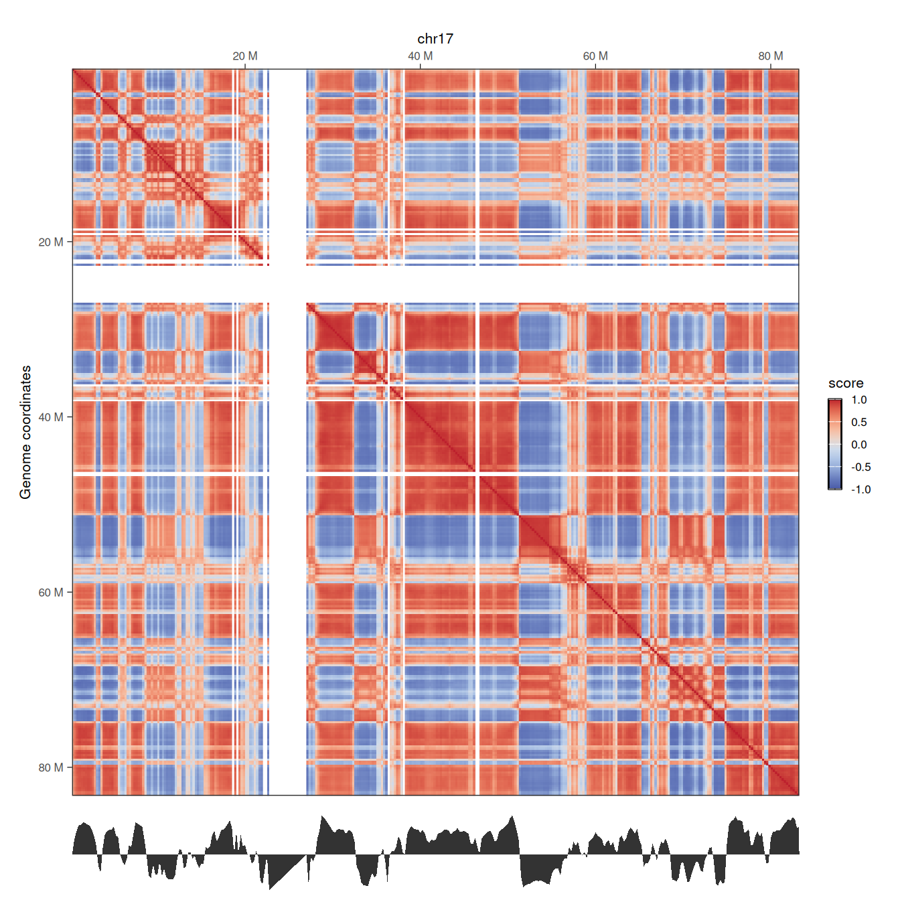
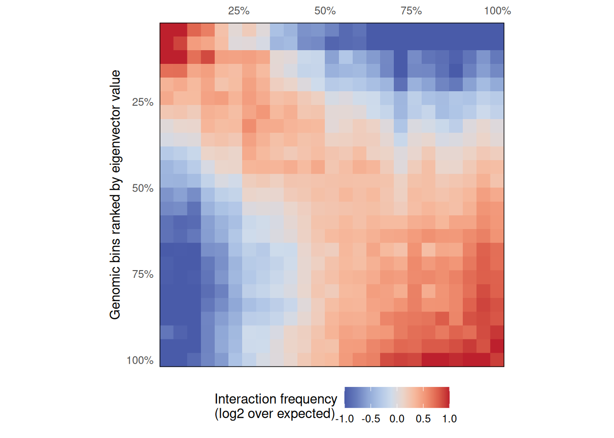
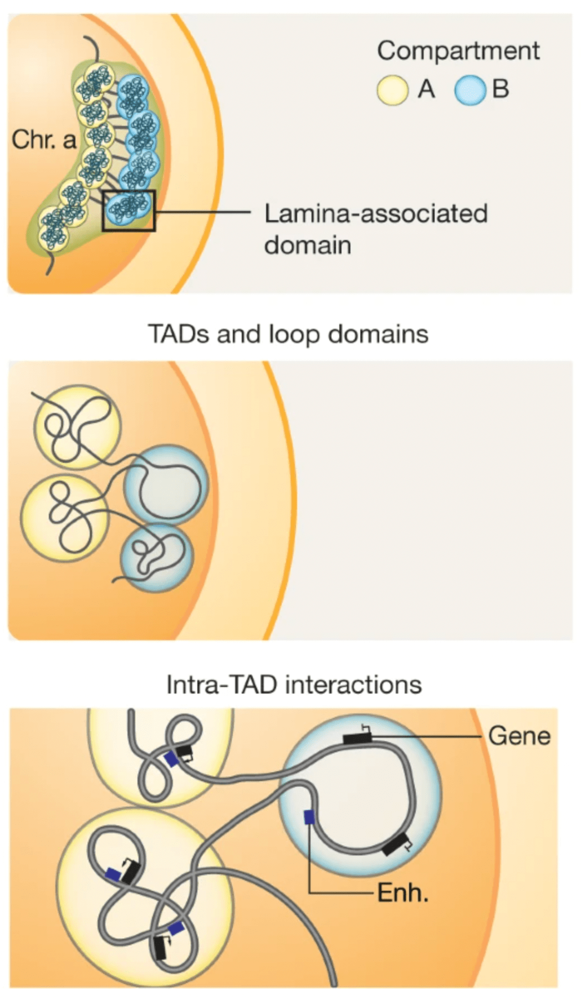
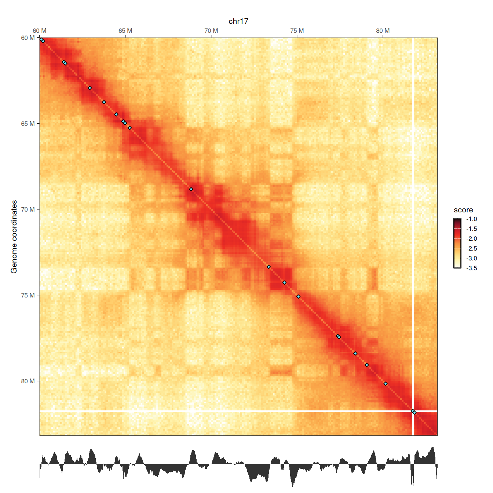
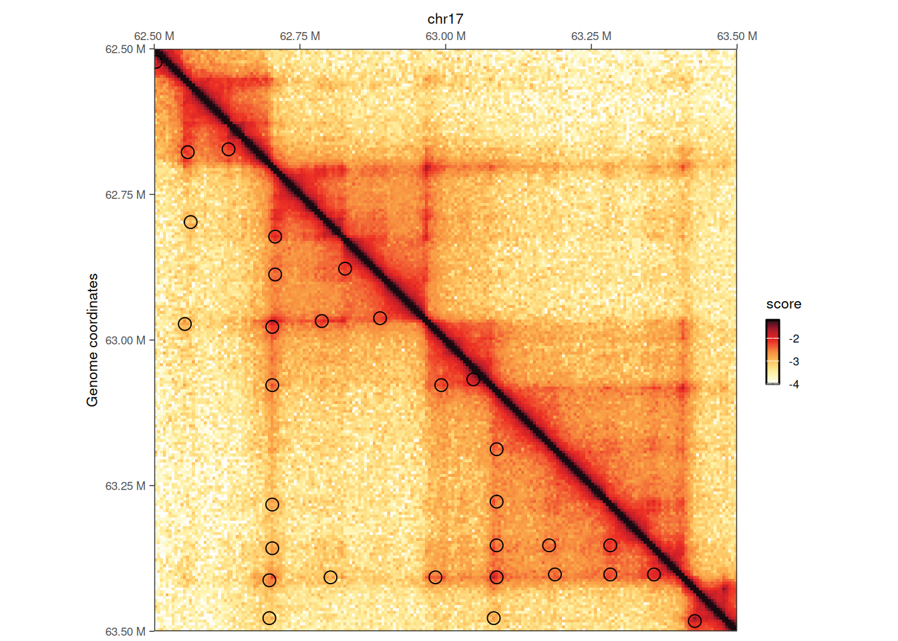

# 7  Finding topological features in Hi-C

> **NOTE:**
>
> ``` downlit
> library(dplyr)
> ##  
> ##  Attaching package: 'dplyr'
> ##  The following objects are masked from 'package:stats':
> ##  
> ##      filter, lag
> ##  The following objects are masked from 'package:base':
> ##  
> ##      intersect, setdiff, setequal, union
> library(ggplot2)
> library(GenomicRanges)
> ##  Loading required package: stats4
> ##  Loading required package: BiocGenerics
> ##  Loading required package: generics
> ##  
> ##  Attaching package: 'generics'
> ##  The following object is masked from 'package:dplyr':
> ##  
> ##      explain
> ##  The following objects are masked from 'package:base':
> ##  
> ##      as.difftime, as.factor, as.ordered, intersect, is.element,
> ##      setdiff, setequal, union
> ##  
> ##  Attaching package: 'BiocGenerics'
> ##  The following object is masked from 'package:dplyr':
> ##  
> ##      combine
> ##  The following objects are masked from 'package:stats':
> ##  
> ##      IQR, mad, sd, var, xtabs
> ##  The following object is masked from 'package:utils':
> ##  
> ##      data
> ##  The following objects are masked from 'package:base':
> ##  
> ##      Filter, Find, Map, Position, Reduce, anyDuplicated, aperm,
> ##      append, as.data.frame, basename, cbind, colnames, dirname,
> ##      do.call, duplicated, eval, evalq, get, grep, grepl, is.unsorted,
> ##      lapply, mapply, match, mget, order, paste, pmax, pmax.int, pmin,
> ##      pmin.int, rank, rbind, rownames, sapply, saveRDS, scale,
> ##      sequence, table, tapply, transform, unique, unsplit, which.max,
> ##      which.min
> ##  Loading required package: S4Vectors
> ##  
> ##  Attaching package: 'S4Vectors'
> ##  The following objects are masked from 'package:dplyr':
> ##  
> ##      first, rename
> ##  The following object is masked from 'package:utils':
> ##  
> ##      findMatches
> ##  The following objects are masked from 'package:base':
> ##  
> ##      I, expand.grid, unname
> ##  Loading required package: IRanges
> ##  
> ##  Attaching package: 'IRanges'
> ##  The following objects are masked from 'package:dplyr':
> ##  
> ##      collapse, desc, slice
> ##  Loading required package: Seqinfo
> library(InteractionSet)
> ##  Loading required package: SummarizedExperiment
> ##  Loading required package: MatrixGenerics
> ##  Loading required package: matrixStats
> ##  
> ##  Attaching package: 'matrixStats'
> ##  The following object is masked from 'package:dplyr':
> ##  
> ##      count
> ##  
> ##  Attaching package: 'MatrixGenerics'
> ##  The following objects are masked from 'package:matrixStats':
> ##  
> ##      colAlls, colAnyNAs, colAnys, colAvgsPerRowSet, colCollapse,
> ##      colCounts, colCummaxs, colCummins, colCumprods, colCumsums,
> ##      colDiffs, colIQRDiffs, colIQRs, colLogSumExps, colMadDiffs,
> ##      colMads, colMaxs, colMeans2, colMedians, colMins, colOrderStats,
> ##      colProds, colQuantiles, colRanges, colRanks, colSdDiffs, colSds,
> ##      colSums2, colTabulates, colVarDiffs, colVars, colWeightedMads,
> ##      colWeightedMeans, colWeightedMedians, colWeightedSds,
> ##      colWeightedVars, rowAlls, rowAnyNAs, rowAnys, rowAvgsPerColSet,
> ##      rowCollapse, rowCounts, rowCummaxs, rowCummins, rowCumprods,
> ##      rowCumsums, rowDiffs, rowIQRDiffs, rowIQRs, rowLogSumExps,
> ##      rowMadDiffs, rowMads, rowMaxs, rowMeans2, rowMedians, rowMins,
> ##      rowOrderStats, rowProds, rowQuantiles, rowRanges, rowRanks,
> ##      rowSdDiffs, rowSds, rowSums2, rowTabulates, rowVarDiffs,
> ##      rowVars, rowWeightedMads, rowWeightedMeans, rowWeightedMedians,
> ##      rowWeightedSds, rowWeightedVars
> ##  Loading required package: Biobase
> ##  Welcome to Bioconductor
> ##  
> ##      Vignettes contain introductory material; view with
> ##      'browseVignettes()'. To cite Bioconductor, see
> ##      'citation("Biobase")', and for packages 'citation("pkgname")'.
> ##  
> ##  Attaching package: 'Biobase'
> ##  The following object is masked from 'package:MatrixGenerics':
> ##  
> ##      rowMedians
> ##  The following objects are masked from 'package:matrixStats':
> ##  
> ##      anyMissing, rowMedians
> library(HiCExperiment)
> ##  Consider using the `HiContacts` package to perform advanced genomic operations 
> ##  on `HiCExperiment` objects.
> ##  
> ##  Read "Orchestrating Hi-C analysis with Bioconductor" online book to learn more:
> ##  https://js2264.github.io/OHCA/
> ##  
> ##  Attaching package: 'HiCExperiment'
> ##  The following object is masked from 'package:SummarizedExperiment':
> ##  
> ##      metadata<-
> ##  The following object is masked from 'package:S4Vectors':
> ##  
> ##      metadata<-
> ##  The following object is masked from 'package:ggplot2':
> ##  
> ##      resolution
> library(HiContactsData)
> ##  Loading required package: ExperimentHub
> ##  Loading required package: AnnotationHub
> ##  Loading required package: BiocFileCache
> ##  Loading required package: dbplyr
> ##  
> ##  Attaching package: 'dbplyr'
> ##  The following objects are masked from 'package:dplyr':
> ##  
> ##      ident, sql, sql_escape_ident, sql_escape_string
> ##  OpenTelemetry error: there is no package called 'otelsdk'
> ##  OpenTelemetry error: there is no package called 'otelsdk'
> ##  
> ##  Attaching package: 'AnnotationHub'
> ##  The following object is masked from 'package:Biobase':
> ##  
> ##      cache
> library(fourDNData)
> library(HiContacts)
> ##  Registered S3 methods overwritten by 'readr':
> ##    method                    from 
> ##    as.data.frame.spec_tbl_df vroom
> ##    as_tibble.spec_tbl_df     vroom
> ##    format.col_spec           vroom
> ##    print.col_spec            vroom
> ##    print.collector           vroom
> ##    print.date_names          vroom
> ##    print.locale              vroom
> ##    str.col_spec              vroom
> library(rtracklayer)
> ##  
> ##  Attaching package: 'rtracklayer'
> ##  The following object is masked from 'package:AnnotationHub':
> ##  
> ##      hubUrl
> library(OHCA)
> ```

> **NOTE:**
>
> This chapter focuses on the annotation of topological features from Hi-C contact maps, including:
>
> - Chromosome compartments
> - Topologically associating domains
> - Stable chromatin loops

## 7.1 Chromosome compartments

Chromosome compartments refer to the segregation of the chromatin into active euchromatin (A compartments) and regulated heterochromatin (B compartment).

### 7.1.1 Importing Hi-C data

To investigate chromosome compartments, we will fetch a contact matrix generated from a micro-C experiment (from Krietenstein et al. ([2020](#ref-Krietenstein_2020))). A subset of the genome-wide dataset is provided in the `HiContactsData` package. It contains intra-chromosomal interactions within `chr17`, binned at `5000`, `100000` and `250000` bp.

``` downlit
library(HiCExperiment)
library(HiContactsData)
cf <- CoolFile(HiContactsData('microC', 'mcool'))
##  see ?HiContactsData and browseVignettes('HiContactsData') for documentation
##  downloading 1 resources
##  retrieving 1 resource
##  loading from cache
microC <- import(cf, resolution = 250000)
microC
##  `HiCExperiment` object with 10,086,710 contacts over 334 regions 
##  -------
##  fileName: "/opt/R-cache/R/ExperimentHub/109b72474fcc_8601" 
##  focus: "whole genome" 
##  resolutions(3): 5000 100000 250000
##  active resolution: 250000 
##  interactions: 52755 
##  scores(2): count balanced 
##  topologicalFeatures: compartments(0) borders(0) loops(0) viewpoints(0) 
##  pairsFile: N/A 
##  metadata(0):

seqinfo(microC)
##  Seqinfo object with 1 sequence from an unspecified genome:
##    seqnames seqnames seqlengths isCircular genome
##    1           chr17   83257441         NA   <NA>
```

### 7.1.2 Annotating A/B compartments

The consensus approach to annotate A/B compartments is to compute the eigenvectors of a Hi-C contact matrix and identify the eigenvector representing the chromosome-wide bi-partite segmentation of the genome.

The [`getCompartments()`](https://rdrr.io/pkg/HiContacts/man/getCompartments.html) function performs several internal operations to achieve this:

1.  Obtains cis interactions per chromosome
2.  Computes O/E contact matrix scores
3.  Computes 3 first eigenvectors of this Hi-C contact matrix
4.  Normalizes eigenvectors
5.  Picks the eigenvector that has the greatest absolute correlation with a phasing track (e.g. a GC% track automatically computed from a genome reference sequence, or a gene density track)
6.  Signs this eigenvector so that positive values represent the A compartment

``` downlit
phasing_track <- BSgenome.Hsapiens.UCSC.hg38::BSgenome.Hsapiens.UCSC.hg38
microC_compts <- getCompartments(microC, genome = phasing_track)
##  Going through preflight checklist...
##  Parsing intra-chromosomal contacts for each chromosome...
##  Computing eigenvectors for each chromosome...

microC_compts
##  `HiCExperiment` object with 10,086,710 contacts over 334 regions 
##  -------
##  fileName: "/opt/R-cache/R/ExperimentHub/109b72474fcc_8601" 
##  focus: "whole genome" 
##  resolutions(3): 5000 100000 250000
##  active resolution: 250000 
##  interactions: 52755 
##  scores(2): count balanced 
##  topologicalFeatures: compartments(41) borders(0) loops(0) viewpoints(0) 
##  pairsFile: N/A 
##  metadata(1): eigens
```

[`getCompartments()`](https://rdrr.io/pkg/HiContacts/man/getCompartments.html) is an endomorphism: it returns the original object, enriched with two new pieces of information:

- A `compartments` `topologicalFeatures`:

``` downlit
topologicalFeatures(microC_compts, "compartments")
##  GRanges object with 41 ranges and 1 metadata column:
##         seqnames            ranges strand | compartment
##            <Rle>         <IRanges>  <Rle> | <character>
##     [1]    chr17    250001-3000000      * |           A
##     [2]    chr17   3000001-3500000      * |           B
##     [3]    chr17   3500001-5500000      * |           A
##     [4]    chr17   5500001-6500000      * |           B
##     [5]    chr17   6500001-8500000      * |           A
##     ...      ...               ...    ... .         ...
##    [37]    chr17 72750001-73250000      * |           A
##    [38]    chr17 73250001-74750000      * |           B
##    [39]    chr17 74750001-79250000      * |           A
##    [40]    chr17 79250001-79750000      * |           B
##    [41]    chr17 79750001-83250000      * |           A
##    -------
##    seqinfo: 1 sequence from an unspecified genome
```

- The calculated eigenvectors stored in `metadata`:

``` downlit
metadata(microC_compts)$eigens
##  GRanges object with 334 ranges and 9 metadata columns:
##                                  seqnames            ranges strand |
##                                     <Rle>         <IRanges>  <Rle> |
##             chr17.chr17_1_250000    chr17          1-250000      * |
##        chr17.chr17_250001_500000    chr17     250001-500000      * |
##        chr17.chr17_500001_750000    chr17     500001-750000      * |
##       chr17.chr17_750001_1000000    chr17    750001-1000000      * |
##      chr17.chr17_1000001_1250000    chr17   1000001-1250000      * |
##                              ...      ...               ...    ... .
##    chr17.chr17_82250001_82500000    chr17 82250001-82500000      * |
##    chr17.chr17_82500001_82750000    chr17 82500001-82750000      * |
##    chr17.chr17_82750001_83000000    chr17 82750001-83000000      * |
##    chr17.chr17_83000001_83250000    chr17 83000001-83250000      * |
##    chr17.chr17_83250001_83257441    chr17 83250001-83257441      * |
##                                     bin_id     weight   chr    center
##                                  <numeric>  <numeric> <Rle> <integer>
##             chr17.chr17_1_250000         0        NaN chr17    125000
##        chr17.chr17_250001_500000         1 0.00626903 chr17    375000
##        chr17.chr17_500001_750000         2 0.00567190 chr17    625000
##       chr17.chr17_750001_1000000         3 0.00528588 chr17    875000
##      chr17.chr17_1000001_1250000         4 0.00464628 chr17   1125000
##                              ...       ...        ...   ...       ...
##    chr17.chr17_82250001_82500000       329 0.00463044 chr17  82375000
##    chr17.chr17_82500001_82750000       330 0.00486910 chr17  82625000
##    chr17.chr17_82750001_83000000       331 0.00561269 chr17  82875000
##    chr17.chr17_83000001_83250000       332 0.00546433 chr17  83125000
##    chr17.chr17_83250001_83257441       333        NaN chr17  83253721
##                                         E1        E2        E3   phasing
##                                  <numeric> <numeric> <numeric> <numeric>
##             chr17.chr17_1_250000  0.000000  0.000000  0.000000  0.383084
##        chr17.chr17_250001_500000  0.450991  0.653287  0.615300  0.433972
##        chr17.chr17_500001_750000  0.716784  0.707461  0.845033  0.465556
##       chr17.chr17_750001_1000000  0.904423  0.414952  0.864288  0.503592
##      chr17.chr17_1000001_1250000  0.913023  0.266287  0.759016  0.547712
##                              ...       ...       ...       ...       ...
##    chr17.chr17_82250001_82500000  1.147060  0.239112  1.133498  0.550872
##    chr17.chr17_82500001_82750000  1.106937  0.419647  1.169464  0.513212
##    chr17.chr17_82750001_83000000  0.818990  0.591955  0.850340  0.522432
##    chr17.chr17_83000001_83250000  0.874038  0.503175  0.847926  0.528448
##    chr17.chr17_83250001_83257441  0.000000  0.000000  0.000000  0.000000
##                                      eigen
##                                  <numeric>
##             chr17.chr17_1_250000  0.000000
##        chr17.chr17_250001_500000  0.450991
##        chr17.chr17_500001_750000  0.716784
##       chr17.chr17_750001_1000000  0.904423
##      chr17.chr17_1000001_1250000  0.913023
##                              ...       ...
##    chr17.chr17_82250001_82500000  1.147060
##    chr17.chr17_82500001_82750000  1.106937
##    chr17.chr17_82750001_83000000  0.818990
##    chr17.chr17_83000001_83250000  0.874038
##    chr17.chr17_83250001_83257441  0.000000
##    -------
##    seqinfo: 1 sequence from an unspecified genome
```

### 7.1.3 Exporting compartment tracks

To save the eigenvector (as a `bigwig` file) and the compartments(as a `gff` file), the `export` function can be used:

``` downlit
library(GenomicRanges)
library(rtracklayer)
coverage(metadata(microC_compts)$eigens, weight = 'eigen') |> export('microC_eigen.bw')
topologicalFeatures(microC_compts, "compartments") |> export('microC_compartments.gff3')
```

### 7.1.4 Visualizing compartment tracks

Compartment tracks should be visualized in a dedicated genome browser, with the phasing track loaded as well, to ensure they are phased accordingly.\
That being said, it is possible to visualize a genome track in R besides the matching Hi-C contact matrix.

``` downlit
library(ggplot2)
library(patchwork)
microC <- autocorrelate(microC)
p1 <- plotMatrix(microC, use.scores = 'autocorrelated', scale = 'linear', limits = c(-1, 1), caption = FALSE)
eigen <- coverage(metadata(microC_compts)$eigens, weight = 'eigen')[[1]]
eigen_df <- tibble(pos = cumsum(runLength(eigen)), eigen = runValue(eigen))
p2 <- ggplot(eigen_df, aes(x = pos, y = eigen)) + 
    geom_area() + 
    theme_void() + 
    coord_cartesian(expand = FALSE) + 
    labs(x = "Genomic position", y = "Eigenvector value")
wrap_plots(p1, p2, ncol = 1, heights = c(10, 1))
```



Here, we clearly note the concordance between the Hi-C correlation matrix, highlighting correlated interactions between pairs of genomic segments, and the eigenvector representing chromosome segmentation into 2 compartments: A (for positive values) and B (for negative values).

### 7.1.5 Saddle plots

Saddle plots are typically used to measure the `observed` vs. `expected` interaction scores within or between genomic loci belonging to A and B compartments.

Non-overlapping genomic windows are grouped in `nbins` quantiles (typically between 10 and 50 quantiles) according to their A/B compartment eigenvector value, from lowest eigenvector values (i.e. strongest B compartments) to highest eigenvector values (i.e. strongest A compartments). The average `observed` vs. `expected` interaction scores are then computed for pairwise eigenvector quantiles and plotted in a 2D heatmap.

``` downlit
library(BiocParallel)
plotSaddle(microC_compts, nbins = 25, BPPARAM = SerialParam(progressbar = FALSE))
```



Here, the top-left small corner represents average O/E scores between strong B compartments and the bottom-right larger corner represents average O/E scores between strong A compartments. Note that only `chr17` interactions are contained in this dataset, explaining the grainy aspect of the saddle plot.

## 7.2 Topological domains

Topological *domains* (a.k.a. Topologically Associating Domains, TADs, isolated neighborhoods, contact domains, …) refer to local chromosomal segments (e.b. roughly ≤ 1Mb in mammal genomes) which preferentially self-interact, in a constrained manner. They are demarcated by domain *boundaries*.



They are generally conserved across cell types and species (Schmitt et al. ([2016](#ref-Schmitt_2016))), typically correlate with units of DNA replication (Pope et al. ([2014](#ref-Pope_2014))), and could play a role during development (Stadhouders et al. ([2019](#ref-Stadhouders_2019))).

### 7.2.1 Computing diamond insulation score

Several approaches exist to annotate topological domains (Sefer ([2022](#ref-Sefer_2022))). Several packages in R implement some of these functionalities, e.g. `spectralTAD` or `TADcompare`.

`HiContacts` offers a simple `getDiamondInsulation` function which computes the diamond insulation score (Crane et al. ([2015](#ref-Crane_2015))). This score quantifies average interaction frequency in an insulation window (of a certain `window_size`) sliding along contact matrices at a chosen `resolution`.

``` downlit
# - Compute insulation score
bpparam <- SerialParam(progressbar = FALSE)
hic <- zoom(microC, 5000) |> 
    refocus('chr17:60000001-83257441') |>
    getDiamondInsulation(window_size = 100000, BPPARAM = bpparam) |> 
    getBorders()
##  Going through preflight checklist...
##  Scan each window and compute diamond insulation score...
##  Annotating diamond score prominence for each window...

hic
##  `HiCExperiment` object with 2,156,222 contacts over 4,652 regions 
##  -------
##  fileName: "/opt/R-cache/R/ExperimentHub/109b72474fcc_8601" 
##  focus: "chr17:60,000,001-83,257,441" 
##  resolutions(3): 5000 100000 250000
##  active resolution: 5000 
##  interactions: 2156044 
##  scores(2): count balanced 
##  topologicalFeatures: compartments(0) borders(21) loops(0) viewpoints(0) 
##  pairsFile: N/A 
##  metadata(1): insulation
```

[`getDiamondInsulation()`](https://rdrr.io/pkg/HiContacts/man/getDiamondInsulation.html) is an endomorphism: it returns the original object, enriched with two new pieces of information:

- A `borders` `topologicalFeatures`:

``` downlit
topologicalFeatures(hic, "borders")
##  GRanges object with 21 ranges and 1 metadata column:
##           seqnames            ranges strand |     score
##              <Rle>         <IRanges>  <Rle> | <numeric>
##    strong    chr17 60105001-60110000      * |  0.574760
##      weak    chr17 60210001-60215000      * |  0.414425
##      weak    chr17 61415001-61420000      * |  0.346668
##    strong    chr17 61500001-61505000      * |  0.544336
##      weak    chr17 62930001-62935000      * |  0.399794
##       ...      ...               ...    ... .       ...
##      weak    chr17 78395001-78400000      * |  0.235613
##      weak    chr17 79065001-79070000      * |  0.236535
##      weak    chr17 80155001-80160000      * |  0.284855
##      weak    chr17 81735001-81740000      * |  0.497478
##    strong    chr17 81840001-81845000      * |  1.395949
##    -------
##    seqinfo: 1 sequence from an unspecified genome
```

- The calculated `insulation` scores stored in `metadata`:

``` downlit
metadata(hic)$insulation
##  GRanges object with 4611 ranges and 8 metadata columns:
##                            seqnames            ranges strand |    bin_id
##                               <Rle>         <IRanges>  <Rle> | <numeric>
##    chr17_60100001_60105000    chr17 60100001-60105000      * |     12020
##    chr17_60105001_60110000    chr17 60105001-60110000      * |     12021
##    chr17_60110001_60115000    chr17 60110001-60115000      * |     12022
##    chr17_60115001_60120000    chr17 60115001-60120000      * |     12023
##    chr17_60120001_60125000    chr17 60120001-60125000      * |     12024
##                        ...      ...               ...    ... .       ...
##    chr17_83130001_83135000    chr17 83130001-83135000      * |     16626
##    chr17_83135001_83140000    chr17 83135001-83140000      * |     16627
##    chr17_83140001_83145000    chr17 83140001-83145000      * |     16628
##    chr17_83145001_83150000    chr17 83145001-83150000      * |     16629
##    chr17_83150001_83155000    chr17 83150001-83155000      * |     16630
##                               weight   chr    center     score insulation
##                            <numeric> <Rle> <integer> <numeric>  <numeric>
##    chr17_60100001_60105000 0.0406489 chr17  60102500  0.188061  -0.750142
##    chr17_60105001_60110000 0.0255539 chr17  60107500  0.180860  -0.806466
##    chr17_60110001_60115000       NaN chr17  60112500  0.196579  -0.686232
##    chr17_60115001_60120000       NaN chr17  60117500  0.216039  -0.550046
##    chr17_60120001_60125000       NaN chr17  60122500  0.230035  -0.459489
##                        ...       ...   ...       ...       ...        ...
##    chr17_83130001_83135000 0.0314684 chr17  83132500  0.262191  -0.270723
##    chr17_83135001_83140000 0.0307197 chr17  83137500  0.240779  -0.393632
##    chr17_83140001_83145000 0.0322810 chr17  83142500  0.219113  -0.529664
##    chr17_83145001_83150000 0.0280840 chr17  83147500  0.199645  -0.663900
##    chr17_83150001_83155000 0.0272775 chr17  83152500  0.180434  -0.809873
##                                  min prominence
##                            <logical>  <numeric>
##    chr17_60100001_60105000     FALSE         NA
##    chr17_60105001_60110000      TRUE    0.57476
##    chr17_60110001_60115000     FALSE         NA
##    chr17_60115001_60120000     FALSE         NA
##    chr17_60120001_60125000     FALSE         NA
##                        ...       ...        ...
##    chr17_83130001_83135000     FALSE         NA
##    chr17_83135001_83140000     FALSE         NA
##    chr17_83140001_83145000     FALSE         NA
##    chr17_83145001_83150000     FALSE         NA
##    chr17_83150001_83155000     FALSE         NA
##    -------
##    seqinfo: 1 sequence from an unspecified genome
```

> **NOTE:**
>
> The `getDiamondInsulation` function can be parallelized over multiple threads by specifying the Bioconductor generic `BPPARAM` argument.

### 7.2.2 Exporting insulation scores tracks

To save the diamond insulation scores (as a `bigwig` file) and the borders (as a `bed` file), the `export` function can be used:

``` downlit
coverage(metadata(hic)$insulation, weight = 'insulation') |> export('microC_insulation.bw')
topologicalFeatures(hic, "borders") |> export('microC_borders.bed')
```

### 7.2.3 Visualizing chromatin domains

Insulation tracks should be visualized in a dedicated genome browser.\
That being said, it is possible to visualize a genome track in R besides the matching Hi-C contact matrix.

``` downlit
hic <- zoom(hic, 100000)
p1 <- plotMatrix(
    hic, 
    use.scores = 'balanced', 
    limits = c(-3.5, -1),
    borders = topologicalFeatures(hic, "borders"),
    caption = FALSE
)
insulation <- coverage(metadata(hic)$insulation, weight = 'insulation')[[1]]
insulation_df <- tibble(pos = cumsum(runLength(insulation)), insulation = runValue(insulation))
p2 <- ggplot(insulation_df, aes(x = pos, y = insulation)) + 
    geom_area() + 
    theme_void() + 
    coord_cartesian(expand = FALSE) + 
    labs(x = "Genomic position", y = "Diamond insulation score")
wrap_plots(p1, p2, ncol = 1, heights = c(10, 1))
```



Local minima in the diamond insulation score displayed below the Hi-C contact matrix are identified using the [`getBorders()`](https://rdrr.io/pkg/HiContacts/man/getDiamondInsulation.html) function, which automatically estimates a minimum threshold. These local minima correspond to borders and are visually depicted on the Hi-C map by blue diamonds.

## 7.3 Chromatin loops

### 7.3.1 `chromosight`

Chromatin loops, dots, or contacts, refer to a strong increase of interaction frequency between a pair of two genomic loci. They correspond to focal “dots” on a Hi-C map. Relying on computer vision algorithms, `chromosight` uses this property to annotate chromatin loops in a Hi-C map (Matthey-Doret et al. ([2020](#ref-Matthey_Doret_2020))). `chromosight` is a standalone `python` package and is made available in R through the `HiCool`-managed conda environment with the [`getLoops()`](https://rdrr.io/pkg/HiContacts/man/getLoops.html) function.

> **IMPORTANT:**
>
> `HiCool` relies on `basilisk` R package to set up an underlying, self-managed `python` environment. Packages from this environment, including `chromosight`, are not yet available for ARM chips (e.g. M1/2/3 in newer on macbooks) or Windows. For this reason, `HiCool`-supported features are not available on these machines.

#### 7.3.1.1 Identifying loops

``` downlit
## Due to HiCool limitations when rendering the book, this code is not executed here
hic <- HiCool::getLoops(microC, resolution = 5000)
```

``` downlit
## Instead we load pre-computed data from a backed-up object
hic_rds <- system.file('extdata', 'microC_with-loops.rds', package = 'OHCA')
hic <- readRDS(hic_rds)
```

``` downlit
hic
##  `HiCExperiment` object with 2,103,634 contacts over 200 regions 
##  -------
##  fileName: "../4d434d8538a0_4DNFI9FVHJZQ_subset.mcool" 
##  focus: "chr17:62,500,001-63,500,000" 
##  resolutions(1): 5000
##  active resolution: 5000 
##  interactions: 19667 
##  scores(2): count balanced 
##  topologicalFeatures: loops(2419) 
##  pairsFile: N/A 
##  metadata(1): chromosight_args
```

[`getLoops()`](https://rdrr.io/pkg/HiContacts/man/getLoops.html) is an endomorphism: it returns the original object, enriched with two new pieces of information:

- A `loops` `topologicalFeatures`:

``` downlit
topologicalFeatures(hic, "loops")
##  GInteractions object with 2419 interactions and 7 metadata columns:
##           seqnames1           ranges1     seqnames2           ranges2 |
##               <Rle>         <IRanges>         <Rle>         <IRanges> |
##       [1]     chr17     150000-155000 ---     chr17     390000-395000 |
##       [2]     chr17     145000-150000 ---     chr17     755000-760000 |
##       [3]     chr17     145000-150000 ---     chr17   1050000-1055000 |
##       [4]     chr17     145000-150000 ---     chr17     510000-515000 |
##       [5]     chr17     150000-155000 ---     chr17     990000-995000 |
##       ...       ...               ... ...       ...               ... .
##    [2415]     chr17 82870000-82875000 ---     chr17 83075000-83080000 |
##    [2416]     chr17 82880000-82885000 ---     chr17 82925000-82930000 |
##    [2417]     chr17 82960000-82965000 ---     chr17 83080000-83085000 |
##    [2418]     chr17 82975000-82980000 ---     chr17 83000000-83005000 |
##    [2419]     chr17 83100000-83105000 ---     chr17 83200000-83205000 |
##                bin1      bin2 kernel_id iteration     score    pvalue
##           <numeric> <numeric> <numeric> <numeric> <numeric> <numeric>
##       [1]    498194    498242         0         0  0.666651         0
##       [2]    498193    498315         0         0  0.452903         0
##       [3]    498193    498374         0         0  0.518936         0
##       [4]    498193    498266         0         0  0.536020         0
##       [5]    498194    498362         0         0  0.573763         0
##       ...       ...       ...       ...       ...       ...       ...
##    [2415]    514738    514779         0         0  0.478653   0.0e+00
##    [2416]    514740    514749         0         0  0.369344   5.0e-10
##    [2417]    514756    514780         0         0  0.690669   0.0e+00
##    [2418]    514759    514764         0         0  0.374722   5.1e-09
##    [2419]    514784    514804         0         0  0.768593   0.0e+00
##              qvalue
##           <numeric>
##       [1]         0
##       [2]         0
##       [3]         0
##       [4]         0
##       [5]         0
##       ...       ...
##    [2415]     0e+00
##    [2416]     6e-10
##    [2417]     0e+00
##    [2418]     6e-09
##    [2419]     0e+00
##    -------
##    regions: 3169 ranges and 0 metadata columns
##    seqinfo: 1 sequence from an unspecified genome; no seqlengths
```

- The arguments used by `chromosight`, stored in `metadata`:

``` downlit
metadata(hic)$chromosight_args
##  $`--pattern`
##  [1] "loops"
##  
##  $`--dump`
##  [1] "/tmp/RtmpUN0slk"
##  
##  $`--inter`
##  [1] FALSE
##  
##  $`--iterations`
##  [1] "auto"
##  
##  $`--kernel-config`
##  NULL
##  
##  $`--perc-zero`
##  [1] "auto"
##  
##  $`--perc-undetected`
##  [1] "auto"
##  
##  $`--tsvd`
##  [1] FALSE
##  
##  $`--win-fmt`
##  [1] "json"
##  
##  $`--win-size`
##  [1] "auto"
##  
##  $`--no-plotting`
##  [1] TRUE
##  
##  $`--smooth-trend`
##  [1] FALSE
##  
##  $`--norm`
##  [1] "auto"
##  
##  $`<contact_map>`
##  [1] "/root/.cache/R/fourDNData/913914662_4DNFI9FVHJZQ.mcool::/resolutions/5000"
##  
##  $`--max-dist`
##  [1] "auto"
##  
##  $`--min-dist`
##  [1] "auto"
##  
##  $`--min-separation`
##  [1] "auto"
##  
##  $`--n-mads`
##  [1] 5
##  
##  $`<prefix>`
##  [1] "chromosight/chromo"
##  
##  $`--pearson`
##  [1] "auto"
##  
##  $`--subsample`
##  [1] "no"
##  
##  $`--threads`
##  [1] 1
```

#### 7.3.1.2 Importing loops from files

If you are using `chromosight` directly from the terminal (i.e. outside `R`), you can import the annotated loops in `R` as follows:

``` downlit
## Change the `.tsv` file to the local output file from chromosight
loops <- system.file('extdata', 'chromo.tsv', package = 'OHCA') |> 
    readr::read_tsv() |> 
    plyinteractions::as_ginteractions(seqnames1 = chrom1, seqnames2 = chrom2)
##  Rows: 2419 Columns: 13
##  ── Column specification ─────────────────────────────────────────────────────
##  Delimiter: "\t"
##  chr  (2): chrom1, chrom2
##  dbl (11): start1, end1, start2, end2, bin1, bin2, kernel_id, iteration, s...
##  
##  ℹ Use `spec()` to retrieve the full column specification for this data.
##  ℹ Specify the column types or set `show_col_types = FALSE` to quiet this message.

loops
##  GInteractions object with 2419 interactions and 7 metadata columns:
##           seqnames1           ranges1 strand1     seqnames2           ranges2
##               <Rle>         <IRanges>   <Rle>         <Rle>         <IRanges>
##       [1]     chr17     150000-155000       * ---     chr17     390000-395000
##       [2]     chr17     145000-150000       * ---     chr17     755000-760000
##       [3]     chr17     145000-150000       * ---     chr17   1050000-1055000
##       [4]     chr17     145000-150000       * ---     chr17     510000-515000
##       [5]     chr17     150000-155000       * ---     chr17     990000-995000
##       ...       ...               ...     ... ...       ...               ...
##    [2415]     chr17 82870000-82875000       * ---     chr17 83075000-83080000
##    [2416]     chr17 82880000-82885000       * ---     chr17 82925000-82930000
##    [2417]     chr17 82960000-82965000       * ---     chr17 83080000-83085000
##    [2418]     chr17 82975000-82980000       * ---     chr17 83000000-83005000
##    [2419]     chr17 83100000-83105000       * ---     chr17 83200000-83205000
##           strand2 |      bin1      bin2 kernel_id iteration     score
##             <Rle> | <numeric> <numeric> <numeric> <numeric> <numeric>
##       [1]       * |    498194    498242         0         0  0.666651
##       [2]       * |    498193    498315         0         0  0.452903
##       [3]       * |    498193    498374         0         0  0.518936
##       [4]       * |    498193    498266         0         0  0.536020
##       [5]       * |    498194    498362         0         0  0.573763
##       ...     ... .       ...       ...       ...       ...       ...
##    [2415]       * |    514738    514779         0         0  0.478653
##    [2416]       * |    514740    514749         0         0  0.369344
##    [2417]       * |    514756    514780         0         0  0.690669
##    [2418]       * |    514759    514764         0         0  0.374722
##    [2419]       * |    514784    514804         0         0  0.768593
##              pvalue    qvalue
##           <numeric> <numeric>
##       [1]         0         0
##       [2]         0         0
##       [3]         0         0
##       [4]         0         0
##       [5]         0         0
##       ...       ...       ...
##    [2415]   0.0e+00     0e+00
##    [2416]   5.0e-10     6e-10
##    [2417]   0.0e+00     0e+00
##    [2418]   5.1e-09     6e-09
##    [2419]   0.0e+00     0e+00
##    -------
##    regions: 3169 ranges and 0 metadata columns
##    seqinfo: 1 sequence from an unspecified genome; no seqlengths
```

#### 7.3.1.3 Exporting chromatin loops

``` downlit
loops <- topologicalFeatures(hic, "loops")
loops <- loops[loops$score >= 0.4 & loops$qvalue <= 1e-6]
GenomicInteractions::export.bedpe(loops, 'loops.bedpe')
##  Warning in interactionCounts(x): 'counts' not in mcols of object; will
##  return NULL
```

#### 7.3.1.4 Visualizing chromatin loops

``` downlit
plotMatrix(
    hic, 
    loops = loops,
    limits = c(-4, -1.2),
    caption = FALSE
)
```



### 7.3.2 Other R packages

A number of other R packages have been developed to identify focal chromatin loops, notably `fitHiC` (Ay et al. ([2014](#ref-Ay_2014))), `GOTHiC` (Mifsud et al. ([2017](#ref-Mifsud_2017))) or `idr2d` (Krismer et al. ([2020](#ref-Krismer_2020))). Each fits a slightly different purpose, and we encourage the end user to read companion publications.

# Session info

> **NOTE:**
>
> ``` downlit
> sessioninfo::session_info(include_base = TRUE)
> ##  ─ Session info ────────────────────────────────────────────────────────────
> ##   setting  value
> ##   version  R version 4.6.1 (2026-06-24)
> ##   os       Ubuntu 24.04.4 LTS
> ##   system   x86_64, linux-gnu
> ##   ui       X11
> ##   language (EN)
> ##   collate  C
> ##   ctype    en_US.UTF-8
> ##   tz       Etc/UTC
> ##   date     2026-10-06
> ##   pandoc   3.11 @ /usr/bin/ (via rmarkdown)
> ##   quarto   1.11.5 @ /usr/local/bin/quarto
> ##  
> ##  ─ Packages ────────────────────────────────────────────────────────────────
> ##   package                     * version   date (UTC) lib source
> ##   abind                         1.4-8     2024-09-12 [2] RSPM (R 4.6.0)
> ##   AnnotationDbi                 1.75.2    2026-07-21 [2] Bioconductor 3.24 (R 4.6.1)
> ##   AnnotationFilter              1.37.0    2026-04-28 [2] Bioconductor 3.24 (R 4.6.1)
> ##   AnnotationHub               * 4.3.2     2026-06-30 [2] Bioconductor 3.24 (R 4.6.1)
> ##   backports                     1.5.1     2026-04-03 [2] RSPM (R 4.6.0)
> ##   base                        * 4.6.1     2026-09-11 [3] local
> ##   base64enc                     0.1-6     2026-02-02 [2] RSPM (R 4.6.0)
> ##   beeswarm                      0.4.0     2021-06-01 [2] RSPM (R 4.6.0)
> ##   Biobase                     * 2.73.2    2026-07-29 [2] Bioconductor 3.24 (R 4.6.1)
> ##   BiocBaseUtils                 1.15.1    2026-05-10 [2] Bioconductor 3.24 (R 4.6.1)
> ##   BiocFileCache               * 3.3.0     2026-04-28 [2] Bioconductor 3.24 (R 4.6.1)
> ##   BiocGenerics                * 0.59.12   2026-08-11 [2] Bioconductor 3.24 (R 4.6.1)
> ##   BiocIO                        1.23.3    2026-04-29 [2] Bioconductor 3.24 (R 4.6.1)
> ##   BiocManager                   1.30.27   2025-11-14 [2] CRAN (R 4.6.1)
> ##   BiocParallel                * 1.47.0    2026-04-28 [2] Bioconductor 3.24 (R 4.6.1)
> ##   BiocVersion                   3.24.0    2026-04-28 [2] Bioconductor 3.24 (R 4.6.1)
> ##   biomaRt                       2.69.3    2026-09-20 [2] Bioconductor 3.24 (R 4.6.1)
> ##   Biostrings                    2.81.9    2026-09-06 [2] Bioconductor 3.24 (R 4.6.1)
> ##   biovizBase                    1.61.0    2026-04-28 [2] Bioconductor 3.24 (R 4.6.1)
> ##   bit                           4.6.0     2025-03-06 [2] RSPM (R 4.6.0)
> ##   bit64                         4.8.6     2026-09-01 [2] RSPM (R 4.6.0)
> ##   bitops                        1.1-0     2026-07-30 [2] RSPM (R 4.6.0)
> ##   blob                          1.3.0     2026-01-14 [2] RSPM (R 4.6.0)
> ##   BSgenome                      1.81.1    2026-07-29 [2] Bioconductor 3.24 (R 4.6.1)
> ##   BSgenome.Hsapiens.UCSC.hg38   1.4.5     2026-07-20 [2] Bioconductor
> ##   cachem                        1.1.0     2024-05-16 [2] RSPM (R 4.6.0)
> ##   Cairo                         1.7-0     2025-10-29 [2] RSPM (R 4.6.0)
> ##   checkmate                     2.3.4     2026-02-03 [2] RSPM (R 4.6.0)
> ##   cigarillo                     1.3.1     2026-07-13 [2] Bioconductor 3.24 (R 4.6.1)
> ##   cli                           3.6.6     2026-04-09 [2] RSPM (R 4.6.0)
> ##   cluster                       2.1.8.3   2026-07-30 [2] RSPM (R 4.6.0)
> ##   codetools                     0.2-20    2024-03-31 [3] CRAN (R 4.6.1)
> ##   colorspace                    2.1-3     2026-07-12 [2] RSPM (R 4.6.0)
> ##   compiler                      4.6.1     2026-09-11 [3] local
> ##   crayon                        1.5.3     2024-06-20 [2] RSPM (R 4.6.0)
> ##   curl                          8.0.0     2026-08-25 [2] RSPM (R 4.6.0)
> ##   data.table                    1.18.6.1  2026-08-24 [2] RSPM (R 4.6.0)
> ##   datasets                    * 4.6.1     2026-09-11 [3] local
> ##   DBI                           1.3.0     2026-02-25 [2] RSPM (R 4.6.0)
> ##   dbplyr                      * 2.6.0     2026-06-17 [2] RSPM (R 4.6.0)
> ##   DelayedArray                  0.39.8    2026-09-30 [2] Bioconductor 3.24 (R 4.6.1)
> ##   deldir                        2.0-4     2024-02-28 [2] RSPM (R 4.6.0)
> ##   dichromat                     2.0-1     2026-07-22 [2] RSPM (R 4.6.0)
> ##   digest                        0.6.39    2025-11-19 [2] RSPM (R 4.6.0)
> ##   doParallel                    1.0.17    2022-02-07 [2] RSPM (R 4.6.0)
> ##   dplyr                       * 1.2.1     2026-04-03 [2] RSPM (R 4.6.0)
> ##   dynamicTreeCut                1.63-1    2016-03-11 [2] RSPM (R 4.6.0)
> ##   ensembldb                     2.37.3    2026-06-07 [2] Bioconductor 3.24 (R 4.6.1)
> ##   evaluate                      1.0.5     2025-08-27 [2] RSPM (R 4.6.0)
> ##   ExperimentHub               * 3.3.2     2026-08-12 [2] Bioconductor 3.24 (R 4.6.1)
> ##   farver                        2.1.2     2024-05-13 [2] RSPM (R 4.6.0)
> ##   fastcluster                   1.3.0     2025-05-07 [2] RSPM (R 4.6.0)
> ##   fastmap                       1.2.0     2024-05-15 [2] RSPM (R 4.6.0)
> ##   filelock                      1.0.3     2023-12-11 [2] RSPM (R 4.6.0)
> ##   foreach                       1.5.2     2022-02-02 [2] RSPM (R 4.6.0)
> ##   foreign                       0.8-91    2026-01-29 [3] CRAN (R 4.6.1)
> ##   Formula                       1.2-6     2026-08-03 [2] RSPM (R 4.6.0)
> ##   fourDNData                  * 1.13.0    2026-04-30 [2] Bioconductor 3.24 (R 4.6.1)
> ##   generics                    * 0.1.4     2025-05-09 [2] RSPM (R 4.6.0)
> ##   GenomeInfoDb                  1.49.1    2026-05-24 [2] Bioconductor 3.24 (R 4.6.1)
> ##   GenomicAlignments             1.49.2    2026-09-02 [2] Bioconductor 3.24 (R 4.6.1)
> ##   GenomicFeatures               1.65.0    2026-04-28 [2] Bioconductor 3.24 (R 4.6.1)
> ##   GenomicInteractions           1.47.0    2026-04-28 [2] Bioconductor 3.24 (R 4.6.1)
> ##   GenomicRanges               * 1.65.4    2026-09-02 [2] Bioconductor 3.24 (R 4.6.1)
> ##   ggbeeswarm                    0.7.3     2025-11-29 [2] RSPM (R 4.6.0)
> ##   ggplot2                     * 4.0.3     2026-04-22 [2] RSPM (R 4.6.0)
> ##   ggrastr                       1.0.2     2023-06-01 [2] RSPM (R 4.6.0)
> ##   glue                          1.8.1     2026-04-17 [2] RSPM (R 4.6.0)
> ##   graphics                    * 4.6.1     2026-09-11 [3] local
> ##   grDevices                   * 4.6.1     2026-09-11 [3] local
> ##   grid                          4.6.1     2026-09-11 [3] local
> ##   gridExtra                     2.3.1     2026-06-25 [2] RSPM (R 4.6.0)
> ##   gtable                        0.3.6     2024-10-25 [2] RSPM (R 4.6.0)
> ##   Gviz                          1.57.4    2026-08-11 [2] Bioconductor 3.24 (R 4.6.1)
> ##   HiCExperiment               * 1.13.1    2026-10-04 [2] Bioconductor 3.24 (R 4.6.1)
> ##   HiContacts                  * 1.15.2    2026-10-04 [2] Bioconductor 3.24 (R 4.6.1)
> ##   HiContactsData              * 1.5.3     2026-10-06 [2] Github (js2264/HiContactsData@d5bebe7)
> ##   Hmisc                         5.3-0     2026-09-06 [2] RSPM (R 4.6.0)
> ##   hms                           1.1.4     2025-10-17 [2] RSPM (R 4.6.0)
> ##   htmlTable                     2.5.0     2026-04-22 [2] RSPM (R 4.6.0)
> ##   htmltools                     0.5.9     2025-12-04 [2] RSPM (R 4.6.0)
> ##   htmlwidgets                   1.6.4     2023-12-06 [2] RSPM (R 4.6.0)
> ##   httr                          1.4.9     2026-09-01 [2] RSPM (R 4.6.0)
> ##   httr2                         1.3.0     2026-07-13 [2] RSPM (R 4.6.0)
> ##   igraph                        2.3.4     2026-09-30 [2] RSPM (R 4.6.0)
> ##   impute                        1.87.0    2026-04-28 [2] Bioconductor 3.24 (R 4.6.1)
> ##   InteractionSet              * 1.41.0    2026-04-28 [2] Bioconductor 3.24 (R 4.6.1)
> ##   interp                        1.1-6     2024-01-26 [2] RSPM (R 4.6.0)
> ##   IRanges                     * 2.47.5    2026-08-27 [2] Bioconductor 3.24 (R 4.6.1)
> ##   iterators                     1.0.14    2022-02-05 [2] RSPM (R 4.6.0)
> ##   jpeg                          0.1-11    2025-03-21 [2] RSPM (R 4.6.0)
> ##   jsonlite                      2.0.0     2025-03-27 [2] RSPM (R 4.6.0)
> ##   KEGGREST                      1.53.6    2026-07-23 [2] Bioconductor 3.24 (R 4.6.1)
> ##   knitr                         1.52      2026-09-06 [2] RSPM (R 4.6.0)
> ##   labeling                      0.4.3     2023-08-29 [2] RSPM (R 4.6.0)
> ##   lattice                       0.23-1    2026-08-12 [2] RSPM (R 4.6.0)
> ##   latticeExtra                  0.6-31    2025-09-10 [2] RSPM (R 4.6.0)
> ##   lazyeval                      0.2.3     2026-04-04 [2] RSPM (R 4.6.0)
> ##   lifecycle                     1.0.5     2026-01-08 [2] RSPM (R 4.6.0)
> ##   magrittr                      2.0.5     2026-04-04 [2] RSPM (R 4.6.0)
> ##   Matrix                        1.7-6     2026-07-25 [2] RSPM (R 4.6.0)
> ##   MatrixGenerics              * 1.25.0    2026-04-28 [2] Bioconductor 3.24 (R 4.6.1)
> ##   matrixStats                 * 1.5.0     2025-01-07 [2] RSPM (R 4.6.0)
> ##   memoise                       2.0.1     2021-11-26 [2] RSPM (R 4.6.0)
> ##   methods                     * 4.6.1     2026-09-11 [3] local
> ##   nnet                          7.3-21    2026-08-03 [2] RSPM (R 4.6.0)
> ##   OHCA                        * 1.9.2     2026-10-06 [1] Bioconductor
> ##   otel                          0.2.0     2025-08-29 [2] RSPM (R 4.6.0)
> ##   parallel                      4.6.1     2026-09-11 [3] local
> ##   patchwork                   * 1.3.2     2025-08-25 [2] RSPM (R 4.6.0)
> ##   pillar                        1.11.1    2025-09-17 [2] RSPM (R 4.6.0)
> ##   pkgconfig                     2.0.3     2019-09-22 [2] RSPM (R 4.6.0)
> ##   plyinteractions               1.11.1    2026-10-04 [2] Bioconductor 3.24 (R 4.6.1)
> ##   plyranges                     1.33.2    2026-07-30 [2] Bioconductor 3.24 (R 4.6.1)
> ##   png                           0.1-9     2026-03-15 [2] RSPM (R 4.6.0)
> ##   preprocessCore                1.75.1    2026-08-31 [2] Bioconductor 3.24 (R 4.6.1)
> ##   prettyunits                   1.2.0     2023-09-24 [2] RSPM (R 4.6.0)
> ##   progress                      1.2.3     2023-12-06 [2] RSPM (R 4.6.0)
> ##   ProtGenerics                  1.45.0    2026-04-28 [2] Bioconductor 3.24 (R 4.6.1)
> ##   purrr                         1.2.2     2026-04-10 [2] RSPM (R 4.6.0)
> ##   R6                            2.6.1     2025-02-15 [2] RSPM (R 4.6.0)
> ##   rappdirs                      0.3.4     2026-01-17 [2] RSPM (R 4.6.0)
> ##   RColorBrewer                  1.1-3     2022-04-03 [2] RSPM (R 4.6.0)
> ##   Rcpp                          1.1.2     2026-07-05 [2] RSPM (R 4.6.0)
> ##   RCurl                         1.98-1.20 2026-08-21 [2] RSPM (R 4.6.0)
> ##   readr                         2.2.0     2026-02-19 [2] RSPM (R 4.6.0)
> ##   restfulr                      0.0.17    2026-06-11 [2] RSPM (R 4.6.0)
> ##   rhdf5                         2.57.18   2026-09-23 [2] Bioconductor 3.24 (R 4.6.1)
> ##   rhdf5filters                  1.25.4    2026-08-06 [2] Bioconductor 3.24 (R 4.6.1)
> ##   Rhdf5lib                      2.1.0     2026-04-28 [2] Bioconductor 3.24 (R 4.6.1)
> ##   rjson                         0.2.23    2024-09-16 [2] RSPM (R 4.6.0)
> ##   rlang                         1.3.0     2026-07-05 [2] RSPM (R 4.6.0)
> ##   rmarkdown                     2.32      2026-09-01 [2] RSPM (R 4.6.0)
> ##   rpart                         4.1.27    2026-03-27 [3] CRAN (R 4.6.1)
> ##   Rsamtools                     2.29.0    2026-04-28 [2] Bioconductor 3.24 (R 4.6.1)
> ##   RSpectra                      0.16-2    2024-07-18 [2] RSPM (R 4.6.0)
> ##   RSQLite                       3.53.3    2026-06-30 [2] RSPM (R 4.6.0)
> ##   rstudioapi                    0.19.0    2026-06-11 [2] RSPM (R 4.6.0)
> ##   rtracklayer                 * 1.73.0    2026-04-28 [2] Bioconductor 3.24 (R 4.6.1)
> ##   S4Arrays                      1.13.2    2026-09-30 [2] Bioconductor 3.24 (R 4.6.1)
> ##   S4Vectors                   * 0.51.10   2026-09-16 [2] Bioconductor 3.24 (R 4.6.1)
> ##   S7                            0.2.2     2026-04-22 [2] RSPM (R 4.6.0)
> ##   scales                        1.4.0     2025-04-24 [2] RSPM (R 4.6.0)
> ##   Seqinfo                     * 1.3.2     2026-08-27 [2] Bioconductor 3.24 (R 4.6.1)
> ##   sessioninfo                   1.2.4     2026-06-04 [2] RSPM (R 4.6.0)
> ##   SparseArray                   1.13.4    2026-09-30 [2] Bioconductor 3.24 (R 4.6.1)
> ##   splines                       4.6.1     2026-09-11 [3] local
> ##   stats                       * 4.6.1     2026-09-11 [3] local
> ##   stats4                      * 4.6.1     2026-09-11 [3] local
> ##   strawr                        0.0.92    2024-07-16 [2] RSPM (R 4.6.0)
> ##   stringi                       1.8.9     2026-08-04 [2] RSPM (R 4.6.0)
> ##   stringr                       1.6.0     2025-11-04 [2] RSPM (R 4.6.0)
> ##   SummarizedExperiment        * 1.43.0    2026-04-28 [2] Bioconductor 3.24 (R 4.6.1)
> ##   survival                      3.8-12    2026-09-09 [2] RSPM (R 4.6.0)
> ##   tibble                        3.3.1     2026-01-11 [2] RSPM (R 4.6.0)
> ##   tidyr                         1.3.2     2025-12-19 [2] RSPM (R 4.6.0)
> ##   tidyselect                    1.2.1     2024-03-11 [2] RSPM (R 4.6.0)
> ##   tools                         4.6.1     2026-09-11 [3] local
> ##   tzdb                          0.5.0     2025-03-15 [2] RSPM (R 4.6.0)
> ##   UCSC.utils                    1.9.0     2026-04-28 [2] Bioconductor 3.24 (R 4.6.1)
> ##   utils                       * 4.6.1     2026-09-11 [3] local
> ##   VariantAnnotation             1.59.4    2026-07-24 [2] Bioconductor 3.24 (R 4.6.1)
> ##   vctrs                         0.7.3     2026-04-11 [2] RSPM (R 4.6.0)
> ##   vipor                         0.4.7     2023-12-18 [2] RSPM (R 4.6.0)
> ##   vroom                         1.7.1     2026-03-31 [2] RSPM (R 4.6.0)
> ##   WGCNA                         1.74      2026-01-30 [2] RSPM (R 4.6.0)
> ##   withr                         3.0.3     2026-06-19 [2] RSPM (R 4.6.0)
> ##   xfun                          0.61      2026-09-16 [2] RSPM (R 4.6.0)
> ##   XML                           3.99-0.25 2026-09-27 [2] RSPM (R 4.6.0)
> ##   XVector                       0.53.0    2026-04-28 [2] Bioconductor 3.24 (R 4.6.1)
> ##   yaml                          2.3.12    2025-12-10 [2] RSPM (R 4.6.0)
> ##  
> ##   [1] /tmp/Rtmpu8u3NE/Rinstb3e0c7701
> ##   [2] /usr/local/lib/R/site-library
> ##   [3] /usr/local/lib/R/library
> ##   * ── Packages attached to the search path.
> ##  
> ##  ───────────────────────────────────────────────────────────────────────────
> ```

# References

Ay, F., Bailey, T. L., & Noble, W. S. (2014). Statistical confidence estimation for hi-c data reveals regulatory chromatin contacts. *Genome Research*, *24*(6), 999–1011. <https://doi.org/10.1101/gr.160374.113>

Crane, E., Bian, Q., McCord, R. P., Lajoie, B. R., Wheeler, B. S., Ralston, E. J., Uzawa, S., Dekker, J., & Meyer, B. J. (2015). Condensin-driven remodelling of x chromosome topology during dosage compensation. *Nature*, *523*(7559), 240–244. <https://doi.org/10.1038/nature14450>

Krietenstein, N., Abraham, S., Venev, S. V., Abdennur, N., Gibcus, J., Hsieh, T.-H. S., Parsi, K. M., Yang, L., Maehr, R., Mirny, L. A., Dekker, J., & Rando, O. J. (2020). Ultrastructural details of mammalian chromosome architecture. *Molecular Cell*, *78*(3), 554–565.e7. <https://doi.org/10.1016/j.molcel.2020.03.003>

Krismer, K., Guo, Y., & Gifford, D. K. (2020). IDR2D identifies reproducible genomic interactions. *Nucleic Acids Research*, *48*(6), e31–e31. <https://doi.org/10.1093/nar/gkaa030>

Matthey-Doret, C., Baudry, L., Breuer, A., Montagne, R., Guiglielmoni, N., Scolari, V., Jean, E., Campeas, A., Chanut, P. H., Oriol, E., Méot, A., Politis, L., Vigouroux, A., Moreau, P., Koszul, R., & Cournac, A. (2020). Computer vision for pattern detection in chromosome contact maps. *Nature Communications*, *11*(1). <https://doi.org/10.1038/s41467-020-19562-7>

Mifsud, B., Martincorena, I., Darbo, E., Sugar, R., Schoenfelder, S., Fraser, P., & Luscombe, N. M. (2017). GOTHiC, a probabilistic model to resolve complex biases and to identify real interactions in hi-c data. *PLOS ONE*, *12*(4), e0174744. <https://doi.org/10.1371/journal.pone.0174744>

Pope, B. D., Ryba, T., Dileep, V., Yue, F., Wu, W., Denas, O., Vera, D. L., Wang, Y., Hansen, R. S., Canfield, T. K., Thurman, R. E., Cheng, Y., Gülsoy, G., Dennis, J. H., Snyder, M. P., Stamatoyannopoulos, J. A., Taylor, J., Hardison, R. C., Kahveci, T., … Gilbert, D. M. (2014). Topologically associating domains are stable units of replication-timing regulation. *Nature*, *515*(7527), 402–405. <https://doi.org/10.1038/nature13986>

Schmitt, A. D., Hu, M., Jung, I., Xu, Z., Qiu, Y., Tan, C. L., Li, Y., Lin, S., Lin, Y., Barr, C. L., & Ren, B. (2016). A compendium of chromatin contact maps reveals spatially active regions in the human genome. *Cell Reports*, *17*(8), 2042–2059. <https://doi.org/10.1016/j.celrep.2016.10.061>

Sefer, E. (2022). A comparison of topologically associating domain callers over mammals at high resolution. *BMC Bioinformatics*, *23*(1). <https://doi.org/10.1186/s12859-022-04674-2>

Stadhouders, R., Filion, G. J., & Graf, T. (2019). Transcription factors and 3D genome conformation in cell-fate decisions. *Nature*, *569*(7756), 345–354. <https://doi.org/10.1038/s41586-019-1182-7>
