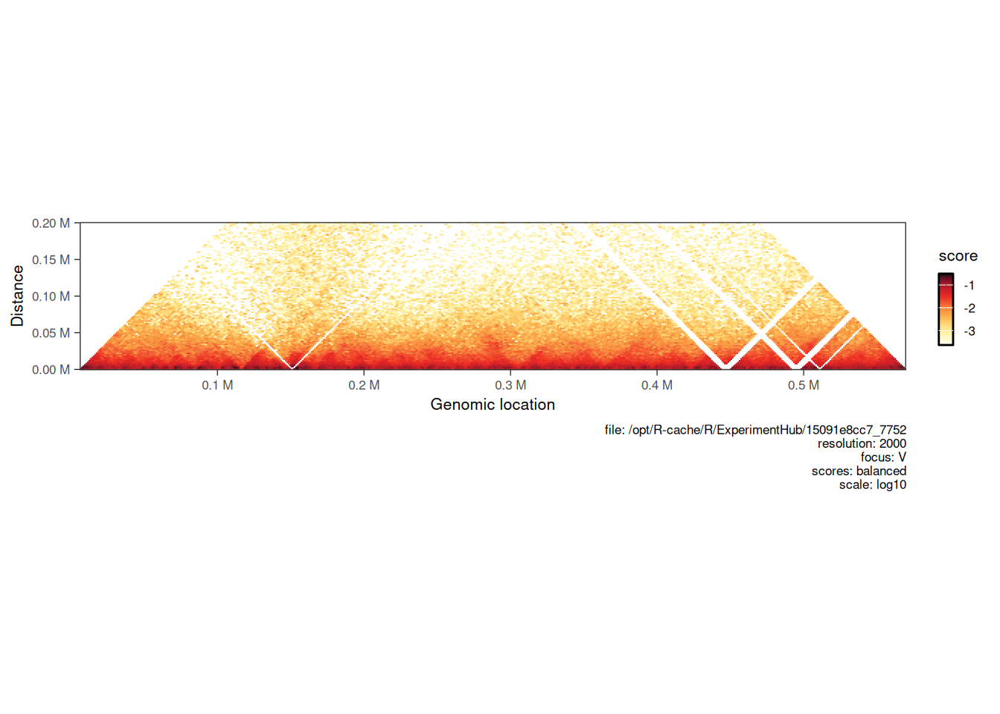
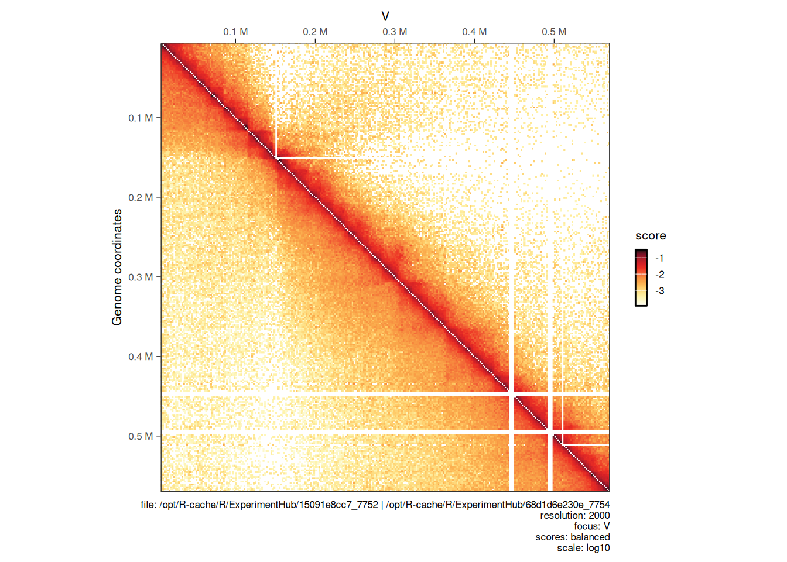
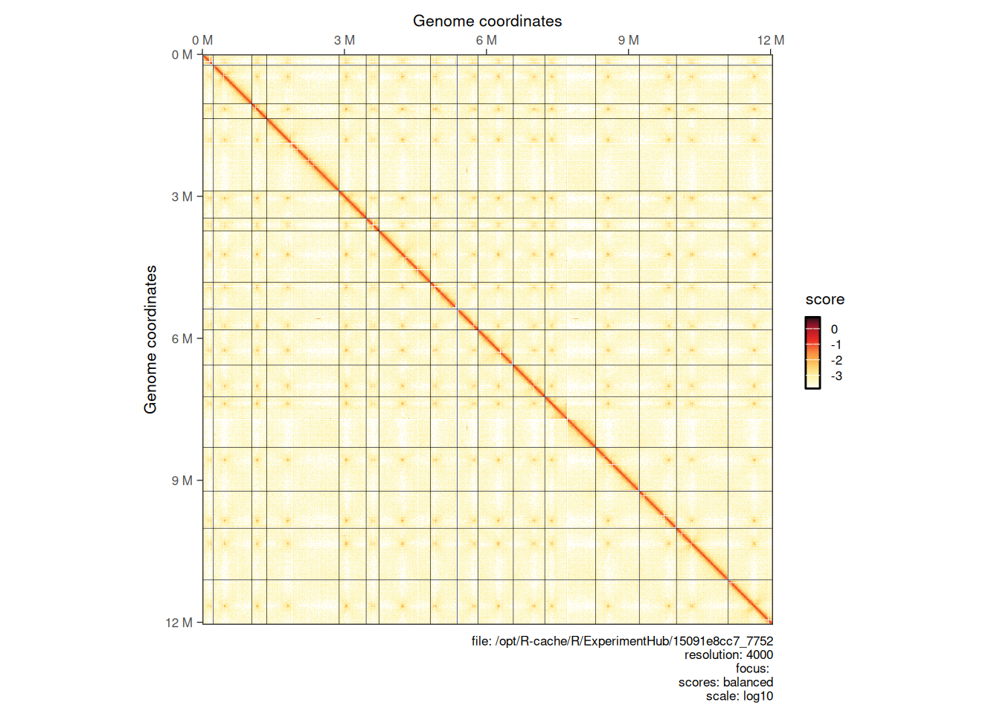
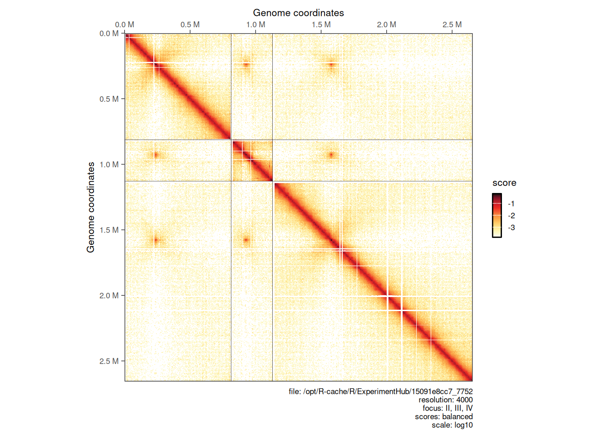
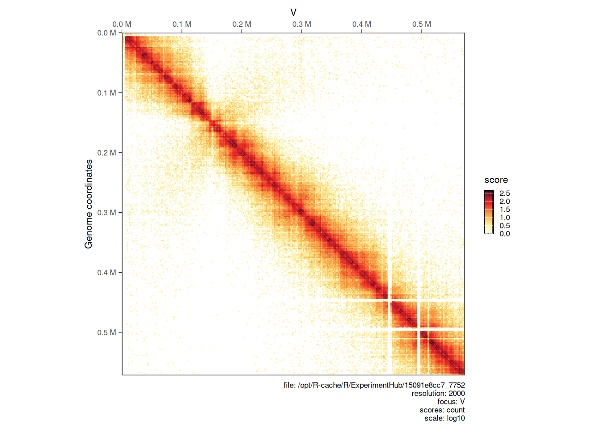
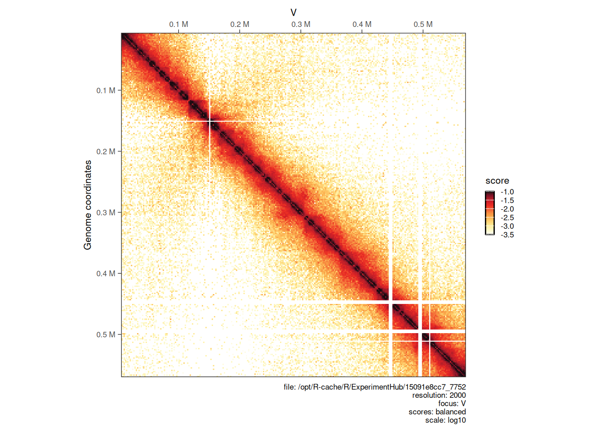
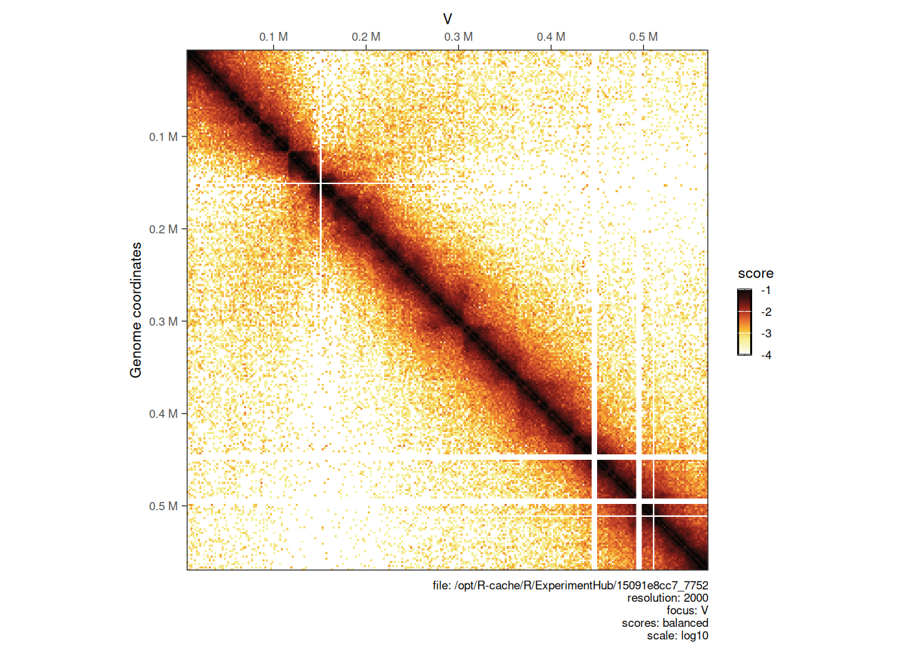
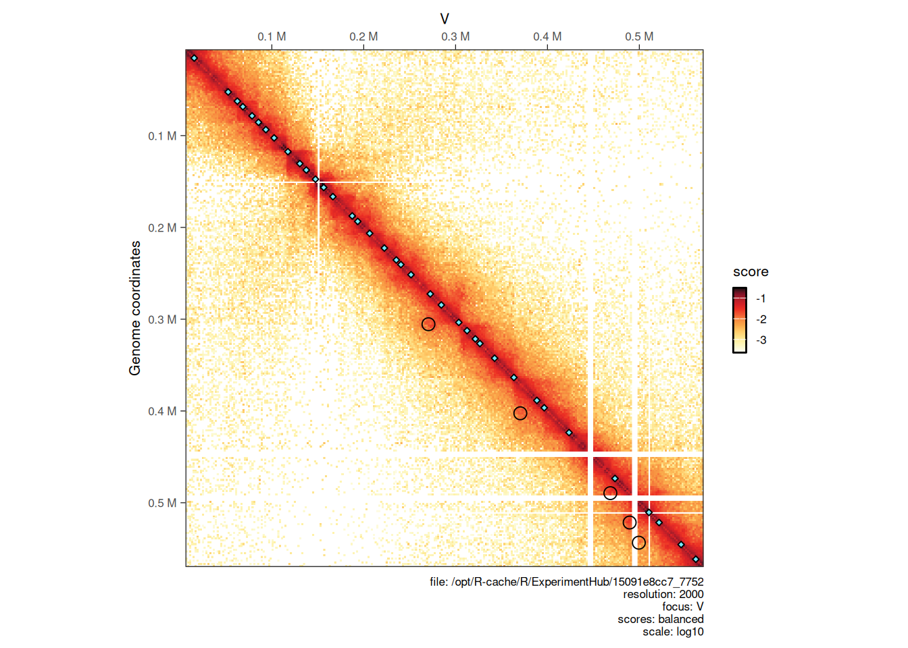
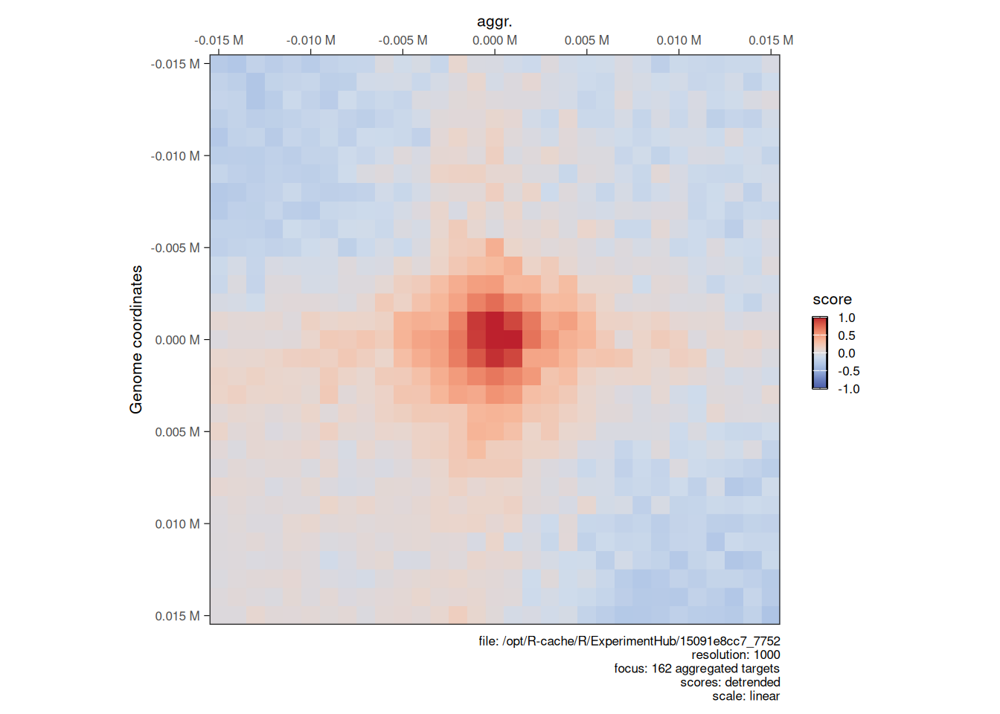

# 4  Hi-C data visualization

> **NOTE:**
>
> ``` downlit
> library(ggplot2)
> library(GenomicRanges)
> ##  Loading required package: stats4
> ##  Loading required package: BiocGenerics
> ##  Loading required package: generics
> ##  
> ##  Attaching package: 'generics'
> ##  The following objects are masked from 'package:base':
> ##  
> ##      as.difftime, as.factor, as.ordered, intersect, is.element,
> ##      setdiff, setequal, union
> ##  
> ##  Attaching package: 'BiocGenerics'
> ##  The following objects are masked from 'package:stats':
> ##  
> ##      IQR, mad, sd, var, xtabs
> ##  The following object is masked from 'package:utils':
> ##  
> ##      data
> ##  The following objects are masked from 'package:base':
> ##  
> ##      Filter, Find, Map, Position, Reduce, anyDuplicated, aperm,
> ##      append, as.data.frame, basename, cbind, colnames, dirname,
> ##      do.call, duplicated, eval, evalq, get, grep, grepl, is.unsorted,
> ##      lapply, mapply, match, mget, order, paste, pmax, pmax.int, pmin,
> ##      pmin.int, rank, rbind, rownames, sapply, saveRDS, scale,
> ##      sequence, table, tapply, transform, unique, unsplit, which.max,
> ##      which.min
> ##  Loading required package: S4Vectors
> ##  
> ##  Attaching package: 'S4Vectors'
> ##  The following object is masked from 'package:utils':
> ##  
> ##      findMatches
> ##  The following objects are masked from 'package:base':
> ##  
> ##      I, expand.grid, unname
> ##  Loading required package: IRanges
> ##  Loading required package: Seqinfo
> library(InteractionSet)
> ##  Loading required package: SummarizedExperiment
> ##  Loading required package: MatrixGenerics
> ##  Loading required package: matrixStats
> ##  
> ##  Attaching package: 'MatrixGenerics'
> ##  The following objects are masked from 'package:matrixStats':
> ##  
> ##      colAlls, colAnyNAs, colAnys, colAvgsPerRowSet, colCollapse,
> ##      colCounts, colCummaxs, colCummins, colCumprods, colCumsums,
> ##      colDiffs, colIQRDiffs, colIQRs, colLogSumExps, colMadDiffs,
> ##      colMads, colMaxs, colMeans2, colMedians, colMins, colOrderStats,
> ##      colProds, colQuantiles, colRanges, colRanks, colSdDiffs, colSds,
> ##      colSums2, colTabulates, colVarDiffs, colVars, colWeightedMads,
> ##      colWeightedMeans, colWeightedMedians, colWeightedSds,
> ##      colWeightedVars, rowAlls, rowAnyNAs, rowAnys, rowAvgsPerColSet,
> ##      rowCollapse, rowCounts, rowCummaxs, rowCummins, rowCumprods,
> ##      rowCumsums, rowDiffs, rowIQRDiffs, rowIQRs, rowLogSumExps,
> ##      rowMadDiffs, rowMads, rowMaxs, rowMeans2, rowMedians, rowMins,
> ##      rowOrderStats, rowProds, rowQuantiles, rowRanges, rowRanks,
> ##      rowSdDiffs, rowSds, rowSums2, rowTabulates, rowVarDiffs,
> ##      rowVars, rowWeightedMads, rowWeightedMeans, rowWeightedMedians,
> ##      rowWeightedSds, rowWeightedVars
> ##  Loading required package: Biobase
> ##  Welcome to Bioconductor
> ##  
> ##      Vignettes contain introductory material; view with
> ##      'browseVignettes()'. To cite Bioconductor, see
> ##      'citation("Biobase")', and for packages 'citation("pkgname")'.
> ##  
> ##  Attaching package: 'Biobase'
> ##  The following object is masked from 'package:MatrixGenerics':
> ##  
> ##      rowMedians
> ##  The following objects are masked from 'package:matrixStats':
> ##  
> ##      anyMissing, rowMedians
> library(HiCExperiment)
> ##  Consider using the `HiContacts` package to perform advanced genomic operations 
> ##  on `HiCExperiment` objects.
> ##  
> ##  Read "Orchestrating Hi-C analysis with Bioconductor" online book to learn more:
> ##  https://js2264.github.io/OHCA/
> ##  
> ##  Attaching package: 'HiCExperiment'
> ##  The following object is masked from 'package:SummarizedExperiment':
> ##  
> ##      metadata<-
> ##  The following object is masked from 'package:S4Vectors':
> ##  
> ##      metadata<-
> ##  The following object is masked from 'package:ggplot2':
> ##  
> ##      resolution
> library(HiContactsData)
> ##  Loading required package: ExperimentHub
> ##  Loading required package: AnnotationHub
> ##  Loading required package: BiocFileCache
> ##  Loading required package: dbplyr
> ##  OpenTelemetry error: there is no package called 'otelsdk'
> ##  OpenTelemetry error: there is no package called 'otelsdk'
> ##  
> ##  Attaching package: 'AnnotationHub'
> ##  The following object is masked from 'package:Biobase':
> ##  
> ##      cache
> library(HiContacts)
> ##  Registered S3 methods overwritten by 'readr':
> ##    method                    from 
> ##    as.data.frame.spec_tbl_df vroom
> ##    as_tibble.spec_tbl_df     vroom
> ##    format.col_spec           vroom
> ##    print.col_spec            vroom
> ##    print.collector           vroom
> ##    print.date_names          vroom
> ##    print.locale              vroom
> ##    str.col_spec              vroom
> library(rtracklayer)
> ##  
> ##  Attaching package: 'rtracklayer'
> ##  The following object is masked from 'package:AnnotationHub':
> ##  
> ##      hubUrl
> ```

> **NOTE:**
>
> This chapter focuses on the various visualization tools offered by `HiContacts` to plot `HiCExperiment` contact matrices in R.

> **TIP:**
>
> To demonstrate how to visualize a `HiCExperiment` contact matrix, we will create an `HiCExperiment` object from an example `.cool` file provided in the `HiContactsData` package.
>
> ``` downlit
> library(HiCExperiment)
> library(HiContactsData)
>
> # ---- This downloads an example `.mcool` file and caches it locally 
> coolf <- HiContactsData('yeast_wt', 'mcool')
> ##  see ?HiContactsData and browseVignettes('HiContactsData') for documentation
> ##  loading from cache
>
> # ---- This creates a connection to the disk-stored `.mcool` file
> cf <- CoolFile(coolf)
> cf
> ##  CoolFile object
> ##  .mcool file: /opt/R-cache/R/ExperimentHub/15091e8cc7_7752 
> ##  resolution: 1000 
> ##  pairs file: 
> ##  metadata(0):
>
> # ---- This imports contacts from the chromosome `V` at resolution `2000`
> hic <- import(cf, focus = 'V', resolution = 2000)
> ```
>
> ``` downlit
> hic
> ##  `HiCExperiment` object with 303,545 contacts over 289 regions 
> ##  -------
> ##  fileName: "/opt/R-cache/R/ExperimentHub/15091e8cc7_7752" 
> ##  focus: "V" 
> ##  resolutions(5): 1000 2000 4000 8000 16000
> ##  active resolution: 2000 
> ##  interactions: 20177 
> ##  scores(2): count balanced 
> ##  topologicalFeatures: compartments(0) borders(0) loops(0) viewpoints(0) 
> ##  pairsFile: N/A 
> ##  metadata(0):
> ```

## 4.1 Visualizing Hi-C contact maps

Visualizing Hi-C contact maps is often a necessary step in exploratory data analysis. A Hi-C contact map is usually displayed as a heatmap, in which:

- Each axis represents a section of the genome of interest (either a segment of a chromosome, or several chromosomes, …).
- The color code aims to represent “interaction frequency”, which can be expressed in “raw” counts or normalized (balanced).
- Other metrics can also be displayed in Hi-C heatmaps, e.g. ratios of interaction frequency between two Hi-C experiments, p-values of differential interaction analysis, …
- Axes are often identical, representing interactions constrained within a single genomic window, a.k.a. **on-diagonal** matrices.
- However, axes *can* be different: this is the case when **off-diagonal** matrices are displayed.

### 4.1.1 Single map

Simple visualization of disk-stored Hi-C contact matrices can be done by:

1.  Importing the interactions over the genomic location of interest into a `HiCExperiment` object;
2.  Using `plotMatrix` function (provided by `HiContacts`) to generate a plot.

``` downlit
library(HiContacts)
plotMatrix(hic)
```


> **NOTE:**
>
> A caption summarizing the plotting parameters is added below the heatmap. This can be removed with `caption = FALSE`.

### 4.1.2 Horizontal map

Hi-C maps are sometimes visualized in a “horizontal” style, where a square **on-diagonal** heatmap is tilted by 45˚ and truncated to only show interactions up to a certain distance from the main diagonal.

When a `maxDistance` argument is provided to `plotMatrix`, it automatically generates a horizontal-style heatmap.

``` downlit
plotMatrix(hic, maxDistance = 200000)
```



### 4.1.3 Side-by-side maps

Sometimes, one may want to visually plot 2 Hi-C samples side by side to compare the interaction landscapes over the same genomic locus. This can be done by adding a second `HiCExperiment` (imported with the same `focus`) with the `compare.to` argument.

Here, we are importing a second `.mcool` file corresponding to a Hi-C experiment performed in a *eco1* yeast mutant:

``` downlit
hic2 <- import(
    CoolFile(HiContactsData('yeast_eco1', 'mcool')), 
    focus = 'V', 
    resolution = 2000
)
##  see ?HiContactsData and browseVignettes('HiContactsData') for documentation
##  downloading 1 resources
##  retrieving 1 resource
##  loading from cache
```

We then plot the 2 matrices side by side. The first will be displayed in the top right corner and the second (provided with `compare.to`) will be in the bottom left corner.

``` downlit
plotMatrix(hic, compare.to = hic2)
##  [1] "/opt/R-cache/R/ExperimentHub/15091e8cc7_7752 | /opt/R-cache/R/ExperimentHub/68d1d6e230e_7754"
```



### 4.1.4 Plotting multiple chromosomes

Interactions from multiple chromosomes can be visualized in a Hi-C heatmap. One needs to (1) first parse the entire contact matrix in `R`, (2) then subset interactions over chromosomes of interest with `[` and (3) use `plotMatrix` to generate the multi-chromosome plot.

``` downlit
full_hic <- import(cf, resolution = 4000)
plotMatrix(full_hic)
```



``` downlit
hic_subset <- full_hic[c("II", "III", "IV")]
plotMatrix(hic_subset)
```



## 4.2 Hi-C maps customization options

A number of customization options are available for the `plotMatrix` function. The next subsections focus on how to:

- Pick the `scores` of interest to represent in a Hi-C heatmap;
- Change the numeric scale and boundaries;
- Change the color map;
- Extra customization options

### 4.2.1 Choosing scores

By default, `plotMatrix` will attempt to plot `balanced` (coverage normalized) Hi-C matrices. However, extra scores may be associated with interactions in a `HiCExperiment` object (more on this in the [next chapter](../pages/matrix-centric.llms.md))

For instance, we can plot the `count` scores, which are un-normalized raw contact counts directly obtained when binning a `.pairs` file:

``` downlit
plotMatrix(hic, use.scores = 'count')
```



### 4.2.2 Choosing scale

The color scale is automatically adjusted to range from the minimum to the maximum `scores` of the `HiCExperiment` being plotted. This can be adjusted using the `limits` argument.

``` downlit
plotMatrix(hic, limits = c(-3.5, -1))
```



### 4.2.3 Choosing color map

[`?HiContacts::palettes`](https://rdrr.io/pkg/HiContacts/man/palettes.html) returns a list of available color maps to use with `plotMatrix`. Any custom color map can also be used by manually specifying a vector of colors.

``` downlit
# ----- `afmhotr` color map is shipped in the `HiContacts` package
afmhotrColors() 
##  [1] "#ffffff" "#f8f5c3" "#f4ee8d" "#f6be35" "#ee7d32" "#c44228" "#821d19"
##  [8] "#381211" "#050606"
plotMatrix(
    hic, 
    use.scores = 'balanced',
    limits = c(-4, -1),
    cmap = afmhotrColors()
)
```



## 4.3 Advanced visualization

### 4.3.1 Overlaying topological features

Topological features (e.g. chromatin loops, domain borders, A/B compartments, e.g. …) are often displayed over a Hi-C heatmap.

To illustrate how to do this, let’s import pre-computed chromatin loops in `R`. These loops have been identified using `chromosight` (Matthey-Doret et al. ([2020](#ref-Matthey_Doret_2020))) on the contact matrix which we imported interactions from.

``` downlit
library(rtracklayer)
library(InteractionSet)
loops <- system.file('extdata', 'S288C-loops.bedpe', package = 'HiCExperiment') |> 
    import() |> 
    makeGInteractionsFromGRangesPairs()
loops
##  GInteractions object with 162 interactions and 0 metadata columns:
##          seqnames1       ranges1     seqnames2       ranges2
##              <Rle>     <IRanges>         <Rle>     <IRanges>
##      [1]         I     3001-4000 ---         I   29001-30000
##      [2]         I   29001-30000 ---         I   50001-51000
##      [3]         I   95001-96000 ---         I 128001-129000
##      [4]         I 133001-134000 ---         I 157001-158000
##      [5]        II     8001-9000 ---        II   46001-47000
##      ...       ...           ... ...       ...           ...
##    [158]       XVI 773001-774000 ---       XVI 803001-804000
##    [159]       XVI 834001-835000 ---       XVI 859001-860000
##    [160]       XVI 860001-861000 ---       XVI 884001-885000
##    [161]       XVI 901001-902000 ---       XVI 940001-941000
##    [162]       XVI 917001-918000 ---       XVI 939001-940000
##    -------
##    regions: 316 ranges and 0 metadata columns
##    seqinfo: 16 sequences from an unspecified genome; no seqlengths
```

Similarly, borders have also been mapped with `chromosight`. We can also import them in `R`.

``` downlit
borders <- system.file('extdata', 'S288C-borders.bed', package = 'HiCExperiment') |> 
    import()
borders
##  GRanges object with 814 ranges and 0 metadata columns:
##          seqnames        ranges strand
##             <Rle>     <IRanges>  <Rle>
##      [1]        I   73001-74000      *
##      [2]        I 108001-109000      *
##      [3]        I 181001-182000      *
##      [4]       II   90001-91000      *
##      [5]       II 119001-120000      *
##      ...      ...           ...    ...
##    [810]      XVI 777001-778000      *
##    [811]      XVI 796001-797000      *
##    [812]      XVI 811001-812000      *
##    [813]      XVI 890001-891000      *
##    [814]      XVI 933001-934000      *
##    -------
##    seqinfo: 16 sequences from an unspecified genome; no seqlengths
```

Chromatin loops are stored in `GInteractions` while borders are `GRanges`. The former will be displayed as **off-diagonal circles** and the later as **on-diagonal diamonds** on the Hi-C heatmap.

``` downlit
plotMatrix(hic, loops = loops, borders = borders)
```



### 4.3.2 Aggregated Hi-C maps

Finally, Hi-C map “snippets” (i.e. extracts) are often aggregated together to show an average signal. This analysis is sometimes referred to as APA (Aggregated Plot Analysis).

Aggregated Hi-C maps can be computed over a collection of `targets` using the `aggregate` function. These targets can be `GRanges` (to extract on-diagonal snippets) or `GInteractions` (to extract off-diagonal snippets). The `flankingBins` specifies how many matrix bins should be extracted on each side of the `targets` of interest.

Here, we compute the aggregated Hi-C snippets of ± 15kb around each chromatin loop listed in `loops`.

``` downlit
hic <- zoom(hic, 1000)
aggr_loops <- aggregate(hic, targets = loops, flankingBins = 15)
##  Going through preflight checklist...
##  Parsing the entire contact matrice as a sparse matrix...
##  Modeling distance decay...
##  Filtering for contacts within provided targets...
aggr_loops
##  `AggrHiCExperiment` object over 148 targets 
##  -------
##  fileName: "/opt/R-cache/R/ExperimentHub/15091e8cc7_7752" 
##  focus: 148 targets 
##  resolutions(5): 1000 2000 4000 8000 16000
##  active resolution: 1000 
##  interactions: 961 
##  scores(4): count balanced expected detrended 
##  slices(4): count balanced expected detrended 
##  topologicalFeatures: targets(148) compartments(0) borders(0) loops(0) viewpoints(0) 
##  pairsFile: N/A 
##  metadata(0):
```

`aggregate` generates a `AggrHiCExperiment` object, a flavor of `HiCExperiment` class of objects.

- `AggrHiCExperiment` objects have an extra `slices` slot. This stores a list of `array`s, one per `scores`. Each `array` is of 3 dimensions, `x` and `y` representing the heatmap axes, and `z` representing the index of the `target`.
- `AggrHiCExperiment` objects also have a mandatory `topologicalFeatures` element named `targets`, storing the genomic loci provided in `aggregate`.

``` downlit
slices(aggr_loops)
##  List of length 4
##  names(4): count balanced expected detrended
dim(slices(aggr_loops, 'count'))
##  [1]  31  31 148
topologicalFeatures(aggr_loops, 'targets')
##  Pairs object with 148 pairs and 0 metadata columns:
##                      first            second
##                  <GRanges>         <GRanges>
##      [1]     I:14501-44500     I:35501-65500
##      [2]    I:80501-110500   I:113501-143500
##      [3]   I:118501-148500   I:142501-172500
##      [4]    II:33501-63500    II:63501-93500
##      [5]  II:134501-164500  II:159501-189500
##      ...               ...               ...
##    [144] XVI:586501-616500 XVI:606501-636500
##    [145] XVI:733501-763500 XVI:754501-784500
##    [146] XVI:758501-788500 XVI:788501-818500
##    [147] XVI:819501-849500 XVI:844501-874500
##    [148] XVI:845501-875500 XVI:869501-899500
```

The resulting `AggrHiCExperiment` can be plotted using the same `plotMatrix` function with the arguments described above.

``` downlit
plotMatrix(
    aggr_loops, 
    use.scores = 'detrended', 
    scale = 'linear', 
    limits = c(-1, 1), 
    cmap = bgrColors()
)
```



# Session info

> **NOTE:**
>
> ``` downlit
> sessioninfo::session_info(include_base = TRUE)
> ##  ─ Session info ────────────────────────────────────────────────────────────
> ##   setting  value
> ##   version  R version 4.6.1 (2026-06-24)
> ##   os       Ubuntu 24.04.4 LTS
> ##   system   x86_64, linux-gnu
> ##   ui       X11
> ##   language (EN)
> ##   collate  C
> ##   ctype    en_US.UTF-8
> ##   tz       Etc/UTC
> ##   date     2026-10-06
> ##   pandoc   3.11 @ /usr/bin/ (via rmarkdown)
> ##   quarto   1.11.5 @ /usr/local/bin/quarto
> ##  
> ##  ─ Packages ────────────────────────────────────────────────────────────────
> ##   package              * version   date (UTC) lib source
> ##   abind                  1.4-8     2024-09-12 [2] RSPM (R 4.6.0)
> ##   AnnotationDbi          1.75.2    2026-07-21 [2] Bioconductor 3.24 (R 4.6.1)
> ##   AnnotationHub        * 4.3.2     2026-06-30 [2] Bioconductor 3.24 (R 4.6.1)
> ##   base                 * 4.6.1     2026-09-11 [3] local
> ##   beeswarm               0.4.0     2021-06-01 [2] RSPM (R 4.6.0)
> ##   Biobase              * 2.73.2    2026-07-29 [2] Bioconductor 3.24 (R 4.6.1)
> ##   BiocBaseUtils          1.15.1    2026-05-10 [2] Bioconductor 3.24 (R 4.6.1)
> ##   BiocFileCache        * 3.3.0     2026-04-28 [2] Bioconductor 3.24 (R 4.6.1)
> ##   BiocGenerics         * 0.59.12   2026-08-11 [2] Bioconductor 3.24 (R 4.6.1)
> ##   BiocIO                 1.23.3    2026-04-29 [2] Bioconductor 3.24 (R 4.6.1)
> ##   BiocManager            1.30.27   2025-11-14 [2] CRAN (R 4.6.1)
> ##   BiocParallel           1.47.0    2026-04-28 [2] Bioconductor 3.24 (R 4.6.1)
> ##   BiocVersion            3.24.0    2026-04-28 [2] Bioconductor 3.24 (R 4.6.1)
> ##   Biostrings             2.81.9    2026-09-06 [2] Bioconductor 3.24 (R 4.6.1)
> ##   bit                    4.6.0     2025-03-06 [2] RSPM (R 4.6.0)
> ##   bit64                  4.8.6     2026-09-01 [2] RSPM (R 4.6.0)
> ##   bitops                 1.1-0     2026-07-30 [2] RSPM (R 4.6.0)
> ##   blob                   1.3.0     2026-01-14 [2] RSPM (R 4.6.0)
> ##   cachem                 1.1.0     2024-05-16 [2] RSPM (R 4.6.0)
> ##   Cairo                  1.7-0     2025-10-29 [2] RSPM (R 4.6.0)
> ##   cigarillo              1.3.1     2026-07-13 [2] Bioconductor 3.24 (R 4.6.1)
> ##   cli                    3.6.6     2026-04-09 [2] RSPM (R 4.6.0)
> ##   codetools              0.2-20    2024-03-31 [3] CRAN (R 4.6.1)
> ##   compiler               4.6.1     2026-09-11 [3] local
> ##   crayon                 1.5.3     2024-06-20 [2] RSPM (R 4.6.0)
> ##   curl                   8.0.0     2026-08-25 [2] RSPM (R 4.6.0)
> ##   datasets             * 4.6.1     2026-09-11 [3] local
> ##   DBI                    1.3.0     2026-02-25 [2] RSPM (R 4.6.0)
> ##   dbplyr               * 2.6.0     2026-06-17 [2] RSPM (R 4.6.0)
> ##   DelayedArray           0.39.8    2026-09-30 [2] Bioconductor 3.24 (R 4.6.1)
> ##   dichromat              2.0-1     2026-07-22 [2] RSPM (R 4.6.0)
> ##   digest                 0.6.39    2025-11-19 [2] RSPM (R 4.6.0)
> ##   dplyr                  1.2.1     2026-04-03 [2] RSPM (R 4.6.0)
> ##   evaluate               1.0.5     2025-08-27 [2] RSPM (R 4.6.0)
> ##   ExperimentHub        * 3.3.2     2026-08-12 [2] Bioconductor 3.24 (R 4.6.1)
> ##   farver                 2.1.2     2024-05-13 [2] RSPM (R 4.6.0)
> ##   fastmap                1.2.0     2024-05-15 [2] RSPM (R 4.6.0)
> ##   filelock               1.0.3     2023-12-11 [2] RSPM (R 4.6.0)
> ##   generics             * 0.1.4     2025-05-09 [2] RSPM (R 4.6.0)
> ##   GenomicAlignments      1.49.2    2026-09-02 [2] Bioconductor 3.24 (R 4.6.1)
> ##   GenomicRanges        * 1.65.4    2026-09-02 [2] Bioconductor 3.24 (R 4.6.1)
> ##   ggbeeswarm             0.7.3     2025-11-29 [2] RSPM (R 4.6.0)
> ##   ggplot2              * 4.0.3     2026-04-22 [2] RSPM (R 4.6.0)
> ##   ggrastr                1.0.2     2023-06-01 [2] RSPM (R 4.6.0)
> ##   glue                   1.8.1     2026-04-17 [2] RSPM (R 4.6.0)
> ##   graphics             * 4.6.1     2026-09-11 [3] local
> ##   grDevices            * 4.6.1     2026-09-11 [3] local
> ##   grid                   4.6.1     2026-09-11 [3] local
> ##   gtable                 0.3.6     2024-10-25 [2] RSPM (R 4.6.0)
> ##   HiCExperiment        * 1.13.1    2026-10-04 [2] Bioconductor 3.24 (R 4.6.1)
> ##   HiContacts           * 1.15.2    2026-10-04 [2] Bioconductor 3.24 (R 4.6.1)
> ##   HiContactsData       * 1.5.3     2026-10-06 [2] Github (js2264/HiContactsData@d5bebe7)
> ##   hms                    1.1.4     2025-10-17 [2] RSPM (R 4.6.0)
> ##   htmltools              0.5.9     2025-12-04 [2] RSPM (R 4.6.0)
> ##   htmlwidgets            1.6.4     2023-12-06 [2] RSPM (R 4.6.0)
> ##   httr                   1.4.9     2026-09-01 [2] RSPM (R 4.6.0)
> ##   httr2                  1.3.0     2026-07-13 [2] RSPM (R 4.6.0)
> ##   InteractionSet       * 1.41.0    2026-04-28 [2] Bioconductor 3.24 (R 4.6.1)
> ##   IRanges              * 2.47.5    2026-08-27 [2] Bioconductor 3.24 (R 4.6.1)
> ##   jsonlite               2.0.0     2025-03-27 [2] RSPM (R 4.6.0)
> ##   KEGGREST               1.53.6    2026-07-23 [2] Bioconductor 3.24 (R 4.6.1)
> ##   knitr                  1.52      2026-09-06 [2] RSPM (R 4.6.0)
> ##   labeling               0.4.3     2023-08-29 [2] RSPM (R 4.6.0)
> ##   lattice                0.23-1    2026-08-12 [2] RSPM (R 4.6.0)
> ##   lifecycle              1.0.5     2026-01-08 [2] RSPM (R 4.6.0)
> ##   magrittr               2.0.5     2026-04-04 [2] RSPM (R 4.6.0)
> ##   Matrix                 1.7-6     2026-07-25 [2] RSPM (R 4.6.0)
> ##   MatrixGenerics       * 1.25.0    2026-04-28 [2] Bioconductor 3.24 (R 4.6.1)
> ##   matrixStats          * 1.5.0     2025-01-07 [2] RSPM (R 4.6.0)
> ##   memoise                2.0.1     2021-11-26 [2] RSPM (R 4.6.0)
> ##   methods              * 4.6.1     2026-09-11 [3] local
> ##   otel                   0.2.0     2025-08-29 [2] RSPM (R 4.6.0)
> ##   parallel               4.6.1     2026-09-11 [3] local
> ##   pillar                 1.11.1    2025-09-17 [2] RSPM (R 4.6.0)
> ##   pkgconfig              2.0.3     2019-09-22 [2] RSPM (R 4.6.0)
> ##   png                    0.1-9     2026-03-15 [2] RSPM (R 4.6.0)
> ##   purrr                  1.2.2     2026-04-10 [2] RSPM (R 4.6.0)
> ##   R6                     2.6.1     2025-02-15 [2] RSPM (R 4.6.0)
> ##   rappdirs               0.3.4     2026-01-17 [2] RSPM (R 4.6.0)
> ##   RColorBrewer           1.1-3     2022-04-03 [2] RSPM (R 4.6.0)
> ##   Rcpp                   1.1.2     2026-07-05 [2] RSPM (R 4.6.0)
> ##   RCurl                  1.98-1.20 2026-08-21 [2] RSPM (R 4.6.0)
> ##   readr                  2.2.0     2026-02-19 [2] RSPM (R 4.6.0)
> ##   restfulr               0.0.17    2026-06-11 [2] RSPM (R 4.6.0)
> ##   rhdf5                  2.57.18   2026-09-23 [2] Bioconductor 3.24 (R 4.6.1)
> ##   rhdf5filters           1.25.4    2026-08-06 [2] Bioconductor 3.24 (R 4.6.1)
> ##   Rhdf5lib               2.1.0     2026-04-28 [2] Bioconductor 3.24 (R 4.6.1)
> ##   rjson                  0.2.23    2024-09-16 [2] RSPM (R 4.6.0)
> ##   rlang                  1.3.0     2026-07-05 [2] RSPM (R 4.6.0)
> ##   rmarkdown              2.32      2026-09-01 [2] RSPM (R 4.6.0)
> ##   Rsamtools              2.29.0    2026-04-28 [2] Bioconductor 3.24 (R 4.6.1)
> ##   RSpectra               0.16-2    2024-07-18 [2] RSPM (R 4.6.0)
> ##   RSQLite                3.53.3    2026-06-30 [2] RSPM (R 4.6.0)
> ##   rtracklayer          * 1.73.0    2026-04-28 [2] Bioconductor 3.24 (R 4.6.1)
> ##   S4Arrays               1.13.2    2026-09-30 [2] Bioconductor 3.24 (R 4.6.1)
> ##   S4Vectors            * 0.51.10   2026-09-16 [2] Bioconductor 3.24 (R 4.6.1)
> ##   S7                     0.2.2     2026-04-22 [2] RSPM (R 4.6.0)
> ##   scales                 1.4.0     2025-04-24 [2] RSPM (R 4.6.0)
> ##   Seqinfo              * 1.3.2     2026-08-27 [2] Bioconductor 3.24 (R 4.6.1)
> ##   sessioninfo            1.2.4     2026-06-04 [2] RSPM (R 4.6.0)
> ##   SparseArray            1.13.4    2026-09-30 [2] Bioconductor 3.24 (R 4.6.1)
> ##   stats                * 4.6.1     2026-09-11 [3] local
> ##   stats4               * 4.6.1     2026-09-11 [3] local
> ##   strawr                 0.0.92    2024-07-16 [2] RSPM (R 4.6.0)
> ##   stringi                1.8.9     2026-08-04 [2] RSPM (R 4.6.0)
> ##   stringr                1.6.0     2025-11-04 [2] RSPM (R 4.6.0)
> ##   SummarizedExperiment * 1.43.0    2026-04-28 [2] Bioconductor 3.24 (R 4.6.1)
> ##   tibble                 3.3.1     2026-01-11 [2] RSPM (R 4.6.0)
> ##   tidyr                  1.3.2     2025-12-19 [2] RSPM (R 4.6.0)
> ##   tidyselect             1.2.1     2024-03-11 [2] RSPM (R 4.6.0)
> ##   tools                  4.6.1     2026-09-11 [3] local
> ##   tzdb                   0.5.0     2025-03-15 [2] RSPM (R 4.6.0)
> ##   utils                * 4.6.1     2026-09-11 [3] local
> ##   vctrs                  0.7.3     2026-04-11 [2] RSPM (R 4.6.0)
> ##   vipor                  0.4.7     2023-12-18 [2] RSPM (R 4.6.0)
> ##   vroom                  1.7.1     2026-03-31 [2] RSPM (R 4.6.0)
> ##   withr                  3.0.3     2026-06-19 [2] RSPM (R 4.6.0)
> ##   xfun                   0.61      2026-09-16 [2] RSPM (R 4.6.0)
> ##   XML                    3.99-0.25 2026-09-27 [2] RSPM (R 4.6.0)
> ##   XVector                0.53.0    2026-04-28 [2] Bioconductor 3.24 (R 4.6.1)
> ##   yaml                   2.3.12    2025-12-10 [2] RSPM (R 4.6.0)
> ##  
> ##   [1] /tmp/Rtmpu8u3NE/Rinstb3e0c7701
> ##   [2] /usr/local/lib/R/site-library
> ##   [3] /usr/local/lib/R/library
> ##   * ── Packages attached to the search path.
> ##  
> ##  ───────────────────────────────────────────────────────────────────────────
> ```

# References

Matthey-Doret, C., Baudry, L., Breuer, A., Montagne, R., Guiglielmoni, N., Scolari, V., Jean, E., Campeas, A., Chanut, P. H., Oriol, E., Méot, A., Politis, L., Vigouroux, A., Moreau, P., Koszul, R., & Cournac, A. (2020). Computer vision for pattern detection in chromosome contact maps. *Nature Communications*, *11*(1). <https://doi.org/10.1038/s41467-020-19562-7>
