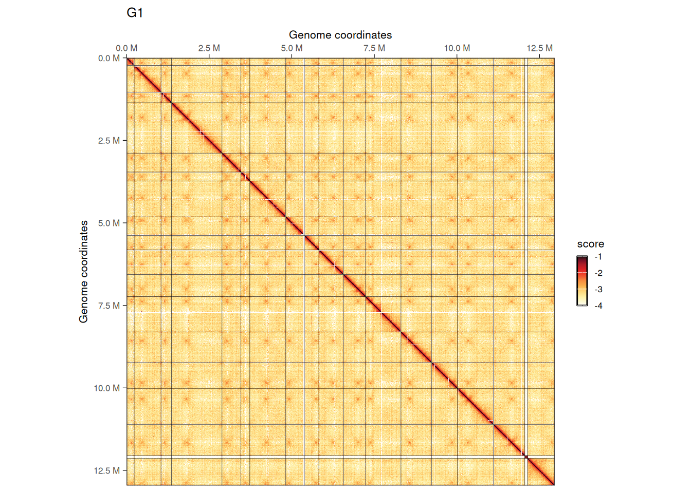
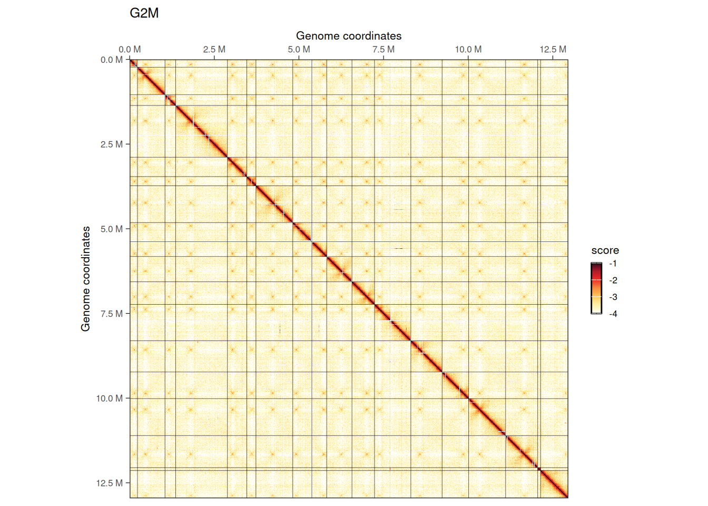
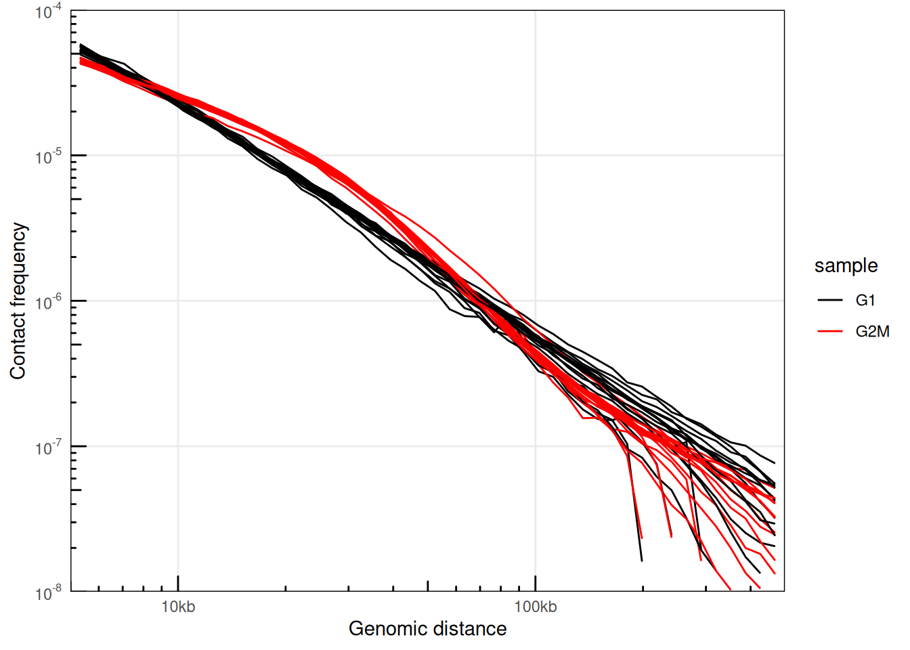
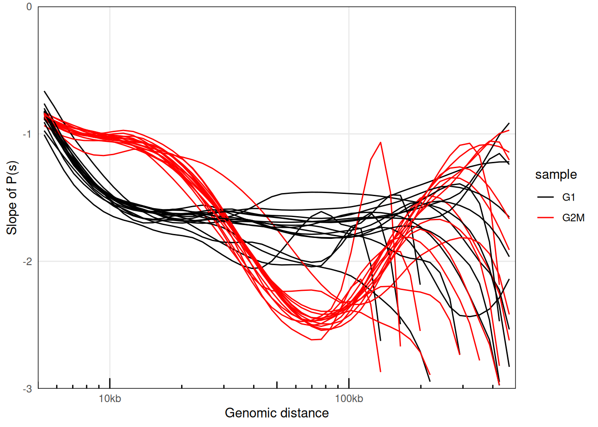
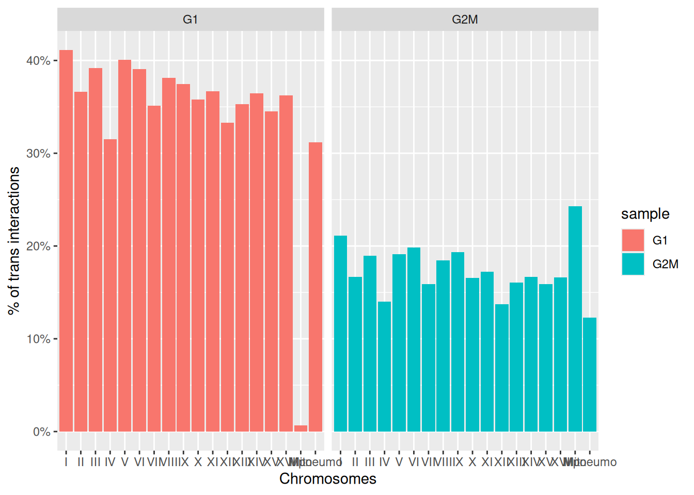
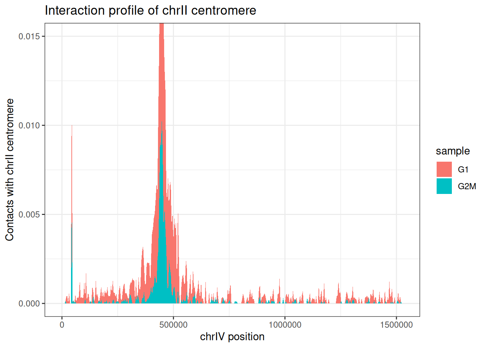
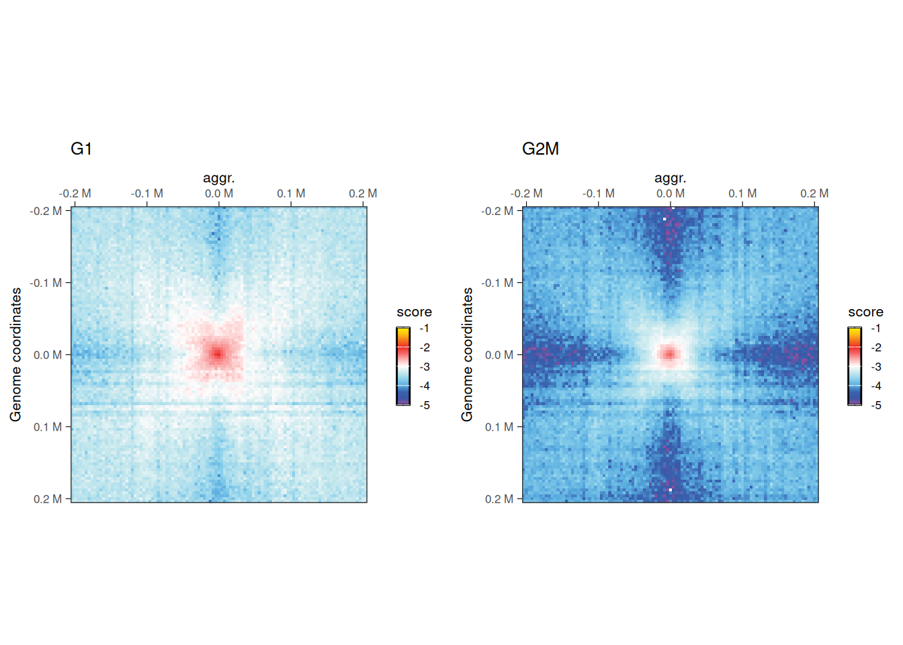
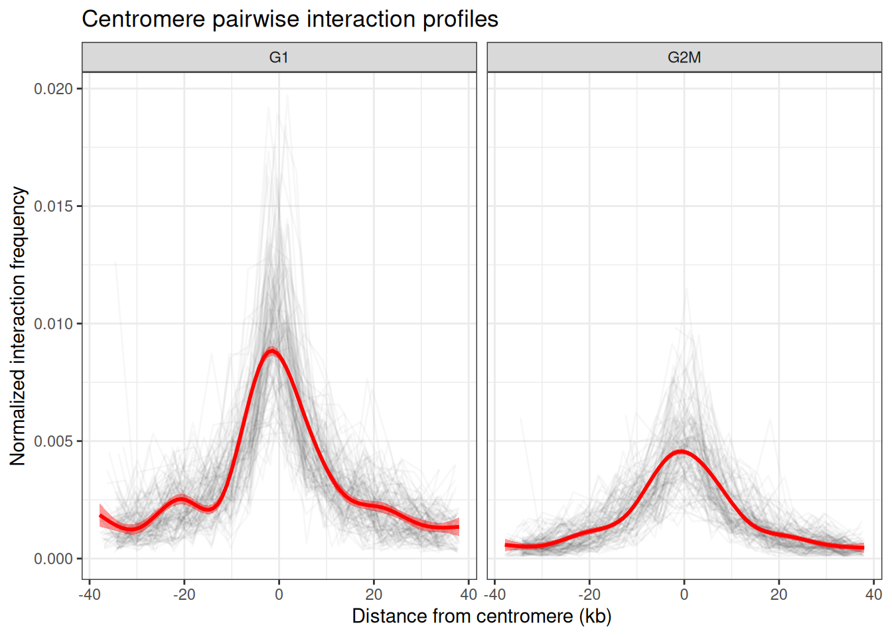

# Workflow 3: Inter-centromere interactions in yeast

> **NOTE:**
>
> ``` downlit
> library(ggplot2)
> library(purrr)
> library(GenomicRanges)
> ##  Loading required package: stats4
> ##  Loading required package: BiocGenerics
> ##  Loading required package: generics
> ##  
> ##  Attaching package: 'generics'
> ##  The following objects are masked from 'package:base':
> ##  
> ##      as.difftime, as.factor, as.ordered, intersect, is.element,
> ##      setdiff, setequal, union
> ##  
> ##  Attaching package: 'BiocGenerics'
> ##  The following objects are masked from 'package:stats':
> ##  
> ##      IQR, mad, sd, var, xtabs
> ##  The following object is masked from 'package:utils':
> ##  
> ##      data
> ##  The following objects are masked from 'package:base':
> ##  
> ##      Filter, Find, Map, Position, Reduce, anyDuplicated, aperm,
> ##      append, as.data.frame, basename, cbind, colnames, dirname,
> ##      do.call, duplicated, eval, evalq, get, grep, grepl, is.unsorted,
> ##      lapply, mapply, match, mget, order, paste, pmax, pmax.int, pmin,
> ##      pmin.int, rank, rbind, rownames, sapply, saveRDS, scale,
> ##      sequence, table, tapply, transform, unique, unsplit, which.max,
> ##      which.min
> ##  Loading required package: S4Vectors
> ##  
> ##  Attaching package: 'S4Vectors'
> ##  The following object is masked from 'package:utils':
> ##  
> ##      findMatches
> ##  The following objects are masked from 'package:base':
> ##  
> ##      I, expand.grid, unname
> ##  Loading required package: IRanges
> ##  
> ##  Attaching package: 'IRanges'
> ##  The following object is masked from 'package:purrr':
> ##  
> ##      reduce
> ##  Loading required package: Seqinfo
> library(InteractionSet)
> ##  Loading required package: SummarizedExperiment
> ##  Loading required package: MatrixGenerics
> ##  Loading required package: matrixStats
> ##  
> ##  Attaching package: 'MatrixGenerics'
> ##  The following objects are masked from 'package:matrixStats':
> ##  
> ##      colAlls, colAnyNAs, colAnys, colAvgsPerRowSet, colCollapse,
> ##      colCounts, colCummaxs, colCummins, colCumprods, colCumsums,
> ##      colDiffs, colIQRDiffs, colIQRs, colLogSumExps, colMadDiffs,
> ##      colMads, colMaxs, colMeans2, colMedians, colMins, colOrderStats,
> ##      colProds, colQuantiles, colRanges, colRanks, colSdDiffs, colSds,
> ##      colSums2, colTabulates, colVarDiffs, colVars, colWeightedMads,
> ##      colWeightedMeans, colWeightedMedians, colWeightedSds,
> ##      colWeightedVars, rowAlls, rowAnyNAs, rowAnys, rowAvgsPerColSet,
> ##      rowCollapse, rowCounts, rowCummaxs, rowCummins, rowCumprods,
> ##      rowCumsums, rowDiffs, rowIQRDiffs, rowIQRs, rowLogSumExps,
> ##      rowMadDiffs, rowMads, rowMaxs, rowMeans2, rowMedians, rowMins,
> ##      rowOrderStats, rowProds, rowQuantiles, rowRanges, rowRanks,
> ##      rowSdDiffs, rowSds, rowSums2, rowTabulates, rowVarDiffs,
> ##      rowVars, rowWeightedMads, rowWeightedMeans, rowWeightedMedians,
> ##      rowWeightedSds, rowWeightedVars
> ##  Loading required package: Biobase
> ##  Welcome to Bioconductor
> ##  
> ##      Vignettes contain introductory material; view with
> ##      'browseVignettes()'. To cite Bioconductor, see
> ##      'citation("Biobase")', and for packages 'citation("pkgname")'.
> ##  
> ##  Attaching package: 'Biobase'
> ##  The following object is masked from 'package:MatrixGenerics':
> ##  
> ##      rowMedians
> ##  The following objects are masked from 'package:matrixStats':
> ##  
> ##      anyMissing, rowMedians
> library(HiCExperiment)
> ##  Consider using the `HiContacts` package to perform advanced genomic operations 
> ##  on `HiCExperiment` objects.
> ##  
> ##  Read "Orchestrating Hi-C analysis with Bioconductor" online book to learn more:
> ##  https://js2264.github.io/OHCA/
> ##  
> ##  Attaching package: 'HiCExperiment'
> ##  The following object is masked from 'package:SummarizedExperiment':
> ##  
> ##      metadata<-
> ##  The following object is masked from 'package:S4Vectors':
> ##  
> ##      metadata<-
> ##  The following object is masked from 'package:ggplot2':
> ##  
> ##      resolution
> library(HiContactsData)
> ##  Loading required package: ExperimentHub
> ##  Loading required package: AnnotationHub
> ##  Loading required package: BiocFileCache
> ##  Loading required package: dbplyr
> ##  OpenTelemetry error: there is no package called 'otelsdk'
> ##  OpenTelemetry error: there is no package called 'otelsdk'
> ##  
> ##  Attaching package: 'AnnotationHub'
> ##  The following object is masked from 'package:Biobase':
> ##  
> ##      cache
> library(multiHiCcompare)
> ##  
> ##  Attaching package: 'multiHiCcompare'
> ##  The following object is masked from 'package:HiCExperiment':
> ##  
> ##      resolution
> ##  The following object is masked from 'package:ggplot2':
> ##  
> ##      resolution
> ```

> **NOTE:**
>
> This chapter illustrates how to plot the aggregate signal over pairs of genomic ranges, in this case pairs of yeast centromeres.

> **IMPORTANT:**
>
> We leverage two yeast datasets in this notebook.
>
> - One from a WT yeast strain in G1 phase
> - One from a WT yeast strain in G2/M phase

## Importing Hi-C data and plotting contact matrices

``` downlit
library(HiContactsData)
library(HiContacts)
##  Registered S3 methods overwritten by 'readr':
##    method                    from 
##    as.data.frame.spec_tbl_df vroom
##    as_tibble.spec_tbl_df     vroom
##    format.col_spec           vroom
##    print.col_spec            vroom
##    print.collector           vroom
##    print.date_names          vroom
##    print.locale              vroom
##    str.col_spec              vroom
library(purrr)
library(ggplot2)
hics <- list(
    'G1' = import(HiContactsData('yeast_g1', 'mcool'), format = 'cool', resolution = 4000),
    'G2M' = import(HiContactsData('yeast_g2m', 'mcool'), format = 'cool', resolution = 4000)
)
##  see ?HiContactsData and browseVignettes('HiContactsData') for documentation
##  downloading 1 resources
##  retrieving 1 resource
##  loading from cache
##  see ?HiContactsData and browseVignettes('HiContactsData') for documentation
##  downloading 1 resources
##  retrieving 1 resource
##  loading from cache
imap(hics, ~ plotMatrix(
    .x, use.scores = 'balanced', limits = c(-4, -1), caption = FALSE
) + ggtitle(.y))
##  $G1
```



    ##  
    ##  $G2M



We can visually appreciate that inter-chromosomal interactions, notably between centromeres, are less prominent in G2/M.

## Checking P(s) and cis/trans interactions ratio

``` downlit
library(dplyr)
##  
##  Attaching package: 'dplyr'
##  The following objects are masked from 'package:dbplyr':
##  
##      ident, sql, sql_escape_ident, sql_escape_string
##  The following object is masked from 'package:Biobase':
##  
##      combine
##  The following object is masked from 'package:matrixStats':
##  
##      count
##  The following objects are masked from 'package:GenomicRanges':
##  
##      intersect, setdiff, union
##  The following object is masked from 'package:Seqinfo':
##  
##      intersect
##  The following objects are masked from 'package:IRanges':
##  
##      collapse, desc, intersect, setdiff, slice, union
##  The following objects are masked from 'package:S4Vectors':
##  
##      first, intersect, rename, setdiff, setequal, union
##  The following objects are masked from 'package:BiocGenerics':
##  
##      combine, intersect, setdiff, setequal, union
##  The following object is masked from 'package:generics':
##  
##      explain
##  The following objects are masked from 'package:stats':
##  
##      filter, lag
##  The following objects are masked from 'package:base':
##  
##      intersect, setdiff, setequal, union
pairs <- list(
    'G1' = PairsFile(HiContactsData('yeast_g1', 'pairs')),
    'G2M' = PairsFile(HiContactsData('yeast_g2m', 'pairs')) 
)
##  see ?HiContactsData and browseVignettes('HiContactsData') for documentation
##  downloading 1 resources
##  retrieving 1 resource
##  loading from cache
##  see ?HiContactsData and browseVignettes('HiContactsData') for documentation
##  downloading 1 resources
##  retrieving 1 resource
##  loading from cache
ps <- imap_dfr(pairs, ~ distanceLaw(.x, by_chr = TRUE) |> 
    mutate(sample = .y) 
)
##  Importing pairs file /opt/R-cache/R/ExperimentHub/136a3879aeb_8630 in memory. This may take a while...
##  Importing pairs file /opt/R-cache/R/ExperimentHub/136a609ddc19_8631 in memory. This may take a while...
plotPs(ps, aes(x = binned_distance, y = norm_p, group = interaction(sample, chr), color = sample)) + 
    scale_color_manual(values = c('black', 'red'))
##  Warning: Removed 2133 rows containing missing values or values outside the scale
##  range (`geom_line()`).
```



``` downlit
plotPsSlope(ps, ggplot2::aes(x = binned_distance, y = slope, group = interaction(sample, chr), color = sample)) + 
    scale_color_manual(values = c('black', 'red'))
##  Warning: Removed 2183 rows containing missing values or values outside the scale
##  range (`geom_line()`).
```



This confirms that interactions in cells synchronized in G2/M are enriched for 10-30kb-long interactions.

``` downlit
ratios <- imap_dfr(hics, ~ cisTransRatio(.x) |> mutate(sample = .y))
ggplot(ratios, aes(x = chr, y = trans_pct, fill = sample)) + 
    geom_col() + 
    labs(x = 'Chromosomes', y = "% of trans interactions") + 
    scale_y_continuous(labels = scales::percent) + 
    facet_grid(~sample)
```



We can also highlight that trans (inter-chromosomal) interactions are proportionally decreasing in G2/M-synchronized cells.

## Centromere virtual 4C profiles

``` downlit
data(centros_yeast)
v4c_centro <- imap_dfr(hics, ~ virtual4C(.x, GenomicRanges::resize(centros_yeast[2], 8000)) |> 
    as_tibble() |> 
    mutate(sample = .y) |> 
    filter(seqnames == 'IV')
) 
ggplot(v4c_centro, aes(x = start, y = score, fill = sample)) +
    geom_area() +
    theme_bw() +
    labs(
        x = "chrIV position", 
        y = "Contacts with chrII centromere", 
        title = "Interaction profile of chrII centromere"
    ) + 
    coord_cartesian(ylim = c(0, 0.015))
```



## Aggregated 2D signal over all pairs of centromeres

We can start by computing all possible pairs of centromeres.

``` downlit
centros_pairs <- lapply(1:length(centros_yeast), function(i) {
    lapply(1:length(centros_yeast), function(j) {
        S4Vectors::Pairs(centros_yeast[i], centros_yeast[j])
    })
}) |> 
    do.call(c, args = _) |>
    do.call(c, args = _) |> 
    InteractionSet::makeGInteractionsFromGRangesPairs()
centros_pairs <- centros_pairs[anchors(centros_pairs, 'first') != anchors(centros_pairs, 'second')]

centros_pairs
##  GInteractions object with 240 interactions and 0 metadata columns:
##          seqnames1       ranges1     seqnames2       ranges2
##              <Rle>     <IRanges>         <Rle>     <IRanges>
##      [1]         I 151583-151641 ---        II 238361-238419
##      [2]         I 151583-151641 ---       III 114322-114380
##      [3]         I 151583-151641 ---        IV 449879-449937
##      [4]         I 151583-151641 ---         V 152522-152580
##      [5]         I 151583-151641 ---        VI 147981-148039
##      ...       ...           ... ...       ...           ...
##    [236]       XVI 556255-556313 ---        XI 440229-440287
##    [237]       XVI 556255-556313 ---       XII 151366-151424
##    [238]       XVI 556255-556313 ---      XIII 268222-268280
##    [239]       XVI 556255-556313 ---       XIV 628588-628646
##    [240]       XVI 556255-556313 ---        XV 326897-326955
##    -------
##    regions: 16 ranges and 0 metadata columns
##    seqinfo: 17 sequences (1 circular) from R64-1-1 genome
```

Then we can aggregate the Hi-C signal over each pair of centromeres.

``` downlit
aggr_maps <- purrr::imap(hics, ~ {
    aggr <- aggregate(.x, centros_pairs, maxDistance = 1e999)
    plotMatrix(
        aggr, use.scores = 'balanced', limits = c(-5, -1), 
        cmap = HiContacts::rainbowColors(), 
        caption = FALSE
    ) + ggtitle(.y)
})
##  Warning in valid.GenomicRanges.seqinfo(x, suggest.trim = TRUE): GRanges object contains 120 out-of-bound ranges located on sequences I,
##    III, V, VI, VIII, IX, XII, and XIV. Note that ranges located on a sequence
##    whose length is unknown (NA) or on a circular sequence are not considered
##    out-of-bound (use seqlengths() and isCircular() to get the lengths and
##    circularity flags of the underlying sequences). You can use trim() to trim
##    these ranges. See ?`trim,GenomicRanges-method` for more information.
##  Warning in valid.GenomicRanges.seqinfo(x, suggest.trim = TRUE): GRanges object contains 120 out-of-bound ranges located on sequences III,
##    V, VI, VIII, IX, XII, XIV, and I. Note that ranges located on a sequence
##    whose length is unknown (NA) or on a circular sequence are not considered
##    out-of-bound (use seqlengths() and isCircular() to get the lengths and
##    circularity flags of the underlying sequences). You can use trim() to trim
##    these ranges. See ?`trim,GenomicRanges-method` for more information.
##  Warning in valid.GenomicRanges.seqinfo(x, suggest.trim = TRUE): GRanges object contains 240 out-of-bound ranges located on sequences I,
##    III, V, VI, VIII, IX, XII, and XIV. Note that ranges located on a sequence
##    whose length is unknown (NA) or on a circular sequence are not considered
##    out-of-bound (use seqlengths() and isCircular() to get the lengths and
##    circularity flags of the underlying sequences). You can use trim() to trim
##    these ranges. See ?`trim,GenomicRanges-method` for more information.
##  Going through preflight checklist...
##  Parsing the entire contact matrice as a sparse matrix...
##  Modeling distance decay...
##  Filtering for contacts within provided targets...
##  Warning in valid.GenomicRanges.seqinfo(x, suggest.trim = TRUE): GRanges object contains 120 out-of-bound ranges located on sequences I,
##    III, V, VI, VIII, IX, XII, and XIV. Note that ranges located on a sequence
##    whose length is unknown (NA) or on a circular sequence are not considered
##    out-of-bound (use seqlengths() and isCircular() to get the lengths and
##    circularity flags of the underlying sequences). You can use trim() to trim
##    these ranges. See ?`trim,GenomicRanges-method` for more information.
##  Warning in valid.GenomicRanges.seqinfo(x, suggest.trim = TRUE): GRanges object contains 120 out-of-bound ranges located on sequences III,
##    V, VI, VIII, IX, XII, XIV, and I. Note that ranges located on a sequence
##    whose length is unknown (NA) or on a circular sequence are not considered
##    out-of-bound (use seqlengths() and isCircular() to get the lengths and
##    circularity flags of the underlying sequences). You can use trim() to trim
##    these ranges. See ?`trim,GenomicRanges-method` for more information.
##  Warning in valid.GenomicRanges.seqinfo(x, suggest.trim = TRUE): GRanges object contains 240 out-of-bound ranges located on sequences I,
##    III, V, VI, VIII, IX, XII, and XIV. Note that ranges located on a sequence
##    whose length is unknown (NA) or on a circular sequence are not considered
##    out-of-bound (use seqlengths() and isCircular() to get the lengths and
##    circularity flags of the underlying sequences). You can use trim() to trim
##    these ranges. See ?`trim,GenomicRanges-method` for more information.
##  Going through preflight checklist...
##  Parsing the entire contact matrice as a sparse matrix...
##  Modeling distance decay...
##  Filtering for contacts within provided targets...

cowplot::plot_grid(plotlist = aggr_maps, nrow = 1)
```



## Aggregated 1D interaction profile of centromeres

One can generalize the previous virtual 4C plot, by extracting the interaction profile between all possible pairs of centromeres in each dataset.

``` downlit
df <- map_dfr(1:{length(centros_yeast)-1}, function(i) {
    centro1 <- GenomicRanges::resize(centros_yeast[i], fix = 'center', 8000)
    map_dfr({i+1}:length(centros_yeast), function(j) {
        centro2 <- GenomicRanges::resize(centros_yeast[j], fix = 'center', 80000)
        gi <- InteractionSet::GInteractions(centro1, centro2)
        imap_dfr(hics, ~ .x[gi] |> 
            interactions() |> 
            as.data.frame() |> 
            as_tibble() |>
            mutate(
                sample = .y, 
                center = center2 - start(GenomicRanges::resize(centro2, fix = 'center', 1))
            ) |> 
            select(sample, seqnames1, seqnames2, center, balanced)
        )
    })
}) 
ggplot(df, aes(x = center/1e3, y = balanced)) + 
    geom_line(aes(group = interaction(seqnames1, seqnames2)), alpha = 0.03, col = "black") + 
    geom_smooth(col = "red", fill = "red") + 
    theme_bw() + 
    theme(legend.position = 'none') + 
    labs(
        x = "Distance from centromere (kb)", y = "Normalized interaction frequency", 
        title = "Centromere pairwise interaction profiles"
    ) +
    facet_grid(~sample)
##  `geom_smooth()` using method = 'gam' and formula = 'y ~ s(x, bs = "cs")'
##  Warning: Removed 25 rows containing non-finite outside the scale range
##  (`stat_smooth()`).
##  Warning: Removed 8 rows containing missing values or values outside the scale range
##  (`geom_line()`).
```



# Session info

> **NOTE:**
>
> ``` downlit
> sessioninfo::session_info(include_base = TRUE)
> ##  ─ Session info ────────────────────────────────────────────────────────────
> ##   setting  value
> ##   version  R version 4.6.1 (2026-06-24)
> ##   os       Ubuntu 24.04.4 LTS
> ##   system   x86_64, linux-gnu
> ##   ui       X11
> ##   language (EN)
> ##   collate  C
> ##   ctype    en_US.UTF-8
> ##   tz       Etc/UTC
> ##   date     2026-10-05
> ##   pandoc   3.11 @ /usr/bin/ (via rmarkdown)
> ##   quarto   1.11.5 @ /usr/local/bin/quarto
> ##  
> ##  ─ Packages ────────────────────────────────────────────────────────────────
> ##   package              * version    date (UTC) lib source
> ##   abind                  1.4-8      2024-09-12 [2] RSPM (R 4.6.0)
> ##   AnnotationDbi          1.75.2     2026-07-21 [2] Bioconductor 3.24 (R 4.6.1)
> ##   AnnotationHub        * 4.3.2      2026-06-30 [2] Bioconductor 3.24 (R 4.6.1)
> ##   base                 * 4.6.1      2026-09-11 [3] local
> ##   beeswarm               0.4.0      2021-06-01 [2] RSPM (R 4.6.0)
> ##   Biobase              * 2.73.2     2026-07-29 [2] Bioconductor 3.24 (R 4.6.1)
> ##   BiocBaseUtils          1.15.1     2026-05-10 [2] Bioconductor 3.24 (R 4.6.1)
> ##   BiocFileCache        * 3.3.0      2026-04-28 [2] Bioconductor 3.24 (R 4.6.1)
> ##   BiocGenerics         * 0.59.12    2026-08-11 [2] Bioconductor 3.24 (R 4.6.1)
> ##   BiocIO                 1.23.3     2026-04-29 [2] Bioconductor 3.24 (R 4.6.1)
> ##   BiocManager            1.30.27    2025-11-14 [2] CRAN (R 4.6.1)
> ##   BiocParallel           1.47.0     2026-04-28 [2] Bioconductor 3.24 (R 4.6.1)
> ##   BiocVersion            3.24.0     2026-04-28 [2] Bioconductor 3.24 (R 4.6.1)
> ##   Biostrings             2.81.9     2026-09-06 [2] Bioconductor 3.24 (R 4.6.1)
> ##   bit                    4.6.0      2025-03-06 [2] RSPM (R 4.6.0)
> ##   bit64                  4.8.6      2026-09-01 [2] RSPM (R 4.6.0)
> ##   blob                   1.3.0      2026-01-14 [2] RSPM (R 4.6.0)
> ##   cachem                 1.1.0      2024-05-16 [2] RSPM (R 4.6.0)
> ##   Cairo                  1.7-0      2025-10-29 [2] RSPM (R 4.6.0)
> ##   calibrate              1.7.7      2020-06-19 [2] RSPM (R 4.6.0)
> ##   cli                    3.6.6      2026-04-09 [2] RSPM (R 4.6.0)
> ##   codetools              0.2-20     2024-03-31 [3] CRAN (R 4.6.1)
> ##   compiler               4.6.1      2026-09-11 [3] local
> ##   cowplot                1.2.0      2025-07-07 [2] RSPM (R 4.6.0)
> ##   crayon                 1.5.3      2024-06-20 [2] RSPM (R 4.6.0)
> ##   curl                   8.0.0      2026-08-25 [2] RSPM (R 4.6.0)
> ##   data.table             1.18.6.1   2026-08-24 [2] RSPM (R 4.6.0)
> ##   datasets             * 4.6.1      2026-09-11 [3] local
> ##   DBI                    1.3.0      2026-02-25 [2] RSPM (R 4.6.0)
> ##   dbplyr               * 2.6.0      2026-06-17 [2] RSPM (R 4.6.0)
> ##   DelayedArray           0.39.8     2026-09-30 [2] Bioconductor 3.24 (R 4.6.1)
> ##   dichromat              2.0-1      2026-07-22 [2] RSPM (R 4.6.0)
> ##   digest                 0.6.39     2025-11-19 [2] RSPM (R 4.6.0)
> ##   dplyr                * 1.2.1      2026-04-03 [2] RSPM (R 4.6.0)
> ##   edgeR                  4.99.6     2026-09-13 [2] Bioconductor 3.24 (R 4.6.1)
> ##   evaluate               1.0.5      2025-08-27 [2] RSPM (R 4.6.0)
> ##   ExperimentHub        * 3.3.2      2026-08-12 [2] Bioconductor 3.24 (R 4.6.1)
> ##   farver                 2.1.2      2024-05-13 [2] RSPM (R 4.6.0)
> ##   fastmap                1.2.0      2024-05-15 [2] RSPM (R 4.6.0)
> ##   filelock               1.0.3      2023-12-11 [2] RSPM (R 4.6.0)
> ##   generics             * 0.1.4      2025-05-09 [2] RSPM (R 4.6.0)
> ##   GenomeInfoDb           1.49.1     2026-05-24 [2] Bioconductor 3.24 (R 4.6.1)
> ##   GenomeInfoDbData       1.2.15     2026-07-20 [2] Bioconductor
> ##   GenomicRanges        * 1.65.4     2026-09-02 [2] Bioconductor 3.24 (R 4.6.1)
> ##   ggbeeswarm             0.7.3      2025-11-29 [2] RSPM (R 4.6.0)
> ##   ggplot2              * 4.0.3      2026-04-22 [2] RSPM (R 4.6.0)
> ##   ggrastr                1.0.2      2023-06-01 [2] RSPM (R 4.6.0)
> ##   glue                   1.8.1      2026-04-17 [2] RSPM (R 4.6.0)
> ##   graphics             * 4.6.1      2026-09-11 [3] local
> ##   grDevices            * 4.6.1      2026-09-11 [3] local
> ##   grid                   4.6.1      2026-09-11 [3] local
> ##   gridExtra              2.3.1      2026-06-25 [2] RSPM (R 4.6.0)
> ##   gtable                 0.3.6      2024-10-25 [2] RSPM (R 4.6.0)
> ##   gtools                 3.9.5      2023-11-20 [2] RSPM (R 4.6.0)
> ##   HiCcompare             1.35.2     2026-10-01 [2] Bioconductor 3.24 (R 4.6.1)
> ##   HiCExperiment        * 1.13.1     2026-10-04 [2] Bioconductor 3.24 (R 4.6.1)
> ##   HiContacts           * 1.15.2     2026-10-04 [2] Bioconductor 3.24 (R 4.6.1)
> ##   HiContactsData       * 1.5.3      2026-10-05 [2] Github (js2264/HiContactsData@d5bebe7)
> ##   hms                    1.1.4      2025-10-17 [2] RSPM (R 4.6.0)
> ##   htmltools              0.5.9      2025-12-04 [2] RSPM (R 4.6.0)
> ##   htmlwidgets            1.6.4      2023-12-06 [2] RSPM (R 4.6.0)
> ##   httr                   1.4.9      2026-09-01 [2] RSPM (R 4.6.0)
> ##   httr2                  1.3.0      2026-07-13 [2] RSPM (R 4.6.0)
> ##   InteractionSet       * 1.41.0     2026-04-28 [2] Bioconductor 3.24 (R 4.6.1)
> ##   IRanges              * 2.47.5     2026-08-27 [2] Bioconductor 3.24 (R 4.6.1)
> ##   jsonlite               2.0.0      2025-03-27 [2] RSPM (R 4.6.0)
> ##   KEGGREST               1.53.6     2026-07-23 [2] Bioconductor 3.24 (R 4.6.1)
> ##   KernSmooth             2.23-27    2026-08-12 [2] RSPM (R 4.6.0)
> ##   knitr                  1.52       2026-09-06 [2] RSPM (R 4.6.0)
> ##   labeling               0.4.3      2023-08-29 [2] RSPM (R 4.6.0)
> ##   lattice                0.23-1     2026-08-12 [2] RSPM (R 4.6.0)
> ##   lifecycle              1.0.5      2026-01-08 [2] RSPM (R 4.6.0)
> ##   limma                  3.99.0     2026-08-31 [2] Bioconductor 3.24 (R 4.6.1)
> ##   locfit                 1.5-9.12   2025-03-05 [2] RSPM (R 4.6.0)
> ##   magrittr               2.0.5      2026-04-04 [2] RSPM (R 4.6.0)
> ##   MASS                   7.3-66     2026-07-15 [2] RSPM (R 4.6.0)
> ##   mathjaxr               2.0-0      2025-12-01 [2] RSPM (R 4.6.0)
> ##   Matrix                 1.7-6      2026-07-25 [2] RSPM (R 4.6.0)
> ##   MatrixGenerics       * 1.25.0     2026-04-28 [2] Bioconductor 3.24 (R 4.6.1)
> ##   matrixStats          * 1.5.0      2025-01-07 [2] RSPM (R 4.6.0)
> ##   memoise                2.0.1      2021-11-26 [2] RSPM (R 4.6.0)
> ##   metap                  1.14       2026-05-01 [2] RSPM (R 4.6.0)
> ##   methods              * 4.6.1      2026-09-11 [3] local
> ##   mgcv                   1.9-4      2025-11-07 [3] CRAN (R 4.6.1)
> ##   mnormt                 2.1.2      2026-01-27 [2] RSPM (R 4.6.0)
> ##   multcomp               1.4-32     2026-08-21 [2] RSPM (R 4.6.0)
> ##   multiHiCcompare      * 1.31.1     2026-07-09 [2] Bioconductor 3.24 (R 4.6.1)
> ##   multtest               2.69.0     2026-04-28 [2] Bioconductor 3.24 (R 4.6.1)
> ##   mutoss                 0.1-14     2026-01-08 [2] RSPM (R 4.6.0)
> ##   mvtnorm                1.4-2      2026-07-12 [2] RSPM (R 4.6.0)
> ##   nlme                   3.1-171    2026-09-01 [2] RSPM (R 4.6.0)
> ##   numDeriv               2016.8-1.1 2019-06-06 [2] RSPM (R 4.6.0)
> ##   otel                   0.2.0      2025-08-29 [2] RSPM (R 4.6.0)
> ##   parallel               4.6.1      2026-09-11 [3] local
> ##   pbapply                1.7-5      2026-09-01 [2] RSPM (R 4.6.0)
> ##   pheatmap               1.0.13     2025-06-05 [2] RSPM (R 4.6.0)
> ##   pillar                 1.11.1     2025-09-17 [2] RSPM (R 4.6.0)
> ##   pkgconfig              2.0.3      2019-09-22 [2] RSPM (R 4.6.0)
> ##   plotrix                3.8-14     2026-02-13 [2] RSPM (R 4.6.0)
> ##   png                    0.1-9      2026-03-15 [2] RSPM (R 4.6.0)
> ##   purrr                * 1.2.2      2026-04-10 [2] RSPM (R 4.6.0)
> ##   qqconf                 1.3.2      2023-04-14 [2] RSPM (R 4.6.0)
> ##   qqman                  0.1.9      2023-08-23 [2] RSPM (R 4.6.0)
> ##   R6                     2.6.1      2025-02-15 [2] RSPM (R 4.6.0)
> ##   rappdirs               0.3.4      2026-01-17 [2] RSPM (R 4.6.0)
> ##   rbibutils              2.4.1      2026-01-21 [2] RSPM (R 4.6.0)
> ##   RColorBrewer           1.1-3      2022-04-03 [2] RSPM (R 4.6.0)
> ##   Rcpp                   1.1.2      2026-07-05 [2] RSPM (R 4.6.0)
> ##   Rdpack                 2.6.6      2026-02-08 [2] RSPM (R 4.6.0)
> ##   readr                  2.2.0      2026-02-19 [2] RSPM (R 4.6.0)
> ##   rhdf5                  2.57.18    2026-09-23 [2] Bioconductor 3.24 (R 4.6.1)
> ##   rhdf5filters           1.25.4     2026-08-06 [2] Bioconductor 3.24 (R 4.6.1)
> ##   Rhdf5lib               2.1.0      2026-04-28 [2] Bioconductor 3.24 (R 4.6.1)
> ##   rlang                  1.3.0      2026-07-05 [2] RSPM (R 4.6.0)
> ##   rmarkdown              2.32       2026-09-01 [2] RSPM (R 4.6.0)
> ##   RSpectra               0.16-2     2024-07-18 [2] RSPM (R 4.6.0)
> ##   RSQLite                3.53.3     2026-06-30 [2] RSPM (R 4.6.0)
> ##   S4Arrays               1.13.2     2026-09-30 [2] Bioconductor 3.24 (R 4.6.1)
> ##   S4Vectors            * 0.51.10    2026-09-16 [2] Bioconductor 3.24 (R 4.6.1)
> ##   S7                     0.2.2      2026-04-22 [2] RSPM (R 4.6.0)
> ##   sandwich               3.1-3      2026-08-03 [2] RSPM (R 4.6.0)
> ##   scales                 1.4.0      2025-04-24 [2] RSPM (R 4.6.0)
> ##   Seqinfo              * 1.3.2      2026-08-27 [2] Bioconductor 3.24 (R 4.6.1)
> ##   sessioninfo            1.2.4      2026-06-04 [2] RSPM (R 4.6.0)
> ##   sn                     2.1.3      2026-02-24 [2] RSPM (R 4.6.0)
> ##   SparseArray            1.13.4     2026-09-30 [2] Bioconductor 3.24 (R 4.6.1)
> ##   splines                4.6.1      2026-09-11 [3] local
> ##   statmod                1.5.2      2026-05-17 [2] RSPM (R 4.6.0)
> ##   stats                * 4.6.1      2026-09-11 [3] local
> ##   stats4               * 4.6.1      2026-09-11 [3] local
> ##   strawr                 0.0.92     2024-07-16 [2] RSPM (R 4.6.0)
> ##   stringi                1.8.9      2026-08-04 [2] RSPM (R 4.6.0)
> ##   stringr                1.6.0      2025-11-04 [2] RSPM (R 4.6.0)
> ##   SummarizedExperiment * 1.43.0     2026-04-28 [2] Bioconductor 3.24 (R 4.6.1)
> ##   survival               3.8-12     2026-09-09 [2] RSPM (R 4.6.0)
> ##   TFisher                0.2.1      2026-08-25 [2] RSPM (R 4.6.0)
> ##   TH.data                1.1-5      2025-11-17 [2] RSPM (R 4.6.0)
> ##   tibble                 3.3.1      2026-01-11 [2] RSPM (R 4.6.0)
> ##   tidyr                  1.3.2      2025-12-19 [2] RSPM (R 4.6.0)
> ##   tidyselect             1.2.1      2024-03-11 [2] RSPM (R 4.6.0)
> ##   tools                  4.6.1      2026-09-11 [3] local
> ##   tzdb                   0.5.0      2025-03-15 [2] RSPM (R 4.6.0)
> ##   UCSC.utils             1.9.0      2026-04-28 [2] Bioconductor 3.24 (R 4.6.1)
> ##   utils                * 4.6.1      2026-09-11 [3] local
> ##   vctrs                  0.7.3      2026-04-11 [2] RSPM (R 4.6.0)
> ##   vipor                  0.4.7      2023-12-18 [2] RSPM (R 4.6.0)
> ##   vroom                  1.7.1      2026-03-31 [2] RSPM (R 4.6.0)
> ##   withr                  3.0.3      2026-06-19 [2] RSPM (R 4.6.0)
> ##   xfun                   0.61       2026-09-16 [2] RSPM (R 4.6.0)
> ##   XVector                0.53.0     2026-04-28 [2] Bioconductor 3.24 (R 4.6.1)
> ##   yaml                   2.3.12     2025-12-10 [2] RSPM (R 4.6.0)
> ##   zoo                    1.9-1      2026-09-25 [2] RSPM (R 4.6.0)
> ##  
> ##   [1] /tmp/RtmpIHYEk6/Rinstb5256c58e
> ##   [2] /usr/local/lib/R/site-library
> ##   [3] /usr/local/lib/R/library
> ##   * ── Packages attached to the search path.
> ##  
> ##  ───────────────────────────────────────────────────────────────────────────
> ```

# References
