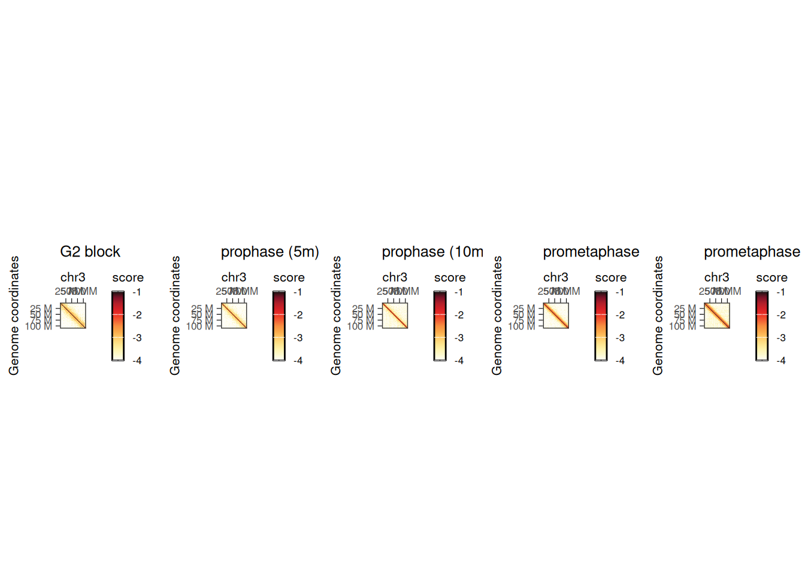
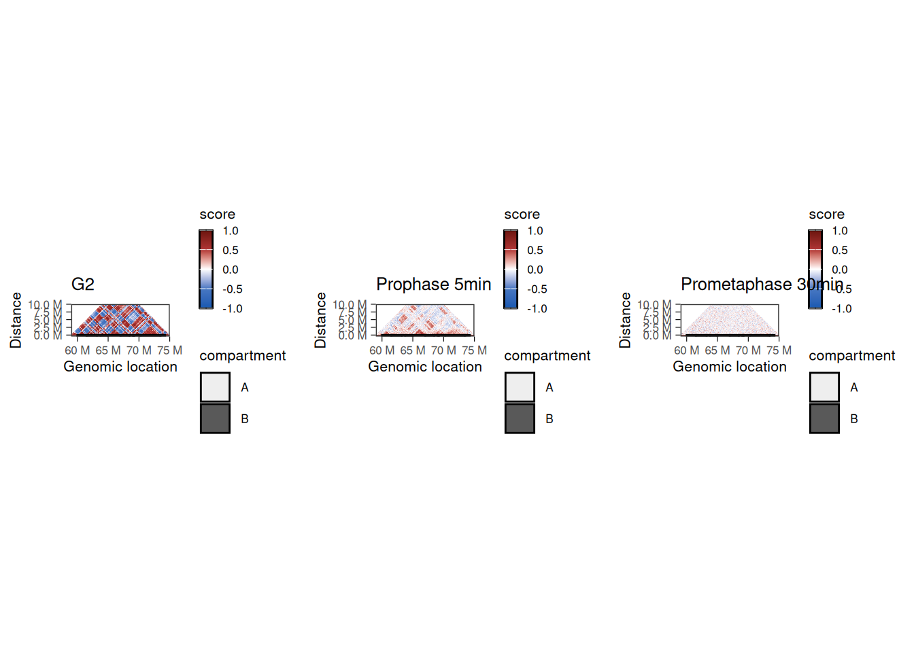
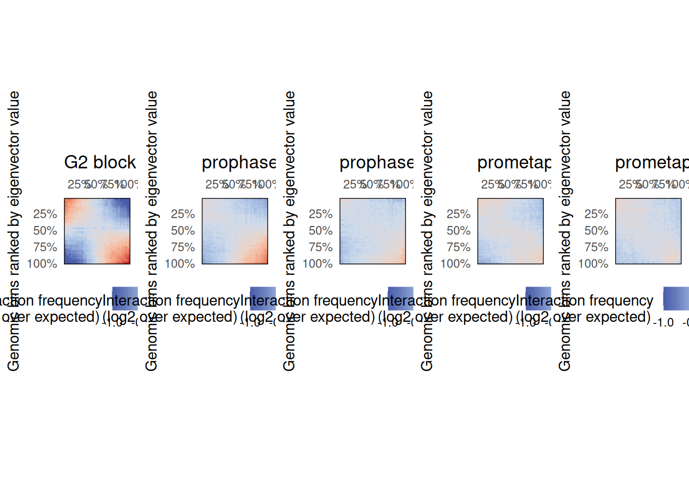
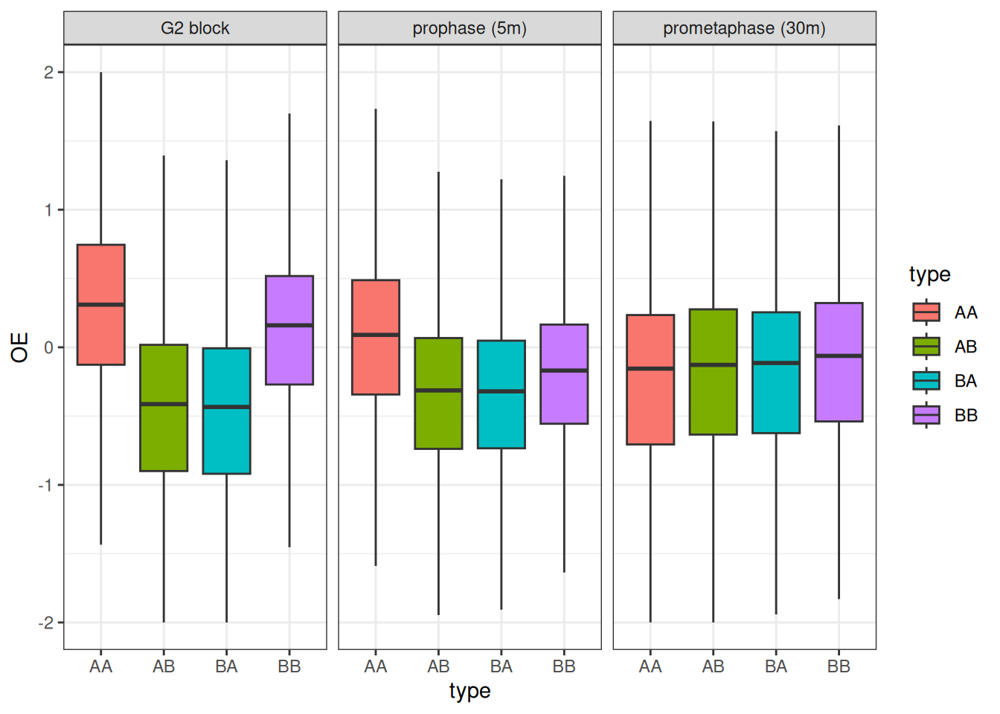

# Workflow 2: Chromosome compartment cohesion upon mitosis entry

> **NOTE:**
>
> ``` downlit
> library(ggplot2)
> library(cowplot)
> library(purrr)
> library(HiCExperiment)
> ##  Consider using the `HiContacts` package to perform advanced genomic operations 
> ##  on `HiCExperiment` objects.
> ##  
> ##  Read "Orchestrating Hi-C analysis with Bioconductor" online book to learn more:
> ##  https://js2264.github.io/OHCA/
> ##  
> ##  Attaching package: 'HiCExperiment'
> ##  The following object is masked from 'package:ggplot2':
> ##  
> ##      resolution
> library(HiContactsData)
> ##  Loading required package: ExperimentHub
> ##  Loading required package: BiocGenerics
> ##  Loading required package: generics
> ##  
> ##  Attaching package: 'generics'
> ##  The following objects are masked from 'package:base':
> ##  
> ##      as.difftime, as.factor, as.ordered, intersect, is.element,
> ##      setdiff, setequal, union
> ##  
> ##  Attaching package: 'BiocGenerics'
> ##  The following objects are masked from 'package:stats':
> ##  
> ##      IQR, mad, sd, var, xtabs
> ##  The following object is masked from 'package:utils':
> ##  
> ##      data
> ##  The following objects are masked from 'package:base':
> ##  
> ##      Filter, Find, Map, Position, Reduce, anyDuplicated, aperm,
> ##      append, as.data.frame, basename, cbind, colnames, dirname,
> ##      do.call, duplicated, eval, evalq, get, grep, grepl, is.unsorted,
> ##      lapply, mapply, match, mget, order, paste, pmax, pmax.int, pmin,
> ##      pmin.int, rank, rbind, rownames, sapply, saveRDS, scale,
> ##      sequence, table, tapply, transform, unique, unsplit, which.max,
> ##      which.min
> ##  Loading required package: AnnotationHub
> ##  Loading required package: BiocFileCache
> ##  Loading required package: dbplyr
> ##  OpenTelemetry error: there is no package called 'otelsdk'
> ##  OpenTelemetry error: there is no package called 'otelsdk'
> library(fourDNData)
> ```

> **NOTE:**
>
> This chapter illustrates how to:
>
> - Annotate compartments for a list of HiC experiments
> - Generate saddle plots for a list of HiC experiments
> - Quantify changes in interactions between compartments between different timepoints

> **IMPORTANT:**
>
> We leverage five chicken datasets in this notebook, published in Gibcus et al. ([2018](#ref-Gibcus_2018)). They are all available from the 4DN data portal using the `fourDNData` package.
>
> - `4DNES9LEZXN7`: chicken cell culture blocked in G2
> - `4DNESNWWIFZU`: chicken cell culture released from G2 block (5min)
> - `4DNESGDXKM2I`: chicken cell culture released from G2 block (10min)
> - `4DNESIR416OW`: chicken cell culture released from G2 block (15min)
> - `4DNESS8PTK6F`: chicken cell culture released from G2 block (30min)

## Importing data

The 4DN consortium provides access to the datasets published in Gibcus et al. ([2018](#ref-Gibcus_2018)). in `R`, they can be obtained thanks to the `fourDNData` gateway package.

> **WARNING:**
>
> The first time the following chunk of code is executed, it will cache a large amount of data (mostly consisting of contact matrices stored in `.mcool` files).

``` downlit
library(HiCExperiment)
library(fourDNData)
library(BiocParallel)
samples <- list(
    '4DNES9LEZXN7' = 'G2 block', 
    '4DNESNWWIFZU' = 'prophase (5m)', 
    '4DNESGDXKM2I' = 'prophase (10m)', 
    '4DNESIR416OW' = 'prometaphase (15m)', 
    '4DNESS8PTK6F' = 'prometaphase (30m)' 
)
bpparam <- MulticoreParam(workers = 5, progressbar = FALSE)
hics <- bplapply(names(samples), fourDNHiCExperiment, BPPARAM = bpparam)
##  
##  
```

``` downlit
names(hics) <- samples

hics[["G2 block"]]
##  `HiCExperiment` object with 150,494,008 contacts over 4,109 regions 
##  -------
##  fileName: "/opt/R-cache/R/fourDNData/12fd795624ba_4DNFIT479GDR.mcool" 
##  focus: "whole genome" 
##  resolutions(13): 1000 2000 ... 5000000 10000000
##  active resolution: 250000 
##  interactions: 7262748 
##  scores(2): count balanced 
##  topologicalFeatures: compartments(891) borders(3465) 
##  pairsFile: N/A 
##  metadata(3): 4DN_info eigens diamond_insulation
```

## Plotting whole chromosome matrices

We can visualize the five different Hi-C maps on the entire chromosome `3` with `HiContacts` by iterating over each of the `HiCExperiment` objects.

``` downlit
library(purrr)
library(HiContacts)
##  Registered S3 methods overwritten by 'readr':
##    method                    from 
##    as.data.frame.spec_tbl_df vroom
##    as_tibble.spec_tbl_df     vroom
##    format.col_spec           vroom
##    print.col_spec            vroom
##    print.collector           vroom
##    print.date_names          vroom
##    print.locale              vroom
##    str.col_spec              vroom
library(ggplot2)
pl <- imap(hics, ~ .x['chr3'] |> 
    zoom(100000) |> 
    plotMatrix(use.scores = 'balanced', limits = c(-4, -1), caption = FALSE) + 
    ggtitle(.y)
)
library(cowplot)
plot_grid(plotlist = pl, nrow = 1)
```



This highlights the progressive remodeling of chromatin into condensed chromosomes, starting as soon as 5’ after release from G2 phase.

## Zooming on a chromosome section

Zooming on a chromosome section, we can plot the Hi-C autocorrelation matrix for each timepoint. These matrices are generally used to highlight the overall correlation of interaction profiles between different segments of a chromosome section (see [Chapter 5](../pages/matrix-centric.llms.md#computing-autocorrelated-map) for more details).

``` downlit
## --- Format compartment positions of chr. 4 segment
.chr <- 'chr4'
.start <- 59000000L
.stop <- 75000000L
library(GenomicRanges)
##  Loading required package: stats4
##  Loading required package: S4Vectors
##  
##  Attaching package: 'S4Vectors'
##  The following object is masked from 'package:HiCExperiment':
##  
##      metadata<-
##  The following object is masked from 'package:utils':
##  
##      findMatches
##  The following objects are masked from 'package:base':
##  
##      I, expand.grid, unname
##  Loading required package: IRanges
##  
##  Attaching package: 'IRanges'
##  The following object is masked from 'package:purrr':
##  
##      reduce
##  Loading required package: Seqinfo
coords <- GRanges(paste0(.chr, ':', .start, '-', .stop))
compts_df <- topologicalFeatures(hics[["G2 block"]], "compartments") |> 
    subsetByOverlaps(coords, type = 'within') |> 
    as.data.frame()
compts_gg <- geom_rect(
    data = compts_df, 
    mapping = aes(xmin = start, xmax = end, ymin = -500000, ymax = 0, alpha = compartment), 
    col = 'black', inherit.aes = FALSE
)

## --- Subset contact matrices to chr. 4 segment and computing autocorrelation scores
g2 <- hics[["G2 block"]] |> 
    zoom(100000) |> 
    subsetByOverlaps(coords) |>
    autocorrelate()
pro5 <- hics[["prophase (5m)"]] |> 
    zoom(100000) |> 
    subsetByOverlaps(coords) |>
    autocorrelate()
pro30 <- hics[["prometaphase (30m)"]] |> 
    zoom(100000) |> 
    subsetByOverlaps(coords) |>
    autocorrelate()

## --- Plot autocorrelation matrices
plot_grid(
    plotMatrix(
        subsetByOverlaps(g2, coords),
        use.scores = 'autocorrelated', 
        scale = 'linear', 
        limits = c(-1, 1), 
        cmap = bwrColors(), 
        maxDistance = 10000000, 
        caption = FALSE
    ) + ggtitle('G2') + compts_gg,
    plotMatrix(
        subsetByOverlaps(pro5, coords),
        use.scores = 'autocorrelated', 
        scale = 'linear', 
        limits = c(-1, 1), 
        cmap = bwrColors(), 
        maxDistance = 10000000, 
        caption = FALSE
    ) + ggtitle('Prophase 5min') + compts_gg,
    plotMatrix(
        subsetByOverlaps(pro30, coords),
        use.scores = 'autocorrelated', 
        scale = 'linear', 
        limits = c(-1, 1), 
        cmap = bwrColors(), 
        maxDistance = 10000000, 
        caption = FALSE
    ) + ggtitle('Prometaphase 30min') + compts_gg,
    nrow = 1
)
##  Warning: Using alpha for a discrete variable is not advised.
##  Using alpha for a discrete variable is not advised.
##  Using alpha for a discrete variable is not advised.
```



These correlation matrices suggest that there are two different regimes of chromatin compartment remodeling in this chromosome section:

1.  Correlation scores between genomic bins within the compartment A remain positive 5’ after G2 release (albeit reduced compared to G2 block) and eventually become null 30’ after G2 release.
2.  Correlation scores between genomic bins within the compartment B are overall null as soon as 5’ after G2 release.

## Generating saddle plots

Saddle plots are typically used to measure the `observed` vs. `expected` interaction scores within or between genomic loci belonging to A and B compartments. Here, they can be used to check whether the two regimes of chromatin compartment remodeling are observed genome-wide.

Non-overlapping genomic windows are grouped by `nbins` quantiles (typically between 10 and 50 bins) according to their A/B compartment eigenvector value, from lowest eigenvector values (i.e. strongest B compartments) to highest eigenvector values (i.e. strongest A compartments). The average `observed` vs. `expected` interaction scores are computed for pairwise eigenvector quantiles and plotted in a 2D heatmap.

``` downlit
pl <- imap(hics, ~ plotSaddle(.x, nbins = 38, BPPARAM = bpparam) + ggtitle(.y)) 
plot_grid(plotlist = pl, nrow = 1)
```



These plots confirm the previous observation made on chr. `4` and reveal that intra-B compartment interactions are generally lost 5’ after G2 release, while intra-A interactions take up to 15’ after G2 release to disappear.

> **WARNING:**
>
> The [`plotSaddle()`](https://rdrr.io/pkg/HiContacts/man/plotSaddle.html) function requires an eigenvector corresponding to A/B compartments. In this example, this eigenvector is recovered from the 4DN data portal. If not already available, this eigenvector can be computed from the contact matrix using the [`getCompartments()`](https://rdrr.io/pkg/HiContacts/man/getCompartments.html) function.

## Quantifying interactions within and between compartments

We can leverage the replicate-merged contact matrices to quantify the interaction frequencies within A or B compartments or between A and B compartments, at different timepoints.

We can use the A/B compartment annotations obtained at the `G2 block` timepoint and extract `O/E` (observed vs expected) scores for interactions within A or B compartments or between A and B compartments, at different timepoints.

``` downlit
## --- Extract the A/B compartments identified in G2 block
compts <- topologicalFeatures(hics[["G2 block"]], "compartments")
compts$ID <- paste0(compts$compartment, seq_along(compts))

## --- Iterate over timepoints to extract `detrended` (O/E) scores and 
##     compartment annotations
library(tibble)
library(plyranges)
##  Loading required package: dplyr
##  
##  Attaching package: 'dplyr'
##  The following objects are masked from 'package:GenomicRanges':
##  
##      intersect, setdiff, union
##  The following object is masked from 'package:Seqinfo':
##  
##      intersect
##  The following objects are masked from 'package:IRanges':
##  
##      collapse, desc, intersect, setdiff, slice, union
##  The following objects are masked from 'package:S4Vectors':
##  
##      first, intersect, rename, setdiff, setequal, union
##  The following objects are masked from 'package:dbplyr':
##  
##      ident, sql, sql_escape_ident, sql_escape_string
##  The following objects are masked from 'package:BiocGenerics':
##  
##      combine, intersect, setdiff, setequal, union
##  The following object is masked from 'package:generics':
##  
##      explain
##  The following objects are masked from 'package:stats':
##  
##      filter, lag
##  The following objects are masked from 'package:base':
##  
##      intersect, setdiff, setequal, union
##  
##  Attaching package: 'plyranges'
##  The following objects are masked from 'package:dplyr':
##  
##      between, n, n_distinct
df <- imap(hics[c(1, 2, 5)], ~ {
    ints <- cis(.x) |> ## Filter out trans interactions
        detrend() |> ## Compute O/E scores
        interactions() ## Recover interactions 
    ints$comp_first <- join_overlap_left(anchors(ints, "first"), compts)$ID
    ints$comp_second <- join_overlap_left(anchors(ints, "second"), compts)$ID
    tibble(
        sample = .y, 
        bin1 = ints$comp_first, 
        bin2 = ints$comp_second, 
        dist = InteractionSet::pairdist(ints), 
        OE = ints$detrended 
    ) |> 
        filter(dist > 5e6) |>
        mutate(type = dplyr::case_when(
            grepl('A', bin1) & grepl('A', bin2) ~ 'AA',
            grepl('B', bin1) & grepl('B', bin2) ~ 'BB',
            grepl('A', bin1) & grepl('B', bin2) ~ 'AB',
            grepl('B', bin1) & grepl('A', bin2) ~ 'BA'
        )) |> 
        filter(bin1 != bin2)
}) |> list_rbind() |> mutate(
    sample = factor(sample, names(hics)[c(1, 2, 5)])
)
```

We can now plot the changes in O/E scores for intra-A, intra-B, A-B or B-A interactions, splitting boxplots by timepoint.

``` downlit
ggplot(df, aes(x = type, y = OE, group = type, fill = type)) + 
    geom_boxplot(outlier.shape = NA) + 
    facet_grid(~sample) + 
    theme_bw() + 
    ylim(c(-2, 2))
##  Warning: Removed 66307 rows containing non-finite outside the scale range
##  (`stat_boxplot()`).
```



This visualization suggests that interactions between genomic loci belonging to the B compartment are lost more rapidly than those between genomic loci belonging to the A compartment, when cells are released from G2 to enter mitosis.

# Session info

> **NOTE:**
>
> ``` downlit
> sessioninfo::session_info(include_base = TRUE)
> ##  ─ Session info ────────────────────────────────────────────────────────────
> ##   setting  value
> ##   version  R version 4.6.1 (2026-06-24)
> ##   os       Ubuntu 24.04.4 LTS
> ##   system   x86_64, linux-gnu
> ##   ui       X11
> ##   language (EN)
> ##   collate  C
> ##   ctype    en_US.UTF-8
> ##   tz       Etc/UTC
> ##   date     2026-10-06
> ##   pandoc   3.11 @ /usr/bin/ (via rmarkdown)
> ##   quarto   1.11.5 @ /usr/local/bin/quarto
> ##  
> ##  ─ Packages ────────────────────────────────────────────────────────────────
> ##   package              * version   date (UTC) lib source
> ##   abind                  1.4-8     2024-09-12 [2] RSPM (R 4.6.0)
> ##   AnnotationDbi          1.75.2    2026-07-21 [2] Bioconductor 3.24 (R 4.6.1)
> ##   AnnotationHub        * 4.3.2     2026-06-30 [2] Bioconductor 3.24 (R 4.6.1)
> ##   backports              1.5.1     2026-04-03 [2] RSPM (R 4.6.0)
> ##   base                 * 4.6.1     2026-09-11 [3] local
> ##   base64enc              0.1-6     2026-02-02 [2] RSPM (R 4.6.0)
> ##   beeswarm               0.4.0     2021-06-01 [2] RSPM (R 4.6.0)
> ##   Biobase                2.73.2    2026-07-29 [2] Bioconductor 3.24 (R 4.6.1)
> ##   BiocBaseUtils          1.15.1    2026-05-10 [2] Bioconductor 3.24 (R 4.6.1)
> ##   BiocFileCache        * 3.3.0     2026-04-28 [2] Bioconductor 3.24 (R 4.6.1)
> ##   BiocGenerics         * 0.59.12   2026-08-11 [2] Bioconductor 3.24 (R 4.6.1)
> ##   BiocIO                 1.23.3    2026-04-29 [2] Bioconductor 3.24 (R 4.6.1)
> ##   BiocManager            1.30.27   2025-11-14 [2] CRAN (R 4.6.1)
> ##   BiocParallel         * 1.47.0    2026-04-28 [2] Bioconductor 3.24 (R 4.6.1)
> ##   BiocVersion            3.24.0    2026-04-28 [2] Bioconductor 3.24 (R 4.6.1)
> ##   Biostrings             2.81.9    2026-09-06 [2] Bioconductor 3.24 (R 4.6.1)
> ##   bit                    4.6.0     2025-03-06 [2] RSPM (R 4.6.0)
> ##   bit64                  4.8.6     2026-09-01 [2] RSPM (R 4.6.0)
> ##   bitops                 1.1-0     2026-07-30 [2] RSPM (R 4.6.0)
> ##   blob                   1.3.0     2026-01-14 [2] RSPM (R 4.6.0)
> ##   cachem                 1.1.0     2024-05-16 [2] RSPM (R 4.6.0)
> ##   Cairo                  1.7-0     2025-10-29 [2] RSPM (R 4.6.0)
> ##   checkmate              2.3.4     2026-02-03 [2] RSPM (R 4.6.0)
> ##   cigarillo              1.3.1     2026-07-13 [2] Bioconductor 3.24 (R 4.6.1)
> ##   cli                    3.6.6     2026-04-09 [2] RSPM (R 4.6.0)
> ##   cluster                2.1.8.3   2026-07-30 [2] RSPM (R 4.6.0)
> ##   codetools              0.2-20    2024-03-31 [3] CRAN (R 4.6.1)
> ##   colorspace             2.1-3     2026-07-12 [2] RSPM (R 4.6.0)
> ##   compiler               4.6.1     2026-09-11 [3] local
> ##   cowplot              * 1.2.0     2025-07-07 [2] RSPM (R 4.6.0)
> ##   crayon                 1.5.3     2024-06-20 [2] RSPM (R 4.6.0)
> ##   curl                   8.0.0     2026-08-25 [2] RSPM (R 4.6.0)
> ##   data.table             1.18.6.1  2026-08-24 [2] RSPM (R 4.6.0)
> ##   datasets             * 4.6.1     2026-09-11 [3] local
> ##   DBI                    1.3.0     2026-02-25 [2] RSPM (R 4.6.0)
> ##   dbplyr               * 2.6.0     2026-06-17 [2] RSPM (R 4.6.0)
> ##   DelayedArray           0.39.8    2026-09-30 [2] Bioconductor 3.24 (R 4.6.1)
> ##   dichromat              2.0-1     2026-07-22 [2] RSPM (R 4.6.0)
> ##   digest                 0.6.39    2025-11-19 [2] RSPM (R 4.6.0)
> ##   doParallel             1.0.17    2022-02-07 [2] RSPM (R 4.6.0)
> ##   dplyr                * 1.2.1     2026-04-03 [2] RSPM (R 4.6.0)
> ##   dynamicTreeCut         1.63-1    2016-03-11 [2] RSPM (R 4.6.0)
> ##   evaluate               1.0.5     2025-08-27 [2] RSPM (R 4.6.0)
> ##   ExperimentHub        * 3.3.2     2026-08-12 [2] Bioconductor 3.24 (R 4.6.1)
> ##   farver                 2.1.2     2024-05-13 [2] RSPM (R 4.6.0)
> ##   fastcluster            1.3.0     2025-05-07 [2] RSPM (R 4.6.0)
> ##   fastmap                1.2.0     2024-05-15 [2] RSPM (R 4.6.0)
> ##   filelock               1.0.3     2023-12-11 [2] RSPM (R 4.6.0)
> ##   foreach                1.5.2     2022-02-02 [2] RSPM (R 4.6.0)
> ##   foreign                0.8-91    2026-01-29 [3] CRAN (R 4.6.1)
> ##   Formula                1.2-6     2026-08-03 [2] RSPM (R 4.6.0)
> ##   fourDNData           * 1.13.0    2026-04-30 [2] Bioconductor 3.24 (R 4.6.1)
> ##   generics             * 0.1.4     2025-05-09 [2] RSPM (R 4.6.0)
> ##   GenomicAlignments      1.49.2    2026-09-02 [2] Bioconductor 3.24 (R 4.6.1)
> ##   GenomicRanges        * 1.65.4    2026-09-02 [2] Bioconductor 3.24 (R 4.6.1)
> ##   ggbeeswarm             0.7.3     2025-11-29 [2] RSPM (R 4.6.0)
> ##   ggplot2              * 4.0.3     2026-04-22 [2] RSPM (R 4.6.0)
> ##   ggrastr                1.0.2     2023-06-01 [2] RSPM (R 4.6.0)
> ##   glue                   1.8.1     2026-04-17 [2] RSPM (R 4.6.0)
> ##   graphics             * 4.6.1     2026-09-11 [3] local
> ##   grDevices            * 4.6.1     2026-09-11 [3] local
> ##   grid                   4.6.1     2026-09-11 [3] local
> ##   gridExtra              2.3.1     2026-06-25 [2] RSPM (R 4.6.0)
> ##   gtable                 0.3.6     2024-10-25 [2] RSPM (R 4.6.0)
> ##   HiCExperiment        * 1.13.1    2026-10-04 [2] Bioconductor 3.24 (R 4.6.1)
> ##   HiContacts           * 1.15.2    2026-10-04 [2] Bioconductor 3.24 (R 4.6.1)
> ##   HiContactsData       * 1.5.3     2026-10-06 [2] Github (js2264/HiContactsData@d5bebe7)
> ##   Hmisc                  5.3-0     2026-09-06 [2] RSPM (R 4.6.0)
> ##   hms                    1.1.4     2025-10-17 [2] RSPM (R 4.6.0)
> ##   htmlTable              2.5.0     2026-04-22 [2] RSPM (R 4.6.0)
> ##   htmltools              0.5.9     2025-12-04 [2] RSPM (R 4.6.0)
> ##   htmlwidgets            1.6.4     2023-12-06 [2] RSPM (R 4.6.0)
> ##   httr                   1.4.9     2026-09-01 [2] RSPM (R 4.6.0)
> ##   httr2                  1.3.0     2026-07-13 [2] RSPM (R 4.6.0)
> ##   impute                 1.87.0    2026-04-28 [2] Bioconductor 3.24 (R 4.6.1)
> ##   InteractionSet         1.41.0    2026-04-28 [2] Bioconductor 3.24 (R 4.6.1)
> ##   IRanges              * 2.47.5    2026-08-27 [2] Bioconductor 3.24 (R 4.6.1)
> ##   iterators              1.0.14    2022-02-05 [2] RSPM (R 4.6.0)
> ##   jsonlite               2.0.0     2025-03-27 [2] RSPM (R 4.6.0)
> ##   KEGGREST               1.53.6    2026-07-23 [2] Bioconductor 3.24 (R 4.6.1)
> ##   knitr                  1.52      2026-09-06 [2] RSPM (R 4.6.0)
> ##   labeling               0.4.3     2023-08-29 [2] RSPM (R 4.6.0)
> ##   lattice                0.23-1    2026-08-12 [2] RSPM (R 4.6.0)
> ##   lifecycle              1.0.5     2026-01-08 [2] RSPM (R 4.6.0)
> ##   magrittr               2.0.5     2026-04-04 [2] RSPM (R 4.6.0)
> ##   Matrix                 1.7-6     2026-07-25 [2] RSPM (R 4.6.0)
> ##   MatrixGenerics         1.25.0    2026-04-28 [2] Bioconductor 3.24 (R 4.6.1)
> ##   matrixStats            1.5.0     2025-01-07 [2] RSPM (R 4.6.0)
> ##   memoise                2.0.1     2021-11-26 [2] RSPM (R 4.6.0)
> ##   methods              * 4.6.1     2026-09-11 [3] local
> ##   nnet                   7.3-21    2026-08-03 [2] RSPM (R 4.6.0)
> ##   otel                   0.2.0     2025-08-29 [2] RSPM (R 4.6.0)
> ##   parallel               4.6.1     2026-09-11 [3] local
> ##   pillar                 1.11.1    2025-09-17 [2] RSPM (R 4.6.0)
> ##   pkgconfig              2.0.3     2019-09-22 [2] RSPM (R 4.6.0)
> ##   plyranges            * 1.33.2    2026-07-30 [2] Bioconductor 3.24 (R 4.6.1)
> ##   png                    0.1-9     2026-03-15 [2] RSPM (R 4.6.0)
> ##   preprocessCore         1.75.1    2026-08-31 [2] Bioconductor 3.24 (R 4.6.1)
> ##   purrr                * 1.2.2     2026-04-10 [2] RSPM (R 4.6.0)
> ##   R6                     2.6.1     2025-02-15 [2] RSPM (R 4.6.0)
> ##   rappdirs               0.3.4     2026-01-17 [2] RSPM (R 4.6.0)
> ##   RColorBrewer           1.1-3     2022-04-03 [2] RSPM (R 4.6.0)
> ##   Rcpp                   1.1.2     2026-07-05 [2] RSPM (R 4.6.0)
> ##   RCurl                  1.98-1.20 2026-08-21 [2] RSPM (R 4.6.0)
> ##   readr                  2.2.0     2026-02-19 [2] RSPM (R 4.6.0)
> ##   restfulr               0.0.17    2026-06-11 [2] RSPM (R 4.6.0)
> ##   rhdf5                  2.57.18   2026-09-23 [2] Bioconductor 3.24 (R 4.6.1)
> ##   rhdf5filters           1.25.4    2026-08-06 [2] Bioconductor 3.24 (R 4.6.1)
> ##   Rhdf5lib               2.1.0     2026-04-28 [2] Bioconductor 3.24 (R 4.6.1)
> ##   rjson                  0.2.23    2024-09-16 [2] RSPM (R 4.6.0)
> ##   rlang                  1.3.0     2026-07-05 [2] RSPM (R 4.6.0)
> ##   rmarkdown              2.32      2026-09-01 [2] RSPM (R 4.6.0)
> ##   rpart                  4.1.27    2026-03-27 [3] CRAN (R 4.6.1)
> ##   Rsamtools              2.29.0    2026-04-28 [2] Bioconductor 3.24 (R 4.6.1)
> ##   RSpectra               0.16-2    2024-07-18 [2] RSPM (R 4.6.0)
> ##   RSQLite                3.53.3    2026-06-30 [2] RSPM (R 4.6.0)
> ##   rstudioapi             0.19.0    2026-06-11 [2] RSPM (R 4.6.0)
> ##   rtracklayer            1.73.0    2026-04-28 [2] Bioconductor 3.24 (R 4.6.1)
> ##   S4Arrays               1.13.2    2026-09-30 [2] Bioconductor 3.24 (R 4.6.1)
> ##   S4Vectors            * 0.51.10   2026-09-16 [2] Bioconductor 3.24 (R 4.6.1)
> ##   S7                     0.2.2     2026-04-22 [2] RSPM (R 4.6.0)
> ##   scales                 1.4.0     2025-04-24 [2] RSPM (R 4.6.0)
> ##   Seqinfo              * 1.3.2     2026-08-27 [2] Bioconductor 3.24 (R 4.6.1)
> ##   sessioninfo            1.2.4     2026-06-04 [2] RSPM (R 4.6.0)
> ##   SparseArray            1.13.4    2026-09-30 [2] Bioconductor 3.24 (R 4.6.1)
> ##   splines                4.6.1     2026-09-11 [3] local
> ##   stats                * 4.6.1     2026-09-11 [3] local
> ##   stats4               * 4.6.1     2026-09-11 [3] local
> ##   strawr                 0.0.92    2024-07-16 [2] RSPM (R 4.6.0)
> ##   stringi                1.8.9     2026-08-04 [2] RSPM (R 4.6.0)
> ##   stringr                1.6.0     2025-11-04 [2] RSPM (R 4.6.0)
> ##   SummarizedExperiment   1.43.0    2026-04-28 [2] Bioconductor 3.24 (R 4.6.1)
> ##   survival               3.8-12    2026-09-09 [2] RSPM (R 4.6.0)
> ##   tibble               * 3.3.1     2026-01-11 [2] RSPM (R 4.6.0)
> ##   tidyr                  1.3.2     2025-12-19 [2] RSPM (R 4.6.0)
> ##   tidyselect             1.2.1     2024-03-11 [2] RSPM (R 4.6.0)
> ##   tools                  4.6.1     2026-09-11 [3] local
> ##   tzdb                   0.5.0     2025-03-15 [2] RSPM (R 4.6.0)
> ##   utils                * 4.6.1     2026-09-11 [3] local
> ##   vctrs                  0.7.3     2026-04-11 [2] RSPM (R 4.6.0)
> ##   vipor                  0.4.7     2023-12-18 [2] RSPM (R 4.6.0)
> ##   vroom                  1.7.1     2026-03-31 [2] RSPM (R 4.6.0)
> ##   WGCNA                  1.74      2026-01-30 [2] RSPM (R 4.6.0)
> ##   withr                  3.0.3     2026-06-19 [2] RSPM (R 4.6.0)
> ##   xfun                   0.61      2026-09-16 [2] RSPM (R 4.6.0)
> ##   XML                    3.99-0.25 2026-09-27 [2] RSPM (R 4.6.0)
> ##   XVector                0.53.0    2026-04-28 [2] Bioconductor 3.24 (R 4.6.1)
> ##   yaml                   2.3.12    2025-12-10 [2] RSPM (R 4.6.0)
> ##  
> ##   [1] /tmp/Rtmpu8u3NE/Rinstb3e0c7701
> ##   [2] /usr/local/lib/R/site-library
> ##   [3] /usr/local/lib/R/library
> ##   * ── Packages attached to the search path.
> ##  
> ##  ───────────────────────────────────────────────────────────────────────────
> ```

# References

Gibcus, J. H., Samejima, K., Goloborodko, A., Samejima, I., Naumova, N., Nuebler, J., Kanemaki, M. T., Xie, L., Paulson, J. R., Earnshaw, W. C., Mirny, L. A., & Dekker, J. (2018). A pathway for mitotic chromosome formation. *Science*, *359*(6376). <https://doi.org/10.1126/science.aao6135>
