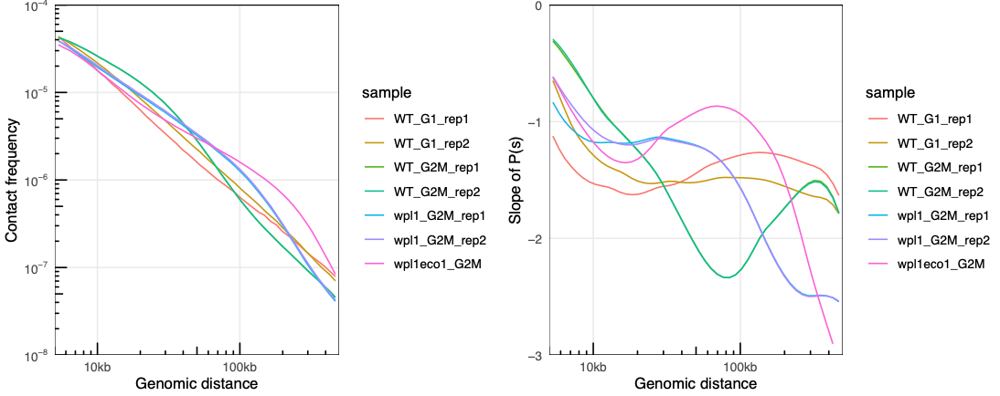
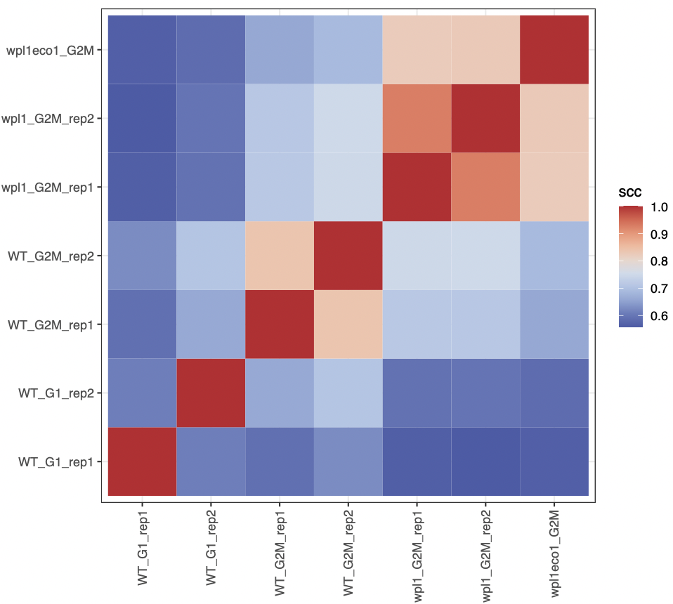
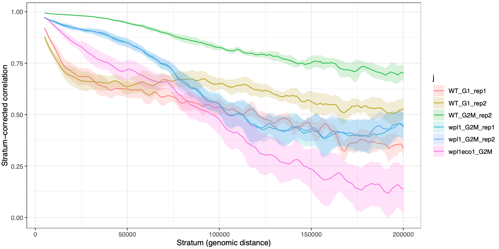
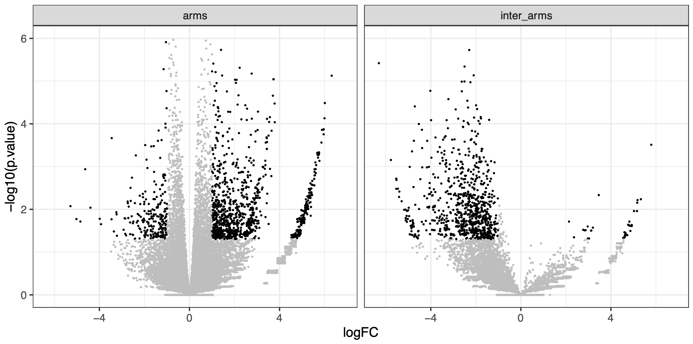
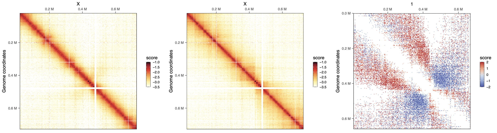

# Workflow 1: Distance-dependent interactions across yeast mutants

> **NOTE:**
>
> ``` downlit
> library(ggplot2)
> library(purrr)
> library(GenomicRanges)
> ##  Loading required package: stats4
> ##  Loading required package: BiocGenerics
> ##  Loading required package: generics
> ##  
> ##  Attaching package: 'generics'
> ##  The following objects are masked from 'package:base':
> ##  
> ##      as.difftime, as.factor, as.ordered, intersect, is.element,
> ##      setdiff, setequal, union
> ##  
> ##  Attaching package: 'BiocGenerics'
> ##  The following objects are masked from 'package:stats':
> ##  
> ##      IQR, mad, sd, var, xtabs
> ##  The following object is masked from 'package:utils':
> ##  
> ##      data
> ##  The following objects are masked from 'package:base':
> ##  
> ##      Filter, Find, Map, Position, Reduce, anyDuplicated, aperm,
> ##      append, as.data.frame, basename, cbind, colnames, dirname,
> ##      do.call, duplicated, eval, evalq, get, grep, grepl, is.unsorted,
> ##      lapply, mapply, match, mget, order, paste, pmax, pmax.int, pmin,
> ##      pmin.int, rank, rbind, rownames, sapply, saveRDS, scale,
> ##      sequence, table, tapply, transform, unique, unsplit, which.max,
> ##      which.min
> ##  Loading required package: S4Vectors
> ##  
> ##  Attaching package: 'S4Vectors'
> ##  The following object is masked from 'package:utils':
> ##  
> ##      findMatches
> ##  The following objects are masked from 'package:base':
> ##  
> ##      I, expand.grid, unname
> ##  Loading required package: IRanges
> ##  
> ##  Attaching package: 'IRanges'
> ##  The following object is masked from 'package:purrr':
> ##  
> ##      reduce
> ##  Loading required package: Seqinfo
> library(InteractionSet)
> ##  Loading required package: SummarizedExperiment
> ##  Loading required package: MatrixGenerics
> ##  Loading required package: matrixStats
> ##  
> ##  Attaching package: 'MatrixGenerics'
> ##  The following objects are masked from 'package:matrixStats':
> ##  
> ##      colAlls, colAnyNAs, colAnys, colAvgsPerRowSet, colCollapse,
> ##      colCounts, colCummaxs, colCummins, colCumprods, colCumsums,
> ##      colDiffs, colIQRDiffs, colIQRs, colLogSumExps, colMadDiffs,
> ##      colMads, colMaxs, colMeans2, colMedians, colMins, colOrderStats,
> ##      colProds, colQuantiles, colRanges, colRanks, colSdDiffs, colSds,
> ##      colSums2, colTabulates, colVarDiffs, colVars, colWeightedMads,
> ##      colWeightedMeans, colWeightedMedians, colWeightedSds,
> ##      colWeightedVars, rowAlls, rowAnyNAs, rowAnys, rowAvgsPerColSet,
> ##      rowCollapse, rowCounts, rowCummaxs, rowCummins, rowCumprods,
> ##      rowCumsums, rowDiffs, rowIQRDiffs, rowIQRs, rowLogSumExps,
> ##      rowMadDiffs, rowMads, rowMaxs, rowMeans2, rowMedians, rowMins,
> ##      rowOrderStats, rowProds, rowQuantiles, rowRanges, rowRanks,
> ##      rowSdDiffs, rowSds, rowSums2, rowTabulates, rowVarDiffs,
> ##      rowVars, rowWeightedMads, rowWeightedMeans, rowWeightedMedians,
> ##      rowWeightedSds, rowWeightedVars
> ##  Loading required package: Biobase
> ##  Welcome to Bioconductor
> ##  
> ##      Vignettes contain introductory material; view with
> ##      'browseVignettes()'. To cite Bioconductor, see
> ##      'citation("Biobase")', and for packages 'citation("pkgname")'.
> ##  
> ##  Attaching package: 'Biobase'
> ##  The following object is masked from 'package:MatrixGenerics':
> ##  
> ##      rowMedians
> ##  The following objects are masked from 'package:matrixStats':
> ##  
> ##      anyMissing, rowMedians
> library(HiCExperiment)
> ##  Consider using the `HiContacts` package to perform advanced genomic operations 
> ##  on `HiCExperiment` objects.
> ##  
> ##  Read "Orchestrating Hi-C analysis with Bioconductor" online book to learn more:
> ##  https://js2264.github.io/OHCA/
> ##  
> ##  Attaching package: 'HiCExperiment'
> ##  The following object is masked from 'package:SummarizedExperiment':
> ##  
> ##      metadata<-
> ##  The following object is masked from 'package:S4Vectors':
> ##  
> ##      metadata<-
> ##  The following object is masked from 'package:ggplot2':
> ##  
> ##      resolution
> library(HiContactsData)
> ##  Loading required package: ExperimentHub
> ##  Loading required package: AnnotationHub
> ##  Loading required package: BiocFileCache
> ##  Loading required package: dbplyr
> ##  OpenTelemetry error: there is no package called 'otelsdk'
> ##  OpenTelemetry error: there is no package called 'otelsdk'
> ##  
> ##  Attaching package: 'AnnotationHub'
> ##  The following object is masked from 'package:Biobase':
> ##  
> ##      cache
> library(multiHiCcompare)
> ##  
> ##  Attaching package: 'multiHiCcompare'
> ##  The following object is masked from 'package:HiCExperiment':
> ##  
> ##      resolution
> ##  The following object is masked from 'package:ggplot2':
> ##  
> ##      resolution
> ```

> **NOTE:**
>
> This chapter illustrates how to:
>
> - Compute P(s) of several samples and compare them
> - Compute distance-adjusted correlation between Hi-C datasets with `HiCRep`
> - Perform differential interaction analysis between Hi-C datasets with `multiHiCcompare`

> **IMPORTANT:**
>
> We leverage seven yeast datasets in this notebook. They are all available from SRA:
>
> - `SRR8769554`: WT yeast strain, G1 phase (rep1)
> - `SRR10687276`: WT yeast strain, G1 phase (rep12)
> - `SRR8769549`: WT yeast strain, G2/M phase (rep1)
> - `SRR10687281`: WT yeast strain, G2/M phase (rep12)
> - `SRR8769551`: *wpl1* mutant yeast strain, G2/M phase (rep1)
> - `SRR10687278`: *wpl1* mutant yeast strain, G2/M phase (rep2)
> - `SRR8769555`: *wpl1/eco1* mutant yeast strain, G2/M phase

> **NOTE:**
>
> This notebook does not execute code when it’s rendered. Instead, the results and the plots have been locally computed and manually embedded in the notebook.

## Recovering data from SRA

The easiest for this is to directly fetch files from SRA from their FTP server. We can do so using the base `download.file` function.

``` downlit
# !! This code is not actually executed !!
dir.create('data')
download.file("ftp://ftp.sra.ebi.ac.uk/vol1/fastq/SRR876/004/SRR8769554/SRR8769554_1.fastq.gz", "data/WT_G1_WT_rep1_R1.fastq.gz")
download.file("ftp://ftp.sra.ebi.ac.uk/vol1/fastq/SRR876/004/SRR8769554/SRR8769554_2.fastq.gz", "data/WT_G1_WT_rep1_R2.fastq.gz")
download.file("ftp://ftp.sra.ebi.ac.uk/vol1/fastq/SRR106/076/SRR10687276/SRR10687276_1.fastq.gz", "data/WT_G1_WT_rep2_R1.fastq.gz")
download.file("ftp://ftp.sra.ebi.ac.uk/vol1/fastq/SRR106/076/SRR10687276/SRR10687276_2.fastq.gz", "data/WT_G1_WT_rep2_R2.fastq.gz")
download.file("ftp://ftp.sra.ebi.ac.uk/vol1/fastq/SRR876/009/SRR8769549/SRR8769549_1.fastq.gz", "data/WT_G2M_WT_rep1_R1.fastq.gz")
download.file("ftp://ftp.sra.ebi.ac.uk/vol1/fastq/SRR876/009/SRR8769549/SRR8769549_2.fastq.gz", "data/WT_G2M_WT_rep1_R2.fastq.gz")
download.file("ftp://ftp.sra.ebi.ac.uk/vol1/fastq/SRR106/081/SRR10687281/SRR10687281_1.fastq.gz", "data/WT_G2M_WT_rep2_R1.fastq.gz")
download.file("ftp://ftp.sra.ebi.ac.uk/vol1/fastq/SRR106/081/SRR10687281/SRR10687281_2.fastq.gz", "data/WT_G2M_WT_rep2_R2.fastq.gz")
download.file("ftp://ftp.sra.ebi.ac.uk/vol1/fastq/SRR876/001/SRR8769551/SRR8769551_1.fastq.gz", "data/wpl1_G2M_rep1_R1.fastq.gz")
download.file("ftp://ftp.sra.ebi.ac.uk/vol1/fastq/SRR876/001/SRR8769551/SRR8769551_2.fastq.gz", "data/wpl1_G2M_rep1_R2.fastq.gz")
download.file("ftp://ftp.sra.ebi.ac.uk/vol1/fastq/SRR106/078/SRR10687278/SRR10687278_1.fastq.gz", "data/wpl1_G2M_rep2_R1.fastq.gz")
download.file("ftp://ftp.sra.ebi.ac.uk/vol1/fastq/SRR106/078/SRR10687278/SRR10687278_2.fastq.gz", "data/wpl1_G2M_rep2_R2.fastq.gz")
download.file("ftp://ftp.sra.ebi.ac.uk/vol1/fastq/SRR876/005/SRR8769555/SRR8769555_1.fastq.gz", "data/wpl1eco1_G2M_R1.fastq.gz")
download.file("ftp://ftp.sra.ebi.ac.uk/vol1/fastq/SRR876/005/SRR8769555/SRR8769555_2.fastq.gz", "data/wpl1eco1_G2M_R2.fastq.gz")
```

## Processing reads with HiCool

We will map each pair of fastqs on the yeast genome reference (`R64-1-1`) using `HiCool`.

``` downlit
# !! This code is not actually executed !!
library(HiCool)
samples <- c(
    'WT_G1_rep1', 
    'WT_G1_rep2', 
    'WT_G2M_rep1', 
    'WT_G2M_rep2', 
    'wpl1_G2M_rep1', 
    'wpl1_G2M_rep2', 
    'wpl1eco1_G2M' 
)
purrr::map(samples, ~ HiCool(
    r1 = paste0('data/', .x, '_R1.fastq.gz'), 
    r2 = paste0('data/', .x, '_R2.fastq.gz'), 
    genome = 'R64-1-1', 
    restriction = 'DpnII', 
    iterative = FALSE, 
    threads = 15, 
    output = 'data/HiCool/', 
    scratch = '/data/scratch/'
))
```

Processed samples are put in `data/HiCool` directory. `CoolFile` objects are pointers to individual contact matrices. We can create such objects by using the `importHiCoolFolder` utility function.

``` downlit
cfs <- list(
    WT_G1_rep1 = importHiCoolFolder('data/HiCool', 'GK8ISZ'), 
    WT_G1_rep2 = importHiCoolFolder('data/HiCool', 'SWZTO0'), 
    WT_G2M_rep1 = importHiCoolFolder('data/HiCool', '3KHHUE'), 
    WT_G2M_rep2 = importHiCoolFolder('data/HiCool', 'UVNG7M'), 
    wpl1_G2M_rep1 = importHiCoolFolder('data/HiCool', 'Q4KX6Z'), 
    wpl1_G2M_rep2 = importHiCoolFolder('data/HiCool', '3N0L25'), 
    wpl1eco1_G2M = importHiCoolFolder('data/HiCool', 'LHMXWE')
)
cfs
```

Now that these pointers have been defined, Hi-C contact matrices can be seamlessly imported in R with `import`.

``` downlit
library(purrr)
library(HiCExperiment)
hics <- map(cfs, import)
hics
## $WT_G1_rep1
## `HiCExperiment` object with 5,454,145 contacts over 12,079 regions
## -------
## fileName: "../OHCA-data/HiCool/matrices/W303_G1_WT_rep1^mapped-S288c^GK8ISZ.mcool"
## focus: "whole genome"
## resolutions(5): 1000 2000 4000 8000 16000
## active resolution: 1000
## interactions: 3347524
## scores(2): count balanced
## topologicalFeatures: compartments(0) borders(0) loops(0) viewpoints(0)
## pairsFile: ../OHCA-data/HiCool/pairs/W303_G1_WT_rep1^mapped-S288c^GK8ISZ.pairs
## metadata(3): log args stats
## 
## $WT_G1_rep2
## `HiCExperiment` object with 12,068,214 contacts over 12,079 regions
## -------
## fileName: "../OHCA-data/HiCool/matrices/W303_G1_WT_rep2^mapped-S288c^SWZTO0.mcool"
## focus: "whole genome"
## resolutions(5): 1000 2000 4000 8000 16000
## active resolution: 1000
## interactions: 6756099
## scores(2): count balanced
## topologicalFeatures: compartments(0) borders(0) loops(0) viewpoints(0)
## pairsFile: ../OHCA-data/HiCool/pairs/W303_G1_WT_rep2^mapped-S288c^SWZTO0.pairs
## metadata(3): log args stats
## 
## ... 
```

## Plotting chromosome-wide matrices of merged replicates

We can merge replicates with the `merge` function, and `map` the `plotMatrix` function over the resulting list of `HiCExperiment`s.

``` downlit
library(HiContacts)
chr <- 'X'
merged_replicates <- list(
    WT_G1 = merge(hics[[1]][chr], hics[[2]][chr]), 
    WT_G2M = merge(hics[[3]][chr], hics[[4]][chr]), 
    wpl1_G2M = merge(hics[[5]][chr], hics[[6]][chr]), 
    wpl1eco1_G2M = hics[[7]][chr]
)
library(dplyr)
library(ggplot2)
maps <- imap(merged_replicates, ~ plotMatrix(
    .x, use.scores = 'balanced', limits = c(-3.5, -1.5), caption = FALSE
) + ggtitle(.y))
cowplot::plot_grid(plotlist = maps, nrow = 1)
```


We can already note that long-range contacts seem to increase in frequency, in G2/M vs G1, in *wpl1* vs WT and in *wpl1/eco1* vs *wpl1*.

## Compute P(s) per replicate and plot it

Still using the `map` function, we can compute average P(s) for each replicate.\
Computation of the P(s) will take some time, as millions of pairs have to be imported in memory, but it will be accurate at the base resolution, rather than bin resolution from matrices.

> **NOTE:**
>
> Since matrices were imported after `HiCool` processing with the `importHiCoolFolder`, the associated `.pairs` file has been automatically added to each `HiCExperiment` object!

The computed P(s) is stored for each sample as a `tibble`.

``` downlit
pairsFile(hics[[1]])
ps <- imap(hics, ~ distanceLaw(.x) |> mutate(sample = .y))
## Importing pairs file ../OHCA-data/HiCool/pairs/W303_G1_WT_rep1^mapped-S288c^GK8ISZ.pairs in memory. This may take a while...
## |===============================================================| 100% 318 MB
## Importing pairs file ../OHCA-data/HiCool/pairs/W303_G1_WT_rep2^mapped-S288c^SWZTO0.pairs in memory. This may take a while...
## |===============================================================| 100% 674 MB
## Importing pairs file ../OHCA-data/HiCool/pairs/W303_G2M_WT_rep1^mapped-S288c^3KHHUE.pairs in memory. This may take a while...
## |===============================================================| 100% 709 MB
## Importing pairs file ../OHCA-data/HiCool/pairs/W303_G2M_WT_rep2^mapped-S288c^UVNG7M.pairs in memory. This may take a while...
## |==============================================================| 100% 1683 MB
## Importing pairs file ../OHCA-data/HiCool/pairs/W303_G2M_wpl1_rep1^mapped-S288c^Q4KX6Z.pairs in memory. This may take a while...
## |==============================================================| 100% 1269 MB
## Importing pairs file ../OHCA-data/HiCool/pairs/W303_G2M_wpl1_rep2^mapped-S288c^3N0L25.pairs in memory. This may take a while...
## |==============================================================| 100% 1529 MB
## Importing pairs file ../OHCA-data/HiCool/pairs/W303_G2M_wpl1-eco1^mapped-S288c^LHMXWE.pairs in memory. This may take a while...
## |==============================================================| 100% 1036 MB
ps[[1]]
## # A tibble: 133 x 6
##   binned_distance          p     norm_p norm_p_unity slope sample
##             <dbl>      <dbl>      <dbl>        <dbl> <dbl> <chr>
## 1               1 0.000154   0.000154         249.   0     WT_G1_rep1
## 2               2 0.0000563  0.0000563         91.2  0.702 WT_G1_rep1
## 3               3 0.0000417  0.0000417         67.5  0.699 WT_G1_rep1
## 4               4 0.00000835 0.00000835        13.5  0.696 WT_G1_rep1
## 5               5 0.00000501 0.00000501         8.10 0.693 WT_G1_rep1
## 6               6 0.00000250 0.00000250         4.05 0.690 WT_G1_rep1
## # ... with 127 more rows
```

We can bind all `tibbles` together and plot P(s) and their slope for each sample.

``` downlit
df <- list_rbind(ps)
plotPs(
    df, aes(x = binned_distance, y = norm_p, 
    group = sample, color = sample)
)
plotPsSlope(
    df, aes(x = binned_distance, y = slope, 
    group = sample, color = sample)
)
```



## Correlation between replicates with `hicrep`

`hicrep` is a popular package to compute stratum-adjusted correlations between Hi-C datasets. “Stratum” refers to the distance from the main diagonal: with increase distance from the main diagonal, interactions of the DNA polymer are bound to decrease. `hicrep` computes a “per-stratum” correlation score and computes a weighted average correlation for entire chromosomes.

We can check the documentation for `hicrep` main function, `get.scc`. This tells us that `mat1` and `mat2` `n*n` intrachromosomal contact maps of raw `counts` should be provided. Fortunately, `HiCExperiment` objects can easily be coerced into actual dense matrices using [`as.matrix()`](https://rdrr.io/r/base/matrix.html) function.

> **IMPORTANT:**
>
> Make sure to use the `count` scores, which are required by `hicrep`.

We can calculate the overall stratum-corrected correlation score over the chromosome `IV` between the two `G2M` WT replicates.

``` downlit
library(hicrep)
scc <- get.scc(
    hics[['WT_G2M_rep1']]["IV"] |> as.matrix(sparse = TRUE, use.scores = 'count'), 
    hics[['WT_G2M_rep2']]["IV"] |> as.matrix(sparse = TRUE, use.scores = 'count'), 
    resol = 1000, h = 2, lbr = 5000, ubr = 50000
)
names(scc)
## [1] "corr" "wei"  "scc"  "std"
scc$scc
##           [,1]
## [1,] 0.9785691
```

This can be generalized to all pairwise combinations of Hi-C datasets.

``` downlit
library(purrr)
library(dplyr)
library(ggplot2)
mats <- map(hics, ~ .x["IV"] |> as.matrix(use.scores = 'count', sparse = TRUE))
df <- map(1:7, function(i) {
    map(1:7, function(j) {
        data.frame(
            i = names(hics)[i], 
            j = names(hics)[j], 
            scc = hicrep::get.scc(mats[[i]], mats[[j]], resol = 1000, h = 2, lbr = 5000, ubr = 200000)$scc
        ) |>
            mutate(i = factor(i, names(cfs))) |>
            mutate(j = factor(j, names(cfs)))
    }) |> list_rbind()
}) |> list_rbind()
ggplot(df, aes(x = i, y = j, fill = scc)) + 
    geom_tile() + 
    scale_x_discrete(guide = guide_axis(angle = 90)) + 
    theme_bw() + 
    coord_fixed(ratio = 1) + 
    scale_fill_gradientn(colours = bgrColors())
```



We can even iterate over an extra level, to compute stratum-corrected correlation for all chromosomes. Here, we will only compute correlation scores between any sample and `WT_G2M_rep1` sample.

> **TIP:**
>
> [`BiocParallel::bplapply()`](https://rdrr.io/pkg/BiocParallel/man/bplapply.html) replaces [`purrr::map()`](https://purrr.tidyverse.org/reference/map.html) here, as it allows parallelization of independent correlation computation runs over multiple CPUs.

``` downlit
# Some chromosomes will be ignored as they are too small for this analysis 
chrs <- c('II', 'IV', 'V', 'VII', 'VIII', 'IX', 'X', 'XI', 'XIII', 'XIV', 'XVI')
bpparam <- BiocParallel::MulticoreParam(workers = 6, progressbar = FALSE)
df <- BiocParallel::bplapply(chrs, function(CHR) {
    mats <- map(hics, ~ .x[CHR] |> interactions() |> gi2cm('count') |> cm2matrix())

        map(c(1, 2, 4, 5, 6, 7), function(j) {
            data.frame(
                chr = CHR,
                i = "WT_G2M_rep1", 
                j = names(mats)[j], 
                dist = seq(5000, 200000, 1000),
                scc = hicrep::get.scc(mats[["WT_G2M_rep1"]], mats[[j]], resol = 1000, h = 2, lbr = 5000, ubr = 200000) 
            ) |> mutate(j = factor(j, names(mats)))
        }) |> list_rbind()

}, BPPARAM = bpparam) |> list_rbind()
```

A tiny bit of data wrangling will allow us to plot the mean +/- confidence interval (90%) of stratum-adjusted correlations across the different chromosomes.

``` downlit
results <- group_by(df, j, dist) |> 
    summarize(
        mean = Rmisc::CI(scc.corr, ci = 0.90)[2], 
        CI_up = Rmisc::CI(scc.corr, ci = 0.90)[1], 
        CI_down = Rmisc::CI(scc.corr, ci = 0.90)[3]
    )
ggplot(results, aes(x = dist, y = mean, ymax = CI_up, ymin = CI_down)) + 
    geom_line(aes(col = j)) + 
    geom_ribbon(aes(fill = j), alpha = 0.2, col = NA) + 
    theme_bw() + 
    labs(x = "Stratum (genomic distance)", y = 'Stratum-corrected correlation')
```



## Differential interaction (DI) analysis with `multiHiCcompare`

We will now focus on the chromosome `XI` and identify differentially interacting (DI) loci between WT and *wpl1* mutant in G2/M.

To do this, we can use the `multiHiCcompare` package. The required input for the main [`make_hicexp()`](https://rdrr.io/pkg/multiHiCcompare/man/make_hicexp.html) function is a `list` of raw counts for different samples/replicates, stored in data frames with four columns (`chr`, `start1`, `start2`, `count`).\
Although this data structure does not correspond to a standard HiC format, it is easy to manipulate a `HiCExperiment` object to coerce it into such structure.

``` downlit
library(multiHiCcompare)
hics_list <- map(hics, ~ .x['XI'] |> 
    zoom(2000) |> 
    as.data.frame() |>
    select(start1, start2, count) |> 
    mutate(chr = 1) |> 
    relocate(chr)
)
mhicc <- make_hicexp(
    data_list = hics_list[c(3, 4, 5, 6)], 
    groups = factor(c(1, 1, 2, 2)
), A.min = 1)
```

The `mhicc` object contains data over the chromosome `XI` binned at 2kb for two pairs of replicates (WT or `wpl1` G2/M HiC, each in duplicates):

- Group1 contains WT data
- Group2 contains `wpl1` data

To identify differential interactions, the actual statistical comparison is performed with the [`hic_exactTest()`](https://rdrr.io/pkg/multiHiCcompare/man/hic_exactTest.html) function.

``` downlit
results <- cyclic_loess(mhicc, span = 0.2) |> hic_exactTest()
## |++++++++++++++++++++++++++++++++++++++++++++++++++| 100% elapsed=00s
## |++++++++++++++++++++++++++++++++++++++++++++++++++| 100% elapsed=05s
results 
## Hi-C Experiment Object
## 2 experimental groups
## Group 1 has 2 samples
## Group 2 has 2 samples
## Data has been normalized
```

The [`results()`](https://rdrr.io/pkg/multiHiCcompare/man/results.html) output is not very informative as it is. It requires a little bit of reformatting to be able to extract valuable insights from it.

``` downlit
df <- left_join(results@hic_table, results(results)) |> 
    mutate(dist = region2 - region1) |> 
    mutate(group = case_when(
        region1 < 430000 & region2 > 450000 ~ 'inter_arms',
        region1 >= 430000 & region2 <= 450000 ~ 'at_centro',
        TRUE ~ 'arms'
    )) |> 
    filter(group %in% c('arms', 'inter_arms')) |> 
    mutate(sign = p.value <= 0.05 & abs(logFC) >= 1)
df
## chr region1 region2 D   IF1   IF2   IF3   IF4   logFC  logCPM  p.value    p.adj dist group  sign
##   1       1       1 0  6.16  2.09  7.96  5.43  0.5401 4.81329 5.38e-01 7.94e-01    0  arms FALSE
##   1       1    2001 1 16.38 10.25 12.96 12.16 -0.2257 5.82484 7.00e-01 8.81e-01 2000  arms FALSE
##   1       1    4001 2 41.41 40.72 84.41 45.14  0.5064 7.69885 5.94e-02 2.16e-01 4000  arms FALSE
##   1       1    6001 3 22.26 30.51 73.83 48.48  1.2726 8.10243 6.48e-07 5.83e-05 6000  arms  TRUE
##   1       1    8001 4 26.63 31.20 33.39 25.92  0.0998 7.55207 8.02e-01 9.34e-01 8000  arms FALSE
## ...
ggplot(df, aes(x = logFC, y = -log10(p.value), col = sign)) + 
    geom_point(size = 0.2) + 
    theme_bw() + 
    facet_wrap(~group) + 
    ylim(c(0, 6)) + 
    theme(legend.position = 'none') + 
    scale_color_manual(values = c('grey', 'black'))
```



In this volcano plot, we can visually appreciate the fold-change of interaction frequency in WT or `wpl1`, for interactions constrained within the chromosome `XI` arms (left) or *spanning* the chr. `XI` centromere (right). This clearly highlights that interactions within arms are increased in `wpl1` mutant while those spanning the centromere strongly decreased.

One of the strengths of `HiContacts` is that it can be leveraged to visualize any quantification related to genomic interactions as a HiC heatmap, since `plotMatrix` can take a `GInteractions` object with any score saved in `mcols` as input.

``` downlit
gis <- rename(df, seqnames1 = chr, start1 = region1, start2 = region2) |> 
    mutate(
        seqnames2 = seqnames1, 
        end1 = start1 + 1999, 
        end2 = start2 + 1999
    ) |> 
    filter(abs(logFC) >= 1) |>
    df2gi() 
cowplot::plot_grid(
    plotMatrix(merged_replicates[['WT_G2M']], use.scores = 'balanced', limits = c(-3.5, -1), caption = FALSE),
    plotMatrix(merged_replicates[['wpl1_G2M']], use.scores = 'balanced', limits = c(-3.5, -1), caption = FALSE),
    plotMatrix(gis, use.scores = 'logFC', scale = 'linear', limits = c(-2, 2), cmap = bgrColors()), 
    align = "hv", axis = 'tblr', nrow = 1
)
```



# Session info

> **NOTE:**
>
> ``` downlit
> sessioninfo::session_info(include_base = TRUE)
> ##  ─ Session info ────────────────────────────────────────────────────────────
> ##   setting  value
> ##   version  R version 4.6.1 (2026-06-24)
> ##   os       Ubuntu 24.04.4 LTS
> ##   system   x86_64, linux-gnu
> ##   ui       X11
> ##   language (EN)
> ##   collate  C
> ##   ctype    en_US.UTF-8
> ##   tz       Etc/UTC
> ##   date     2026-10-05
> ##   pandoc   3.11 @ /usr/bin/ (via rmarkdown)
> ##   quarto   1.11.5 @ /usr/local/bin/quarto
> ##  
> ##  ─ Packages ────────────────────────────────────────────────────────────────
> ##   package              * version    date (UTC) lib source
> ##   abind                  1.4-8      2024-09-12 [2] RSPM (R 4.6.0)
> ##   AnnotationDbi          1.75.2     2026-07-21 [2] Bioconductor 3.24 (R 4.6.1)
> ##   AnnotationHub        * 4.3.2      2026-06-30 [2] Bioconductor 3.24 (R 4.6.1)
> ##   base                 * 4.6.1      2026-09-11 [3] local
> ##   Biobase              * 2.73.2     2026-07-29 [2] Bioconductor 3.24 (R 4.6.1)
> ##   BiocBaseUtils          1.15.1     2026-05-10 [2] Bioconductor 3.24 (R 4.6.1)
> ##   BiocFileCache        * 3.3.0      2026-04-28 [2] Bioconductor 3.24 (R 4.6.1)
> ##   BiocGenerics         * 0.59.12    2026-08-11 [2] Bioconductor 3.24 (R 4.6.1)
> ##   BiocIO                 1.23.3     2026-04-29 [2] Bioconductor 3.24 (R 4.6.1)
> ##   BiocManager            1.30.27    2025-11-14 [2] CRAN (R 4.6.1)
> ##   BiocParallel           1.47.0     2026-04-28 [2] Bioconductor 3.24 (R 4.6.1)
> ##   BiocVersion            3.24.0     2026-04-28 [2] Bioconductor 3.24 (R 4.6.1)
> ##   Biostrings             2.81.9     2026-09-06 [2] Bioconductor 3.24 (R 4.6.1)
> ##   bit                    4.6.0      2025-03-06 [2] RSPM (R 4.6.0)
> ##   bit64                  4.8.6      2026-09-01 [2] RSPM (R 4.6.0)
> ##   blob                   1.3.0      2026-01-14 [2] RSPM (R 4.6.0)
> ##   cachem                 1.1.0      2024-05-16 [2] RSPM (R 4.6.0)
> ##   calibrate              1.7.7      2020-06-19 [2] RSPM (R 4.6.0)
> ##   cli                    3.6.6      2026-04-09 [2] RSPM (R 4.6.0)
> ##   codetools              0.2-20     2024-03-31 [3] CRAN (R 4.6.1)
> ##   compiler               4.6.1      2026-09-11 [3] local
> ##   crayon                 1.5.3      2024-06-20 [2] RSPM (R 4.6.0)
> ##   curl                   8.0.0      2026-08-25 [2] RSPM (R 4.6.0)
> ##   data.table             1.18.6.1   2026-08-24 [2] RSPM (R 4.6.0)
> ##   datasets             * 4.6.1      2026-09-11 [3] local
> ##   DBI                    1.3.0      2026-02-25 [2] RSPM (R 4.6.0)
> ##   dbplyr               * 2.6.0      2026-06-17 [2] RSPM (R 4.6.0)
> ##   DelayedArray           0.39.8     2026-09-30 [2] Bioconductor 3.24 (R 4.6.1)
> ##   dichromat              2.0-1      2026-07-22 [2] RSPM (R 4.6.0)
> ##   digest                 0.6.39     2025-11-19 [2] RSPM (R 4.6.0)
> ##   dplyr                  1.2.1      2026-04-03 [2] RSPM (R 4.6.0)
> ##   edgeR                  4.99.6     2026-09-13 [2] Bioconductor 3.24 (R 4.6.1)
> ##   evaluate               1.0.5      2025-08-27 [2] RSPM (R 4.6.0)
> ##   ExperimentHub        * 3.3.2      2026-08-12 [2] Bioconductor 3.24 (R 4.6.1)
> ##   farver                 2.1.2      2024-05-13 [2] RSPM (R 4.6.0)
> ##   fastmap                1.2.0      2024-05-15 [2] RSPM (R 4.6.0)
> ##   filelock               1.0.3      2023-12-11 [2] RSPM (R 4.6.0)
> ##   generics             * 0.1.4      2025-05-09 [2] RSPM (R 4.6.0)
> ##   GenomeInfoDb           1.49.1     2026-05-24 [2] Bioconductor 3.24 (R 4.6.1)
> ##   GenomeInfoDbData       1.2.15     2026-07-20 [2] Bioconductor
> ##   GenomicRanges        * 1.65.4     2026-09-02 [2] Bioconductor 3.24 (R 4.6.1)
> ##   ggplot2              * 4.0.3      2026-04-22 [2] RSPM (R 4.6.0)
> ##   glue                   1.8.1      2026-04-17 [2] RSPM (R 4.6.0)
> ##   graphics             * 4.6.1      2026-09-11 [3] local
> ##   grDevices            * 4.6.1      2026-09-11 [3] local
> ##   grid                   4.6.1      2026-09-11 [3] local
> ##   gridExtra              2.3.1      2026-06-25 [2] RSPM (R 4.6.0)
> ##   gtable                 0.3.6      2024-10-25 [2] RSPM (R 4.6.0)
> ##   gtools                 3.9.5      2023-11-20 [2] RSPM (R 4.6.0)
> ##   HiCcompare             1.35.2     2026-10-01 [2] Bioconductor 3.24 (R 4.6.1)
> ##   HiCExperiment        * 1.13.1     2026-10-04 [2] Bioconductor 3.24 (R 4.6.1)
> ##   HiContactsData       * 1.5.3      2026-10-05 [2] Github (js2264/HiContactsData@d5bebe7)
> ##   htmltools              0.5.9      2025-12-04 [2] RSPM (R 4.6.0)
> ##   htmlwidgets            1.6.4      2023-12-06 [2] RSPM (R 4.6.0)
> ##   httr                   1.4.9      2026-09-01 [2] RSPM (R 4.6.0)
> ##   httr2                  1.3.0      2026-07-13 [2] RSPM (R 4.6.0)
> ##   InteractionSet       * 1.41.0     2026-04-28 [2] Bioconductor 3.24 (R 4.6.1)
> ##   IRanges              * 2.47.5     2026-08-27 [2] Bioconductor 3.24 (R 4.6.1)
> ##   jsonlite               2.0.0      2025-03-27 [2] RSPM (R 4.6.0)
> ##   KEGGREST               1.53.6     2026-07-23 [2] Bioconductor 3.24 (R 4.6.1)
> ##   KernSmooth             2.23-27    2026-08-12 [2] RSPM (R 4.6.0)
> ##   knitr                  1.52       2026-09-06 [2] RSPM (R 4.6.0)
> ##   lattice                0.23-1     2026-08-12 [2] RSPM (R 4.6.0)
> ##   lifecycle              1.0.5      2026-01-08 [2] RSPM (R 4.6.0)
> ##   limma                  3.99.0     2026-08-31 [2] Bioconductor 3.24 (R 4.6.1)
> ##   locfit                 1.5-9.12   2025-03-05 [2] RSPM (R 4.6.0)
> ##   magrittr               2.0.5      2026-04-04 [2] RSPM (R 4.6.0)
> ##   MASS                   7.3-66     2026-07-15 [2] RSPM (R 4.6.0)
> ##   mathjaxr               2.0-0      2025-12-01 [2] RSPM (R 4.6.0)
> ##   Matrix                 1.7-6      2026-07-25 [2] RSPM (R 4.6.0)
> ##   MatrixGenerics       * 1.25.0     2026-04-28 [2] Bioconductor 3.24 (R 4.6.1)
> ##   matrixStats          * 1.5.0      2025-01-07 [2] RSPM (R 4.6.0)
> ##   memoise                2.0.1      2021-11-26 [2] RSPM (R 4.6.0)
> ##   metap                  1.14       2026-05-01 [2] RSPM (R 4.6.0)
> ##   methods              * 4.6.1      2026-09-11 [3] local
> ##   mgcv                   1.9-4      2025-11-07 [3] CRAN (R 4.6.1)
> ##   mnormt                 2.1.2      2026-01-27 [2] RSPM (R 4.6.0)
> ##   multcomp               1.4-32     2026-08-21 [2] RSPM (R 4.6.0)
> ##   multiHiCcompare      * 1.31.1     2026-07-09 [2] Bioconductor 3.24 (R 4.6.1)
> ##   multtest               2.69.0     2026-04-28 [2] Bioconductor 3.24 (R 4.6.1)
> ##   mutoss                 0.1-14     2026-01-08 [2] RSPM (R 4.6.0)
> ##   mvtnorm                1.4-2      2026-07-12 [2] RSPM (R 4.6.0)
> ##   nlme                   3.1-171    2026-09-01 [2] RSPM (R 4.6.0)
> ##   numDeriv               2016.8-1.1 2019-06-06 [2] RSPM (R 4.6.0)
> ##   otel                   0.2.0      2025-08-29 [2] RSPM (R 4.6.0)
> ##   parallel               4.6.1      2026-09-11 [3] local
> ##   pbapply                1.7-5      2026-09-01 [2] RSPM (R 4.6.0)
> ##   pheatmap               1.0.13     2025-06-05 [2] RSPM (R 4.6.0)
> ##   pillar                 1.11.1     2025-09-17 [2] RSPM (R 4.6.0)
> ##   pkgconfig              2.0.3      2019-09-22 [2] RSPM (R 4.6.0)
> ##   plotrix                3.8-14     2026-02-13 [2] RSPM (R 4.6.0)
> ##   png                    0.1-9      2026-03-15 [2] RSPM (R 4.6.0)
> ##   purrr                * 1.2.2      2026-04-10 [2] RSPM (R 4.6.0)
> ##   qqconf                 1.3.2      2023-04-14 [2] RSPM (R 4.6.0)
> ##   qqman                  0.1.9      2023-08-23 [2] RSPM (R 4.6.0)
> ##   R6                     2.6.1      2025-02-15 [2] RSPM (R 4.6.0)
> ##   rappdirs               0.3.4      2026-01-17 [2] RSPM (R 4.6.0)
> ##   rbibutils              2.4.1      2026-01-21 [2] RSPM (R 4.6.0)
> ##   RColorBrewer           1.1-3      2022-04-03 [2] RSPM (R 4.6.0)
> ##   Rcpp                   1.1.2      2026-07-05 [2] RSPM (R 4.6.0)
> ##   Rdpack                 2.6.6      2026-02-08 [2] RSPM (R 4.6.0)
> ##   rhdf5                  2.57.18    2026-09-23 [2] Bioconductor 3.24 (R 4.6.1)
> ##   rhdf5filters           1.25.4     2026-08-06 [2] Bioconductor 3.24 (R 4.6.1)
> ##   Rhdf5lib               2.1.0      2026-04-28 [2] Bioconductor 3.24 (R 4.6.1)
> ##   rlang                  1.3.0      2026-07-05 [2] RSPM (R 4.6.0)
> ##   rmarkdown              2.32       2026-09-01 [2] RSPM (R 4.6.0)
> ##   RSQLite                3.53.3     2026-06-30 [2] RSPM (R 4.6.0)
> ##   S4Arrays               1.13.2     2026-09-30 [2] Bioconductor 3.24 (R 4.6.1)
> ##   S4Vectors            * 0.51.10    2026-09-16 [2] Bioconductor 3.24 (R 4.6.1)
> ##   S7                     0.2.2      2026-04-22 [2] RSPM (R 4.6.0)
> ##   sandwich               3.1-3      2026-08-03 [2] RSPM (R 4.6.0)
> ##   scales                 1.4.0      2025-04-24 [2] RSPM (R 4.6.0)
> ##   Seqinfo              * 1.3.2      2026-08-27 [2] Bioconductor 3.24 (R 4.6.1)
> ##   sessioninfo            1.2.4      2026-06-04 [2] RSPM (R 4.6.0)
> ##   sn                     2.1.3      2026-02-24 [2] RSPM (R 4.6.0)
> ##   SparseArray            1.13.4     2026-09-30 [2] Bioconductor 3.24 (R 4.6.1)
> ##   splines                4.6.1      2026-09-11 [3] local
> ##   statmod                1.5.2      2026-05-17 [2] RSPM (R 4.6.0)
> ##   stats                * 4.6.1      2026-09-11 [3] local
> ##   stats4               * 4.6.1      2026-09-11 [3] local
> ##   strawr                 0.0.92     2024-07-16 [2] RSPM (R 4.6.0)
> ##   SummarizedExperiment * 1.43.0     2026-04-28 [2] Bioconductor 3.24 (R 4.6.1)
> ##   survival               3.8-12     2026-09-09 [2] RSPM (R 4.6.0)
> ##   TFisher                0.2.1      2026-08-25 [2] RSPM (R 4.6.0)
> ##   TH.data                1.1-5      2025-11-17 [2] RSPM (R 4.6.0)
> ##   tibble                 3.3.1      2026-01-11 [2] RSPM (R 4.6.0)
> ##   tidyselect             1.2.1      2024-03-11 [2] RSPM (R 4.6.0)
> ##   tools                  4.6.1      2026-09-11 [3] local
> ##   tzdb                   0.5.0      2025-03-15 [2] RSPM (R 4.6.0)
> ##   UCSC.utils             1.9.0      2026-04-28 [2] Bioconductor 3.24 (R 4.6.1)
> ##   utils                * 4.6.1      2026-09-11 [3] local
> ##   vctrs                  0.7.3      2026-04-11 [2] RSPM (R 4.6.0)
> ##   vroom                  1.7.1      2026-03-31 [2] RSPM (R 4.6.0)
> ##   withr                  3.0.3      2026-06-19 [2] RSPM (R 4.6.0)
> ##   xfun                   0.61       2026-09-16 [2] RSPM (R 4.6.0)
> ##   XVector                0.53.0     2026-04-28 [2] Bioconductor 3.24 (R 4.6.1)
> ##   yaml                   2.3.12     2025-12-10 [2] RSPM (R 4.6.0)
> ##   zoo                    1.9-1      2026-09-25 [2] RSPM (R 4.6.0)
> ##  
> ##   [1] /tmp/RtmpIHYEk6/Rinstb5256c58e
> ##   [2] /usr/local/lib/R/site-library
> ##   [3] /usr/local/lib/R/library
> ##   * ── Packages attached to the search path.
> ##  
> ##  ───────────────────────────────────────────────────────────────────────────
> ```

# References
