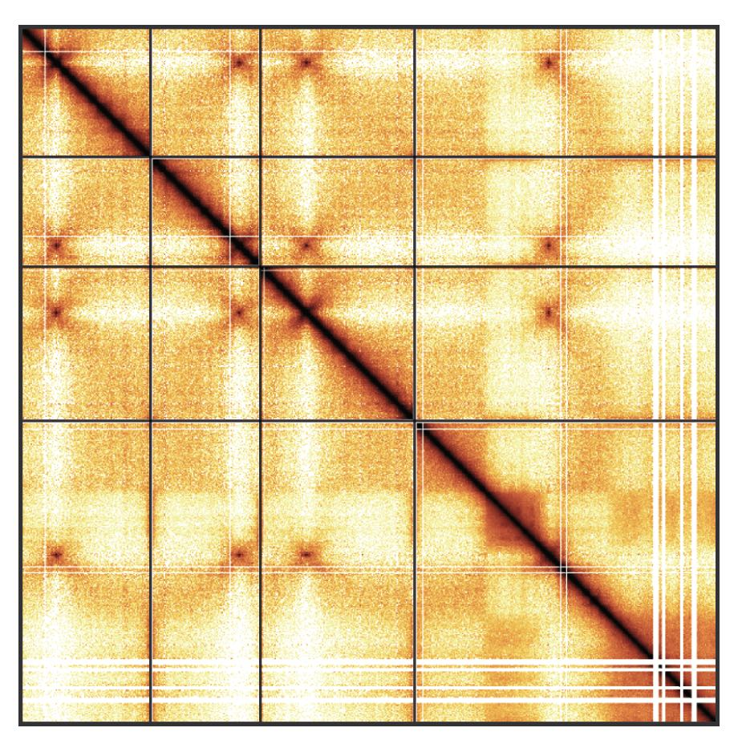

--- 
title: "Orchestrating Hi-C analysis with Bioconductor"
documentclass: book
biblio-style: apalike
link-citations: yes
github-repo: js2264/OHCA
author: "Jacques Serizay"
---

```{r, echo=FALSE}
.gh_url <- file.path('https://github.com', rmarkdown::metadata[['github-repo']])
```

# Welcome {-}

`r rebook::openingDetails(Copyright='J. Serizay', Source=.gh_url)`

This is the online version of **Orchestrating Hi-C analysis with Bioconductor**.  

# Introduction {-}

This book is divided in three parts:  

**Part I: Fundamentals concepts**

- Chapter 1: What Hi-C is, experimentally and computationally 
- Chapter 2: The different `R` classes implemented to analyse Hi-C
- Chapter 3: Parsing and manipulating Hi-C data in R
- Chapter 4: Hi-C data visualization  


**Part II: In-depth Hi-C analysis**

- Chapter 5: Performing "arithmetics" on Hi-C matrices
- Chapter 6: Computing Hi-C-specific metrics
- Chapter 7: Finding topological features from a Hi-C contact matrix  


**Part III: Advanced Hi-C considerations**

- Chapter 8: Hi-C interoperability in R/Bioconductor
